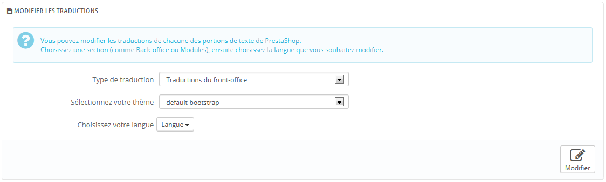
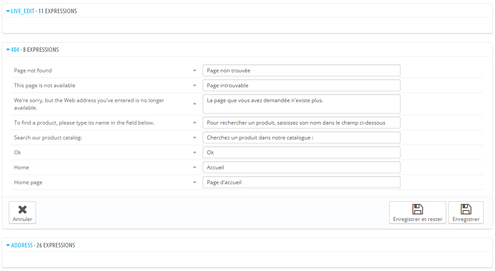
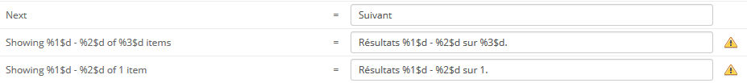
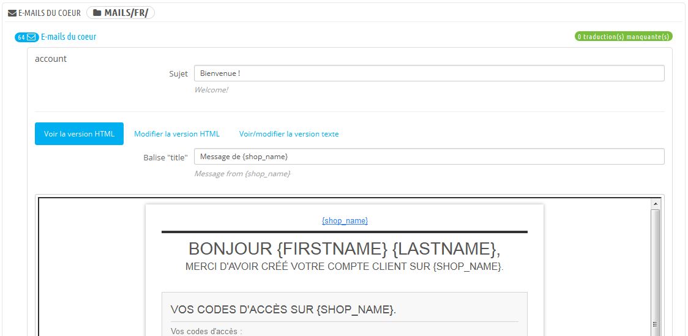
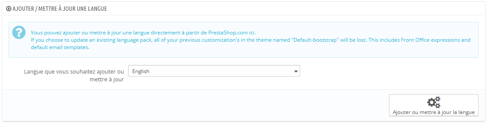
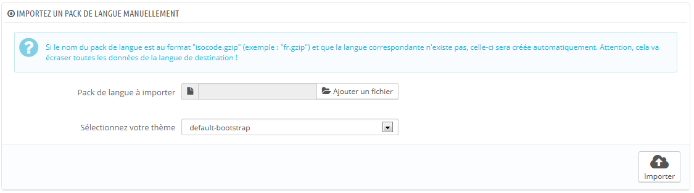
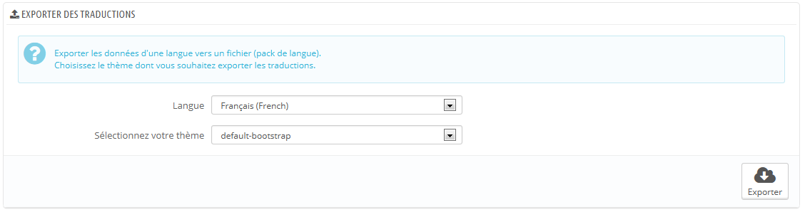
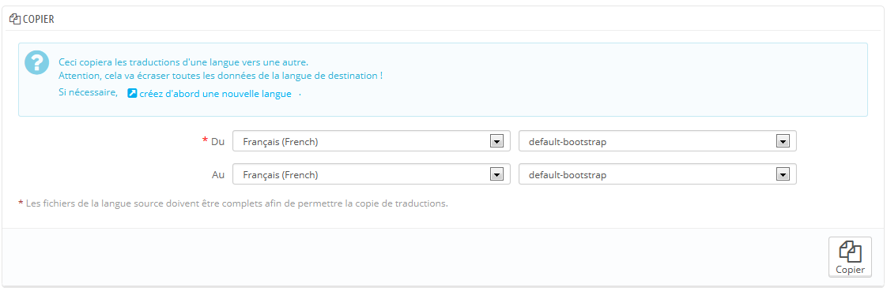

# Traductions

PrestaShop vous fournit un outil complet de traduction pour votre boutique. Il vous permet d'ajouter et de modifier les traductions de vos pages. Ainsi, vous êtes véritablement maître de votre boutique, et pouvez gérer la traduction des chaînes sans avoir à attendre que les traducteurs officiels publient leurs corrections.

Même si vous ne souhaitez pas utiliser les corrections des traducteurs, vous pourriez vouloir changer la formulation qu'ils ont utilisé (moins formelle, moins verbeuse, etc.), et personnaliser les différents textes disponibles. Ce faisant, vous adaptez votre site web à votre public : par exemple, une boutique de vêtements hip-hop n'utilisera pas les mêmes expressions qu'une boutique de vente de montres de luxe.

Le processus d'adaptation d'un logiciel à d'autres langues est appelé _internationalisation et localisation_, ou i18n et L10n.

La première étape est l'internationalisation, durant laquelle les développeurs choisissent le mécanisme à utiliser pour traduire leur logiciel. Toutes les chaînes du logiciel sont ensuite converties pour être exploitées par ce mécanisme.\
&#x20;La seconde étape est la localisation, où les utilisateurs bilingues ou polyglottes traduisent les chaînes originales vers leur propre langue. La localisation peut également inclure la mise en place de données locales pour améliorer encore plus le logiciel pour les utilisateurs locaux.\
&#x20;Vous pouvez en apprendre plus en lisant la page Wikipedia : [http://fr.wikipedia.org/wiki/Internationalisation\_%28informatique%29](http://fr.wikipedia.org/wiki/Internationalisation\_\(informatique\)).

L'équipe de PrestaShop a choisi de concevoir son propre outil intégré au logiciel, afin que quiconque disposant d'une installation de PrestaShop puisse personnaliser sa boutique en fonction de ses besoins.\
&#x20;La traduction communautaire se faire à l'aide d'une installation ouverte en ligne de PrestaShop, située à l'adresse [https://crowdin.net/project/prestashop-official](https://crowdin.net/project/prestashop-official)

Les packs de traduction officiels peuvent être téléchargés à la main depuis cette adresse : [http://www.prestashop.com/fr/traductions](http://www.prestashop.com/fr/traductions).

## Modifier une traduction 

L'outil le plus important de la page "Traductions" se trouve dans la section "Modifier les traductions". C'est ici que vous choisissez la traduction à modifier, afin de potentiellement en réécrire toutes les phrases si besoin était.

Sélection la partie de la traduction actuelle que vous voulez modifier :

* **Traductions du front-office**. Le texte que vos clients voient en parcourant votre boutique.
* **Traductions du back-office**. Le texte que vous voyez dans les pages d'administration de votre boutique
* **Traductions des messages d'erreur**. Les messages d'erreur qui peuvent apparaître sur votre front-office.
* **Traductions des noms des champs**. Les noms des champs des formulaires, tant dans le front-office que le back-office.
* **Traductions des modules installés**. Les chaînes utilisées par les modules installés. Note que les modules qui sont présents mais pas installés n'apparaîtront pas dans l'outil.
* **Traductions des fichiers PDF**. Les chaînes utilisées par le générateur de fichiers PDF : factures, bons de livraison, etc.
* **Traductions des modèles d'e-mails**. Les chaînes utilisées par les e-mails envoyés par PrestaShop.

Certaines catégories ont une seconde liste déroulante, qui donne les thèmes disponibles, Les thèmes PrestaShop ont leurs propres chaînes, mais peuvent aussi avoir leurs propres modules, modèles de PDF et d'e-mail. Cette liste déroulante vous permet donc de choisir le thème avec lequel vous souhaitez travailler.

Une fois votre sélection faite, cliquez sur le drapeau de la langue pour laquelle vous souhaitez modifier la traduction.

Une longue page s'ouvre alors. Elle contient la centaine de chaînes disponibles pour cette catégorie, parfois divisées en dizaines de groupes de champs.

Par défaut, seuls les groupes de champs ayant des chaînes non traduites sont ouverts. Si vous souhaitez tous les ouvrir, cliquez deux fois sur le bouton en haut à gauche : une fois pour fermer tous les groupes, et une seconde fois pour tous les ouvrir. Vous pouvez également ouvrir et fermer les groupes de champs un par un en cliquant sur leur titre.

La modification d'une traduction est très facile :

* Ouvrez le groupe de champs,
* Modifiez son contenu,
* Cliquez soit sur le bouton "Enregistrer les modifications et rester" pour préserver vos modifications tout en continuant à modifier cette catégorie, soit sur "Enregistrer les modifications" et revenir à la page "Traductions".

PrestaShop 1.5 a introduit une nouvelle syntaxe quand les chaînes contiennent des variables, comme `%s`, `%d`, `%1$s`, `%2$d`, etc.

Quand vous trouvez une chaîne avec une telle variable, cela signifie que PrestaShop la remplacera avec une valeur dynamique avant d'afficher la chaîne traduite.\
&#x20;Par exemple, dans la chaîne "Your order on %s is complete.", `%s` sera remplacé par le nom de la boutique. C'est pourquoi vous devez conserver cette variable dans votre traduction finale. Par exemple, en français il faudra la traduire en "Votre commande sur %s a bien été enregistrée."

Techniquement, les variables empêchent de couper les chaines en deux. Ainsi, dans les versions précédentes de PrestaShop, "Your order on %s is complete." aurait été coupée en deux : "Your order on" et "is complete." Bien que la traduction littérale de chacune de ces phrases fonctionne pour certaines langues, cela rendait la traduction impossible pour de nombreuses autres langues, notamment les langues bidirectionnelles comme l'arabe ou l'hébreu. Grâce à ces variables, de telles chaînes sont maintenant totalement traduisibles.

Certains champs peuvent avoir une icône d'avertissement à droite. Cela indique les chaînes avec variable. Vous pouvez cliquer sur l'icône pour avoir des informations.\
&#x20;Dans le cas d'une chaîne avec variable, vous devriez vous assurer que le contenu de cette variable se trouvera dans le bon flot de la phrase, et éviter les traductions littérales.\
&#x20;Les variables numérotées (`%1$s`, `%2$d`, etc.) permettent aux traducteurs de réordonner les variables au sein de la chaîne tout en maintenant les informations de chacune. Ainsi, le traducteur français pourra au choix traduire "Order #%1$d from %2$s" en "Commande n°%1$s du %2$s" ou "Le %2$s, commande n°%1$s".

### Fonctionnements spécifiques 

La plupart des catégories de traduction présentent leurs chaînes de la même manière : les chaînes sont rassemblées en groupes que vous pouvez ouvrir ou fermer en cliquant sur leur titre. Le titre indique le nombre d'expressions que le groupe contient, et quand c'est le cas, le nombre d'expressions manquantes, entre parenthèses et en rouge.

Trois catégories ne correspondent pas à cette description :

* **Messages d'erreur**. Les chaînes ne sont pas rassemblées en groupes, elles sont présentées toutes ensemble.
* **Fichiers PDF**. Il n'y a qu'un groupe, "PDF".
* **Modèles d'e-mails**. Les chaînes sont rassemblées en groupes, mais ce ne sont plus de simples champs texte. Chaque e-mail dispose de deux modèles : un au format HTML, avec une mise en page et de la couleur, et un au format texte brut. Tandis que la version texte brut peut être modifiée directement dans le champ textuel, la version HTML ne peut être modifiée qu'en cliquant sur le bouton "Modifier ce modèle d'e-mail" situé en bas de la prévisualisation. Ce clic remplace la prévisualisation par un champ Wysiwyg (_what you see is what you get_), avec un éditeur complet (basé sur TinyMCE : [http://www.tinymce.com/](http://www.tinymce.com/)). En plus de modifier le texte, vous pouvez retoucher la mise en page comme bon vous semble. Vous pouvez par exemple changer les couleurs afin de s'adapter au style de votre boutique.\
  &#x20;Note que les modèles d'e-mails contiennent des variables, tels que `{lastname}` or `{shop_name}`, que PrestaShop remplace par la valeur réelle lors de l'envoi de l'e-mail. Assurez-vous de les conserver dans la traduction.

## Ajouter / mettre à jour une langue 

Les traductions de PrestaShop sont disponibles en packs, qui combinent toutes les catégories de traduction en un fichier zip. Certains packs de langue sont disponibles gratuitement depuis les serveurs de PrestaShop.com. PrestaShop s'occupe de télécharger le pack de langue, le décompresser et créer les sous-dossiers nécessaires dans le dossier `/translation` de votre installation.

Vous pouvez également mettre à jour les langues installées, ici aussi depuis les serveurs de PrestaShop.com, mais gardez en mémoire que vous perdriez toute modification que vous ayez faite à votre propre traduction.

## Importer un pack de langue manuellement 

Dans le cas où vous ne souhaiteriez pas utiliser un pack de traduction officiel, mais plutôt un pack personnalisé (soit réalisé par l'une de vos connaissances, ou récupérée depuis une autre installation de PrestaShop), alors cet outil est fait pour vous.

Sélectionnez le fichier Zip, sélectionnez le thème auquel vous souhaitez appliquer ce pack, puis cliquez sur le bouton "Importer", et le pack sera installé dans votre dossier `/translation`.

Si vous avez déjà un dossier de langue avec le même code ISO 639-1, il sera remplacé par les fichiers du pack que vous importez.

## Exporter des traductions 

Vous pouvez créer votre pack de langue en utilisant cet outil, soit dans le but de faire une sauvegarde de vos personnalisations, ou afin de partager vos traductions avec une autre installation de PrestaShop – l'une des vôtres ou d'un autre utilisateur.

Sélectionnez simplement la langue et le thème de la traduction que vous souhaitez exporter, et cliquez sur le bouton "Exporter".

Notez que le pack contiendra le thème qui est censé fonctionner avec la traduction.

## Copier 

Vous pouvez copier le contenu d'une langue vers une autre. C'est particulièrement utile quand vous souhaitez remplacer la langue d'un thème par celle d'un autre thème.

Choisissez la langue et le thème sources, puis la langue et le thème de destination, enfin cliquez sur le bouton "Copier". Dans la plupart des cas, la langue devrait être la même dans les deux listes déroulantes.

S'il y a déjà un dossier pour cette langue dans le thème de destination, il sera remplacé par les fichiers de la langue et du thème source.

Vous préférerez peut-être créer d'abord une nouvelle langue pour le thème de destination, puis y copier la langue source.
