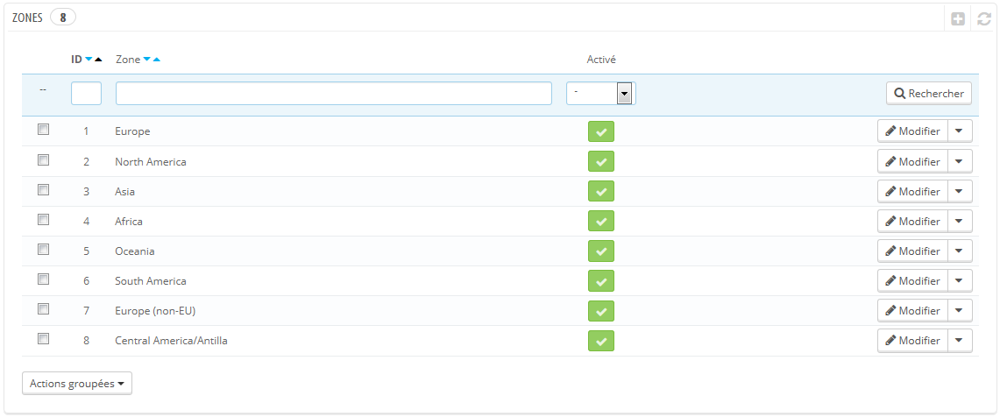
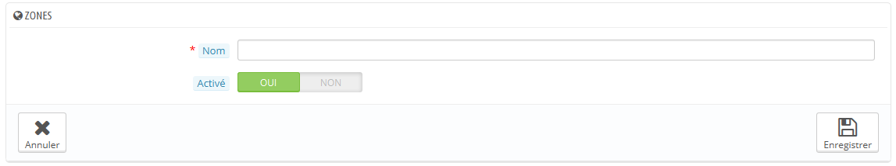

# Zones (fr)

Les zones de PrestaShop sont une liste des régions du monde ([http://en.wikipedia.org/wiki/Subregion](http://en.wikipedia.org/wiki/Subregion) (en anglais)). Elle simplifie la catégorisation des pays.

Si besoin, vous pouvez créer d'autres zones : cliquez sur "Créer" pour afficher le formulaire de création.

Tout ce dont vous avez besoin est un nom et un état, indiquant par exemple que vous ne voulez pas autoriser la livraison en Océanie.\
&#x20;En mode multiboutique, vous pouvez également associer la zone à une sélection de boutiques.
