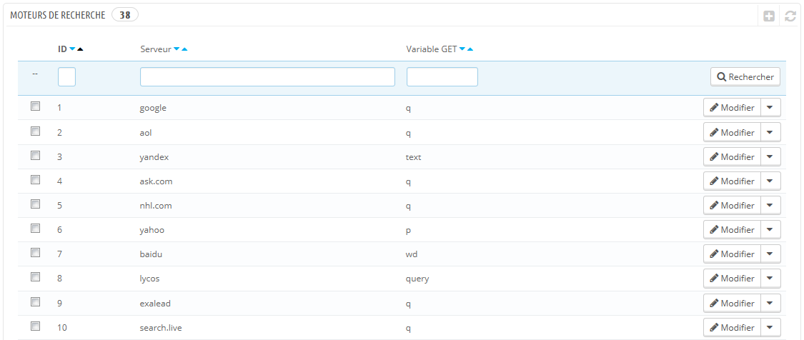

# Moteurs de recherche

Un grand nombre de visiteurs viennent sur votre site depuis un moteur de recherche. Afin de savoir ce qu'ils recherchaient, et de rendre votre site plus compatible avec ces recherches, vous devez connaître leurs requêtes.

Cette page vous présente un tableau de tous les moteurs de recherche intégrés à votre installation de PrestaShop – c'est à dire les moteurs que PrestaShop peut reconnaître, et dont il peut extraire la requête du visiteur en provenance du moteur de recherche.

Si Google est le moteur de recherche le plus utilisé, il y a beaucoup d'autres moteurs de recherche avec lesquels votre site peut être retrouvé. Vous devez donc être en mesure de récupérer leurs requêtes. Quand un moteur de recherche commence à rapporter des visiteurs réguliers, il est temps de l'ajouter dans votre base de données – autrement, ces visiteurs seront marqués dans vos statistiques comme provenant d'un "Autre moteur de recherche", ce qui ne vous aide en rien.

## Ajouter un moteur de recherche 

Il y a très peu à faire pour ajouter un nouveau moteur de recherche à votre liste.

Supposons que vous vouliez ajouter DuckDuckGo, un moteur très respectueux des données privées :

1. Obtenez l'URL référent pour la recherche. Par exemple, [http://duckduckgo.com/?q=chaussures+pour+enfants](http://duckduckgo.com/?q=chaussures+pour+enfants).
2. Prenez la partie serveur, qui est spécifique au moteur de recherche, et placez la dans le champ "Serveur". Dans notre cas, "duckduckgo".
3. Trouvez la variable de requête :
   1. Trouvez la chaîne de requête. La forme correspond à un ensemble de lettres, suivis du signe "=", suivi de la requête, et suivi soit par un "&", soit par la fin de la chaîne. Dans notre cas : "q=chaussures+pour+enfants".
   2. La variable de requête est l'ensemble des lettres avant le signe "=". Dans notre cas : "q". Insérez-la dans le champ "Variable $\_GET".
4. Cliquez sur le bouton "Enregistrer", et à partir de maintenant, PrestaShop sera en mesure de reconnaître les visiteurs en provenance de DuckDuckGo.
