# Découvrir la zone d'administration

**Contenu**

* [Découvrir la zone d'administration](decouvrir-la-zone-dadministration.md#Découvrirlazoned%27administration-Découvrirlazoned%27administration)
  * [Présentation de l'interface principale](decouvrir-la-zone-dadministration.md#Découvrirlazoned%27administration-Présentationdel%27interfaceprincipale)
    * [La barre supérieure](decouvrir-la-zone-dadministration.md#Découvrirlazoned%27administration-Labarresupérieure)
    * [Les menus](decouvrir-la-zone-dadministration.md#Découvrirlazoned%27administration-Lesmenus)
  * [Les boutons](decouvrir-la-zone-dadministration.md#Découvrirlazoned%27administration-Lesboutons)
  * [L'aide contextuelle](decouvrir-la-zone-dadministration.md#Découvrirlazoned%27administration-L%27aidecontextuelle)
  * [Le tableau de bord](decouvrir-la-zone-dadministration.md#Découvrirlazoned%27administration-Letableaudebord)
    * [La barre horizontale](decouvrir-la-zone-dadministration.md#Découvrirlazoned%27administration-Labarrehorizontale)
    * [La colonne de gauche](decouvrir-la-zone-dadministration.md#Découvrirlazoned%27administration-Lacolonnedegauche)
    * [La colonne centrale](decouvrir-la-zone-dadministration.md#Découvrirlazoned%27administration-Lacolonnecentrale)
    * [La colonne de droite](decouvrir-la-zone-dadministration.md#Découvrirlazoned%27administration-Lacolonnededroite)
    * [Réordonner les éléménts](decouvrir-la-zone-dadministration.md#Découvrirlazoned%27administration-Réordonnerleséléménts)

## Découvrir la zone d'administration 

Vous avez installé PrestaShop 1.6, et êtes connecté à votre back-office. Il vous faut maintenant prendre le temps de parcourir son administration afin de comprendre ses messages et de savoir où trouver une information spécifique.

Le design de la zone d'administration a été totalement revu pour la version 1.6 de PrestaShop, afin d'être plus intuitif et ergonomique – ainsi que de mieux fonctionner sur les terminaux mobiles.

Bien que la majorité des pages et options de la 1.5 est toujours là où vous pouvez vous attendre à la trouver, il vous faudra sans doute passer par une phase d'apprentissage.

Nous avons créé ce chapitre afin de vous aider lors de cette découverte de l'interface d'administration de PrestaShop. Elle a été conçue pour être plus ergonomique et plus simple d'utilisation, mais restez conscients que vous devriez lire tous les chapitres du guide utilisateur pour comprendre pleinement votre nouvel outil e-commerce !

### Présentation de l'interface principale 

Prenez le temps d'appréhender le tableau de bord – c'est à dire, la première page que vous voyez en vous connectant au back-office. Non seulement vous donne-t-elle un résumé de tout ce que vous devez savoir sur votre boutique à un instant T, avec des liens vers les pages les plus utiles, mais par ailleurs, en tant que nouvel utilisateur de PrestaShop, elle vous donne quelques conseils à propos de réglages auxquels vous devez faire attention.

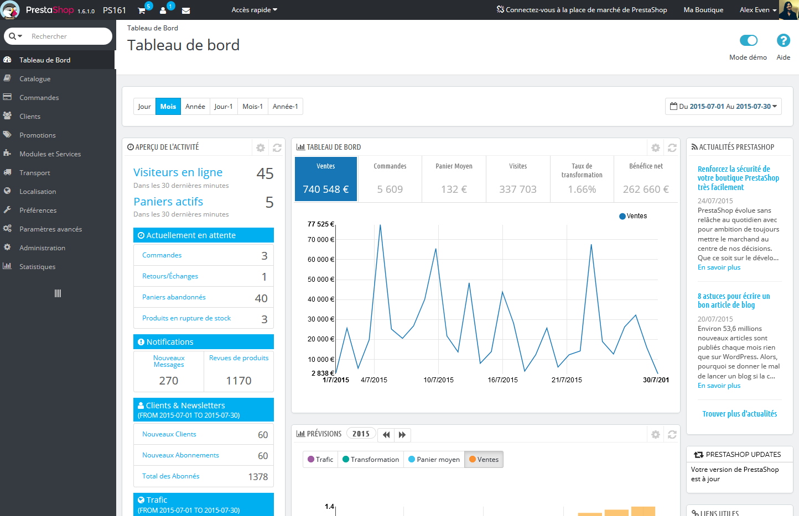

L'interface d'administration de PrestaShop a été repensée en version 1.6.1.0, pour davantage de lisibilité et une plus grande facilité d'utilisation.

Voici ce que à quoi elle ressemble pour les versions 1.6.0.0 à 1.6.1.0 :

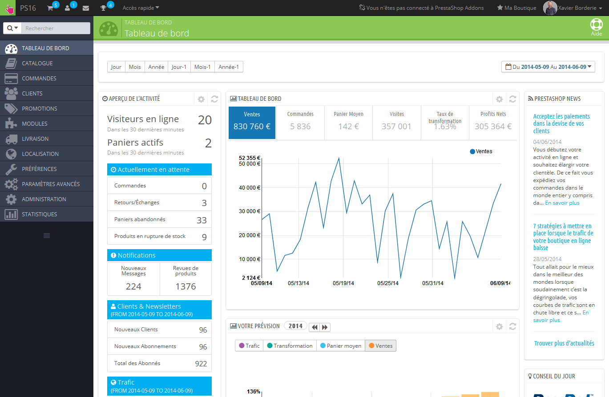

#### La barre supérieure 

En haut de la page se trouve une barre sombre contenant une poignée de liens et informations :

* **Le logo de PrestaShop**, avec le numéro de votre version actuelle.
* **Le nom de votre boutique**. Ce lien vous permet de revenir au tableau de bord depuis n'importe quelle page.
* **Icône de caddie**. Une infobulle donne le nombre de nouvelles commandes. De là, vous pouvez soit afficher l'une des commandes, soit aller à la liste de commandes. En cliquant dessus, ouvre un encadré vous présentant les nouvelles commandes depuis la dernière fois que vous avez cliqué sur cette icône.
* **Icône de personne**. Une infobulle donne le nombre de nouveaux inscrits. De là, vous pouvez soit afficher la page de l'info des clients, soit aller à la liste des clients. En cliquant dessus, ouvre un encadré vous présentant les nouveaux clients inscrits depuis la dernière fois que vous avez cliqué sur cette icône.
* **Icône de courrier**. Une infobulle donne le nombre de messages. En cliquant dessus, ouvre un encadré vous présentant les nouveaux messages reçus par le service clientèle depuis la dernière fois que vous avez cliqué sur cette icône. De là, vous pouvez soit afficher l'un des messages, soit aller à la page du SAV.
* **Icône de trophée.** Une infobulle indique le nombre de nouveaux éléments. En cliquant dessus, ouvre un encadré vous présentant vos progrès en tant que marchand. De là, vous pouvez ouvrir la page complète des badges et points, provenant du module "Expertise PrestaShop".
* **Accès rapide**. Un menu regroupe des raccourcis vers certaines des pages les plus utiles, que vous pouvez modifier dans la page "Accès rapide" du menu "Administration".
* **Connectez-vous à la place de marché de PrestaShop**. Ouvre une fenêtre modale qui vous permet de relier votre boutique à la place de marché Addons, et donc d'obtenir les mises à jour pour les thèmes et modules que vous y avez acheté.
* **Lien "Ma Boutique"**. Ouvre un nouvel onglet de votre navigateur avec la page d'accueil de votre boutique.
* **Menu (votre nom)**. Un simple menu rappelant le compte avec lequel vous êtes connecté, qui contient les liens suivants :
  * **Lien "Mes Préférences"**. Ouvre la page de préférence de votre compte utilisateur actuel, d'où vous pouvez régler certaines options, comme la langue du back-office ou votre mot de passe.
  * **Lien "Déconnexion**". Vous déconnecte du compte actuellement utilisé.

#### Les menus 

Lors de vos activités quotidiennes d'administrateur de boutique, vous aurez régulièrement à parcourir les nombreuses pages et options du back-office.

Par défaut, le système de menu de PrestaShop 1.6 est affiché sur le côté gauche de la page. Vous pouvez le faire s'afficher en haut de la page en utilisant l'option "Orientation du menu principal du back-office" dans votre page de préférence utilisateur, (à laquelle vous pouvez accéder via le lien qui porte votre nom dans la barre supérieure).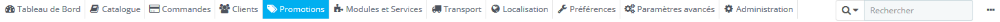

Que ce soit au format horizontal au vertical, le contenu de chaque menu est affiché quand la souris survole le titre du menu, réduisant ainsi la nécessité de charger de nouveaux écrans juste pour accéder aux options d'un menu.

En plus de cela, le format vertical peut être réduit pour n'afficher que ses icônes, en cliquant sur l'icône de "lignes parallèles" qui se trouve en bas.

\
Chaque menu correspond à un ensemble donné de tâches :

* **Barre de recherche avec menu déroulant**. Vous permet de chercher parmi le contenu de votre boutique.
* Tableau de bord. La page d'accueil de votre back-office, où vous pouvez voir vos principales statistiques, en temps réel.
* **Catalogue**. C'est le cœur de votre boutique, là où vous allez ajouter vos produits, créer des catégories, configurer vos transporteurs et fournisseurs...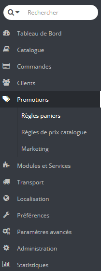
* **Commandes**. Dès qu'un client commence à ajouter des produits à son panier, vous verrez les premières commandes arriver dans ce menu, avec les factures qui les accompagnent. C'est également à partir de ce menu que vous gérerez vos retours de marchandise, vos avoirs et le service client par commande.
* **Clients**. Ce menu vous donne accès à toutes les informations sur vos clients. Vous pouvez modifier leurs adresses, créer des groupes d'utilisateurs afin de leur appliquer des promotions spécifiques, gérer le service après-vente, et même ajouter de nouveaux titres de civilité si besoin est.
* **Promotions**. Ce menu à part vous permet de créer rapidement des bons de réduction et des promotions par le biais d'un jeu de règles.
* **Modules et Services**. Multipliez la puissance et l'utilité de votre boutique en ajoutant des modules, dont une centaine est déjà disponible dans l'installation par défaut, et de nombreux sont disponibles à l'achat sur la place de marché PrestaShop Addons ([http://addons.prestashop.com/](http://addons.prestashop.com/)). C'est également dans ce menu que vous placerez les éléments de vos modules sur votre thème. Enfin, une dernière page vous permet d'appliquer des réglages globaux à vos modules de paiement.
* **Livraison**. Tout ce qui concerne l'expédition de vos colis, notamment les coûts de transport.
* **Localisation**. Vous aide à configurer votre boutique avec des éléments locaux, tels que la langue et les traductions, la monnaie, les unités de mesure, les taxes et règles de taxes, et les entités géographiques.
* **Préférences**. PrestaShop est une solution e-commerce très configurable, et vous pouvez modifier quasiment tous ces comportements à l'aide de ce jeu de pages de préférences.
* **Paramètres avancés**. Contient des liens vers des outils et des pages d'informations qui sont trop particuliers pour tenir dans d'autres menus, tels que les réglages du service web, l'outil de sauvegarde de la base de données, ou la page d'amélioration des performances, entre autres.
* **Administration**. Voici tous les réglages relatifs au back-office lui-même. Par exemple, le contenu du menu "Accès rapide", la liste de vos employés et leurs droits d'accès, et l'ordre des menus, entre autres.
* **Statistiques**. Ce menu vous donne accès à un grand nombre de statistiques et graphiques qui est récupéré et généré par PrestaShop.

Ce sont là les menus par défaut. Notez que des modules peuvent ajouter de nouveaux menus, de nouvelles pages aux menus existants, ou de nouvelles options aux pages existantes.

Par ailleurs, un menu n'est disponible que si une option est mise en place :

* **Stock**. Ce menu vous donne accès à une fonctionnalité avec laquelle vous pouvez gérer vos entrepôts, les mouvements de votre stock et vos commandes de réapprovisionnement.\
  &#x20;Ce menu n'est accessible que si l'option "Activer la gestion des stocks avancée" est validée. Elle se trouve dans la section "Stocks produit" de la page de préférence "Produits".

Tous les menus par défaut, dont celui de gestion avancée des stocks, sont expliqués en détail dans ce guide de l'utilisateur.

### Les boutons 

Un grand nombre de pages de l'administration utilisent des boutons de manière régulière, que ce soit en haut ou en bas de l'écran. Par exemple, la page de création/modification d'un produit peut avoir jusqu'à 8 boutons.

Plus que de simples raccourcis, ils ouvrent de réelles fonctionnalités que vous utiliserez souvent.

Les boutons disponibles varient grandement en fonction du contexte. De fait, deux pages peuvent ne pas avoir le même jeu de boutons. Cela étant, il y en a certains que vous verrez souvent :

* **Ajouter.** Ouvre la page de création pour le contenu en cours : nouveau produit, nouvelle catégorie, nouvelle commande, etc.
* **Modules et services recommandés.** Ouvre une fenêtre présentant les modules disponibles pour le contexte en cours.
* **Aide.** Ouvre la documentation en ligne pour la page en cours ("aide contextuelle").

Le bouton "modules recommandés" vous permet de voir les modules qui s'appliquent au contexte en cours. Par exemple, la page des transporteurs affiche les modules de la catégorie de modules "Transporteurs & logistique". Cela se révèle très utile pour rapidement trouver le module à installer et à configurer pour obtenir un certain résultat.

La plupart des formulaires du back-office sont validé à l'aide bouton en bas de l'écran :

* **Enregistrer.** Enregistre le contenu de la page en cours et renvoie vers la liste d'éléments existants.
* **Enregistrer et rester.** Enregistre le contenu de la page en cours et garde la page ouverte.
* **Annuler.** Renvoie la liste des éléments existants.

Les tableaux présentant des listes (de produits, commandes, clients, etc.) ont leur propres boutons pour gérer les éléments listés :

* **Ajouter**. Créé un nouvel élément dans le contexte actuel.
* **Exporter**. Télécharge un fichier CSV de tous les éléments.
* **Importer**. Vous amène sur la page d'options d'import CSV, où vous pouvez importer vos fichiers CSV.
* **Rafraîchir la liste**. Charge à nouveau la liste pour présenter les dernières modifications.
* **Voir la requête SQL**. Vous fournit la requête SQL pour reproduire votre recherche ou filtre dans votre propre gestionnaire SQL.
* **Exporter vers le gestionnaire SQL**. Ouvre le gestionnaire SQL de PrestaShop (dans le menu "Paramètres avancés"), grâce auquel vous pouvez faire des requêtes sur la base de données PrestaShop avec des instructions SQL ("`SELECT ... FROM ... WHERE ...`"). Si votre liste d'éléments est filtrée (par exemple, par nom), alors la requête SQL par défaut le prendra en compte (par exemple, "``WHERE 1  AND b.`name` LIKE '%robe%'``" pour une liste de produits).

### L'aide contextuelle 

Depuis la version 1.6.0.7 de PrestaShop, la documentation du logiciel est directement intégrée dans l'interface du logiciel : en cliquant sur le bouton "Aide" depuis n'importe quel page du back-office, l'interface principale se réduit en largeur pour pouvoir afficher une nouvelle colonne sur la droite, contenant la documentation de cette partie du back-office.

Un nouveau clic sur le bouton "Aide" referme la colonne d'aide contextuelle. Si vous ne fermez pas la colonne d'aide, PrestaShop comprendra que vous voulez qu'elle s'affiche sur toutes les pages du back-office, et maintiendra donc la colonne ouverte tant que vous ne l'aurez pas fermée.

Si la zone d'affichage du navigateur web est inférieure à 1220 pixels de large, alors PrestaShop ouvrira la documentation contextuelle dans une nouvelle fenêtre de navigateur plutôt que de réduire l'espace dédié à l'interface principale.

En bas de la colonne d'aide, un petit formulaire vous permet d'indiquer à l'équipe de PrestaShop si cette aide vous a été utile. Donnez une note à la page d'aide en cliquant sur l'un des 5 niveaux de satisfactions. Si vous cliquez sur l'un des deux niveaux les plus bas, PrestaShop ouvrira un court formulaire vous permettant de préciser vos pensées. Vous pouvez soit le remplir et cliquez sur le bouton "Valider", soit fermer le formulaire en cliquant sur la croix, ce qui enverra simplement votre note à notre serveur.

### Le tableau de bord 

Explorons maintenant le contenu du tableau de bord lui-même. Il peut paraître encombré au nouvel utilisateur, mais vous découvrirez vite qu'il offre un excellent résumé des activités quotidiennes de votre boutique d'un coup d'oeil.

Le tableau de bord est divisé en 4 zones : une barre horizontale, et trois colonnes.

Mode démo

Par défaut, le tableau de bord utilise des fausses données pour vous permettre de voir comment les données statistiques sont affichées.

Lorsque vous utilisez PrestaShop sur une vraie boutique, vous devez désactiver ces fausses données pour utiliser vos vraies données : désactivez le "Mode démo" en haut à droite de l'écran.

#### La barre horizontale 

En haut du tableau de bord se trouve une simple barre qui vous permet de choisir la période de temps utilisée pour afficher les statistiques du tableau de bord.

Trois jeux d'options sont disponibles :

* Ce jour, ce mois, cette année.
* Jour, mois ou année précédent(e).
* Une date précise (le bouton à droite, qui ouvre un sélecteur de date).

Le choix d'une option met à jour tous les blocs de contenu qui se trouvent sur le tableau de bord, afin que les données qu'ils affichent correspondent à cette période seule. Les blocs qui ne présentent pas de statistiques ne sont pas mis à jour.

Pour choisir une période de temps, vous pouvez soit cliquez sur le premier puis le dernier jour de cette période dans le calendrier (l'ordre des jours n'est pas important), ou vous pouvez saisir les dates au format AAAA-MM-JJ dans les champs textuels. Cliquez sur "Appliquer" pour voir le tableau de bord se mettre à jour en fonction de vos réglages.

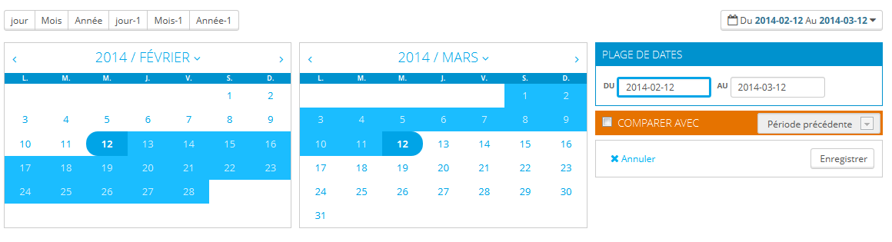

Vous pouvez également comparer deux périodes de temps en cochant la case "Comparer avec". Sélectionnez la seconde période comme vous l'avez fait pour la première (les deux peuvent se superposer), puis cliquez sur "Appliquer".\
Lorsque vous comparer deux périodes, certains des blocs de contenu sera mis à jour pour indiquer l'évolution des données (voir par exemple le bloc "Tableau de bord", qui présente les données du module Dashboard Trends).

#### La colonne de gauche 

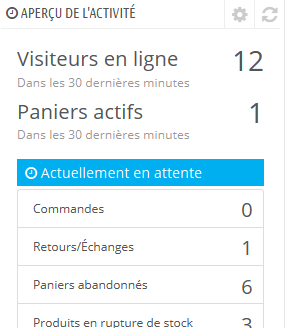Par défaut, cette colonne présente les données du module Dashboard Activity, qui rend les principaux chiffres tirés de votre base de données accessibles en un clin d'oeil :

* Les visiteurs durant les 30 dernières minutes.
* Les paniers actifs durant les 30 dernières minutes.
* Les commandes en attente, les demandes de retour/échange, les paniers abandonnés et les produits épuisés.
* Les notifications de nouveaux messages, de nouvelles questions liées à une commande et de nouveaux commentaires de produits.
* Les nouveaux clients et nouvelles inscriptions à la newsletter.
* Les statistiques de trafic : visites, visiteurs uniques, sources de trafic et liens directs.

#### La colonne centrale 

C'est dans la colonne centrale que l'appellation de "tableau de bord" prend toute son importance : cette zone du tableau de bord vous présente les chiffres les plus importants relatifs aux activités quotidiennes de votre site, accompagnés d'un graphique des ventes et d'une liste des dernières commandes. Chaque fois que vous vous connectez à l'administration de votre boutique, vous chercherez surtout à voir l'évolution de ces courbes. C'est ici que vous prendre le pouls de votre boutique.

Par défaut, il y a trois blocs de contenu dans cette colonne, qui sont gérés par des modules :

* **Tableau de bord** (module Dashboard Trends). C'est le principal bloc d'information du tableau de bord. Avec ses graphiques variés, il vous aide vraiment à voir si la direction que prend votre boutique est la bonne ou non. Cliquez sur l'un des types de graphique pour l'afficher. Par ailleurs, lorsque vous comparez deux périodes de temps, il affiche l'évolution de chaque chiffre en pourcentage. Survolez le graphique avec votre souris pour en voir les détails.\
  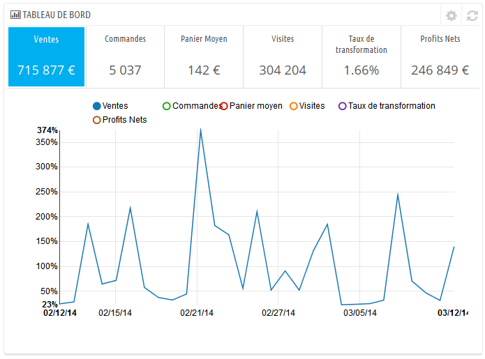\
  En cliquant sur son icône de configuration (en haut à droite), un panneau s'ouvre où vous pouvez configurer les divers frais de votre boutique (frais bancaire, coût d'expédition, hébergement, etc.) afin de mieux indiquer vos tendances.
* **Votre prévision** (module Dashboard Goals). Ce bloc vous présente les objectifs que vous vous êtes fixés pour les mois à venir, et la manière dont votre boutique parvient à s'y comparer. Survolez le graphique avec votre souris pour en voir les détails.\
  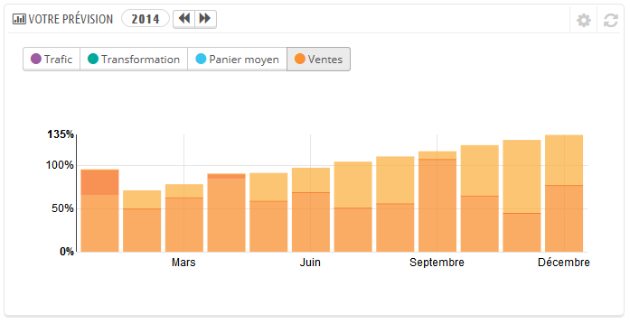\
  En fonction de vos résultats mensuels, vous devriez mettre à jour vos objectifs à venir. Vous pouvez configurer vos objectifs dans le formulaire de configuration du bloc (en haut à droit du bloc), et indiquer vos attentes mois après mois en termes de trafic, de taux de conversion, et de valeur panier moyenne. La colonne "Ventes" sera mise à jour en fonction des objectifs des autres colonnes (par exemple, pour 1000 visiteurs avec un taux de conversion de 2% et un panier moyen de 10€, vous devriez obtenir 1000\*(2/100)\*10 = 200€) Vous pouvez modifier la devise dans la page "Devises" du menu "Localisation".
* **Produits et  ventes** (module Dashboard Products). Ce bloc vous présente un tableau des dernières commandes et un classement de vos produits : meilleures ventes, produits les plus vus, et meilleures recherches (au sein de votre boutique, pas depuis les moteurs de recherche).\
  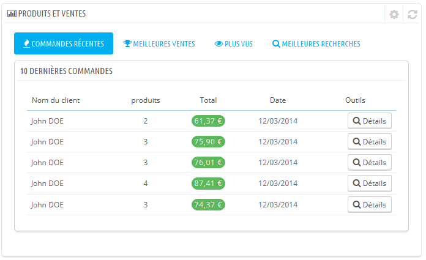\
  Vous pouvez configurer le nombre d'élément à afficher pour chaque tableau en ouvrant le bloc de configuration du bloc.

#### La colonne de droite 

Cette dernière colonne est informative : elle vous donne des nouvelles de PrestaShop.com, des notifications quand une nouvelle version de PrestaShop est disponible, et des liens utiles.

Elle comprend également un bloc "Mode démo", qui permet d'annuler les données de test utilisées par défaut dans le Tableau de bord, et d'utiliser vos propres données (récupérées par le système de statistiques de PrestaShop).

#### Réordonner les éléménts 

Sur votre Tableau de bord, vous avez la possibilité de changer l'ordre des éléments affichés dans chacune des colonnes (gauche et centrale, voir ci-dessus). C'est notamment utile si vous utilisez des modules additionnels ou si vous vous concentrez sur des statistiques qui ne sont pas en première position.

Pour changer cet ordonnancement, suivez ces étapes :

* Allez à Modules et Services / **Positions**
* Sélectionnez "**Montrer : Tous les modules**"
* Cochez la case "**Afficher les points d'accroche invisibles**"
* Dans le champ de recherche "Rechercher un point d'accroche" entrez "**dashboardZoneOne**" pour la colonne de gauche ou "**dashboardZoneTwo**" pour la colonne centrale

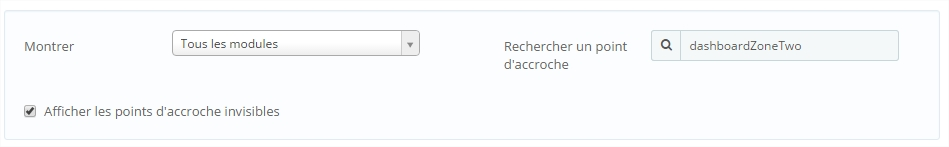

Maintenant vous avez les différents éléments accrochés à la colonne de gauche / centrale.

Pour changer ces éléments de position, vous pouvez les déplacer en drag and drop ou alors en cliquant sur les petites flèches à côté du logo, comme montré ci-dessous :

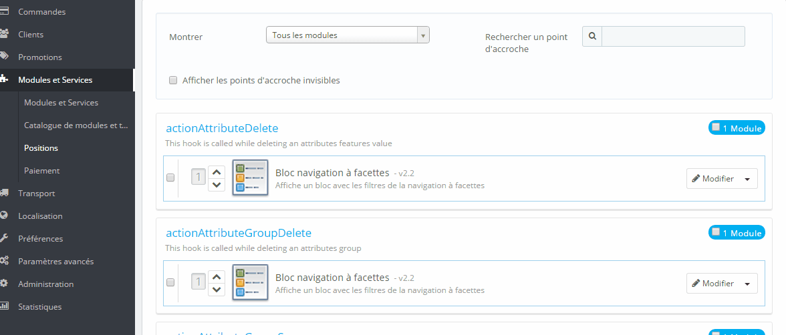
