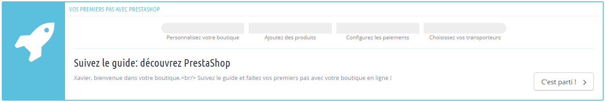

# Embarquer à bord de PrestaShop

Depuis la version 1.6.0.11 de PrestaShop, chaque nouvelle installation dispose du module OnBoarding, activé par défaut. Ce module a été conçu dans le but d'aider les nouveaux utilisateurs à comprendre rapidement la manière dont le back-office fonctionne, en partant de la personnalisation simple de la boutique jusqu'au lancement de celle-ci, en passant par l'ajout de produits dans le catalogue, la configuration des méthodes de paiement et le choix des options de livraison par défaut. Tout ceci se déroule dans une interface ludique.

Si vous savez déjà utiliser la zone d'administration de PrestaShop, vous devriez sans doute désactiver ce module :

1. Rendez-vous dans la page Module.
2. Cherchez le module "OnBoarding".
3. Désactivez-le.

## Comment le module fonctionne 

L'interface du module est impossible à manquer : c'est la première chose que vous verrez en haut de toutes les pages du back-office, juste avec le contenu propre à cette page.

Dès le premier abord, vous pouvez comprendre la manière dont le module fonctionne : il accompagnera le début au travers d'une poignée d'étapes, en les aidant à mettre en place les options de leur boutique.

En cliquant sur le bouton "Allons-y", vous déclenchez le processus d'accompagnement – qui peut être interrompu à n'importe quel moment, pour être repris plus tard. Ce processus se partage entre une fenêtre qui apparaît par-dessus de l'interface du back-office, qui vous donne des instructions à suivre, et l'interface principale elle-même, où vous êtes supposé suivre ces instructions.

## Étape 1 : personnaliser sa boutique 

La première étape vous aider à personnaliser votre boutique, afin de la rendre vôtre. Cela se fait en installant un nouveau thème et en mettant en ligne le logo de votre marque.

En coulisse, le module a déjà changé la page du back-office pour faire apparaître la page de préférences des thèmes. Cliquez sur "OK, montrez-moi mon thème" pour cacher la fenêtre du module et travailler sur votre thème : vous pouvez soit passer du thème par défaut à un autre thème déjà présent, ou en obtenir un nouveau depuis Addons, la place de marché de PrestaShop : [http://addons.prestashop.com/](http://addons.prestashop.com/)

Une fois que vous avez installé et activé le nouveau thème, vous devriez prendre le temps de parcourir les options de la page de préférences des thèmes afin de vous assurer que toutes les options sont bien configurées comme vous le souhaitez.

Une fois que votre thème est à votre goût, cliquez sur le bouton "Terminé, passons à l'étape suivante".

## Étape 2 : ajouter des produits à votre catalogue 

La deuxième étape vous emmène au coeur de votre boutique : les produits que vous vendez.

Cliquez sur le bouton "OK, montre-moi mon catalogue" pour faire disparaître la fenêtre du module. La page du back-office est maintenant le formulaire de création de produit. Parcourez les différents champs et les onglets sur la gauche, et n'hésitez pas à cliquer sur le bouton "Aide" en haut à droite pour en apprendre plus sur les possibilités offertes par PrestaShop.

Créez plusieurs produits, même des inventions, afin de mieux comprendre comme l'interface fonctionne. Puis, une fois que vous avez bien intégré comment tout fonctionne, créez vos vrais produits.

Une fois que vous avez créé plusieurs produits, cliquez sur le bouton "Terminé, passons à l'étape suivante".

## Étape 3 : configurez vos méthodes de paiement 

La troisième étape est essentielle : si vous ne configurez pas votre méthode de paiement, vous ne recevrez pas d'argent pour vos produits vendus !

Cliquez sur le bouton "OK, montre-moi les méthodes de paiement" pour faire disparaître la fenêtre du module. La page du back-office est maintenant la page des réglages pour le paiement. Elle vous présente plusieurs méthodes

Celles disponibles par défaut ne requièrent pas de compte, mais implique que la livraison sera retardée de quelques jours, le temps que vous ayez vérifié le paiement : transfert bancaire et règlement par chèque nécessitent tous les deux une vérification manuelle et une validation manuelle de la commande.

PrestaShop recommande plusieurs méthodes de paiement affichées sur cet écran, la plupart étant dans les faits des modules que vous pouvez installer. Celles présentées sont sûrs, connues et dispose du soutien de PrestaShop. Elles dépendent également de l'endroit où votre boutique se trouve : un marchant américain ne verra pas les mêmes méthodes qu'un marchant polonais. Choisissez celle pour laquelle vous avez déjà un compte, ou avec laquelle vous souhaitez travailler, et configurez le module avec les informations de votre compte. Vous pouvez avoir autant de méthodes de paiement que nécessaires.

Plus bas dans l'écran, vous pouvez régler les restrictions de règlement basées sur la devise, le groupe de clients et le pays. Choisissez bien, car ces restrictions peuvent empêcher les clients d'utiliser une méthode de paiement donnée, ou même leur empêcher de faire des achats sut votre site !

Une fois que vous avez configuré vos méthodes de paiement, cliquez sur le bouton "Terminé, passons à l'étape suivante".

## Étape 4 : configurez vos méthodes de livraison 

La quatrième étape est également essentielle : si vous n'avez pas mis en place d'options de livraison, vous n'avez pas de moyen de faire payer vos clients pour l'envoi de leurs produits. Si vous vendez des produits virtuels (PDF, etc.), alors vous pouvez vous passer de partenaire de livraison, mais dès que vous vendez de vrais produits tangibles, vous devez indiquer votre partenaire de livraison.

Cliquez sur le bouton "Parlons des livraisons" pour faire disparaître la fenêtre du module. La page du back-office est maintenant la page des réglages de livraison. Elle vous présente deux options : ajouter vous-mêmes un partenaire livraison, ou utiliser un module transporteur.

Si vous ne vendez que des produits virtuels, cliquez sur "Passer à la suite".

L'ajoute d'un nouveau transporteur se fait par le biais d'un outil pratique, qui vous aidez à tout mettre en place : nom, temps de livraison, zone et tarifs de livraison, limites de taille et de poids, etc.

Vous pourriez préférer aller plus vite et installer un module transporteur. La page principale en liste quelques-uns, mais vous en trouverez d'autres dans la page "Modules". Installer celui de votre partenaire actuel, et configurez le module avec vos informations contractuelles.

Une fois que vous avez terminé de configurer vos méthodes de livraison, cliquez sur le bouton "Terminé, passons à l'étape suivante".

## Terminé 

Vous avez (presque) fini !

Vous avez parcouru toutes les étapes essentielles à la configuration de votre boutique. Il y a bien d'autres étapes, mais celles-ci sont nécessaires pour vendre sur Internet.

Cliquer sur le bouton "Lancer" mettre fin aux instructions du module, et vous affichera une animation de votre fusée en route vers l'espace !

Avant de sortir votre boutique du mode de maintenance et de le rendre disponible pour tous les internautes, vous devriez parcourir toutes les autres pages de préférence du back-office, afin de vous assurer qu'elles sont bien configurées comme vous le souhaitez. Si c'est le cas, ne cliquez pas sur le bouton "Lancer" et cliquer sur la croix pour fermer la fenêtre du module.

Une fois que vous avez tout configuré, rendez-vous dans la page maintenance et activez votre boutique. C'est fait ! Tous nos meilleurs voeux de succès en ligne ! Commencez par promouvoir votre boutique : partagez votre lancement sur les réseaux sociaux à l'aide de la fenêtre finale du module.

Une fois que vous avez terminé, le module n'apparaître plus dans le back-office.
