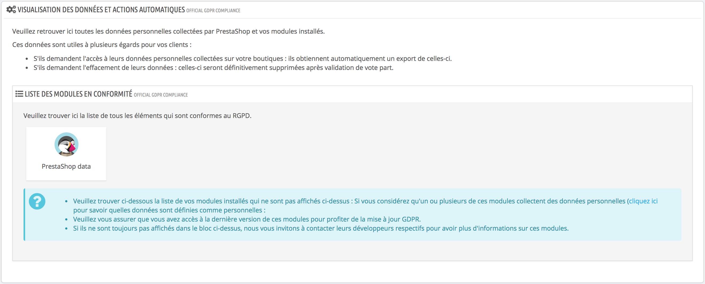
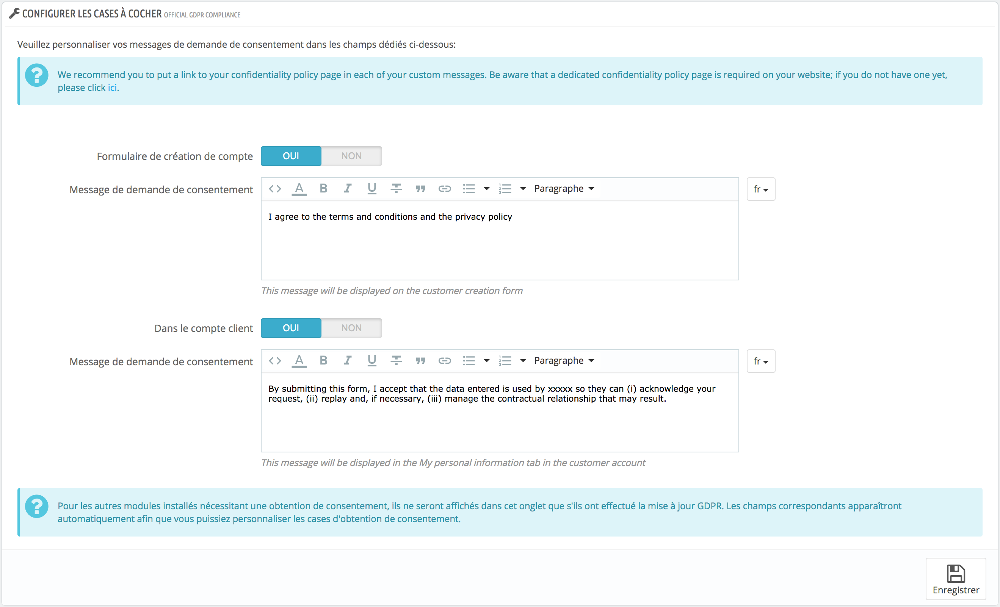

# Etre conforme au RGPD

## Introduction 

Le Règlement Général sur la Protection des Données (RGPD), entré en vigueur le 25 mai 2018, encadre l’utilisation qui est faite des données personnelles des utilisateurs dans l’Union européenne. Il s’applique à tout [traitement de données à caractère personnel](https://addons.prestashop.com/fr/modules-prestashop-gratuits/31944-livre-blanc-rgpd.html) (ex : collecte, conservation, extraction, utilisation, destruction, etc.), automatisé ou non.

## Pourquoi le RGPD est important 

Sachant cela et le fait que vous avez une activité e-commerce, vous traitez des données personnelles. En outre, le RGPD n’affecte pas seulement les entreprises européennes mais aussi les entreprises situées en dehors de l’Europe qui collectent des données de citoyens européens. Inutile de dire qu’aucun marchand ne peut ignorer ce règlement ; la conformité de votre activité est donc essentielle.

## Principales caractéristiques 

Le module RGPD disponible sur notre [marketplace Addons](https://addons.prestashop.com/fr/legislation/32323-rgpd-officiel-by-prestashop-16.html) vise à protéger les données personnelles des utilisateurs. Ils doivent avoir le droit d’accéder à leurs données personnelles et le droit à leur portabilité, le droit d’obtenir la rectification et/ou l’effacement de leurs données ainsi que le droit de retirer leur consentement lorsque celui-ci leur a été demandé.

Ce module vous permet également de conserver un journal de bord de l’ensemble des activités de vos utilisateurs concernant leurs données personnelles (notamment l’accessibilité, le consentement et l’effacement des données). Vous serez ainsi capable de démontrer que vous respectez vos obligations au regard du règlement.

Attention, l'article 83 du RGPD prévoit des sanctions jusqu’à 20 millions d’euros ou, dans le cas d’une entreprise, jusqu’à 4% du CA annuel mondial total de l’exercice précédent.

### Configurer le module RGPD 

#### Démarrage 

Recherchez le module RPGD puis cliquez sur Configurer. Cet onglet permettra de vous familiariser avec le Règlement Général sur la Protection des Données (RGPD) et avec notre module. Vous y trouverez les informations générales concernant ce règlement européen (notre livre blanc, vidéo, article, etc.), ainsi que le guide d’utilisation de notre module en PDF téléchargeable pour vous aider dans les différents éléments de sa configuration.

#### Gestion des données personnelles 

Dans cet onglet, vous trouverez tout d’abord la liste des modules installés sur votre boutique qui sont en conformité avec le RGPD.

Si vous considérez qu’un ou plusieurs modules collectent des données personnelles et qu’ils n’apparaissent pas sur cette liste, veuillez-vous assurer que vous avez accès à la dernière version de ces modules pour profiter de la mise à jour RGPD.

S’ils ne sont toujours pas affichés dans la liste, nous vous invitons à contacter leurs développeurs respectifs pour avoir [plus d’informations](http://build.prestashop.com/howtos/module/how-to-make-your-module-compliant-with-prestashop-official-gdpr-compliance-module) sur ces modules.

Vous aurez ensuite la possibilité dans cet onglet de chercher un client ou un utilisateur inconnu/invité enregistré dans votre base de données et de visualiser ensuite l’ensemble de ses données collectées par la solution PrestaShop ainsi que par les modules conformes RGPD installés sur votre boutique. Pour le rechercher, nous vous invitons à entrer tout simplement les premières lettres du nom de votre utilisateur, de son adresse email ou de son numéro de téléphone :

Les données personnelles que vous visualisez sur cette interface sont utiles à plusieurs égards pour vos utilisateurs :

* S’ils demandent l’accès à leurs données personnelles collectées sur votre boutique, ils obtiennent automatiquement un export de celles-ci sous format PDF ou CSV.
* S’ils demandent l’effacement de leurs données, celles-ci seront définitivement supprimées après validation de votre part.

Il vous est possible également dans cet onglet de traiter les demandes de suppression de données de vos utilisateurs effectuées grâce au formulaire de contact - et elles seront soumises à votre validation. Avant d’accepter la demande de suppression de données et de supprimer un utilisateur de façon définitive de votre base de données, assurez-vous d’avoir téléchargé les factures qui y sont liées.

Pour plus de détails sur ces données, vous serez redirigés vers la partie clients de votre back office qui gèrent les profils enregistrés et permet de voir les informations qu’ils contiennent.

À noter : ce module permet également de supprimer les comptes invités. Le marchand doit alors renseigner l’adresse mail ou le numéro de téléphone exacts pour voir tous les détails des comptes invités et ensuite pouvoir supprimer les données associées.

Une fois les données de l’utilisateur supprimées, celui-ci n’existe plus (compte client et adresse supprimés de votre base) mais les factures sont toujours visibles dans la commande. Seules ses données personnelles sont effacées. Ses paniers abandonnés sont transférés sur un compte anonyme et ses commandes, donc, ne sont plus associées à aucun compte client.

#### Personnalisation des cases d’obtention de consentement 

Cet onglet vous permettra de personnaliser les cases à cocher d’obtention de consentement et les messages correspondants dans les différents formulaires de votre boutique.

**Configuration des cases à cocher**

Vous pouvez activer et personnaliser les cases à cocher d’obtention de consentement à deux endroits par défaut :

* Dans le formulaire de création de compte client sur votre boutique
* Dans l’onglet Informations du compte client

Nous vous recommandons de remplir vos messages de demande de consentement dans toutes les langues disponibles de votre boutique.

En fonction des modules installés sur votre boutique, s’ils ont réalisé la mise à jour de conformité au RGPD, les champs de texte correspondants seront affichés sur cette interface pour que vous puissiez personnaliser vos messages de demande de consentement.

#### Suivi des activités des clients 

Dans cet onglet, vous pouvez visualiser toutes les actions de vos clients liées à leurs données personnelles (notamment pour l’accessibilité, le consentement et l’effacement de données).

Dans ce tableau récapitulatif, vous trouverez les informations ci-dessous :

* &#x20;Nom/Prénom du client ou ID client
* Type de demande : accessibilité, consentement ou effacement des données
* Date et heure de l’action

#### Aide 

Vous trouverez dans cet onglet la liste des questions les plus fréquentes de nos clients marchands et les réponses de nos experts Modules et RGPD à ces questions.

