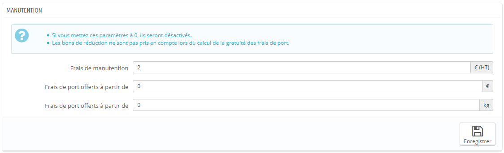
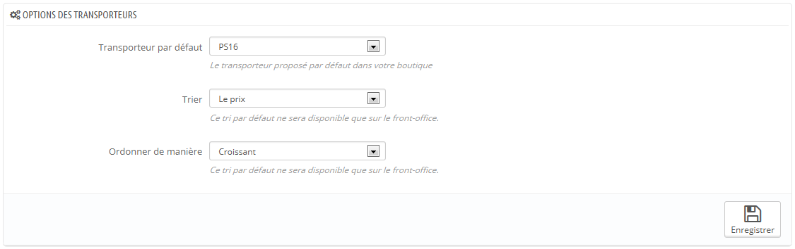

# Préférences de livraison

La seconde page du menu "Livraison" vous donne accès aux réglages les plus généraux du transport dans PrestaShop.

Cette page présente des réglages des frais de manutention :

* **Frais de manutention**. Saisissez les frais de manutention par commande, qui seront ajoutés au prix total de la commande. Ces frais sont différents des coûts d'expédition : il s'agit de ce qu'il vous en coûte de récupérer des colis, les emballer et les expédier. Si vous n'avez pas de coûts, mettez 0€.
* **Frais de port offerts à partir de**. Indiquez un prix ou un poids à partir duquel les clients profiteront de la livraison gratuite. Par exemple, vous pourriez offrir les frais de port quand la commande dépasse les 250€. Si vous ne souhaitez pas offrir la livraison, laissez ces champs à 0.

La section "Options des transporteurs" vous donne accès à trois réglages, qui ont un impact sur le front-office afin d'aider le client à faire un choix :

* **Transporteur par défaut**. Si vous avez plus d'un transporteur dans votre système, vous pourriez préférer en promouvoir un en particulier auprès de vos clients. Outre les transporteurs eux-mêmes, cette liste déroulante comporte deux options contextuelles :
  * **Le meilleur prix**. En fonction du montant de la commande, de son poids et de la zone d'expédition, PrestaShop choisira le transporteur le plus intéressant pour le client.
  * **La meilleure note**. Les notes de transporteurs permettent d'identifier les transporteurs les plus rapides. PrestaShop affichera le transporteur ayant, dans le contexte de la commande, le délai de livraison le plus court.
* **Tri par défaut des transporteurs**. Quand les clients se voient présentés un choix de transporteurs, vous pouvez choisir de trier la liste soit en fonction des frais de port, soit de leur position dans la liste ci-dessus.
* **Ordre par défaut des transporteurs**. Ce réglage indique l'ordre dans lequel les transporteurs sont triés :
  * Si les réglages sont sur "Prix" et "Croissant", alors les transporteurs seront affichés du moins cher au plus cher.
  * Si les réglages sont sur "Position" et "Décroissant", alors les transporteurs seront affichés depuis celui en haut de la liste, jusqu'à celui tout en bas.
