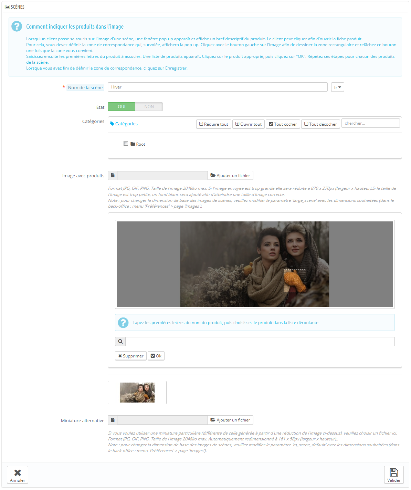

# Construire des scènes

Les scènes sont une fonctionnalité introduite avec la version 1.1 de PrestaShop, et disponible jusqu'à la version 1.5 incluses.\
**Les nouvelles installations de PrestaShop 1.6 ne présentent pas cette fonctionnalité, mais les sites mis à jour vers la version 1.6 peuvent toujours en profiter.**

Si vous avez installé PrestaShop 1.6 et que vous souhaitez malgré tout utiliser les scènes, voici comment faire :

1. Ouvrez la page Administration > Menus.
2. Cliquez sur "Ajouter un menu".
3. Dans le formulaire, donnez un nom à la page (a priori, "Scènes"), et saisissez "AdminScenes" dans le champ "Classe". Laissez le champ "Module" vide, et choisissez "Catalogue" comme page parente.
4. Validez. La page des scènes apparaîtra dans la page choisie.

**Notez que la fonctionnalité est dépréciée, et n'est plus supportée.**

Créer une "scène" consiste à assigner plusieurs zones cliquables à une image, de sorte que différentes pages produits puissent être ouvertes en cliquant sur une seule image. On appelle également cela une "image map", ou "image réactive". Cette fonctionnalité rend votre site attractif en facilitant la navigation des internautes.

Avant de créer une scène, vous devez disposer d'une image qui présente les différentes déclinaisons d'un produit, ou simplement différents produits.

En cliquant sur l'option "Scènes" du menu "Catalogue" vous amène à une nouvelle page, qui liste les scènes déjà enregistrées (s'il y en a).

## Créer une scène 

Pour créer une nouvelle scène, cliquez sur le bouton "Créer". Vous serez amené à l'écran de création.

* **Nom de la scène**. Donnez un nom à la scène.
* **État**. Définir si la scène doit être disponible ou non. Vous pouvez choisir de ne la rendre publique qu'à partir du moment où vous aurez mis tous les liens en place.
* **Image avec produits**. Sélectionnez l'image qui figurera dans la scène, puis cliquez sur "Enregistrer et rester". La page sera rechargée, avec la photo que vous avez envoyée, et quelques options en plus.

Nous allons maintenant mettre une scène en place. Cliquez sur un coin de votre image et faites glisser la souris à travers l'image pour mettre en évidence/couper la partie de l'image que vous désirez rendre cliquable pour l'utilisateur.

La partie sélectionnée sera claire et illuminée tandis que le reste de l'image sera assombri. Prenez soin d'aligner le cadre de votre image avec la zone sur laquelle votre client pourra cliquer.

Ceci fait :

* Saisissez les premières lettres du produit associé à cette image dans le champ en-dessous de l'image.\
  &#x20;Dans notre exemple, si nous tapons "robe", plusieurs choix apparaissent. On sélectionnera alors "robe imprimée".
* Confirmez votre choix en cliquant sur "OK". Votre scène vient maintenant d'être créée.

Répétez ce processus pour tous les produits que vous souhaitez rendre accessible depuis une image.

Les zones cliquables sont visibles grâce à l'icône "+". En déplaçant le curseur sur l'image, vous pouvez voir une petite fenêtre qui indique le nom de l'image, l'image par défaut, la courte description et le prix.

Si vous avez commis une erreur dans la zone cliquable, vous pouvez la redimensionner en saisissant ses côtés ou ses coins.

Si vous désirez supprimer une zone cliquable, sélectionnez la zone, et cliquez sur le bouton "Supprimer" se trouvant à côté de l'image.

Enfin, vous devez assigner une scène à une catégorie en cochant les cases dans le tableau "Catégories".

Une fois que toutes les modifications ont été faites, enregistrez vos paramètres.

Votre scène est désormais disponible dans votre boutique, au sein des catégories sélectionnées.
