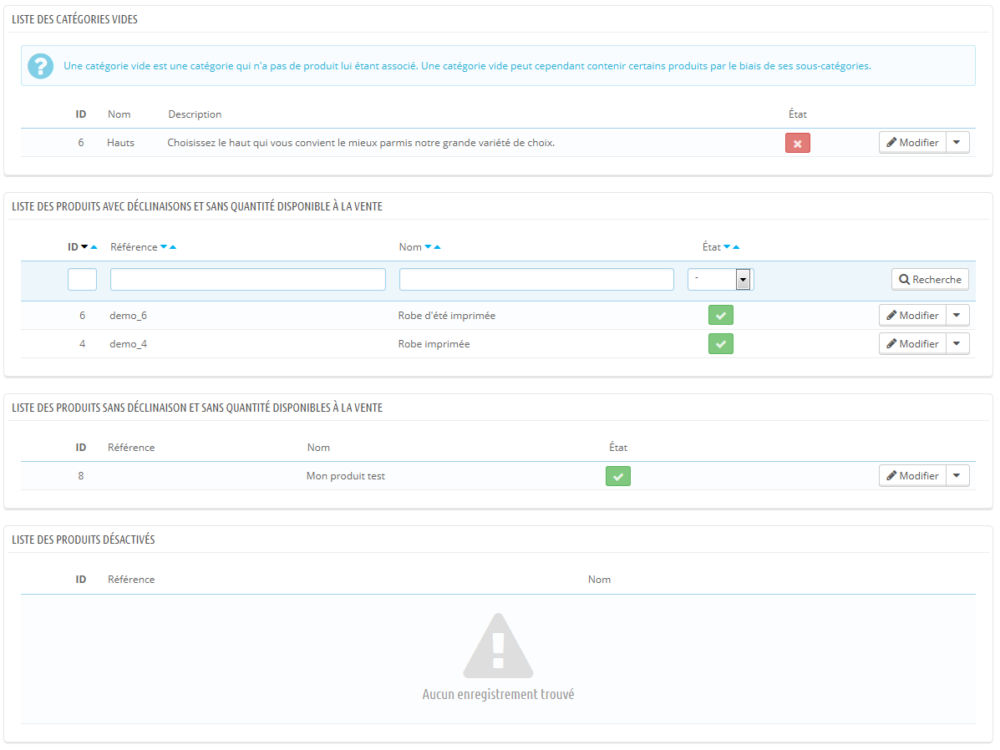

# Faire le suivi de votre catalogue

La page "Suivi" vous indique les sections de votre boutique auxquelles vous devez prêter le plus d'attention, afin de gérer au mieux votre catalogue et vous assurer que tout est sous contrôle.

Quatre sections apparaissent:

* **Liste des catégories vides**. Affiche le nom et le nombre de catégories qui ne contiennent aucun produit. Supprimez les catégories vides ou ajoutez-y des produits. Cela évitera qu'un client, en navigant dans votre boutique, se retrouve dans une catégorie vide.
* **Liste des produits avec déclinaisons et sans quantité disponible à la vente**. Affiche les produits qui ne sont plus en vente. Prenez les mesures nécessaires pour les réapprovisionner.
* **Liste des produits sans déclinaison et sans quantité disponible à la vente**. Affiche également les produits qui ne sont plus en vente. Prenez les mesures nécessaires pour les réapprovisionner.
* **Liste de produits désactivés**. Affiche le nom et le nombre de produits qui ont été retirés de la vente et qui ne sont pas visibles par vos clients. Pensez à les activer (peut-être en les réapprovisionnant) ou à les supprimer de votre catalogue.

La page "Suivi" devrait être consultée régulièrement afin d'améliorer la gestion du catalogue.
