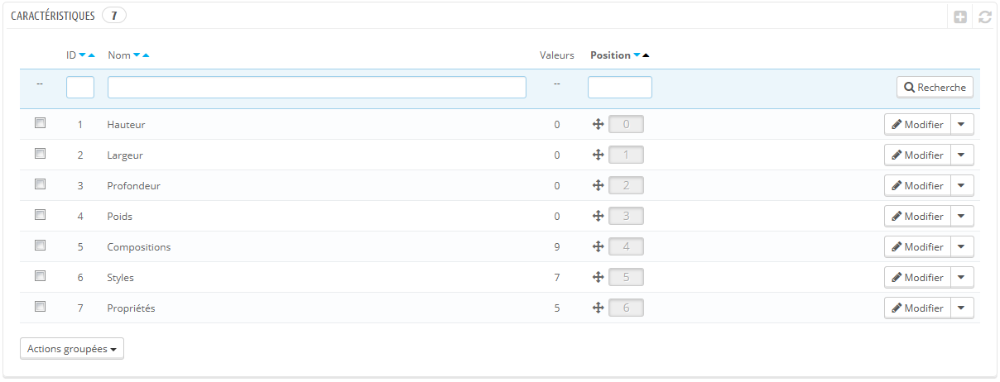
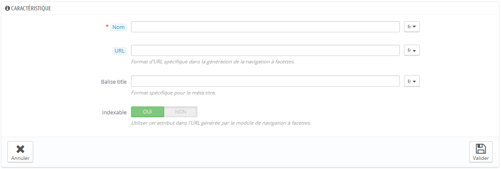
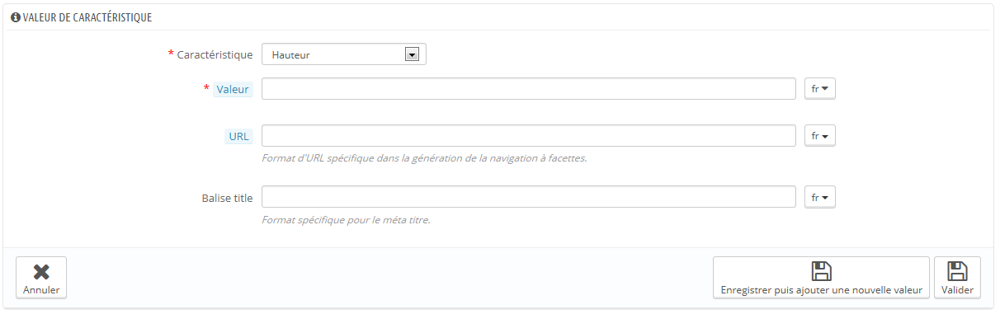

# Gérer les caractéristiques de vos produits

Cette page permet de définir les caractéristiques intrinsèques d'un produit : elles restent les mêmes tout au long des déclinaisons du produit.\
Vous devriez voir les caractéristiques de la même manière que vous voyez les attributs (voir ci-dessus), avec la différence notable que vous ne pouvez pas créer de déclinaisons à partir des caractéristiques.

La différence entre un attribut et une caractéristique dépend du produit lui-même. Certains produits peuvent partager la même propriété, qui pour un serait un attribut servant à construire des déclinaisons du produit, pour l'autre serait une simple caractéristique immuable.

Par exemple, un client peut acheter une déclinaison d'iPod basée sur ses attributs (couleur, espace disque) mais pas ses caractéristiques (poids, taille).

De la même manière, la même boutique pourrait vendre des déclinaisons basées sur ses attributs (couleur, taille, genre) mais pas ses caractéristiques (taille).

Les caractéristiques sont configurées par produit, dans la page "Produits" du menu "Catalogue", mais elles doivent d'abord être enregistrées dans votre boutique à l'aide de l'outil "Caractéristiques" du menu "Catalogue".

Vous pouvez configurer l'ordre des caractéristiques à l'aide des flèches dans la colonne "Position".\
La colonne "Actions" vous donne accès aux actions Modifier, Supprimer et Détails, que vous pouvez cliquer pour afficher les valeurs disponibles pour cette caractéristique. De là, vous pouvez trier, modifier et supprimer ces valeurs si besoin est.

## Ajouter une caractéristique 

Cliquez sur "Ajouter une nouvelle caractéristique". Un formulaire très simple apparaît. C'est là que vous nommez la caractéristique elle-même : par exemple, un type de casques fournis avec un lecteur de musique.

Donnez un nom à cette nouvelle caractéristique, et enregistrez-la pour revenir à la liste des caractéristiques.

Trois options supplémentaires sont disponibles lorsque vous activez le module "Bloc navigation à facettes". Elles ne sont pas strictement liées à la navigation à facette : elles mettent en place une adresse web directe vers une déclinaison produit. Ainsi, non seulement le client peut envoyer un lien précis à un ami, mais le positionnement du produit dans les moteurs de recherche est également amélioré.

* **URL**. Le mot à utiliser dans l'adresse. Par défaut, PrestaShop utilise le nom public de l'attribut.
* **Titre Meta**. Le mot à utiliser dans le titre de la page. Par défaut, PrestaShop utilise le nom public de l'attribut.
* **Indexable**. Indique si les moteurs de recherche doivent indexer cet attribut ou non.

Le client peut obtenir l'adresse simplement en cliquant sur un attribut dans la fiche produit : l'adresse changera pour ajouter un détail final, par exemple `#/couleur-metal` ou `#/espace_disque-16go/couleur-vert`.

Le générateur de navigation à facette utilise également ces options, ce qui explique la présence des indications "Format spécifique pour la génération des URL pour la navigation à facettes" et "Utilise cet attribut dans l'URL générée par le module de bloc de navigation à facette".

## Ajouter une valeur à une caractéristique 

Cliquez sur "Ajouter une autre valeur". Un nouveau formulaire apparaît.

Remplissez le formulaire :

* **Caractéristique**. Dans la liste déroulante, sélectionnez l'une des caractéristiques.
* **Valeur**. Donnez une valeur à l'attribut : "5 kg", "27 cm", ...

&#x20;...en enregistrez la valeur de cette caractéristique. Vous pouvez en ajouter d'autres en cliquant sur "Enregistrer puis ajouter une nouvelle valeur".
