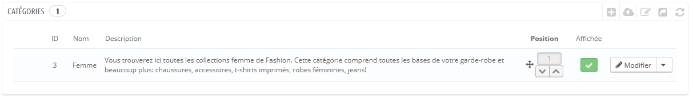
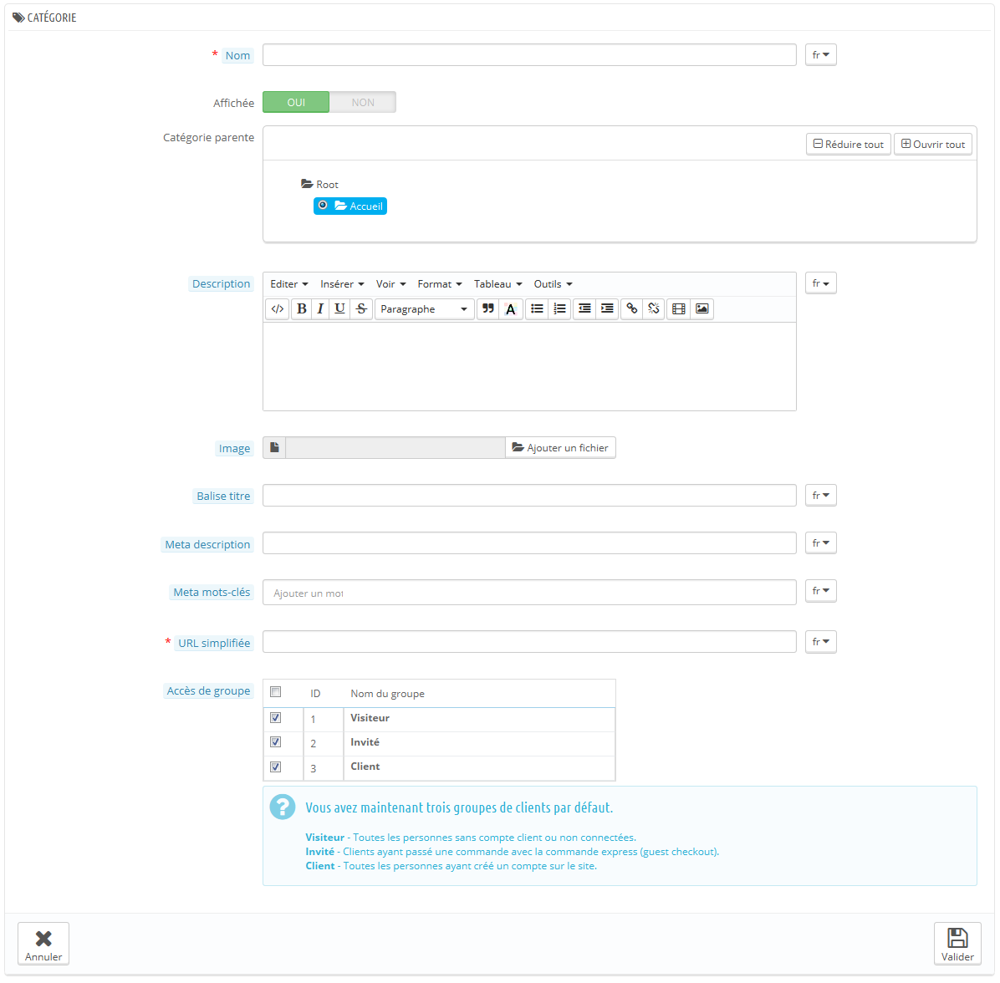

# Gérer les catégories

Il est essentiel de disposer de catégories, car elles vous permettent de regrouper les produits équivalents. Ainsi, les clients peuvent facilement s'y retrouver parmi vos nombreux produits, et limiter leur recherche quand ils cherchent un type particulier de produit. Une catégorie permet également de facilement comparer des produits, grâce à l'outil de comparaison de PrestaShop.

Vous devriez créer une catégorie à partir du moment où vous avez au moins deux produits qui disposent de caractéristiques équivalentes. Les produits d'une même catégorie doivent être comparables, voire interchangeables. Gardez cela en tête quand vient le moment d'ajouter de nouveaux produits ou de créer de nouvelles catégories.

Vous pouvez choisir de ne pas créer de catégorie et de grouper tous les produits dans une seule catégorie globale, "Accueil". Cependant, vos clients ne pourront pas comparer les produits.

Vous pouvez également décider que vous n'êtes pas intéressé par l'outil de comparaison et préférez construire vos catégories comme bon vous semble. Dans ce cas, nous vous conseillons de désactiver l'outil de comparaison : allez dans la page de préférences des produits, et mettez le champ "Préciser ici le nombre maximum de produits qui peuvent être sélectionnés pour la comparaison de produits" à 0.

Lors de la création d'une catégorie de produits, vous devez vous concentrer sur un aspect : **les produits de cette catégorie doivent être comparables**. C'est non seulement utile pour vos clients, mais c'est également une nécessité pour l'outil de comparaison de produits.

Les catégories sont gérées dans la page "Catégories" du menu "Catalogue". Cette page présente un tableau des catégories existant actuellement, avec leurs principales informations.\
Pour voir la sous-catégorie, cliquez sur la catégorie-mère, ou sélectionnez "Détails" dans le menu des actions.



À l'aide des icônes de la colonne "Affichée" du tableau, vous pouvez indiquer celles que vous voulez cacher des clients en cliquant sur l'icône "Oui", qui se transforme alors en "Non".

Toutes les catégories que vous créerez seront en fait des sous-catégories de la catégorie "Accueil".\
Pour modifier la catégorie "Accueil" (ou n'importe quelle catégorie actuellement sélectionnée), cliquez sur le bouton "Modifier" quand le tableau affiche les catégories racines.

Pour créer une nouvelle catégorie, cliquez sur le bouton "Ajouter une catégorie" depuis n'importe quel niveau de catégories.



Traduisez vos catégories !

Assurez-vous de traduire chaque champ dans toutes les langues utilisées par votre boutique. Pour ce faire, cliquez sur l'icône de drapeau à côté du champ et choisissez le drapeau correspondant à la langue du texte que vous voulez saisir.

Tout d'abord, vous devez mettre en place les informations générales :

* **Nom**. Nommez la catégorie. Utilisez un nom court et descriptif, et choisissez bien vos mots : vos clients se baseront dessus lors du parcours de votre boutique.
* **Affichée**. Indiquez si elle doit être affichée (c'est-à-dire si vous souhaitez la rendre aussitôt disponible pour vos visiteurs). Par exemple, vous pourriez vouloir remettre à plus tard l'ouverture de la catégorie, tant que tous ses produits n'y ont pas été placés.
* **Catégorie parente**. _N'apparaît pas lors de la création d'une catégorie racine._ Si vous souhaitez créer une sous-catégorie appartenant à une catégorie autre que la page d'accueil, vous pouvez la choisir dans ce sélecteur.
* **Description**. Vous devriez remplir ce champ, car non seulement il se révélera utile pour vous et vos employés, mais certains thèmes peuvent également s'en servir, par exemple en l'affichant pour vos clients.
* **Image**. Cliquez sur le bouton "Ajouter un fichier" pour mettre en ligne une image représentative de la catégorie, à partir de votre ordinateur.
* **Balise de titre**. Le titre qui apparaîtra dans les moteurs de recherche quand une recherche est faite par le client.
* **Meta description**. Une présentation du site en quelques lignes, dans le but d'attirer l'attention du client. Elle apparaîtra dans les résultats de recherche.
* **Meta mots-clés**. Les mots clés que vous devez définir afin que votre site soit référencé par les moteurs de recherche. Vous pouvez en définir plusieurs, séparés par des virgules. Vous pouvez également définir des expressions, en prenant soin de les mettre entre guillemets.
* **URL simplifiée**. Cela vous permet de réécrire l'adresse web de vos catégories comme vous le souhaitez.\
  &#x20;Par exemple, au lieu d'avoir une adresse comme [http://www.exemple.com/category.php?id\_category=3](http://www.exemple.com/category.php?id\_category=3), vous pouvez avoir [http://www.exemple.com/123-nom-de-la-catégorie](http://www.exemple.com/123-nom-de-la-cat%C3%A9gorie).\
  &#x20;Dans ce cas, vous devez simplement indiquer dans le champ "URL simplifiée" les mots (séparés par des tirets) que vous voudriez voir apparaître au lieu du "nom-de-la-catégorie".
* **Groupe d'accès**. Restreint l'accès à la catégorie et à ses produits pour certains acheteurs. Pour y accéder, ces acheteurs doivent appartenir à un groupe d'utilisateurs. Consultez les fonctions de groupes dans l'onglet "Clients" pour plus d'informations.
*   **Catégorie racine**. Peut-être souhaitez-vous faire de cette catégorie la nouvelle catégorie d'accueil, en lieu et place de "Accueil". Dans ce cas, activez l'option.

    La catégorie d'accueil est particulièrement utile en mode multiboutique. Imaginez que vous avez trois boutiques avec des produits et catégories totalement ou partiellement différentes : vous pourriez souhaiter avoir une catégorie d'accueil différente pour chaque boutique.

    La catégorie d'accueil représente donc la catégorie "Accueil" de chaque boutique. Ainsi, si vous ne souhaitez pas avoir les mêmes produits dans la catégorie "page d'accueil" de chaque boutique, vous avez besoin de différentes catégories d'accueil.\
    Il est ainsi plus facile d'assigner des catégories à chaque boutique, et vous pouvez avoir des produits différents dans la catégorie d'accueil.

Une fois que vous avez terminé de configurer votre catégorie, enregistrez-la, et vous pouvez commencer à y placer des produits.

Une nouvelle catégorie n'apparaît pas automatiquement dans le menu de votre boutique. Pour **ajouter une catégorie à votre menu**, vous devez paramétrer le module "Menu haut horizontal" (si vous utilisez le thème par défaut), ou tout autre module que vous avez pour gérer votre menu.

## Parcourir et modifier les catégories <a href="#gererlescategories-parcouriretmodifierlescategories" id="gererlescategories-parcouriretmodifierlescategories"></a>

Le bouton "Modifier" vous permet de modifier la catégorie parente de la sous-catégorie actuellement affichée. Cela signifie que lorsque vous affichez les sous-catégories principales, un clic sur le bouton "Modifier" vous permettra de modifier la catégorie "Accueil".

Vous pouvez cliquer sur n'importe quelle catégorie de la liste : cela ouvrira la catégorie, et affichera toutes ses sous-catégories. Dans les faits, cela changera le contexte de l'interface : un clic sur le bouton "Modifier" vous fera modifier la catégorie parente, et un clic sur le bouton "Ajouter" ouvrira le formulaire de création avec l'option "Catégorie parente" réglée sur la catégorie parente en cours.

## Importer et exporter des catégories <a href="#gererlescategories-importeretexporterdescategories" id="gererlescategories-importeretexporterdescategories"></a>

Outre les boutons "Ajouter" et "Modifier", la liste des catégories présente également deux boutons :

* **Exporter.** Vous permet de télécharger la liste des catégories au format CSV.
*   **Importer.** Ouvre la page "Paramètres avancés > Import CSV", avec le format attendu réglé sur "Catégories". Lisez le chapitre "Comprendre les paramètres avancés" pour en apprendre plus sur l'import de fichier CSV.\
    Vous aurez besoin d'un fichier CSV au format suivant :

    ```
    ID;Name;Description;Position;Displayed;
    3;iPods;Now that you can buy movies from the iTunes Store and sync them to your iPod, the whole world is your theater.;1;1;
    4;Accessories;Wonderful accessories for your iPod;2;1;
    5;Laptops;The latest Intel processor, a bigger hard drive, plenty of memory, and even more new features all fit inside just one liberating inch. The new Mac laptops have the performance, power, and connectivity of a desktop computer. Without the desk part.;3;1;
    ```

    L'identifiant de la catégorie est son ID, pas son nom.

Vous trouverez plus de possibilités dans la page "Import" du menu "Paramètres avancés".

## Ajouter des produits à une catégorie <a href="#gererlescategories-ajouterdesproduitsaunecategorie" id="gererlescategories-ajouterdesproduitsaunecategorie"></a>

Pour ajouter des produits à une catégorie, vous devez ouvrir la page de configuration du produit et vous rendre dans son onglet "Associations" sur la gauche. C'est ici que vous établirez les catégories auxquelles le produit appartient.

Position des produits

La catégorie "Accueil" est une catégorie spéciale, où vous pouvez mettre en avant et promouvoir des produits de n'importe quelles autres catégories en les faisant apparaître dans le bloc "Produits phares". Par défaut, vous ne pouvez afficher que 8 produits sur la page d'accueil.

Le bloc "Produits phares" dépend du module "Produits phares sur la page d'accueil". Si vous voulez afficher plus (ou moins) de produits sur la page d'accueil, changez la configuration de ce module (depuis la page "Modules" du menu "Modules").

À noter : vous ne devez pas enlever un produit de sa catégorie originelle afin de l'afficher sur la page d'accueil. Un produit peut avoir autant de catégories que nécessaire.
