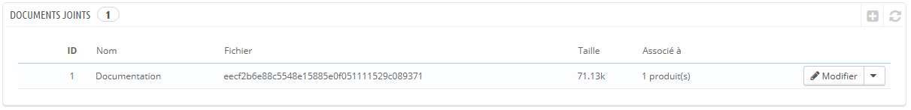
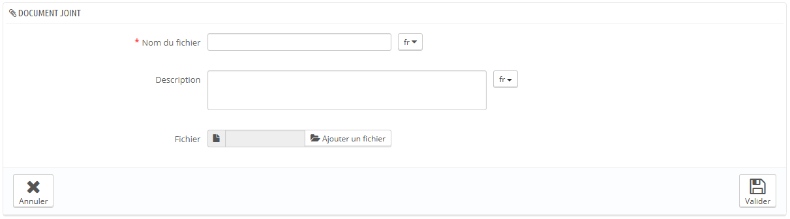

# Gérer les documents joints

PrestaShop vous permet de mettre certains fichiers à disposition de vos clients avant qu'ils ne passent commande.

Par exemple, disons que vous vendez de l'électronique, et que vous souhaitez conseiller à vos clients de lire un document sur le fonctionnement de l'un de vos produits. Vous pouvez mettre en ligne un document à cet effet.\
&#x20;Vous pouvez aussi tout simplement mettre le manuel à disposition de tous au format PDF, directement depuis la page du produit.

Chaque produit peut avoir des fichiers joints, qui peuvent être définis individuellement via leur onglet "Documents joints" à gauche, comme expliqué dans le chapitre précédent de ce guide, "Ajouter des produits et des catégories de produits". Cette page vous donne accès à tous les fichiers joints de la boutique : si vous avez besoin d'appliquer un fichier à plusieurs produits, vous n'aurez qu'à le mettre en ligne une fois.

Vous pouvez également mettre en ligne des fichiers individuels, avant même de les associer à des produits. C'est dans la page "Documents joints" du menu "Catalogue" que tout se passe.

Le processus d'enregistrement d'un fichier joint est clair :

1. Cliquez sur le bouton "Ajouter un document joint". Un formulaire s'ouvre.
2. **Nom du fichier**. Indiquez le nom de votre document joint, dans toutes les langues disponibles.
3. **Description**. Donnez en une description brève, également dans toutes les langues.
4. Cliquez sur "Parcourir" pour sélectionner sur votre ordinateur un fichier à mettre en ligne.
5. Cliquez sur "Enregistrer".

Vous êtes alors renvoyé vers la liste des fichiers joints, où apparaît le fichier que vous venez de mettre en ligne. Il est disponible pour tous les produits, par le biais de leurs onglets "Documents joints".

Désormais, un onglet "Téléchargement" apparaîtra sur la page publique du produit, et vos clients pourront télécharger le fichier autant qu'ils le souhaitent.
