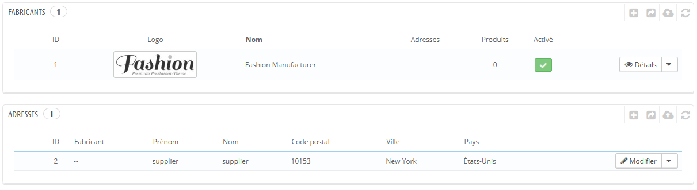
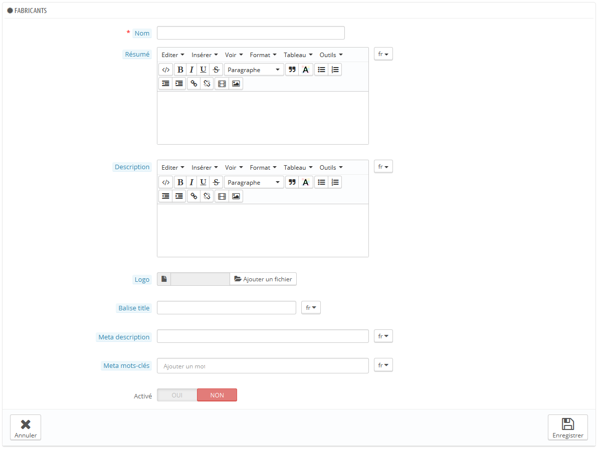
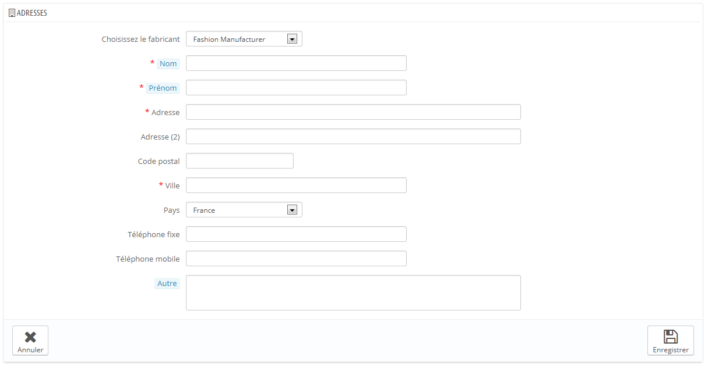

# Gérer les fabricants

À moins que vous ne fassiez vos produits vous-même, vous devriez toujours enregistrer les fabricants de vos produits dans PrestaShop.

Dans PrestaShop, la marque d'un produit correspond à son fabricant.

Si vous vendez vos propres produits, vous devez au moins créer un fabricant pour votre société. Cela aider vos clients à trouver ce qu'ils recherchent, et peuvent apporter du contenu intéressant pour les moteurs de recherche.

Sur votre boutique, les fabricants sont triés par ordre alphabétique. Vous ne pouvez pas changer cet ordre.

Les nouvelles marques sont automatiquement désactivées. Vous devez les activer afin qu'elles apparaissent en ligne – même si elles ne contiennent pas encore de produit.

En saisissant les informations sur les marques, les visiteurs de votre site peuvent avoir un accès rapide à l'ensemble des produits d'une marque donnée. Cela rend la navigation sur votre site plus facile pour eux. En termes de visibilité, remplir ces champs permettra d'améliorer votre position dans les moteurs de recherche.

## Créer un fabricant 

Cliquez sur le bouton "Ajouter une marque", et un formulaire de création apparaît.

Remplissez-en tous les champs:

* **Nom**. Indiquez le nom de la marque, afin de simplifier les recherches de vos visiteurs.
* **Résumé**. Il s'agit de la description qui apparaîtra sur les moteurs de recherche lorsqu'un internaute lance une recherche. Limitée à 100 caractères.
* **Description**. Ajoutez une description plus complexe de votre marque ainsi que de leurs activités et produits.\
  &#x20;Vous pouvez détailler leurs spécialités et promouvoir la qualité de leurs produits. La description de la marque sera affichée dans votre boutique, aux côtés des autres.
* **Logo**. Il est essentiel d'avoir un logo de la marque : elle accroche le regard des clients, et votre boutique acquiert presque autant de capital-confiance que si vous étiez vous-même la marque ou le fabricant.
* Les champs SEO (Méta titre, Méta description et Méta mots-clés) : ils offrent le même intérêt que leurs équivalents pour les catégories.
* **Balise \<title>**. Le titre apparaîtra dans les moteurs de recherche lorsqu'il affiche votre lien dans ses résultats de recherche.
* **Méta description**. Une présentation de votre site en seulement quelques lignes, destinée à capter l'intérêt d'un client. Elle apparaîtra dans les résultats de recherche.
* **Méta mots-clés**. Les mots-clés doivent être définis pour que votre site soit référencé par les moteurs de recherche. Vous pouvez en saisir plusieurs, séparés par des virgules, ou utiliser des expressions qui doivent être indiquées entre guillemets.
* **Activé**. Vous pouvez désactiver un fabricant, même temporairement. Cela ne fera que le retirer de la liste des fabricants sur votre boutique en front-office.

Enregistrez vos modifications afin d'être ramené à la liste des marques. De là, vous pouvez :

* Cliquer sur le nom d'une marque ou son logo, afin d'obtenir une liste de tous les produits qui lui sont associés. S'il n'y en a pas, alors vous devriez associer des produits à cette marque, en travaillant par produit, depuis la page "Produits" du menu "Catalogue", en utilisant l'onglet "Associations" de chaque produit.\
  &#x20;Vous obtiendrez le même résultat en cliquant sur l'icône "Affichage" situé à droite de la présente page.
* Désactiver la marque, en cliquant sur l'icône de coche verte. Une fois désactivé, une croix rouge apparaît à sa place : cliquez dessus pour réactiver la marque.
* Modifier / supprimer la marque en cliquant sur les boutons correspondants, à la droite de la ligne.

## Créer une adresse de fabricant 

En bas de la page "Marques" se trouve la section "Adresses". Chaque marque peut voir sa propre adresse enregistrée dans PrestaShop. Cela vous sert principalement de rappel : ainsi, vous aurez toujours l'adresse de la marque à portée de main dans PrestaShop.

Cliquez sur le bouton "Ajouter une adresse de marque" pour ouvrir le formulaire de création.

Assurez-vous bien de choisir le bon fabricant, et de remplir autant de champs que nécessaire.
