# Gérer les produits

## Gérer les produits 

Vous pouvez gérer les produits de votre boutique par le biais de la page "Produits" du menu "Catalogue".

Ce chapitre contient les sections suivantes :

* [Gérer les produits](gerer-les-produits.md#Gérerlesproduits-Gérerlesproduits)
  * [La liste de produits](gerer-les-produits.md#Gérerlesproduits-Lalistedeproduits)
  * [Les boutons globaux de la page produit](gerer-les-produits.md#Gérerlesproduits-Lesboutonsglobauxdelapageproduit)
  * [Remplir les informations globales sur le produit](gerer-les-produits.md#Gérerlesproduits-Remplirlesinformationsglobalessurleproduit)
  * [Déterminer le prix d'un produit](gerer-les-produits.md#Gérerlesproduits-Déterminerleprixd%27unproduit)
  * [Améliorer la position de votre produit dans les moteurs de recherche (Référencement - SEO)](gerer-les-produits.md#Gérerlesproduits-Améliorerlapositiondevotreproduitdanslesmoteursderecherche\(Référencement-SEO\))
  * [Gérer les associations du produit](gerer-les-produits.md#Gérerlesproduits-Gérerlesassociationsduproduit)
  * [Évaluer les coûts de livraison : taille, poids, transporteur](gerer-les-produits.md#Gérerlesproduits-Évaluerlescoûtsdelivraison:taille,poids,transporteur)
  * [Ajouter des déclinaisons au produit](gerer-les-produits.md#Gérerlesproduits-Ajouterdesdéclinaisonsauproduit)
  * [Gérer les quantités de produit](gerer-les-produits.md#Gérerlesproduits-Gérerlesquantitésdeproduit)
  * [Configurer les images du produit](gerer-les-produits.md#Gérerlesproduits-Configurerlesimagesduproduit)
  * [Configurer les caractéristiques du produit](gerer-les-produits.md#Gérerlesproduits-Configurerlescaractéristiquesduproduit)
  * [Gérer la personnalisation](gerer-les-produits.md#Gérerlesproduits-Gérerlapersonnalisation)
  * [Gérer les documents joints](gerer-les-produits.md#Gérerlesproduits-Gérerlesdocumentsjoints)
  * [Configurer le fournisseur du produit](gerer-les-produits.md#Gérerlesproduits-Configurerlefournisseurduproduit)
  * [Gestion des entrepôts (avancé)](gerer-les-produits.md#Gérerlesproduits-Gestiondesentrepôts\(avancé\))
* [Créer un pack de produits](gerer-les-produits.md#Gérerlesproduits-Créerunpackdeproduits)
* [Créer un produit téléchargeable / dématérialisé](gerer-les-produits.md#Gérerlesproduits-Créerunproduittéléchargeable/dématérialisé)

### La liste de produits 

En cliquant sur l'option "Produits" du menu "Catalogue", vous ouvrez une page qui présente la liste de vos produits actuels, avec quelques détails : ID, photo, nom, référence, catégorie, etc.

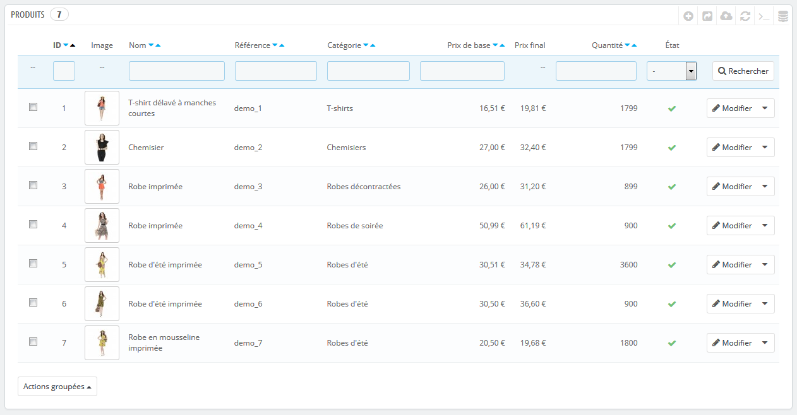

En plus de la liste de produits, cette page vous présente quelques statistiques de votre boutique :

* Pourcentage de produit en stock,
* Pourcentage de marge brute moyenne,
* Pourcentage de ventes sur les 30 derniers jours,
* Nombre de produits désactivés.

L'option "Filtrer par catégorie" vous permet de n'afficher que les produits qui concernent votre recherche actuelle, ainsi que de réorganiser la position des produits au sein d'une catégorie.

Position des produits

Vous ne pouvez pas réorganiser la liste entière de produits. Ils sont affichés tels quels (par numéro d'ID croissant) dans la boutique, et le client peut choisir l'ordre des produit sur la boutique à l'aide des algorithmes de tri disponibles : moins chers en premiers, plus chers en premiers, tri alphabétique sur le nom des produits, tri alphabétique inversé sur le nom des produits, produits en stock en premier, référence croissante, référence décroissante.

Vous pouvez organiser les produits par catégorie en cliquant sur la case "Filtrer par catégorie". Cette case ouvre une petite interface qui liste toutes vos catégories et sous-catégories. Lorsque vous en sélectionnez une, la liste de produits est automatiquement filtrée pour n'afficher que les produits de cette catégorie. Elle ajoute également une colonne "Position" au tableau, grâce à laquelle vous pouvez changer l'ordre des produits dans la page de la catégorie. Pour faire cela, vous pouvez soit déplacer les lignes du tableau à la souris, soit cliquer sur les flèches.

Votre ordre de produits peut ensuite être modifié par l'ordre de tri choisi par le client.

Notez que lorsque vous changez l'ordre d'affichage de la liste de produits dans le back-office (en cliquant sur les flèches du nom d'une colonne afin de trier les produits en fonction de cette colonne), la colonne "Position" n'affiche plus les flèches et vous ne pouvez plus déplacer les lignes du tableau. Au lieu de cela, la colonne affiche le numéro de position du produit. Pour pouvoir à nouveau organiser les produits, cliquez sur le bouton "Reset".

Enfin, le haut de la liste de produits présente quatre boutons :

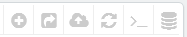

* **Ajouter**. Ajouter un nouveau produit.
* **Exporter**. Télécharger un fichier CSV de tous les produits de votre catalogue.
* **Importer**. Ouvrir la page d'importation de données, depuis la quelle vous pouvez envoyer votre fichier CSV.
* **Rafraîchir**. Recharger la liste de produits pour afficher les dernières modifications.
* **Voir la requête SQL**. Vous fournit la requête SQL pour reproduire votre recherche ou filtre dans votre propre gestionnaire SQL.
* **Exporter vers le gestionnaire SQL**. Ouvre le gestionnaire SQL de PrestaShop (dans le menu "Paramètres avancés"), grâce auquel vous pouvez faire des requêtes sur la base de données PrestaShop avec des instructions SQL ("`SELECT ... FROM ... WHERE ...`"). Si votre liste de produits est filtrée (par exemple, par nom), alors la requête SQL par défaut le prendra en compte (par exemple, "``WHERE 1  AND b.`name` LIKE '%robe%'``").

Vous pouvez ajouter de nouveaux produits en cliquant sur "Ajouter". La page de création s'ouvre, avec plusieurs onglets à gauche.

### Les boutons globaux de la page produit 

Par défaut, la page de création d'un produit affiche deux boutons : que vous trouverez sur la plupart des pages de l'administration : "Modules et services recommandés" et "Aide".

En bas de la chaque page se trouvent trois boutons :

* **Enregistrer**. Ce bouton enregistre toutes les modifications que vous avez apportées à n'importe lequel des onglets du produit, puis vous ramène à la liste des produits.
* **Enregistrer et rester**. Ce bouton enregistre toutes les modifications que vous avez apportées à n'importe quel des onglets du produit, mais vous laisse sur la page du produit en cours de création. C'est particulièrement utile si vous souhaitez changer d'onglet sans perdre les modifications apportées à l'onglet en cours, ou si vous voulez appliquer vos modifications immédiatement.
* **Annuler**. Vous ramène simplement à la liste des produits, sans enregistrer aucune de vos modifications.

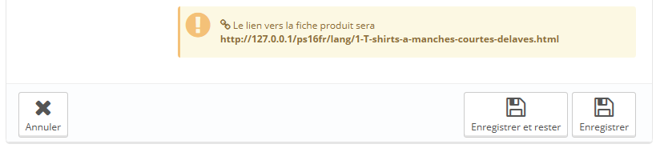

Dès que vous donnez un nom au produit et que vous cliquez sur "Enregistrer et rester", d'autres boutons apparaissent dans la page produit :

* **Visualiser**. Affiche la page d'accueil de votre produit. C'est non seulement pratique, mais par ailleurs cela marche avec les produits désactivés (onglet "Information").
*   **Dupliquer**. Crée une copie exacte du produit en cours. C'est particulièrement utile si vous souhaitez utiliser le produit en cours comme base pour un nouveau produit, sans devoir tout recréer à la main. Par exemple, deux produits peuvent être très différents, mais avoir les mêmes associations de produits, les mêmes transporteurs, ou le même fournisseur.

    Ne dupliquez pas trop !

    Si vous souhaitez créer différentes versions d'un même produit, du fait de leurs différences en termes de couleur, de capacité, de taille, etc., alors vous devriez mettre en place des déclinaisons de produit plutôt que de dupliquer le produit X fois. Voir l'onglet "Déclinaisons", qui est expliqué dans la section "Ajouter des déclinaisons de produit" de ce chapitre.
* **Ventes**. Vous renvoie vers la page "Détail produit" du tableau de statistiques (menu "Statistiques"), qui vous présente le nombre de vues et de ventes du produit.
* **Supprimer ce produit**. Enlève toutes les données du produit en cours, y compris ses images, déclinaisons, fonctionnalités, etc.

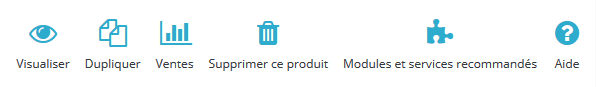

### Remplir les informations globales sur le produit 

Le premier onglet contient les informations de base sur le produit.

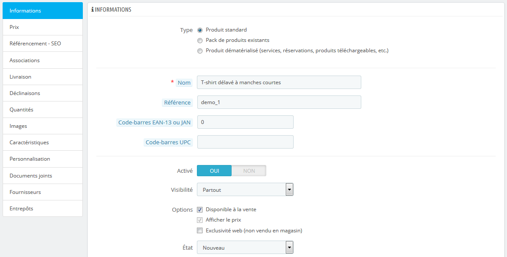

La première ligne est essentielle : indiquez si le produit est un pack (une déclinaison d'au moins deux produits existants), un produit dématérialisé (fichier téléchargeable, service, etc.), ou tout simplement un produit normal, envoyé par transporteur. Pour le moment, nous ne parlerons que de la première de ces trois options, et traiterons des packs et produits dématérialisés dans leurs propres sections de ce chapitre.

Il y a de nombreuses autres options liées aux produits dans la page "Produits" du menu "Préférences" :

* Nombre de jours durant lesquels un produit est considéré comme "nouveau"
* Tri par défaut
* Activer la gestion des stocks avancée
* etc.

Il faut vraiment vous assurer que ces réglages globaux correspondent à vos attentes.

Vous commencez avec quatre champs de texte :

*   **Nom**. La première chose à faire est de nommer le produit. Le nom apparaîtra dans les résultats des moteurs de recherche. À côté du champ, vous trouverez un drapeau, ce qui vous permet de choisir la langue dans laquelle vous souhaitez modifier ou créer le nom.

    Vous **devez** donner au produit un nom dans au moins la langue par défaut avant de pouvoir l'enregistrer. Vous ne serez pas en mesure d'enregistrer jusqu'à ce qu'il ait un nom - et de nombreux autres onglets exigent que le produit soit enregistré afin d'être accessibles.

    Assurez-vous bien de traduire chaque champ dans toutes les langues reconnues par votre boutique. Pour ce faire, cliquez sur le petit drapeau à côté du champ, et choisissez le drapeau de la langue dans laquelle vous souhaitez traduire le texte.
* **Référence**. C'est votre propre référence interne. Il peut s'agir d'un nombre, ou d'une référence à son emplacement dans votre stock ou de son fournisseur, ou tout ce qui le rend unique. Facultatif.
* **Code-barres EAN-13 ou JAN**. Ce sont les chiffres des codes-barres du produit, utilisés dans le monde entier afin de l'identifier. Vous pouvez utiliser soit un EAN-13 ou soit un JAN.
  * Un EAN-13 est le numéro international du produit à  13 chiffres. À lire sur Wikipedia : [http://fr.wikipedia.org/wiki/Code-barres\_EAN](http://fr.wikipedia.org/wiki/Code-barres\_EAN).
  * Un JAN est spécifique au Japon, mais est compatible avec l'EAN international. À lire sur Wikipedia : [http://en.wikipedia.org/wiki/Japanese\_Article\_Number](http://en.wikipedia.org/wiki/Japanese\_Article\_Number) (en anglais).
* **Code-barres UPC**. Un code-barres à 12 chiffres, et le premier du genre, généralement utilisé en Amérique du Nord, au Royaume-Uni, en Australie et en Nouvelle-Zélande. À lire sur Wikipedia : [http://fr.wikipedia.org/wiki/Code\_universel\_des\_produits](http://fr.wikipedia.org/wiki/Code\_universel\_des\_produits).

Puis se trouvent quatre options :

* **Activé**. Si vous préférez que le produit ne soit pas immédiatement rendu disponible à la vente, choisissez "No".
* **Visibilité**. Vous pouvez par ailleurs rendre le produit uniquement accessible par certains chemins :
  * **Partout**. Les clients peuvent découvrir le produit en explorant le catalogue, en cherchant le produit dans le moteur de recherche, ou directement en utilisant son adresse web.
  * **Catalogue uniquement**. Les clients peuvent découvrir le produit en explorant le catalogue ou directement en utilisant son adresse web.
  * **Recherche uniquement**. Les clients peuvent découvrir le produit en cherchant le produit dans le moteur de recherche, ou directement en utilisant son adresse web.
  * **Nulle part**. Les clients ne peuvent arriver sur le produit qu'en utilisant son adresse web. Ils ne le trouveront pas en explorant le catalogue ni en utilisant le moteur de recherche. Cela vous permet de créer des produits privés, auxquels seuls quelques clients privilégiés peuvent avoir accès, ne serait-ce que temporairement (vous pouvez modifier cette option à n'importe quel moment).
* **Options**. Quelques options spécifiques :
  * **Disponible à la vente**. Si vous décochez cette case, les clients ne pourront ajouter ce produit à leur panier. Vous obtiendrez donc un affichage de type catalogue limité à ce produit (en référence à la préférence "Mode Catalogue").
  * **Afficher le prix**. Si l'option "disponible à la vente" ci-dessus est activée, vous pouvez choisir d'afficher le prix malgré tout, même si les clients ne pourront pas acheter le produit.
  * **Exclusivité web (non vendu en magasin)**. Si votre société dispose de magasins en dur, cette option peut s'avérer très utile : elle signale au client que le produit ne peut être acheté qu'en ligne, ce qui évitera la venue en magasin de clients qui vérifient le prix en ligne puis font le trajet pour éviter les frais de port.
* **Condition**. Toutes les boutiques en ligne ne font pas que vendre des produits neufs. Cette option vous permet d'indiquer l'état du produit :\

  * **Neuf**. Le produit est neuf, vendu dans son emballage d'origine intact.
  * **Occasion/seconde main**. Le produit a déjà été vendu au moins une fois, et a probablement été utilisé par quelqu'un d'autre – c'est au moins une seconde main. Il devrait être vendu dans son emballage d'origine, qui peut être scellé avec du scotch.
  * **Reconditionné**. Le produit a été renvoyé à votre boutique pour une raison ou une autre (rayures, cabossage ou autre forme de dommage purement cosmétique et n'affectant pas les performances ou l'utilité du produit).

Ces quelques détails en place, vous pouvez ajouter une description à votre produit.\
Il est essentiel de décrire un produit, que ce soit pour le client (plus il a d'information, mieux c'est) ou pour les moteurs de recherche (la description vous aidera à apparaître dans plus de requêtes de recherche.

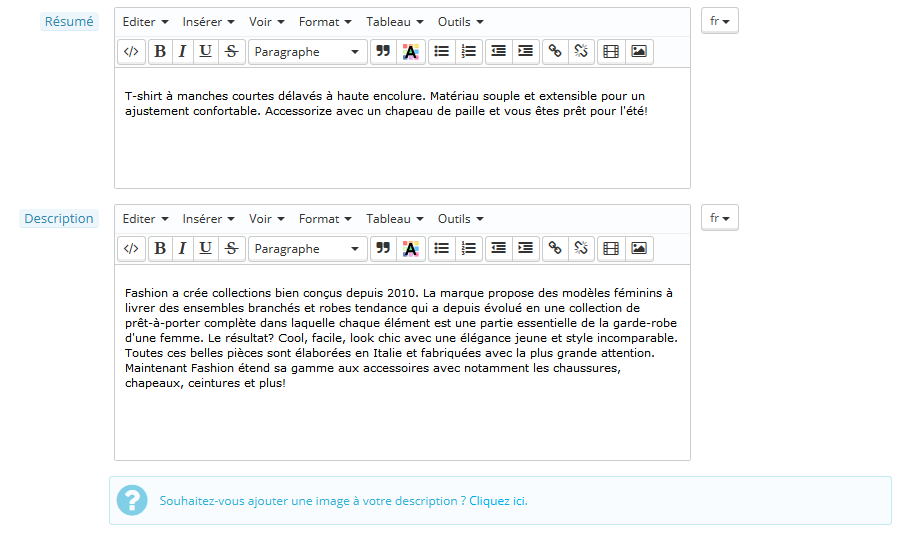

En bas d l'écran, les deux champs de description n'ont pas les mêmes usages :

* Le champ "**Résumé**" vous permet d'écrire une rapide description, qui apparaîtra dans les moteurs de recherche et dans la description du produit dans les pages de catégorie. Ce champ est limité à 400 caractères par défaut : si vous dépassez cette limite PrestaShop affichera un avertissement en rouge.
* Le champ "**Description**" vous permet d'écrire une description complète de votre produit, qui apparaîtra directement sur la page produit. L'éditeur de texte vous donne accès à un grand nombre d'options pour créer une description visuellement agréable (police, taille, couleur, etc.).\
  &#x20;Si le second champ n'est pas limité en caractères, évitez cependant de trop en mettre : efforcez-vous de ne mettre que les informations essentielles de manière convaincante, et votre produit en sortira grandi.

En-dessous du champ "Description" se trouve un petit outil vous permettant d'ajouter l'une des images liées au produit (par le biais de l'onglet "Images") dans la description, à l'aide d'un code. Cliquez sur "Cliquez ici" pour l'ouvrir.

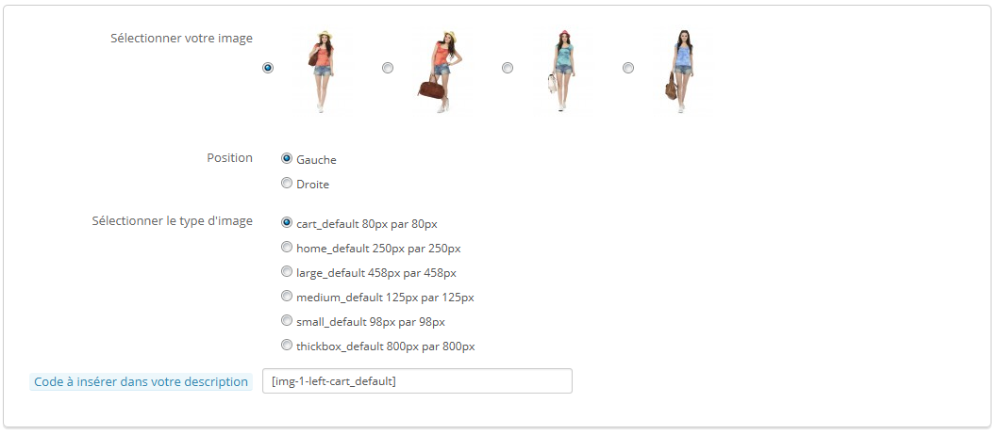

Sélectionnez simplement l'image que vous souhaitez utiliser, choisissez sa position par rapport au texte et sa taille, et PrestaShop génèrera le code que vous pourrez coller dans la description (idéalement entre deux paragraphes, ou au tout début d'un paragraphe).

Dans le champ "**Mots-clés**", saisissez les mots qui aideront vos clients à trouver ce qu'ils recherchent en les séparant par des virgules.

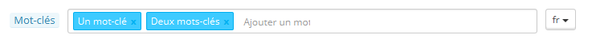

Ils sont affichés sur la boutique dans le bloc "Mots-clés" (s'il est disponible). Si vous ne souhaitez pas afficher ce bloc, désactivez simplement le module "Bloc mots-clés" (dans la page "Modules").

Différence avec PrestaShop 1.4

PrestaShop 1.4 vous permettait d'indiquer la marque/le fabricant du produit directement dans cet onglet. Depuis la version 1.5, ce réglage a été déplacé dans l'onglet "Associations" à gauche. De même pour le champ "Catégorie par défaut", les catégories associées, et le champ "Accessoires".

La version 1.4 permettait également d'indiquer la taille et le poids avec l'emballage final. Depuis la version 1.5, ces réglages peuvent être trouvés dans l'onglet "Transport" à gauche.

Le champ "Emplacement" de la version 1.4 se trouve désormais dans l'onglet "Entrepôts" à gauche, qui n'est disponible que si vous avez activé la gestion des stocks avancée (menu "Préférences", page "Produits", section "Stock des produit").

Une fois que vous avez saisi toutes ces informations, enregistrez votre travail pour revenir à la liste des produits. Si vous cliquez plutôt sur "Enregistrer et rester", vous pourrez continuer à travailler sur le produit en cours.

### Déterminer le prix d'un produit 

Tout se passe dans l'onglet "Prix" à gauche. La section Prix peut être intimidante au premier abord, avec des champs qui s'influencent les uns les autres, et les taxes à prendre en compte – mais c'est en fait très simple.

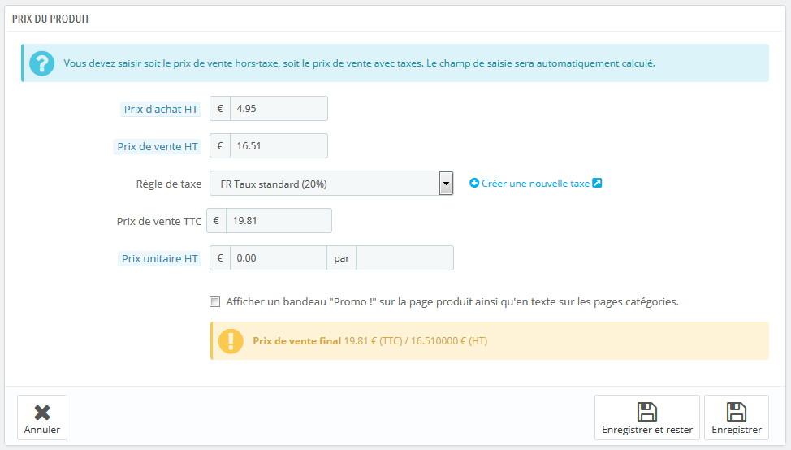

Déterminez le prix qui apparaîtra dans votre boutique en suivant les instructions suivantes :

* **Prix d'achat HT**. Cela vous permet de connaître instantanément votre prix de gros (votre prix d'usine), et ainsi de le comparer avec votre prix de vente afin de calculer facilement votre marge.
* **Prix de vente HT**. Le prix de votre produit avant l'application des taxes.
* **Règle de taxe**. La taxe applicable au produit. Choisissez parmi les différents taux que vous avez mis en place.\
  &#x20;Pour créer de nouveaux taux de taxation, cliquez sur le bouton "Créer". La création de taxe se passe dans la page "Taxes" du menu "Localisation". Tout est expliqué dans le chapitre "Comprendre les réglages locaux" de ce guide.
* **Écotaxe (TTC)**. La valeur de l'écotaxe pour ce produit. Cette valeur est déjà incluse dans le prix de vente. Vous êtes censé déclarer cette taxe à l'agence de taxation de votre pays.\
  &#x20;_Notez que ce champ n'est pas affiché par défaut._ Si vous devez ajouter une écotaxe, vous devez l'indiquer à PrestaShop : dans le menu "Localisation", ouvrez la page "Taxes", et dans la section des options en bas de page, activez le réglage "Utiliser l'écotaxe".
* **Prix de vente TTC**. Le prix du produit avec les taxes incluses. Vous pouvez modifier la valeur, cela modifiera automatiquement le champ "Prix d'achat HT" en fonction du taux de taxation choisi.
* **Prix unitaire**. Cela vous permet de vous conformer aux législations locales qui requièrent que les produits soient affichés avec leur prix unitaire.\
  &#x20;Par exemple, si vous vendez un pack de 6 canettes de soda, vous devrez alors remplir ce champ avec le prix par canette, et indiquer "canette" dans le second champ. La description sur la même ligne se modifiera en fonction. Le champ "par" peut correspondre à n'importe quelle unité, les plus fréquentes étant "litre", "fl oz" (once liquide), "sterling" (livre anglaise), "kg" (kilogramme), "gallon", etc.
* **Afficher un bandeau "Promo !"**. Cochez cette case pour indiquer que le produit est en solde, sur la fiche produit et sur le texte dans la liste des produits. Un logo apparaîtra en dessous du produit. Vous pouvez modifier ce logo en changeant le fichier suivant : `themes/default/img/onsale_fr.gif`
* **Prix de vente final**. Ce prix, comprenant la taxe, est mis à jour au fur et à mesure de votre saisie.

Vous pouvez remplir le champ "Prix de vente TTC" et choisir la règle de taxe à appliquer, et le prix de détail HT sera calculé automatiquement. L'opération opposée est aussi possible.

Une fois ces informations saisies, vous avez fait les grands fondamentaux de votre page produit. Vous pouvez enregistrer vos modifications et aussitôt voir votre produit en vente sur votre boutique !\
&#x20;Mais ne vous arrêtez pas en si bon chemin, car il y a encore de nombreux détails que vous pouvez et même devez ajouter à votre produit pour rendre la page produit plus utile pour vos utilisateurs.

#### Prix spécifiques : gérer les réductions de prix 

Vous pouvez modifier le prix final de vente d'un produit en fonction de la quantité qu'achète un client, de son groupe de client, de son pays, etc. Pour ce faire, passez par la section "Prix spécifiques" de l'onglet "Prix". Cliquez sur "Ajouter un nouveau prix spécifique" pour faire apparaître un formulaire.

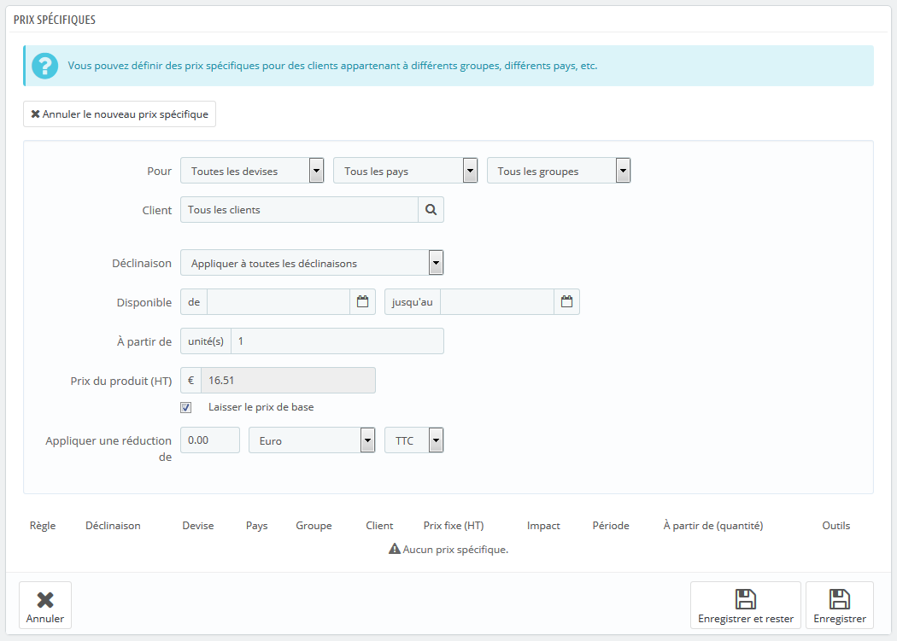

Il s'agit d'un moyen très simple de créer une réduction de prix pour ce produit (et toutes ses combinaisons).

* **Pour**. Vous permet d'être le plus précis possible sur les groupes auxquels le prix s'applique, y compris la monnaie, le pays et même le groupe de client (qui sera abordé plus tard dans ce chapitre).
* **Client**. Vous pouvez être encore plus précis et indiquer que la réduction que vous créez sera réservée à certains clients et uniquement eux : saisissez les premières lettres de leur prénom ou nom, et choisissez les comptes ciblés.
* **Déclinaison**. Vous pouvez choisir de voir ce prix spécifique s'appliquer à toutes les déclinaisons, ou seulement une. Si vous souhaitez l'appliquer à plus d'une déclinaison mais pas toutes, vous devrez créer un prix spécifique pour chaque déclinaison.
* **Disponible à partir de**. Vous permet de définir la plage de dates durant lesquelles le prix réduit sera activé. Un clic dans chaque champ ouvrira un sélecteur de date, ce qui vous simplifie le processus.
* **À partir de \[] unité**. Indique le nombre de produits achetés à partir duquel la réduction est appliquée. Par défaut, il s'agit de "1", ce qui signifie dès le premier achat.
* **Prix du  produit (HT)**. Ici, vous pouvez indiquer un prix arbitraire, sans devoir passer par des calculs ou vous baser sur le prix normal. Laissez ce champ à "0" pour vous baser sur le prix par défaut.\
  **Laisser le prix de base**. Cochez cette case pour remettre à zéro le champ "Prix de vente du produit HT" et vous empêcher de le modifier.
* **Appliquer une réduction de**. La réduction sera appliquée une fois que le client aura choisi une quantité. Utilisez le sélecteur pour indiquer le type de réduction que vous voulez appliquer (soit un montant précis, soit un pourcentage du prix normal).

Une fois que vous avez saisi les différents réglages, cliquez sur "Enregistrer et rester" : le résumé de votre réduction apparaîtra sous le formulaire, dans un tableau. La réduction est immédiatement visible sur le site.\
Si vous souhaitez le supprimer, cliquez sur l'icône "poubelle" dans le tableau.

Si vous souhaitez construire des promotions plus complexes, découvrez le menu "Règle de prix" en lisant le chapitre "Mettre en place des promotions" de ce guide.

#### Gérer les priorités de prix 

Un client peut correspondre à plusieurs prix et plusieurs règles de réduction, même si vous avez pris le temps de créer des règles très précises, avec des groupes personnalisés et même des boutiques créées spécifiquement (dans un contexte multiboutique). PrestaShop vous permet donc en plus de définir des règles de priorités afin de n'appliquer qu'une seule règle de réduction pour ces clients. Vous pourriez par exemple vouloir que le groupe soit plus important que la monnaie utilisée.

Vous pouvez modifier les réglages par défaut de PrestaShop en passant par la section "Gestion des priorités".

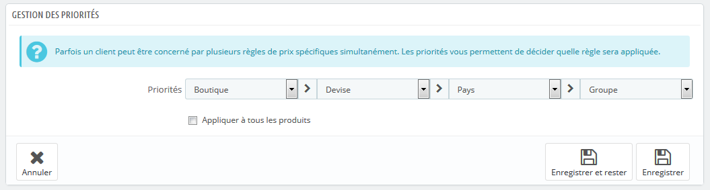

L'ordre d'importance par défaut est :

1. Boutique (dans un contexte multiboutique),
2. Devise,
3. Pays,
4. Groupe.

La case à cocher "Appliquer à tous les produits" vous permet de mettre à jour les réglages de tous les produits. Si la case à cocher reste vide, vos modifications ne s'appliqueront alors qu'au produit en cours.

### Améliorer la position de votre produit dans les moteurs de recherche (Référencement - SEO) 

Pour améliorer votre liste de produits et augmenter la visibilité de votre boutique, nous vous suggérons de remplir soigneusement les différents champs SEO : balises, méta descriptions, mots-clés et URL simplifiée...

L'acronyme "SEO" signifie "Optimisation pour les moteurs de recherche". À lire sur Wikipedia : [http://fr.wikipedia.org/wiki/Optimisation\_pour\_les\_moteurs\_de\_recherche](http://fr.wikipedia.org/wiki/Optimisation\_pour\_les\_moteurs\_de\_recherche).

Découvrez les 50 bonnes pratiques SEO pour l'e-commerce ! Téléchargez et lisez notre livre blanc sur le référencement naturel : [http://www.prestashop.com/fr/livre-blanc-seo](http://www.prestashop.com/fr/livre-blanc-seo).

Pour accéder à ces informations, ouvrez l'onglet "Référencement - SEO" à gauche.

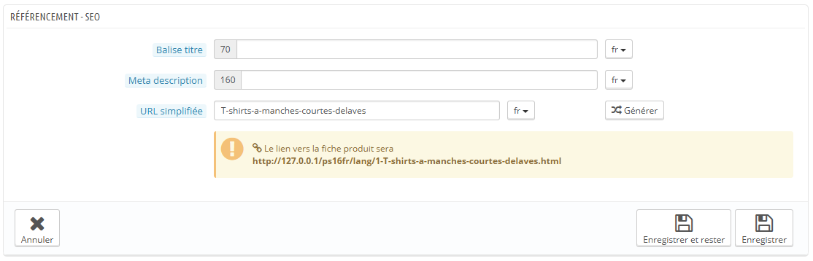

Les champs de cette page vous permettent d'optimiser directement la visibilité de votre catalogue sur les moteurs de recherche.

* **Balise titre**. C'est le champ le plus important, étant donné que le titre apparaîtra sur les moteurs de recherche. Restez très factuel : vous devez convaincre l'utilisateur du moteur de recherche de cliquer sur votre lien plutôt que sur un autre parmi les résultats. Faites en sorte d'avoir un titre unique à ce produit pour l'ensemble de votre boutique.
  * Bon exemple : "Levi's 501® Original Jeans - Bleu délavé - Taille normale".
  * Mauvais exemple : "Item #02769869B bestseller".
* **Méta description**. Une présentation du produit en quelques lignes (dans l'idéal, moins de 155 caractères), afin d'attirer l'attention du client. Elle apparaîtra dans les résultats de recherche, en fonction de la recherche elle-même : certains moteurs de recherche choisissent de n'afficher que les mots cherchés dans le contexte du contenu de la page. Assurez-vous de faire une description unique à ce produit sur votre site.
* **URL simplifiée**. Voici un autre champ extrêmement important. Il vous permet de réécrire l'adresse web de votre produit. Par exemple, au lieu d'avoir une adresse de type\
  &#x20;[http://www.myprestashop.com/index.php?id\_product=8\&controller=product](http://www.myprestashop.com/index.php?id\_product=8\&controller=product)\
  &#x20;...vous pouvez avoir :\
  &#x20;[http://www.myprestashop.prestashop.com/8-nom-du-produit.html](http://www.myprestashop.prestashop.com/8-nom-du-produit.html) .\
  &#x20;Vous devez simplement indiquer dans le champ "URL simplifié" les mots (séparés par des tirets) que vous souhaitez voir apparaître au lieu du nom par défaut.\
  &#x20;Le bouton "**Générer**" vous permet de facilement obtenir une adresse web simplifiée basée sur le nom du produit. Une fois générée, vous pouvez modifier l'URL produit comme bon vous semble.

Les URL simplifiées ne fonctionnent que si la réécriture d'URL est activée. Vous pouvez le faire dans la page de préférences "SEO & URL", dans la section "Configuration des URL".

Vous en apprendrez plus sur cette page de préférence dans le chapitre "Comprendre les préférences" de guide.

### Gérer les associations du produit 

Créer des associations pour votre produit signifie le coupler avec d'autres contenus de votre base de données :

* Des catégories de produits,
* Autres produits (des accessoires),
* Une marque.

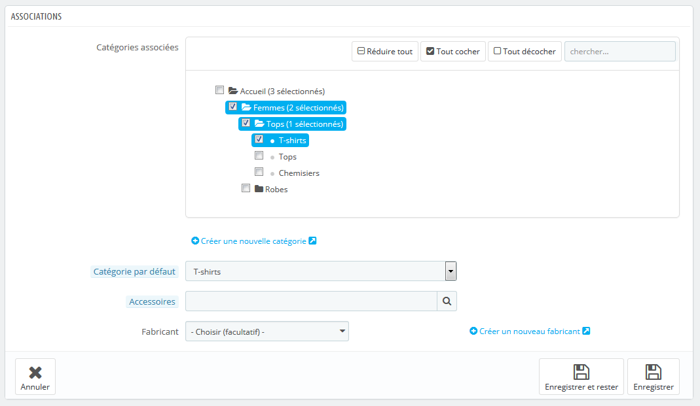

#### Catégories de produits 

La section "Catégories associées" vous permet de choisir les catégories dans lesquelles le produit devrait apparaître. Vous pouvez en choisir plus d'une, mais gardez en tête que pour le client, il est préférable que le produit se trouve uniquement au milieu de produit équivalents et comparables. De fait, vous devriez éviter de choisir la catégorie racine, et préférer les sous-catégories.\
&#x20;Par exemple, la catégorie "Téléphone" peut comprendre des sous-catégories de marques (Apple, Samsung, Nokia, etc.) ainsi que des "caractéristiques" (simple, multimédia, smart-phone). C'est à vous d'indiquer la catégorie la plus utile à vos clients.\
&#x20;Si vous estimez devoir créer une nouvelle catégorie, enregistrez l'état actuel de votre produit avant de cliquer sur le bouton "Créer une nouvelle catégorie".

Le champ "Catégorie par défaut" est particulièrement utile quand un produit est disponible dans plusieurs catégories. Ce réglage sert principalement à clarifier la catégorie où ranger le produit quand un client arrive sur votre boutique en passant par un moteur de recherche, étant donné que le nom de la catégorie peut apparaître dans l'adresse web du produit.

Produits phares

En cochant la case "Accueil", vous avez la possibilité de mettre le produit en avant sur la page d'accueil de votre site – à condition que votre thème le permette. Pour retirer un produit de la liste "Produits phares", décochez simplement la case "Accueil".

#### Accessoires 

Le champ "Accessoires" vous permet de choisir des produits pertinents à associer avec ce produit, qui seront suggérés aux clients qui regardent la page produit (si le thème le permet). Saisissez les premières lettres d'un produit et sélectionnez-le. Ce produit sera ajouté en-dessous du champ.

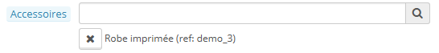

Vous pouvez associer un produit à autant de produits que vous jugez nécessaire. Cliquez sur la croix pour supprimer une association.\
&#x20;Une association ne va que dans un sens : le produit associé n'aura pas d'association créée vers le produit en cours dans sa page de configuration.

L'ajout d'un accessoire et sa suppression ne sont pas automatiquement enregistrés ! N'oubliez donc pas de cliquer sur le bouton "Enregistrer".

#### Fabricant 

Un produit ne peut être associé qu'à un seul fabricant. Choisissez-en un dans le sélecteur, ou enregistrez un nouveau fabricant si besoin est (mais n'oubliez pas d'enregistrer l'état actuel du produit avant de cliquer sur "Créer un nouveau fabricant").

### Évaluer les coûts de livraison : taille, poids, transporteur 

Les coûts de livraison ne sont pas à négliger : ils peuvent facilement doubler le prix final d'une commande, et vous devriez être très clairs à leurs propos – les clients détestent les mauvaises surprises.

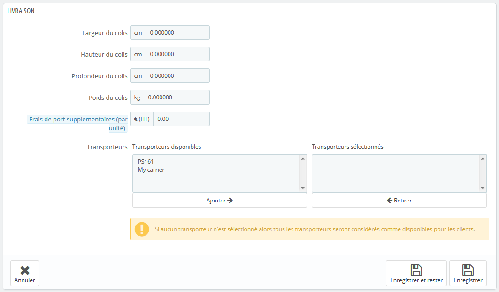

L'onglet "Livraison" vous permet d'indiquer de précieux détails sur l'emballage du produit :

*   **Largeur**, **Hauteur**, **Profondeur**, **Poids** : Vous devez vous efforcer de remplir chacun de ces champs, car connaître la taille et le poids d'un paquet est non seulement utile pour vous, mais également aux transporteurs, car PrestaShop peut choisir automatiquement un transporteur en fonction de ces réglages. Le prix final de la commande est affiché pour le client une fois que PrestaShop (ou le client) a choisi un transporteur.

    Ces valeurs utilisent les unités par défaut de poids, volume, distance et dimension, telles qu'établies dans la page "Localisation" du menu "Localisation".

    Ces valeurs n'ont pas à se limiter à des nombres entiers. Si votre produit pèse moins d'1 kg, vous pouvez simplement ajouter un point (et non une virgule) pour indiquer les fractions :

    * 123 kg
    * 1.23 kg
    * 0.23 kg
    * etc.
* **Frais de port supplémentaires**. Une indication qui peut vous être très utile dans le cas de produits particulièrement délicats ou compliqués à emballer, ou ceux très lourds.
* **Transporteurs**. Vous pouvez choisir de n'autoriser ce produit à être expédié que par une sélection de transporteurs. Si aucun transporteur n'est sélectionné, alors tous les transporteurs seront considérés comme disponibles pour les clients.

### Ajouter des déclinaisons au produit 

Il vous arrivera certainement de vendre le même produit sous différentes versions : globalement le même nom, mais ces versions peuvent différer par leur couleur, leur capacité, la taille de leur écran, et d'autres attributs. La plupart du temps, ces attributs sont réunis : vous pourriez avoir la version rouge du produit disponible avec capacité de 1 Go ou 2 Go, ou avec écran 12'' ou 15''. C'est pourquoi PrestaShop appelle ces versions "déclinaisons" : votre stock de produits peut être fait de plusieurs variantes d'un même produit, qui dans les faits ne sont tout simplement que des combinaisons spécifiques de ses attributs.

Vous ne pouvez pas créer de déclinaison si vous n'avez pas des attributs de produit enregistrés dans PrestaShop.\
&#x20;Par ailleurs, vous ne devriez pas créer de déclinaisons pour les caractéristiques à partir desquelles vos clients ne peuvent faire de choix.

La création d'attribut se fait dans la page "Attributs et Valeurs" du menu "Catalogue", et est expliquée en détail dans le chapitre du même nom de ce guide.

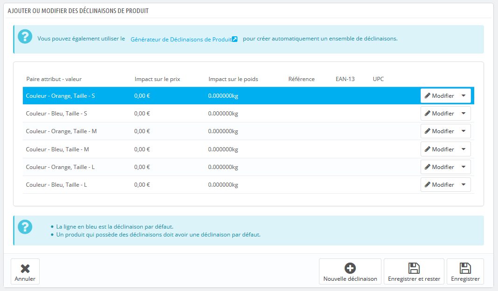

Vous pouvez créer vos déclinaisons comme bon vous semble, et PrestaShop vous y aide en vous proposant deux méthodes.

#### Méthode manuelle 

Cette méthode vous permet de créer des déclinaisons l'une après l'autre. De fait, elle est à réserver soit aux produits avec peu de déclinaisons, soit aux produits avec des déclinaisons très précises, qui ne peuvent être créées de manière assez rapide avec la méthode automatique (voir la section suivante).

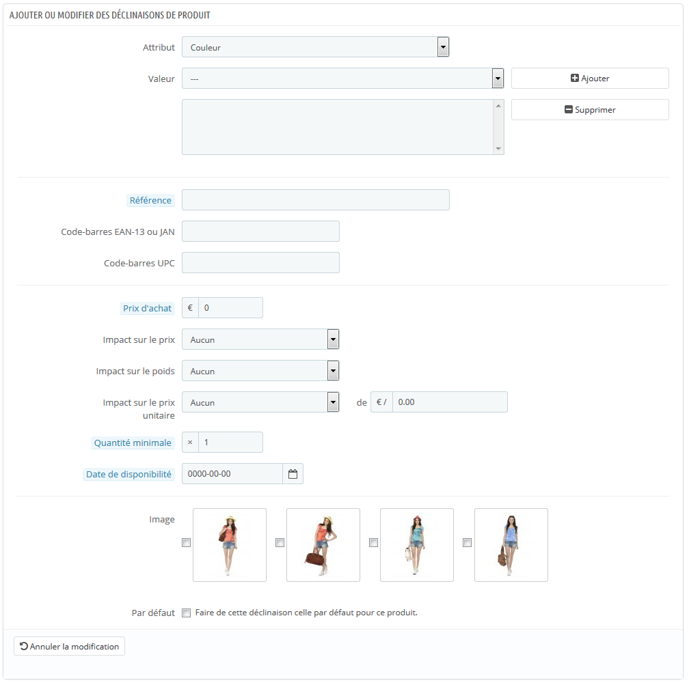

L'ajout de différentes déclinaisons à votre produit se fait en quelques étapes. Cliquez sur le bouton "Nouvelle déclinaison", situé en bas de la page, au niveau du bouton "Enregistrer". Un formulaire apparaît :

* **Paire attribut-valeur**.
  1. Choisissez l'attribut depuis le sélecteur, tel que "Couleur" par exemple. Le contenu du sélecteur "Valeur" se met à jour en fonction de votre sélection.
  2. Choisissez la valeur d'attribut que vous souhaitez inclure, "bleu" par exemple.
  3. Cliquez sur le bouton "Ajouter" et la paire attribut-valeur apparaîtra dans le rectangle de sélection.\
     &#x20;Vous pouvez ajouter autant de paires attribut-valeur que nécessaire pour parvenir à votre déclinaison.\
     &#x20;Vous ne pouvez ajouter qu'une paire par attribut : il est impossible de mettre en place à la fois "Couleur : bleu" et "Couleur : rouge" ; si c'est une nécessité, vous devez alors créer de nouveaux attributs, comme "Couleur principale" et "Couleur secondaire".\
     &#x20;Vous pouvez supprimer une paire attribut-valeur en la sélectionnant puis en cliquant sur le bouton "Supprimer".
* **Référence**, **EAN-13** et **UPC**.
  * Si nécessaire, indiquez la référence de la déclinaison et les codes-barres EAN-13 et/ou UPC dans chaque champ, comme si vous étiez en train de créer un tout nouveau produit dans PrestaShop. Ces chiffres peuvent être utilisés par votre entrepôt ou votre opérateur : assurez-vous de remplir ces champs, ils sont souvent essentiels pour votre entreprise.
* **Prix d'achat**. Ce champ est utile si le prix initial du produit change simplement parce qu'il s'agit d'une déclinaison.
* **Impact sur le prix/poids/prix unitaire**. Si la déclinaison est censée avoir un impact sur le prix du produit, son poids ou son prix à l'unité, choisissez le menu approprié, sélectionnez "Augmentation" ou "Réduction" en fonction du contexte, et remplissez le champ qui apparaît avec la valeur de cet impact.
* **Écotaxe (TTC)**. La valeur de l'écotaxe spécifique à cette déclinaison (si l'option d'écotaxe est activée).
* **Quantité minimale**. Vous préférerez peut-être que cette déclinaison ne puisse être vendue que par lot. Utilisez ce champ pour définir le nombre d'articles minimal.
* **Date de disponibilité**. S'il ne s'agit que d'une déclinaison temporaire ou promotionnelle, vous pouvez indiquer les dates de début et fin de sa mise en vente.
* **Image**. Les images qui sont liées au produit initial (telles que mises en ligne à l'aide du formulaire de l'onglet "Images" sur la gauche) sont présentées. Cochez la case des images qui représentent le mieux cette combinaison.
* **Par défaut**. Cochez cette case si vous souhaitez que cette déclinaison devienne la principale du produit.

Une fois que vous aurez saisi tous les détails de la déclinaison, enregistrez le produit à l'aide du bouton "Enregistrer et rester". Votre déclinaison s'affichera dans le tableau en bas de l'écran.

Différences avec PrestaShop 1.4

PrestaShop 1.4 proposait un sélecteur de couleur en bas de sa liste de déclinaisons, avec laquelle vous pouviez choisir la couleur à afficher (ou non) sur la page produit.

Depuis PrestaShop 1.5, cette option a été déplacée et améliorée. Lors de la création d'un nouvel attribut (dans la page "Attributs et Valeurs" de l'onglet "Catalogue"), vous pouvez utiliser le sélecteur "Type d'attribut" pour choisir si le thème doit afficher un sélecteur, une liste de boutons, ou un sélecteur de couleur.

#### Méthode avancée 

Si vous avez trop de versions ou de variétés du produit, vous pouvez utiliser le "Générateur de déclinaisons de produit". Cet outil vous permet de générer automatiquement toutes les déclinaisons et possibilités.

Cliquez sur "Générateur de déclinaisons de produit" pour ouvrir une nouvelle page.

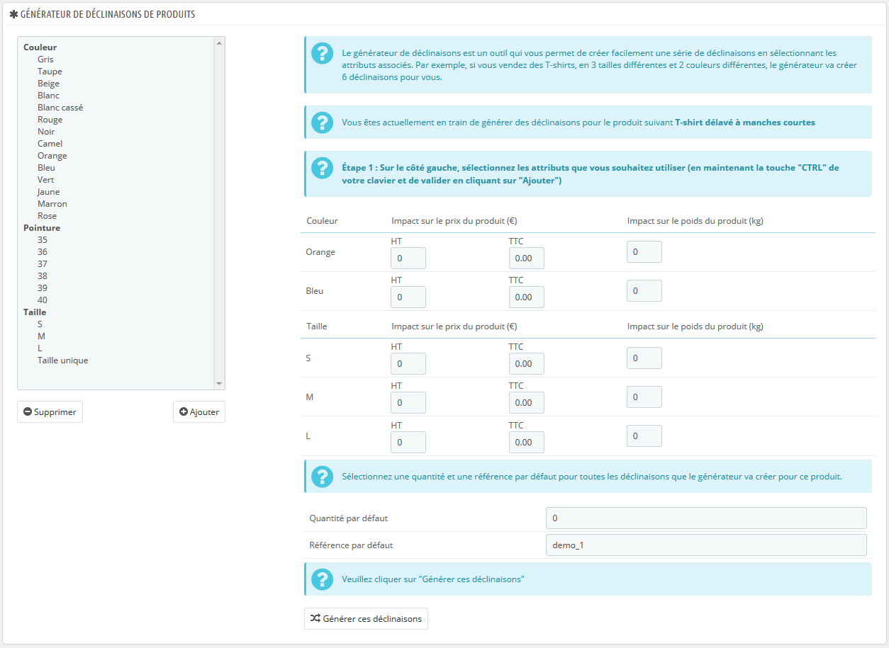

Une fenêtre d'avertissement apparaîtra, vous demandant "Vous perdrez toutes les modifications non enregistrées, souhaitez-vous continuer ?". Cela signifie que votre produit possède déjà une déclinaison. Si vous répondez par la positive, cela effacera la déclinaison qui existe déjà. Faites attention !

Vos attributs et leurs valeurs se trouvent sur le côté gauche de cette page. Sélectionnez les valeurs en cliquant sur leur nom (si vous souhaitez en sélectionner plusieurs à la fois, utilisez la touche Ctrl en cliquant), puis cliquez sur "Ajouter".\
&#x20;Par exemple, vous pouvez choisir les valeurs "Bleu", "S", "M" et "L".\
Pour retirer une sélection d'attributs déjà en place, sélectionnez simplement leurs valeurs et cliquez sur "Supprimer".

Une fois les attributs sélectionnés, vous pouvez modifier l'impact sur le prix et le poids du produit pour chaque sélection. Ce n'est pas obligatoire : elles peuvent avoir les mêmes prix et poids.\
Insérez la quantité de chaque produit dans le champ "Quantité par défaut" en bas de la page. **Attention, les quantités doivent être les mêmes pour chaque déclinaison**. Par exemple, 200 produits dans chaque déclinaison = 2 couleurs \* 1 taille \* 200 = 400 articles en tout.\
&#x20;Vous pouvez ajouter une référence pour cette déclinaison si cela correspond à vos besoins administratifs.\
&#x20;Cliquez sur le bouton "Générer ces déclinaisons", et un PrestaShop vous renverra vers l'onglet "Déclinaisons", avec toutes les déclinaisons générées. Si vous en avez besoin, vous pouvez les modifier une à une.

Comme vous pouvez le voir, le générateur de déclinaisons vous aide à gagner du temps quand vous avez un grand nombre d'attributs à assembler, comme les tailles et les matériaux. Il créera automatiquement toutes les associations possibles, qui apparaîtront alors sur la page publique du produit, dans l'onglet "Déclinaisons" (si le thème le permet).\
&#x20;Si vous ne souhaitez pas conserver toutes les déclinaisons générées, ou si elles ne sont en fait pas toutes exactement les mêmes (références différentes, prix, dates de disponibilité...), vous pouvez en supprimer (icône poubelle) ou en modifier depuis la liste des déclinaisons du produit. L'icône de l'étoile permet d'indiquer que cette déclinaison deviendra la version par défaut – auquel cas elle sera surlignée en bleu.

### Gérer les quantités de produit 

Les quantités de produit sont gérées dans un seul onglet. Son fonctionnement est simple : la page vous présente un tableau de toutes les déclinaisons du produit en cours (s'il n'y a pas de déclinaisons, le tableau ne contient qu'une ligne). Il vous revient d'indiquer le stock initial de toutes les déclinaisons. PrestaShop s'en servira pour déterminer si un produit est bientôt en rupture de stock ou n'est plus disponible.

#### Options de gestion de stock 

La page de gestion des quantités prend en compte la fonctionnalité de gestion de stock, si celle-ci est activée. Cela signifie que si les déclinaisons du produit en cours sont réparties sur plusieurs lieux de stockage, PrestaShop est en mesure d'enregistrer l'emplacement exact de chaque déclinaison, même au sein d'un entrepôt donné.

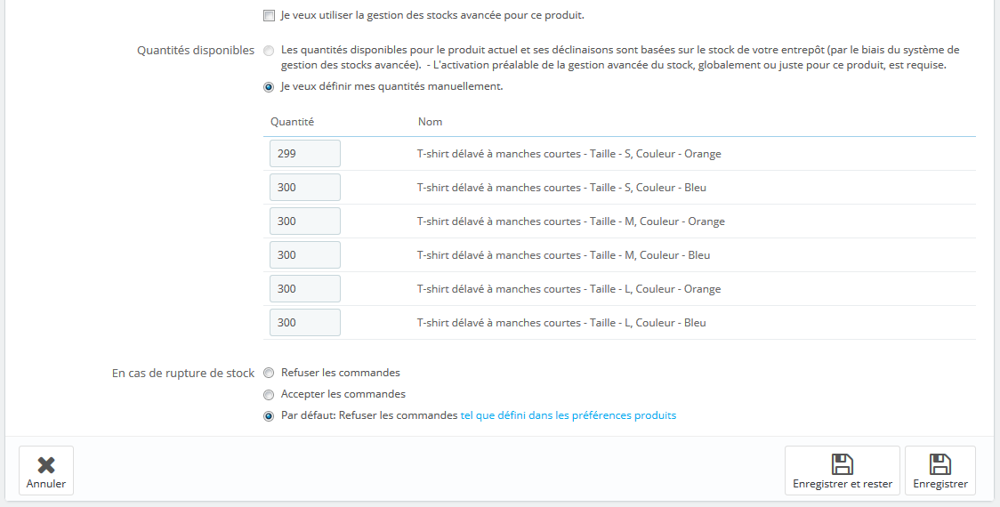

Par défaut, vous devez gérer la quantité du produit à la main, pour chaque déclinaison, depuis cette page. Une fois la gestion de stock avancée activée, vous pouvez compter sur PrestaShop pour prendre cela en charge.

Pour utiliser la gestion du stock pour le produit en cours, vous devez d'abord activer la fonctionnalité pour toute la boutique : allez dans la page de préférences "Produits" (dans le menu "Préférences"), et dans la section "Stocks produit", validez l'option "Activer la gestion des stocks avancée". Une fois que la case a été cochée, une option devient disponible : "Les quantités disponibles pour ce produit sont synchronisées sur le stock physique (utilisable) en entrepôts". Sélectionnez-la, et vous ne pourrez plus modifier les quantités du produit en cours : elles sont désormais dépendante du gestionnaire de stock.

#### En cas de rupture de stock 

L'option "En cas de rupture de stock" vous permet de dire à PrestaShop d'adopter un certain comportement lorsqu'il n'y a plus de quantité en stock : refuser les commandes (le produit ne sera plus disponible à la vente) ou accepter les commandes (dans les faits, vous faites donc de la prévente). La dernière option stipule d'utiliser le comportement par défaut, tel qu'établi dans les réglages globaux (menu "Préférences", page "Produits", section "Stock des produits", option "Autoriser la commande de produits en rupture de stock").

#### Paramètres de disponibilité 

En bas de la page, vous pouvez configurer très exactement le comportement de PrestaShop en fonction de la disponibilité du produit en cours :

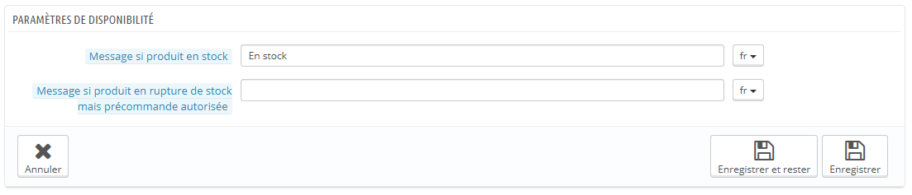

Les options sont :

* **Message si produit en stock**. Vous permet d'afficher un message pour vos visiteurs une fois que le produit est disponible, par exemple "En stock". Cela les rassure, car cela signifie que votre boutique peut aussitôt leur envoyer le produit.
* **Message si produit en rupture de stock mais précommande autorisée**. Vous permet d'afficher un message pour vos visiteurs lorsque le produit est indisponible mais peut toujours être commandé, par exemple "Pré-commandez dès maintenant !". Cela les rassure, car cela signifie que votre boutique leur enverra le produit aussitôt le produit de retour en stock.

Vous pouvez également configurer le réglage global à appliquer à tous les produits. Le réglage par défaut consiste à refuser les commandes, mais vous pouvez le modifier dans la page de préférences "Produits" (option "Autoriser la commande de produits en rupture de stock"). Tout est expliqué dans le chapitre "Comprendre les préférences" de ce guide.

### Configurer les images du produit 

L'onglet "Images" sur la gauche sert à inclure des photos sur la page de votre produit. Vous devriez mettre en ligne toutes les images de ce produit, y compris de ses différentes déclinaisons (couleur, taille, forme, etc.).

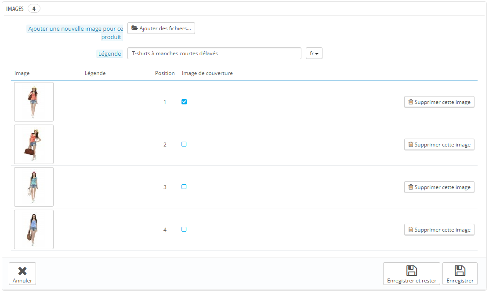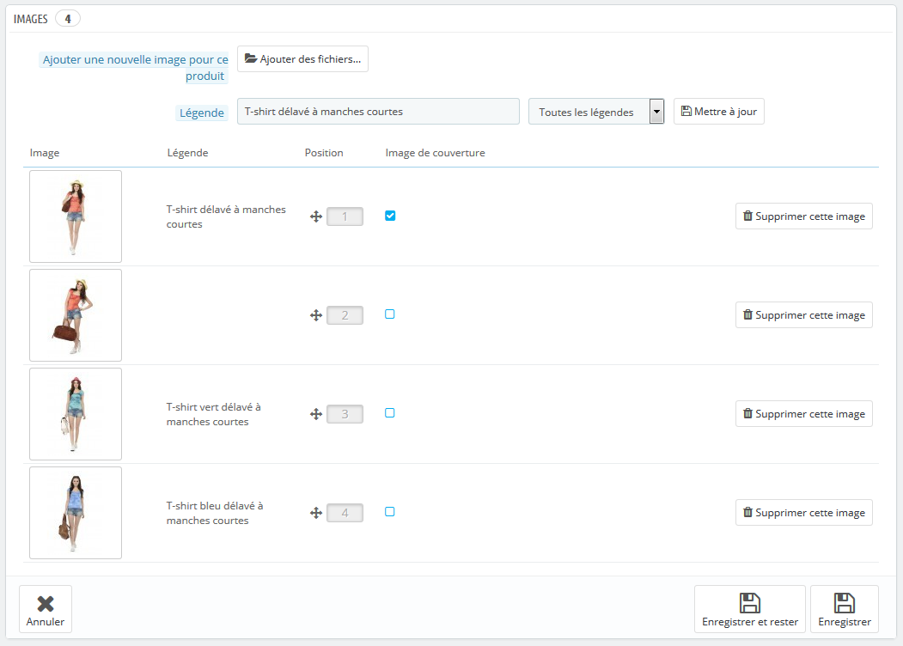

Pour ajouter une ou plusieurs images à votre produit :

1. Cliquez sur le bouton "Ajouter des fichiers", puis sélectionnez dans votre ordinateur au moins un fichier d'image à charger. Vous pouvez sélectionner autant d'images que nécessaire en maintenant pressée la touche Ctrl tout en faisant votre sélection de fichiers, ou les ajouter une à une. PrestaShop vous affichera la liste des images choisie, avec leur taille et la possibilité d'en retirer certaines.\
   &#x20;La taille maximale est réglée par PrestaShop en fonction de la configuration PHP de votre serveur. Cette taille peut être baissée dans la page de préférences "Images", dans la section "Images produit".
2. Cliquez sur le bouton "Télécharger des fichiers vers le serveur" pour mettre vos images en ligne.
3. Donnez une légende à chaque image mise en ligne. Elle sera affichée si l'image ne s'affiche pas, et peut être très utile pour votre référencement. N'hésitez pas à différencier les légendes entre elles.
4. Les images apparaissent dans un tableau sous le formulaire. Si vous avez plus d'une image, vous pouvez indiquer l'image qui doit être utilisée comme image principale. Cette image de couverture sera celle par défaut sur la page produit de votre boutique. Cliquez sur une miniature pour l'afficher en grande taille.

Une fois que vous avez mis en ligne toutes les images, vous pouvez modifier l'ordre des images en glissant chaque ligne du tableau avec la souris, en cliquant quand le curseur prend une forme de déplacement.

### Configurer les caractéristiques du produit 

L'onglet "Caractéristiques" vous permet de spécifier les caractéristiques de votre produit (poids, matériaux, pays d'origine, etc.).

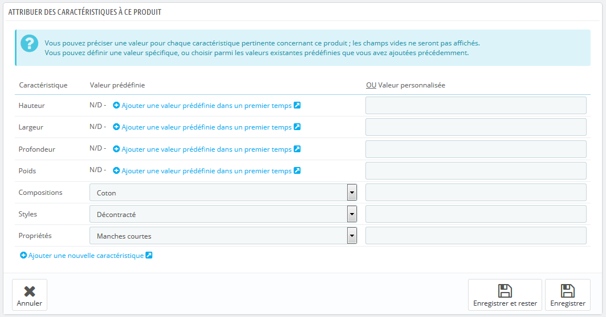

Quand vous créez des caractéristiques et des valeurs (par exemple, laine et matériau microfibre), vous les assignez aux produits lorsque c'est approprié. Cela signifie que vous n'avez pas à remplir les champs de caractéristiques pour chacun de vos produits mais simplement de remplir les valeurs requises et de les appliquer plus tard.

Le moteur de comparaison de PrestaShop repose entièrement sur les caractéristiques produit : ce sont elles qui sont comparées entre produits.

Étant donné que la comparaison de produit ne fonctionne qu'au sein d'une même catégorie, vous devriez faire en sorte que tous les produits d'une catégorie partagent les mêmes caractéristiques, avec des valeurs à comparer.

Notez que **contrairement aux déclinaisons, ces valeurs ne changent pas, et sont valables pour le produit en général** (comprenez : tous vos déclinaisons partagent les mêmes caractéristiques).

#### Créer une caractéristique 

Avant d'ajouter une caractéristique au produit, vous devez en créer une à usage global au sein de votre boutique. Vous pouvez soit aller sur la page "Caractéristiques" du menu "Catalogue", soit cliquer directement sur le bouton "Ajouter une nouvelle caractéristique". Un avertissement apparaît, "Vous perdrez toutes les modifications non enregistrées, souhaitez-vous continuer ?" – assurez-vous d'avoir enregistré toutes vos modifications avant de valider cet avertissement.

La création de caractéristiques et de valeurs de caractéristique est expliquée en détail dans la section dédiée de ce guide.

#### Assigner une valeur et une caractéristique à un produit 

Nous allons partir du principe que vous avez déjà configuré toutes vos caractéristiques et vos valeurs de caractéristique.

Dans l'onglet "Caractéristiques" à gauche de la page du produit en cours, un tableau liste toutes les caractéristiques de votre boutique. Toutes ne s'appliquent pas au produit : PrestaShop ne prendra en compte que les caractéristiques que vous avez indiqué comme pertinentes, en leur donnant une valeur.

Vous pouvez soit régler une valeur à la main, dans le champ tout à droite de la ligne de la caractéristique, ou vous pouvez laisser les valeurs prédéfinies (qui ont été définies lors de la création de la caractéristique), s'il y en a.\
&#x20;S'il n'y a pas de valeur prédéfinie disponible pour une caractéristique, la mention "N/D" apparaît (signifiant "non disponible"), suivi du bouton "Ajouter une valeur prédéfinie dans un premier temps".

Si vous choisissez d'utiliser une valeur personnalisée, n'oubliez pas de la régler pour toutes les langues reconnues par votre boutique. Utilisez l'icône du drapeau pour changer de langue.

Si des valeurs prédéfinies sont disponibles, elles apparaîtront dans une liste déroulante. Cliquez simplement sur la valeur voulue.

Une fois toutes les caractéristiques pertinentes en place, enregistrez vos modifications pour les voir s'appliquer aussitôt sur votre boutique.

Souvenez-vous : si une caractéristique n'a pas de valeur assignée, elle ne sera pas prise en compte pour ce produit et ne sera pas visible sur votre boutique.

### Gérer la personnalisation 

Votre boutique en ligne PrestaShop offre à vos clients la possibilité de personnaliser les produits qu'ils vont acheter.

Exemple : si vous êtes un vendeur de bijoux et que vos clients ont la possibilité de graver un texte ou une image sur leur bijou, ils pourront vous fournir le texte ou l'image en même temps qu'ils passent leur commande.

L'intérêt de cette fonctionnalité est qu'elle permet d'offrir au client un service vraiment personnalisé, ce qu'ils apprécieront certainement !

Apprenons à configurer cette fonction. Dans l'onglet "Personnalisation" à gauche, vous pouvez indiquer quel type de champs (fichier ou image) peut être personnalisé.

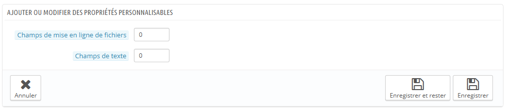

* **Champs fichier**. Place un bouton d'envoi de fichier sur la page de commande. Chaque bouton n'accepte qu'un fichier, donc mettez-en autant que nécessaire.
* **Champs texte**. Place un champ textuel dans la page de commande. Vous pouvez en ajouter autant que nécessaire.\
  &#x20;Par exemple, si vous autorisez jusqu'à 5 lignes de texte à 14 caractères chacune, ajoutez 5 champs et indiquez la limite de caractères dans le nom du champ. Vous ne pouvez pas limiter le nombre de caractères dans un champ.

Une fois que vous avez ajouté le nombre de champs que vous souhaitez, cliquez sur "Enregistrer et rester". La page se rechargera et affichera autant de champ-texte que nécessaire. Donnez-leur à tous un titre public approprié : il servira d'indicateur pour le client, donc faites en sorte d'être très précis sur les données que vous souhaitez recevoir.\
&#x20;Par exemple, si vous autorisez les images pour une couverture de livre, vous pourriez utiliser ceci :

* "Couverture (20.95 x 27.31 cm, couleur)".
* "4e de couverture (20.95 x 27.31 cm, noir et blanc)".
* "Dos (20.95 x 1.716 cm, couleur)".

Même chose pour le texte : si les clients souhaitent faire graver des mots dans un produit, vous pourriez utiliser ceci :

* "Première ligne (24 car.)".
* "Seconde ligne (24 car.)".
* "Dernière ligne, signature (16 car.)".

Vous pouvez rendre un champ nécessaire à la validation de la commande en cochant la case "requis" à droite de chacun.

**Enlever des champs**. Si finalement vous avez ajouté trop de champs, modifiez simplement les chiffres dans les champs de types, et cliquez sur "Enregistrer et rester". La page se rechargera avec le bon nombre de champs, le contenu des premiers ayant été préservé.

Une fois tous les champs remplis, n'oubliez pas d'enregistrer vos modifications.

#### Du côté du client 

Une fois que le produit a ses propriétés personnalisables de configurées, sa page sur la boutique affiche un nouvel onglet, à côté de l'onglet "Plus d'info" : "Personnalisation".

Le client doit choisir le ou les fichier(s) et/ou ajouter du texte et les enregistrer avant d'ajouter le produit dans son panier.

Les images personnalisées et les textes apparaîtront dans le panier final.

Le reste du processus de commande se déroule comme d'habitude.

#### Du côté du marchand 

Une fois que la commande a été validée par le client, le marchand reçoit une notification de la commande dans son back-office.

Il peut ensuite parcourir la commande, qui indiquera les images et textes dans la liste de produits, pour chaque produit. Le marchand n'a ensuite plus qu'à télécharger les images (simplement en cliquant sur l'image dans la commande) ou copier/coller le texte et les utiliser dans son outil de personnalisation.

Le reste du processus de commande et de livraison se déroule comme d'habitude.

### Gérer les documents joints 

PrestaShop vous permet de mettre certains fichiers à disposition de vos clients avant qu'ils ne passent commande. Tout se passe dans l'onglet "Documents joints" à gauche.

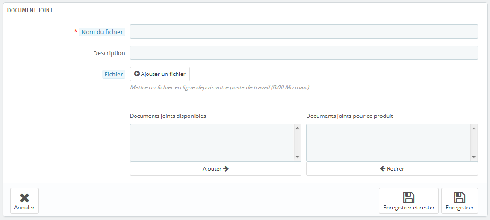

Par exemple, admettons que vous vendez de l'électronique, et que vous souhaitez conseiller à vos clients de lire un document sur le fonctionnement de l'un de vos produits. Vous pouvez mettre en ligne un document à cet effet.\
&#x20;Vous pouvez également mettre le manuel du produit en format PDF, disponible en téléchargement directement depuis la page produit.

Un document joint s'ajoute très facilement :

1. Indiquez le nom de votre document joint (il n'a pas à être le même que le nom du fichier original).
2. Donnez-lui en une description brève. Cela vous aidera à le distinguer des autres fichiers avec plus d'assurance.
3. Cliquez sur "Ajouter un fichier" pour sélectionner sur votre ordinateur un fichier à mettre en ligne. Dès que vous choisissez le fichier, PrestaShop le met en ligne
4. Le document joint apparait dans le sélecteur "Documents joints disponibles" : sélectionnez-le et cliquez sur "Ajouter" pour le passer dans le sélecteur "Documents joints pour ce produit".
5. Enregistrez votre produit.

Désormais, l'onglet "Télécharger" apparaîtra dans votre boutique en ligne, et les clients pourront consulter le fichier que vous venez d'enregistrer.

S'il vous faut retirer un fichier joint, sélectionnez-le dans le sélecteur "Documents joints pour ce produit" et cliquez sur le bouton "Supprimer". Le fichier sera déplacé dans le sélecteur "Documents disponibles" dans le cas où vous souhaitiez le remettre en ligne plus tard.

Vous pouvez maintenant consulter tous les documents joints de votre boutique, en ajouter d'autres ou en enlever, en vous rendant sur la page "Documents joints" du menu "Catalogue". Elle permet par ailleurs d'utiliser les fichiers que vous avez attaché à un produit pour un autre produit : si vous avez besoin d'appliquer à de nombreux produits un fichier déjà associé à un autre produit, vous n'aurez ainsi qu'à le mettre en ligne une fois.

### Configurer le fournisseur du produit 

Indiquer le fournisseur du produit n'est pas vraiment important pour vos clients (beaucoup moins que peut l'être sa marque, le plus souvent). Pourtant, cela peut se révéler un élément essentiel de votre propre gestion interne, notamment pour la gestion de votre stock: il vous suffit de savoir à qui vous avez acheté le produit. Le fournisseur du produit en cours doit être défini dans l'onglet "Fournisseurs" sur la gauche.

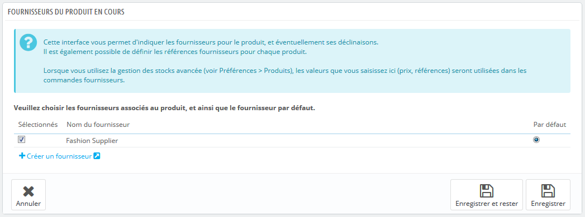

Vous ne pouvez pas utiliser cette fonction si vous ne possédez pas déjà au moins un fournisseur enregistré dans votre boutique. Les fournisseurs sont créés à partir de la page "Fournisseurs", dans le menu "Catalogue".

Le processus complet d'enregistrement d'un fournisseur est expliqué en détail dans ce guide, section "Gérer les fournisseurs".\
&#x20;Vous pouvez accéder directement à l'onglet en question en cliquant sur le bouton "Créer un fournisseur".

Il est très facile d'associer un ou plusieurs fournisseurs au produit en cours : il suffit de cliquer sur la case correspondante au fournisseur, et d'enregistrer vos modifications.

Si le produit est associé à plus d'un fournisseur, vous pouvez choisir celui qui devrait être celui par défaut en utilisant le bouton radio sur la droite.\
&#x20;Remarque : les boutons radio "Par défaut" ne sont pas disponibles initialement. Pour les sélectionner, vous devez d'abord cliquer sur le bouton "Enregistrer et rester" afin de sélectionner un autre fournisseur par défaut.

#### Référence(s) fournisseur(s) 

La page des fournisseurs du produit contient également un tableau qui vous permet de définir la référence précise et le prix unitaire en fonction de la devise pour chaque déclinaison du produit. Si le produit a plus d'un fournisseur, le tableau n'ouvre que la déclinaison liée au premier fournisseur, les autres étant fermées par défaut. Cliquez sur le nom d'un fournisseur afin d'ouvrir son tableau de références, et de fermer les autres.

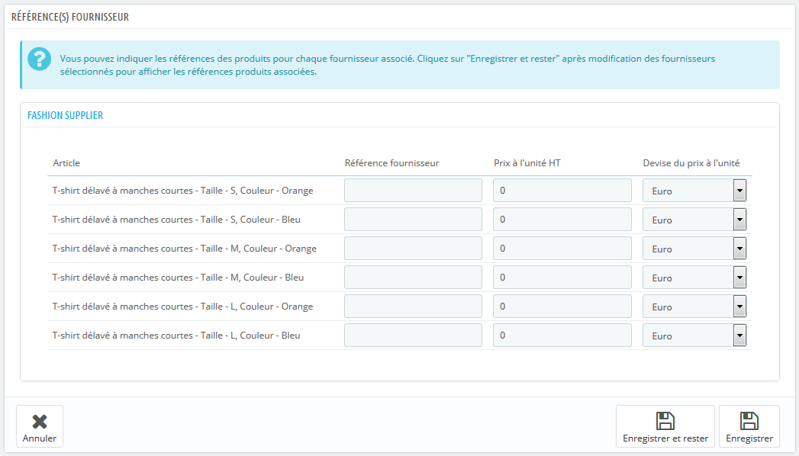

### Gestion des entrepôts (avancé) 

Une fois que vous avez activé l'option de gestion avancée du stock (dans la page "Produits" du menu "Préférences"), ce nouvel onglet devient disponible pour tous les produits, et vous permet d'indiquer dans quel entrepôt le produit en cours est stocké.

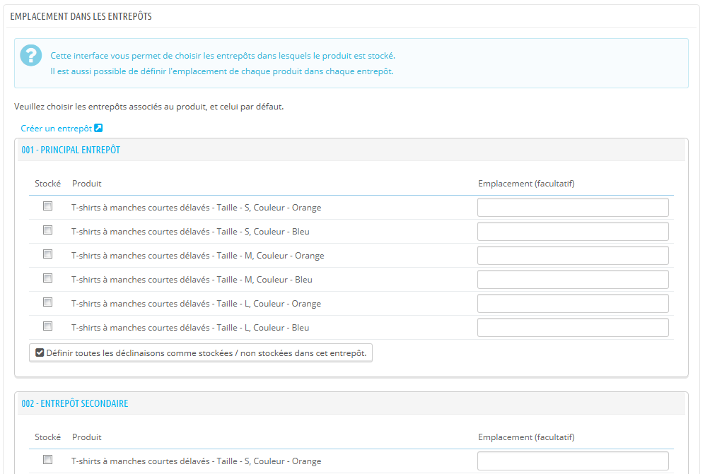

Vous ne pouvez pas utiliser cette fonction si vous ne possédez pas déjà au moins un entrepôt enregistré dans votre boutique. Les entrepôts sont créés à partir de la page "Entrepôts", dans le menu "Stock".

Le processus complet d'enregistrement d'un entrepôt est expliqué en détail dans un autre chapitre de ce guide, "Gestion avancée du stock".\
&#x20;Vous pouvez y accéder directement en cliquant sur le bouton "Créer un entrepôt".

L'onglet "Entrepôts" présente un tableau qui vous permet de définir l'emplacement précis pour chaque déclinaison du produit (s'il y a lieu) dans chaque entrepôt. Si vous avez enregistré plus d'un entrepôt, le tableau ne montre que le premier par défaut. Cliquez sur le nom d'un entrepôt afin d'ouvrir son tableau, et de fermer les autres.

Pour chaque entrepôt, vous pouvez définir quelle est la déclinaison du produit en cours qui y est stockée, et un champ de texte vous permet d'indiquer précisément où elle est stockée au sein de cet entrepôt. Vous pouvez écrire ce que vous voulez dans ce champ : "Allée 5", "À côté des albums de Radiohead", "A07 E08 H14", ou quoi que ce soit qui vous aide vous ou votre équipe d'emballage à trouver le produit le plus précisément possible.

## Créer un pack de produits 

Vous pourriez souhaiter vendre un pack de produits composé de plusieurs articles. Par exemple : un pack ordinateur "démarrage", comprenant la machine, un écran et une imprimante. PrestaShop vous facilite la tâche de créer un tel pack à partir des produits enregistrés dans votre catalogue.

Un pack vous permet de vous simplifier la préparation de commandes. Elles peuvent aussi permettre au client de profiter de certains avantages, comme de réduction ou d'offres spéciales.

À l'heure actuelle, vous ne pouvez pas ajouter de déclinaison à un pack.\
&#x20;Si vous souhaitez avoir des packs avec des déclinaisons, vous devrez créer des produits individuels pour chaque déclinaison. C'est une limitation connue de PrestaShop, qui sera corrigée dans une prochaine version.

Vous ne pouvez pas ajouter un pack existant dans un nouveau pack, ni importer le contenu d'un pack existant dans un nouveau pack.

Le processus de création d'un pack est semblable à celui de la création d'un produit normal :

1. Allez à la page "Produits" du menu "Catalogue" ;
2. Cliquez sur le bouton "Ajouter" ;
3. Dans l'onglet "Informations" sur la gauche, changez le type de produit en "Pack de produits existants ".

Une nouvelle section apparaît en dessous pour créer votre pack. Cette section comporte seulement deux champs de texte et un bouton :

* Le premier champ est utilisé pour rechercher des produits qui sont déjà enregistrés dans votre boutique.
* Le second champ est utilisé pour indiquer la quantité de produit choisi qui doit être ajoutée au pack.
* Le bouton ajoute le produit au pack.

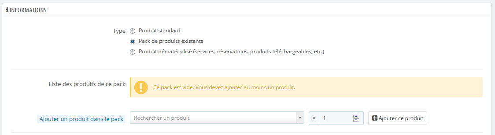

Vous pouvez ajouter autant de produits que vous le souhaitez au pack.

Vous pouvez supprimer un produit du pack en cliquant simplement sur l'icône de corbeille à côté de lui.

Une fois que vous en avez terminé avec l'ajout de vos produits au pack, vous pouvez modifier le contenu de tous les autres onglets disponibles comme vous le feriez pour un produit normal.

## Créer un produit téléchargeable / dématérialisé 

Votre boutique peut comporter (en partie ou principalement) des produits virtuels - c'est à dire, des produits qui ne sont pas expédiés, mais plutôt téléchargés : billets de concert, livres électroniques, services à la personne... PrestaShop vous facilite la tâche de créer un tel produit.

Le processus de création d'un produit téléchargeable est semblable à celui de la création d'un produit normal :

1. Allez à la page "Produits" du menu "Catalogue" ;
2. Cliquez sur bouton "Créer" ;
3. Dans l'onglet "Information" sur la gauche, donnez un nom au produit puis changez le type de produit en "Produit dématérialisé".

Les onglets sur la gauche changent:

* L'onglet "Produit dématérialisé" apparaît, vers lequel vous serez redirigé dès que vous aurez changé le type de produit.
* L'onglet "Transport" disparaît.

Le nouvel onglet ne comporte qu'une option dans un premier temps : elle demande si le produit virtuel que vous créez est un fichier joint (par exemple, si votre client va payer pour télécharger quelque chose).

* Si ce n'est pas le cas, restez-en là: vous vendez un service, et rien ne doit être téléchargé.
* Si oui, cliquez sur l'option "Oui".

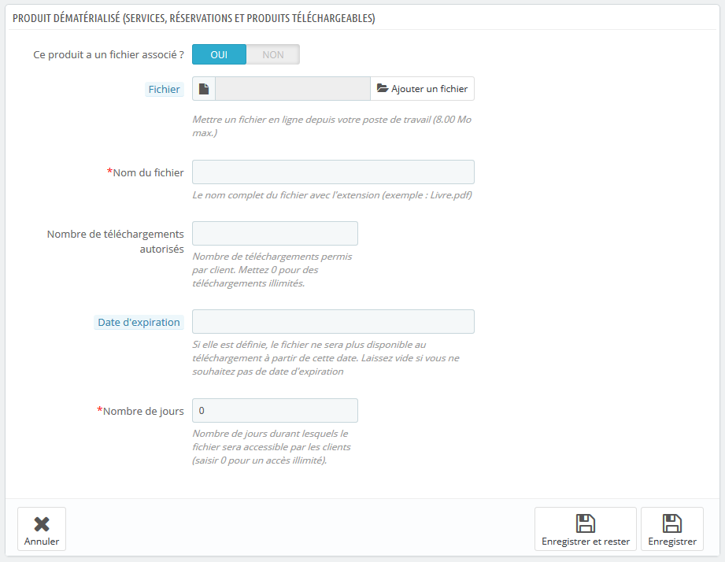

Lorsque vous cliquez sur "Oui", PrestaShop ouvre un nouveau formulaire dans l'onglet à partir duquel vous pouvez télécharger le fichier que vous avez l'intention de vendre:

* **Nom du fichier**. Ce champ est automatiquement rempli après que le fichier a été téléchargé. Il n'est pas recommandé de le changer pour une autre valeur.
*   **Fichier**. Cliquez sur le bouton "Parcourir" afin de trouver le fichier sur votre disque dur. Dès que vous l'avez sélectionné, PrestaShop le met en ligne.

    La taille maximale d'envoi de fichier dépend de la configuration de votre serveur, ne peut pas être augmentée par PrestaShop.

    Si vous avez accès au fichier `php.ini` de votre serveur, voici les variables à changer :

    * `upload_max_filesize = 20M`
    * `post_max_size = 20M`

    Si vous n'avez pas accès au fichier `php.ini`, contactez votre hébergeur à ce propos.

    Vous devriez compresser votre fichier au format Zip, afin d'éviter les incompréhensions de votre navigateur face à un fichier `.exe` ou `.jpg`. Le navigateur télécharge automatiquement les fichiers Zip pour le client.

    Si vous vendez des images en haute résolution, le fait de les mettre en ligne à l'aide de ce formulaire ne vous dispense pas de mettre en ligne une version miniature via l'onglet "Images" sur la gauche.
* **Nombre de téléchargements permis**. Vous pouvez définir le nombre de fois que le fichier peut être téléchargé à partir du moment où le client l'a acheté. Vous préférerez peut-être limiter à 1 ou 5. Si vous voulez le garder disponible de manière indéfinie, mettez le champ texte à 0.
* **Date d'expiration**. Les fichiers virtuels peuvent être de nature promotionnelle, ou perdre leur intérêt après une certaine date. Si c'est le cas, vous pouvez définir la date d'expiration après laquelle le produit ne sera plus en vente sur votre boutique. Laissez ce champ vide s'il n'y a pas de date d'expiration.
* **Nombre de jours**. Vous pouvez définir le nombre de jours après lesquels le lien de téléchargement devient non fonctionnel. S'il n'y a pas de limite, définissez le champ texte à 0.

Une fois que vous en avez terminé avec l'onglet "Produit dématérialisé", vous pouvez modifier le contenu de tous les autres onglets disponibles comme vous le feriez pour un produit normal.
