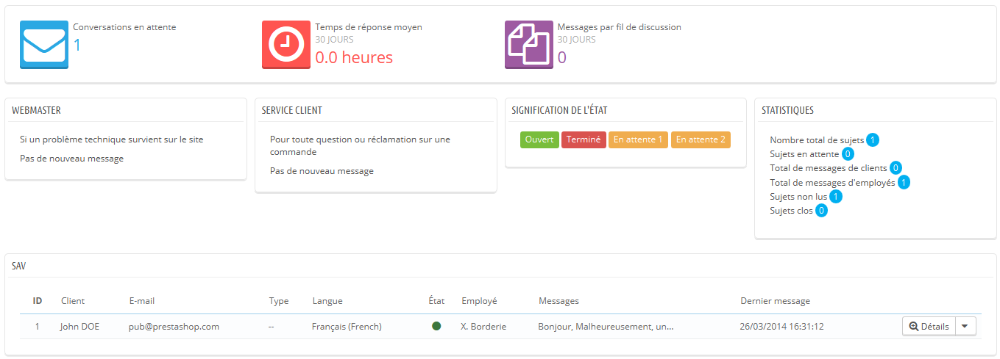
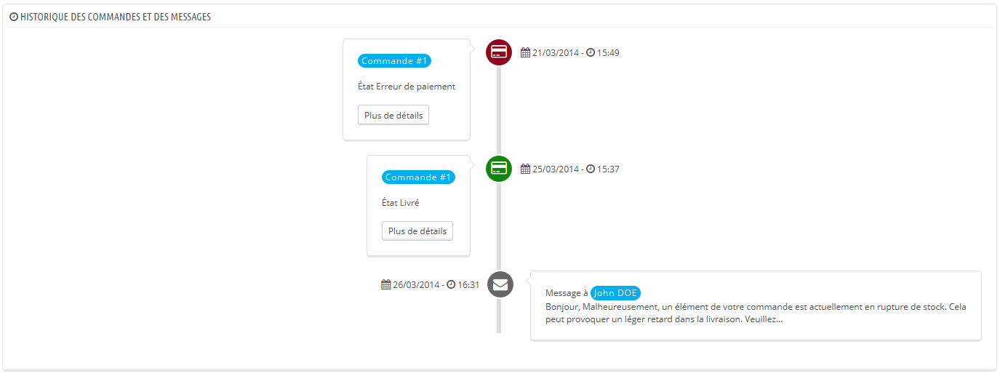

# Service Après-Vente

PrestaShop vous permet de centraliser toutes les requêtes de vos clients. Cela vous aide à connaître les demandes pour lesquelles il n'y a pas encore de réponse, plutôt que de vérifier si l'un des destinataires de l'e-mail a déjà répondu.

Dans les faits, le formulaire de contact de votre boutique, disponible depuis le lien "Contactez-nous" situé en bas de votre front-office, se présente au client avec deux contacts par défaut : "Service client" et "Webmaster". Le client n'a qu'à choisir la personne ou le service qu'il souhaite contacter, puis à saisir ses informations dans les autres champs. Le message est alors enregistré dans l'outil de gestion SAV de PrestaShop.

Les discussions ne sont traitées par l'outil de gestion client qu'à condition que le contact utilisé a activé l'option "Enregistrer sur le service client?". Ce réglage peut être activé en passant par la page "Contacts" du menu "Clients". Cette page est expliquée en détail dans la section suivante du présent chapitre.

Si l'option est désactivée pour le contact choisi par le client, le message ne sera envoyé que sur l'adresse e-mail du contact, et ne sera pas stockée au sein de PrestaShop.

Vous devez également configurer correctement les options IMAP, afin que PrestaShop puisse récupérer les réponses du client aux e-mails qui lui sont envoyés par l'outil de SAV. Ces réglages se font dans la section "Options de SAV", en bas de l'écran.

Sur cette page, chaque contact dispose de sa propre section, d'où vous pouvez rapidement voir s'il y a de nouveaux messages (c'est-à-dire des messages non lus). Il y en a deux par défaut, et en ajouter plus déplacera les sections "Signification de l'état" et "Statistiques" vers la gauche et vers le bas.

Ces deux dernières sections sont très pratiques pour votre gestion quotidienne de vos nouveaux messages :

* **Signification de l'état**. Un simple rappel des codes de couleurs que votre équipe peut appliquer à une discussion.
* **Service client : Statistiques**. Un aperçu de l'activité globale de votre service client depuis ses débuts.

Plus bas encore, vous trouverez la liste des messages, anciens comme récents.

En bas de page, vous avez accès à deux options, qui s'appliquent à tous vos contacts :

* **Autoriser la mise en ligne de fichiers**. Spécifie si le client peut joindre un fichier à son message ou non. Cela peut se révéler très utile dans le cas de problèmes graphiques sur votre boutique, car le client peut alors vous envoyer une capture d'écran.
* **Message prédéfini**. Le modèle par défaut de réponse pour vos employés. Composez un message simple, afin qu'il puisse s'adapter au plus grand nombre de situations, avec un minimum de modification.

Enfin, le bas de la page présente les "Options de SAV", où vous pouvez mettre en place tous les réglages relatifs à votre serveur de messagerie (IMAP).

## Gérer les messages du SAV 

Chaque discussion avec un client peut être entièrement gérée par le biais de l'interface très complète de PrestaShop, sans devoir passer par un client de messagerie comme Outlook ou Thunderbird.

Dans la liste des discussions, cliquez sur l'une des lignes pour voir les détails de la conversation :

* Vous pouvez appliquer une poignée d'actions à la discussion, afin de vous aider à rapidement les trier et donc les traiter plus rapidement. Il y a 4 actions disponibles :\

  * **Marquer comme "traité"** ou **"Réouvrir"**. Passer l'état de la discussion de "Ouvert" à "Terminé".
  * **Marquer comme "en attente 1"** et **Marquer comme "en attente** 2". Ces deux états sont internes : leur signification dépend de votre équipe. Vous pouvez même choisir de ne pas les utiliser, et de ne vous appuyer que sur "Ouvert" et "Terminé".
  * **Transférer cette discussion à un autre employé**. À partir du moment où un employé a commencé à répondre au message d'un client, il devient en charge de la requête de l'utilisateur. Si au cours de la discussion il se trouve qu'un autre employé devrait la prendre en charge, vous pouvez utiliser ce bouton pour le lui attribuer à l'aide d'une liste déroulante. Cet autre employé recevra une notification. Si la personne à laquelle vous voulez transférer cette discussion n'est pas disponible dans la liste, choisissez "Quelqu'un d'autre" dans cette liste et deux options apparaîtront, vous permettant d'indiquer l'adresse e-mail du destinataire et d'ajouter un commentaire à propos de la discussion.
* **Répondre au prochain message de cette conversation qui n'a pas encore de réponse**.

Vous avez accès aux détails essentiels :

* Nom du client et adresse e-mail, sur lesquels vous pouvez cliquer pour accéder aux informations du client.
* Nombre de commandes, total des dépenses et date d'inscription du client.
* Heure et date du message.
* Enfin, le message lui-même.

Pour répondre à cette discussion, utilisez simplement le formulaire contenant votre message par défaut (tel que configuré dans la section "Options de contact" de la page "SAV"), et cliquez sur "Envoyer"

En bas de la page la section "Historique des commandes et des messages" vous donne une représentation chronologique claire des évènements liés à cette discussion.

## Options de SAV 

Cette section vous permet de configurer précisément les accès de PrestaShop à votre serveur e-mail, par le biais de son interface IMAP. Vous devriez vous assurer que tous les champs sont correctement remplis afin que l'outil de gestion du support client puisse fonctionner correctement. La plupart de ces informations doivent vous avoir été fournies par votre hébergeur.

* **URL IMAP**, **Port IMAP**, **Utilisateur IMAP** et **Mot de passe IMAP**. Ces informations sont essentielles pour accéder à votre serveur de messages via le protocole IMAP.
* **Supprime les messages**. En activant cette option, vous indiquez que vous souhaitez que les messages soient effacés du serveur dès que PrestaShop les a récupérés. À utiliser avec prudence : cela rendrait vos messages inaccessibles à tout autre client e-mail.
* **/norsh**. En activant cette option, la connexion à votre serveur e-mail n'est plus authentifiée. Non recommandé.
* **/ssl**. En activant cette option, la connexion à votre serveur e-mail n'est plus chiffrée. Non recommandé.
* **/validate-cert**. En activant cette option, PrestaShop forcera la validation du certificat TLS/SSL sur serveur.
* **/novalidate-cert**. En activant cette option, PrestaShop n'essayera jamais de valider le certificat TLS/SSL sur serveur. C'est une option essentielle pour vos certificats auto-signés (_self-signed certificate_).
* **/tls**. En activant cette option, PrestaShop forcera l'utilisation de StartTLS pour chiffrer la connexion. Les serveurs qui n'acceptent pas StartTLS seront rejetés.
* **/notls**. En activant cette option, PrestaShop n'utilisera pas le chiffrement StartTLS pour cette session, même si le serveur l'accepte.
