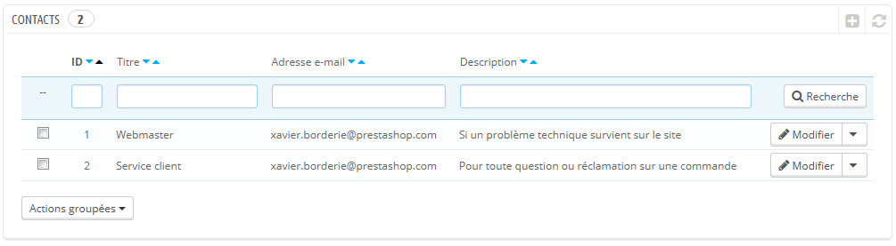
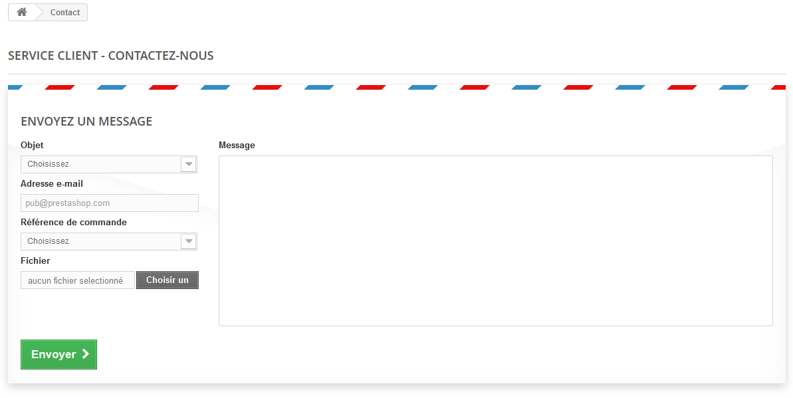

# Vos contacts

Pour faciliter la communication avec vos clients, vous pouvez créer de nombreux comptes de contacts. Par exemple : service client, service technique, service commercial, etc. Cette fonctionnalité permet à vos utilisateurs de directement contacter la bonne personne en fonction de leurs besoins.

## Créer de nouveaux contacts 

Pour que les messages soient bien envoyés aux bons destinataires, vous devez configurer les contacts de votre boutique.

La page "Contacts" du menu "Clients" vous présente la liste des contacts existants.

Cliquez sur "Ajouter" pour accéder au formulaire de contact :

* **Titre**. Le nom du contact : soit le nom d'une personne, soit le nom du service lui-même. Vous pouvez également choisir d'utiliser une phrase, comme "J'ai un problème avec ma commande", "Je veux renvoyer un produit" ou "Proposition de partenariat".
* **Adresse e-mail**. L'adresse peut être la même que celle d'un autre contact. Qui plus est, tous les contacts peuvent avoir la même adresse si vous n'avez pas vraiment d'équipe – les clients ne le sauront jamais, mais avoir de nombreux contacts peut les aider à avoir confiance en votre boutique, car cela signifie que de nombreuses personnes y travaillent.
* **Enregistrer les messages ?**. Indiquez si les messages doivent être enregistrés dans l'outil de gestion SAV, ou juste être envoyés par e-mail. Si cette option est désactivée, PrestaShop ne vous aidera pas à gérer les messages pour ce contact. Cela peut se révéler utile pour un contact comme "Proposition de partenariat", car vous pourriez préférer que ces messages arrivent directement dans votre boite e-mail sans être lisible par toute votre équipe.
* **Description**. Choisissez une description courte, ne dépassant pas la ligne, car elle est affichée au client sur le formulaire de contact.

## Comment les clients peuvent vous contacter 

Pour contacter la bonne équipe d'employés depuis votre front-office, le client doit cliquer soit sur le lien "Contact" en haut de la page, ou le lien "Contactez-nous" en bas de la page. Le formulaire de contact s'ouvre alors.

Le client peut ensuite choisir le service à contacter, saisir son adresse e-mail puis son message. Un menu déroulant lui permet d'indiquer la commande dont il est en train de parler, et même le produit dont il parle.
