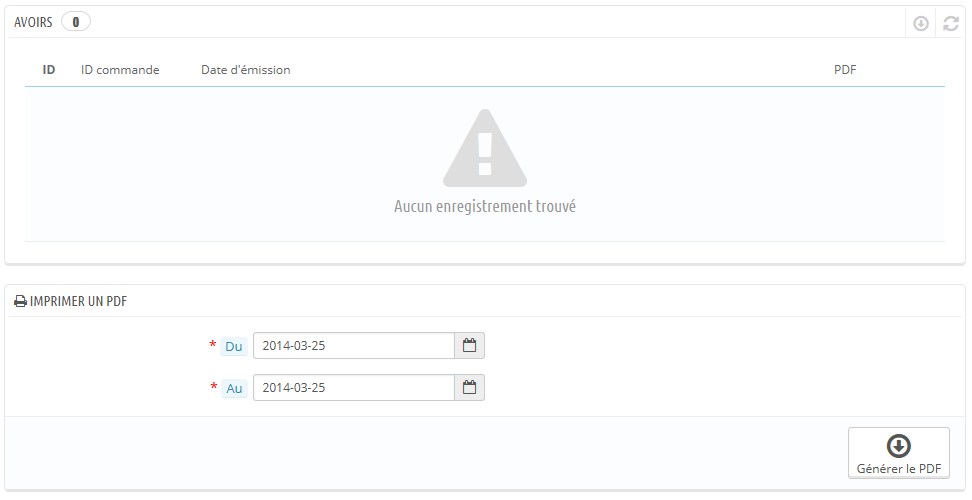
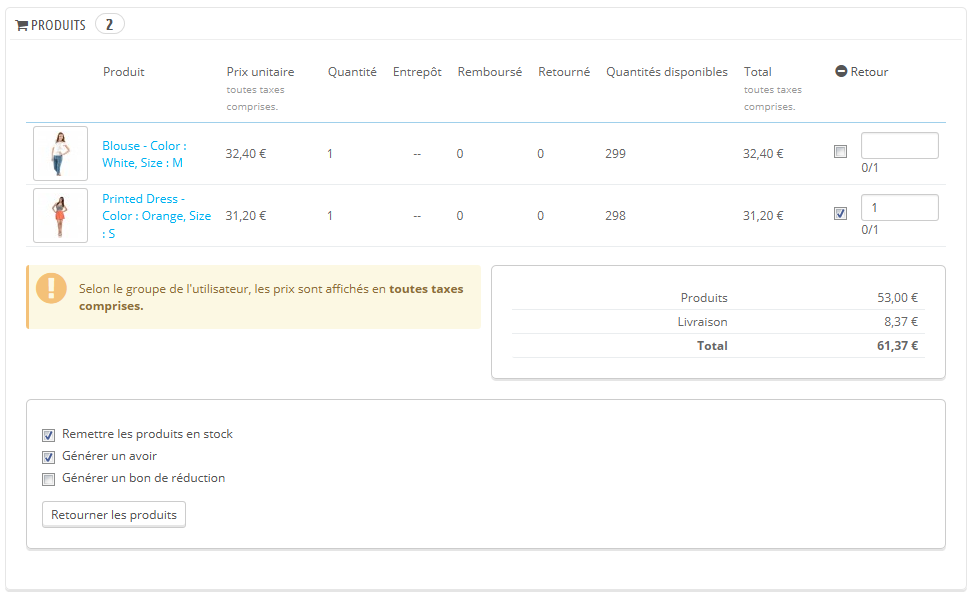

# Avoirs

Suite à votre acceptation d'un retour produit demandé, vous devriez recevoir un colis en provenance du client. Une fois le produit entre vos mains, vous **devez** créer un avoir depuis la page de la commande. La page "Avoirs" ne permet pas d'en créer, elle ne fait que les lister. Cette page est également utilisée pour générer un PDF de vos avoirs.

## Configuration des avoirs 

Il n'y a qu'une option sur la page :

* **Préfixe**. Vous pourriez préférer avoir des avoirs préfixés par langue. Bien entendu, vous pouvez aussi choisir de ne pas avoir de préfixe.

N'oubliez d'enregistrer vos modifications.

## Créer un avoir 

Dans la liste de vos commandes (page "Commandes"), cliquez sur la commande contenant le produit qui vous a été renvoyé pour avoir plus de détails – cela ne fonctionne que si vous avez déjà indiqué que le client peut vous renvoyer des produits.

En dessous du tableau "Produits" :

1. Cochez les articles renvoyés.
2. Cochez la case "Remettre les produits en stock" si vous souhaitez remettre les produits dans votre stock.
3. Cochez la case "Générer un avoir".
4. Pour faire plaisir à un client malgré une erreur dans sa commande, pensez à lui offrir un bon de réduction en cochant la case "bon de réduction".
5. Vous pouvez aussi rembourser ses frais de port en cliquant sur "Inclure les frais de port".

Une fois que vous avez sélectionné toutes les options que vous désirez, confirmez en cliquant sur "Retourner les produits".

L'avoir est désormais créé et disponible dans les détails de la commande, ainsi que dans la page "Avoirs".\
De là, vous pouvez cliquer sur le lien pour télécharger le fichier PDF.\
Votre client verra l'avoir dans son espace utilisateur.

Si vous avez créé un bon de réduction, il le verra dans la section "Mes bons de réduction" dans son compte utilisateur. S'il clique dessus, la page dédiée apparaîtra.

Le montant des articles renvoyés est ajouté au bon de réduction. Le client peut utiliser différents codes de réduction (à gauche de la rangée) la prochaine fois qu'il passe une commande.
