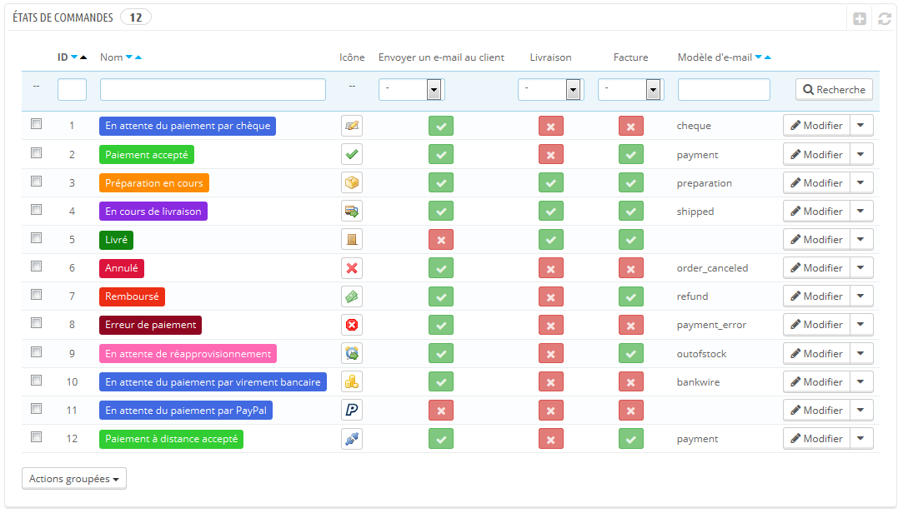
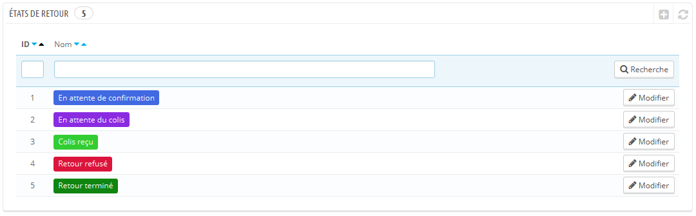
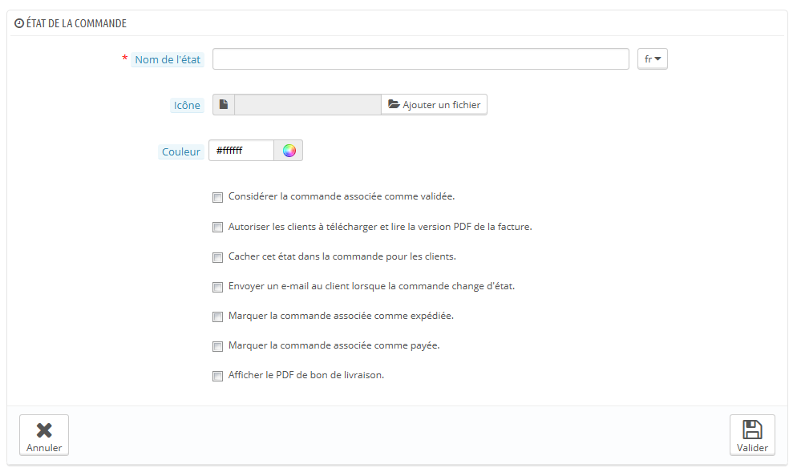
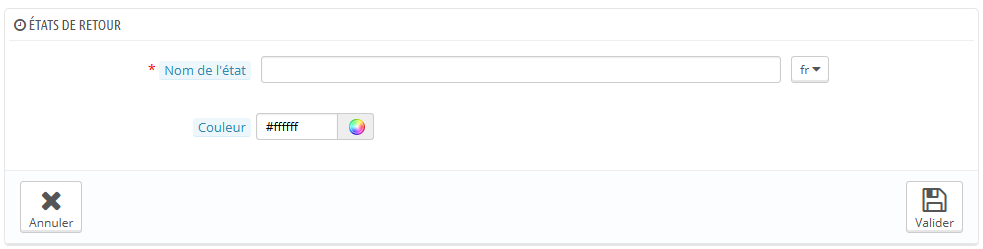

# États de commande

Avoir différents états de commande vous permet de gérer facilement vos commandes et retours, et de garder vos clients informés de l'évolution de leur commande.

Ces différents étés sont visibles et modifiables dans la page "États de commandes" du menu "Commandes".

La page affiche la liste de tous les états de commande enregistrés, avec :

* Leurs couleurs distinctes : les états en place disposent d'une couleur qui vous aide à rapidement vous rendre compte s'il y a un problème sur la commande ou si tout se déroule normalement.
* Leurs icônes.
* Leurs liens avec trois comportements de PrestaShop (il y en a d'autres) :
  * Le client doit-il recevoir un e-mail quand la commande passe à cet état ?
  * Est-ce un état de livraison ?
  * Cet état permet-il à l'utilisateur de télécharger une version PDF de la facture ?
* Le nom du modèle d'e-mail : vous pouvez modifier ces modèles, langue par langue, dans la page "Traductions" du menu "Localisation". Dans la section "Modifier les traductions" de cette page, choisissez "Traduction modèles d'e-mails" dans le menu déroulant, puis cliquez sur le code de la langue dans laquelle vous voulez modifier ces modèles.
* Leurs icônes d'actions : "modifier" et "supprimer".

La liste des états de retour présente moins d'informations, car ces états sont tout au plus des étiquettes sans réel impact sur la commande.

## Créer un nouvel état 

Vous pouvez bien sûr créer un nouvel état, en cliquant sur le bouton "Ajouter".

Remplissez le formulaire :

* **Nom de l'état**. Utilisez un nom court et représentatif.
* **Icône**. Vous pouvez utiliser n'importe quelle icône 16\*16 pixels. Par exemple, le jeu d'icône Silk de FamFamFam ([http://www.famfamfam.com/lab/icons/silk/](http://www.famfamfam.com/lab/icons/silk/)) est excellent et gratuit.
* **Couleur**. Vous devez vous efforcer de donner à votre état une couleur qui correspond aux couleurs déjà en place (si c'est cohérent). Les couleurs par défaut sont :
  * Rouge/Orange : commande annulée ou remboursée,
  * Rouge pourpre : erreur de règlement,
  * Bleu : commandes qui attendent encore leur règlement,
  * Vert clair : commandes payées,
  * Vert sombre : commandes livrées,
  * Violet : commandes expédiées,
  * Rose : rupture de stock.
* Les options :
  * **Considérer la commande associée comme validée**. Si l'option est activée, cet état marquera les commandes associées comme étant payées, et les passera à l'état adéquat.
  * **Autoriser les clients à télécharger et lire la version PDF de la facture**. Si l'option est désactivée, vous devrez vous-mêmes envoyer leurs factures à vos clients.
  * **Cacher cet état dans la commande pour les clients**. Permet de créer des états internes, réservés à vous et votre équipe. Les clients ne verront jamais cet état dans leur page de commande.
  * **Envoyer un e-mail au client lorsque la commande est changée à cet état**. Si l'option est activée, un menu déroulant apparaît pour vous permettre de choisir un modèle d'e-mail à utiliser.
  * **Marquer la commande associée comme expédiée**. Soyez prudent : une fois qu'une commande est marquée comme étant livrée, elle ne peut pas revenir en arrière.
  * **Marquer la commande associée comme payé**. Même chose ici : une fois qu'une commande est marquée comme étant payée, elle ne peut pas revenir en arrière.
  * **Afficher le PDF de bon de livraison**. Vous donne accès au bon de livraison, prêt à être imprimé.

## Créer un nouvel état de retour 

Vous pouvez créer un nouvel état de retour avec le bouton "Créer" situé en bas. Le formulaire de création s'ouvre.

Il ne comprend que deux champs :

* **Nom de l'état**. Donnez-lui le nom que vous voulez.
* **Couleur**. Assignez-lui une couleur.

Enfin, enregistrez votre création.
