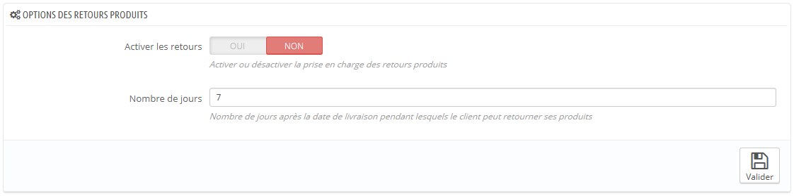
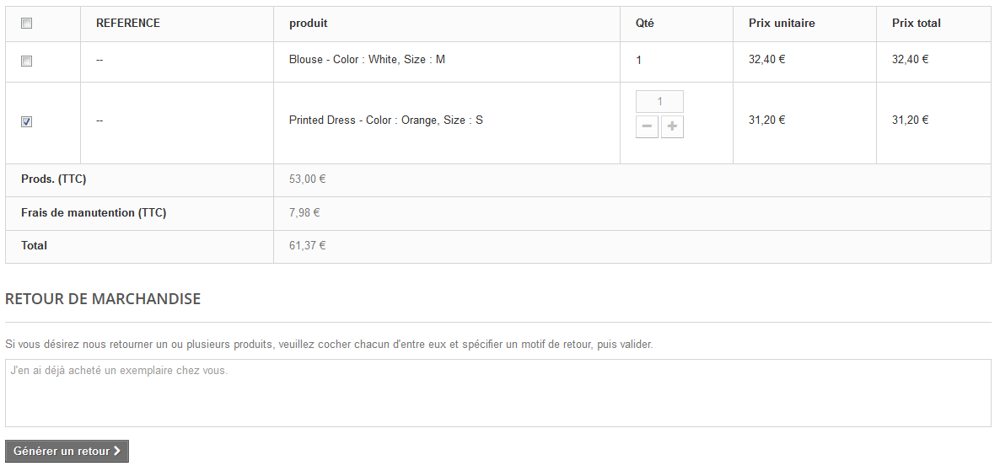
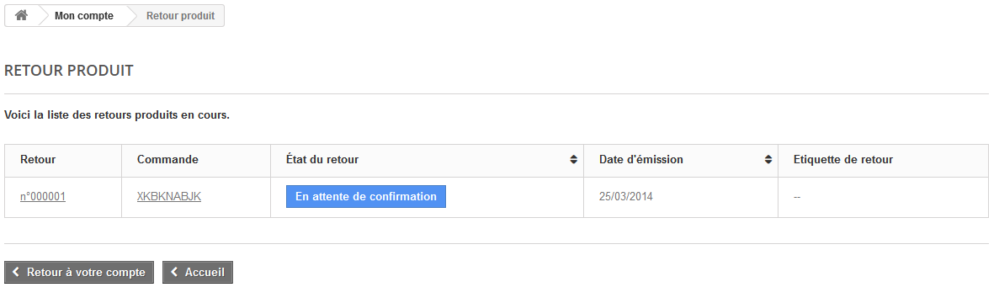
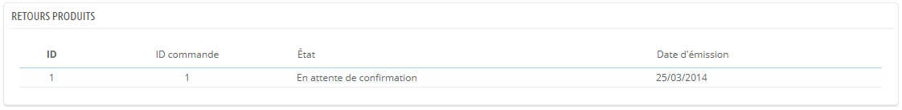
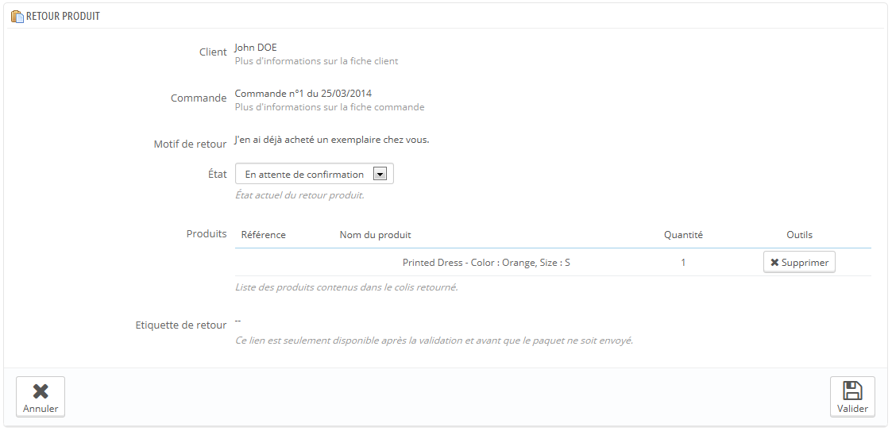
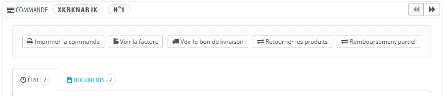

# Retours produits

La page "Retours produits", vous donne une liste de tous les processus de retours produits.

En bas de la page, vous avez la possibilité d'autoriser les clients à vous renvoyer des produits. Activez ou non la possibilité de retours de produits, indiquez le nombre de jours après réception durant lesquels le client peut renvoyer un produit, et enregistrez vos réglages.

## Le retour produit du point de vue du client 

Une fois que vous avez activé l'option de retour produits dans votre back-office, le client peut choisir de renvoyer un produit (à condition d'être toujours dans les délais choisis). Pour ce faire, il doit :

1. Accéder à son historique de commandes, depuis son compte.
2. Sélectionner la commande contenant le produit qu'il veut renvoyer.
3. Sélectionner le(s) produit(s) qu'il veut renvoyer en cochant la case à coté de leur(s) nom(s).
4. (facultatif) Ajouter une explication, afin que vous compreniez pourquoi la commande est renvoyée.

Une fois ce formulaire rempli, le client clique sur "Faire un retour produit", et la requête est envoyée au gestionnaire de la boutique (vous). Elle apparaît avec la mention "En attente de confirmation" dans la page "Retour produit" du compte de l'utilisateur.

## Le retour produit du point de vue du marchand 

La demande de retour produit apparaîtra sur votre back-office. Dans un premier temps, la demande prend l'état de "En attente de confirmation".

Le processus de remboursement peut prendre plusieurs étapes, qui sont indiquées par l'état actuel du retour. Il n'y a qu'une poignée d'états, qui peuvent suivre tout le processus de remboursement :

* En attente de confirmation.
* En attente du paquet.
* Paquet reçu.
* Retour refusé.
* Retour terminé.

Il vous revient maintenant d'accepter ou refuser ce retour produit :

1. Cliquez sur le nom de la demande de retour pour avoir plus de détails.
2. Changez le statut pour continuer le processus de retour produit.
   * Si vous souhaitez arrêter le processus de retour (et refuser son remboursement au client), choisissez simplement l'état "Retour refusé".
   * Si vous acceptez le produit retourné et le remboursement du client, suivez précisément ces étapes :
     1. Choisissez l'étape suivante du processus : "En attente du paquet". Cela enverra au client un e-mail indiquant qu'il peut vous renvoyer son produit.
     2. Une fois que vous avez reçu le paquet, changez l'état du retour à "Paquet reçu".
     3. Enfin, une fois que l'ensemble du processus est terminé (soit que le client a été remboursé, ou vous lui avez envoyé un bon), changez l'état du retour en "Retour terminé".
3. Validez

## Rembourser un client 

Une commande peut être remboursée, partiellement ou en totalité. Pour cela, deux boutons actions sont disponibles dans la barre supérieure de la page de commande (et non sur la page des retours produits).

Les boutons d'actions évoluent en fonction de l'état de la commande. Par exemple, une fois que la commande a atteint l'état "Livré", les boutons "Ajouter un produit" et "Enlever un produit" sont remplacés par deux boutons : "Retourner les produits" ou "Remboursement partiel".

Le retour produit n'est pas activé par défaut. Pour l'activer, vous devez vous rendre dans la page "Retours produits" du menu "Commandes" et activer l'option dans la section des options en bas de la page. Cela s'appliquera à tous les produits et toutes les commandes.

* **Retourner les produits**. À n'utiliser que lorsque le client a effectivement renvoyé ses produits : une fois que le produit renvoyé a été reçu, vous pouvez le marquer comme renvoyée dans le formulaire de la commande. Cliquez sur le bouton "Retourner les produits" et une nouvelle colonne apparaîtra dans la liste de produits, intitulée "Retour". Cochez la case des produits impliqués, indiquez la quantité du produit qui a été renvoyée et cliquez sur le bouton "Retourner les produits" en bas du tableau.
* **Remboursement partiel**. À n'utiliser que lorsque vous avez besoin de rembourser une partie de la commande, et non la commande complète ; soit parce que le client a renvoyé un produit commandé, soit par geste commercial pour un produit endommagé que le client a choisi de conserver malgré tout. Cliquez sur "Remboursement partiel" et une nouvelle colonne apparaîtra dans la liste de produits, intitulée "Remboursement partiel". Indiquez la quantité pour chaque produit impliqué, choisissez l'une des options en bas de la liste (voir ci-dessous) et cliquez sur le bouton "Remboursement partiel" en bas du tableau.

Quand vous marquez des produits comme ayant été retournés ou à rembourser, quatre options sont disponibles sous le tableau des produits :

* **Réinjecter**. Une fois coché, PrestaShop considère que le produit renvoyé est remis en vente, et augmentera alors le stock de ce produit. Ne cliquez pas cette option si un produit a été renvoyé car il était cassé...
* **Générer un avoir**. Une fois coché, un avoir sera créé, correspondant au montant des produits sélectionnés. Un avoir est l'indication que vous reconnaissez qu'un produit a été retourné et qu'un remboursement a été mis en place. Le client peut utiliser cet avoir pour son prochain achat.
* **Bon de réduction**. Une fois coché, un bon de réduction sera créé, correspondant au montant des produits sélectionnés. Un bon de réduction prend la forme d'un code de réduction que le client peut saisir lors du processus de commande.\
  Vous pouvez modifier les bons existants du client en affichant la page du client : depuis la page de la commande actuelle, cliquez sur le lien sous le nom du client dans la section "Information client" ; une fois sur la page du client, allez dans la section "Bons". Vous pouvez modifier chaque bon en cliquant sur leur icône "Modifier".
* **Rembourser les frais d'envoi**. Vous pouvez aussi choisir de rembourser les frais d'expédition, ce qui est toujours apprécié.

Si le client a payé avec une carte de crédit, le système de paiement peut rembourser la carte automatiquement, mais il reste possible que vous ayez à la faire vous-mêmes. Si la commande a été payée avec un chèque ou transfert bancaire, vous devez créer le remboursement vous-même, puis marquer la commande comme ayant été remboursée manuellement dans le back-office (sur la page de la commande).
