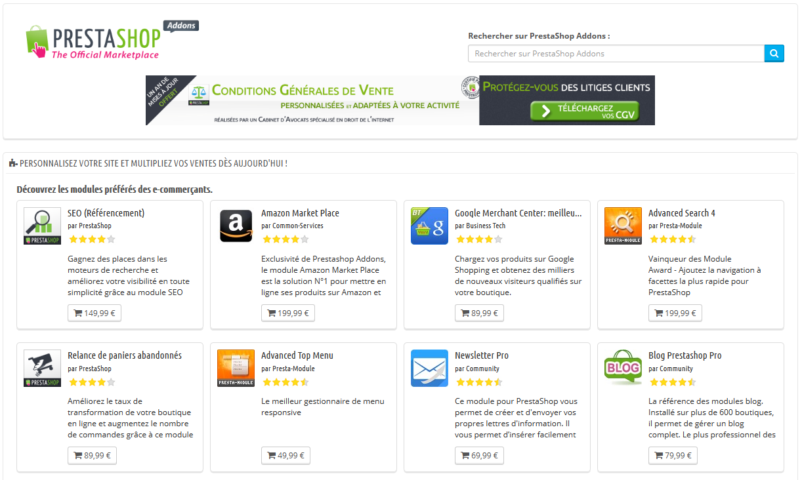
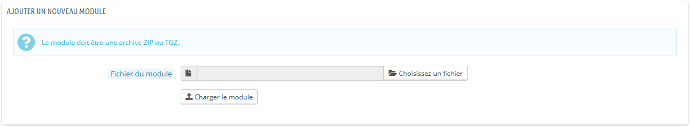
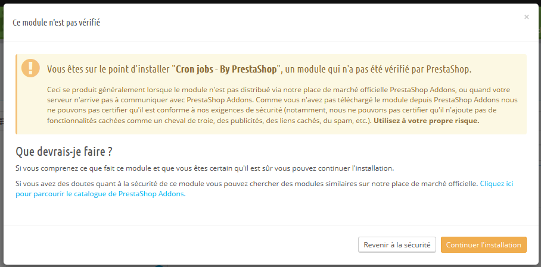
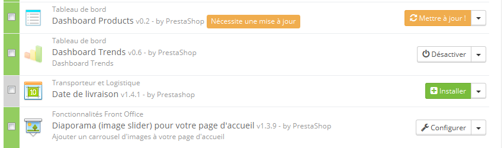
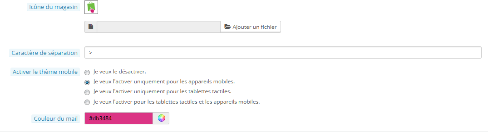

# Catalogue de modules et thèmes

**Tableau de contenu**

/\*\<!\[CDATA\[\*/\
div.rbtoc1597053589761 {padding: 0px;}\
div.rbtoc1597053589761 ul {list-style: disc;margin-left: 0px;}\
div.rbtoc1597053589761 li {margin-left: 0px;padding-left: 0px;}\
\
/\*]]>\*/

* [Catalogue de modules et thèmes](catalogue-de-modules-et-themes.md#Cataloguedemodulesetthèmes-Cataloguedemodulesetthèmes)
  * [Installer un module](catalogue-de-modules-et-themes.md#Cataloguedemodulesetthèmes-Installerunmodule)
  * [Mettre un module à jour](catalogue-de-modules-et-themes.md#Cataloguedemodulesetthèmes-Mettreunmoduleàjour)
  * [Désinstaller un module](catalogue-de-modules-et-themes.md#Cataloguedemodulesetthèmes-Désinstallerunmodule)
  * [Installer un thème](catalogue-de-modules-et-themes.md#Cataloguedemodulesetthèmes-Installerunthème)
  * [Le thème mobile de PrestaShop](catalogue-de-modules-et-themes.md#Cataloguedemodulesetthèmes-LethèmemobiledePrestaShop)

## Catalogue de modules et thèmes 

PrestaShop est livré avec plus de 100 modules. Vous pouvez toutefois en ajouter d'autres si vous vous sentez limité par les modules existant, ou si vous souhaitez explorer d'autres possibilités.

Il y a un grand nombre de modules disponibles sur le site PrestaShop Addons ([http://addons.prestashop.com/](http://addons.prestashop.com/)). Certains sont gratuits, d'autres payants, et vous trouverez sûrement les modules qui correspondent à vos besoins ! Si vous êtes un développeur de modules ou un designer de thème averti, vous pouvez même proposer vos créations et les vendre sur Addons !

La page "Catalogue de modules et thèmes" vous donne un accès rapide et facile à la base de données Addons de modules et de thèmes. Son interface se comprend rapidement :

* Un champ de recherche, grâce auquel vous pouvez découvrir tout le contenu d'Addons.
* Une liste de 8 modules que vous pouvez directement acheter.
* Une liste de 12 thèmes que vous pouvez directement acheter.

Le fait de lancer une recherche vous enverra sur le site Addons, où plus d'options sont disponibles.

Une requête de recherche renverra les 5 premiers résultats depuis Addons, d'autres étant accessibles en cliquant sur le lien "Voir tous les résultats addons.prestashop.com" situé en haut des résultats.

En cliquant sur un résultat, vous ouvrez sa page Addons dans un nouvel onglet de votre navigateur web.

Addons est la place de marché officielle pour les modules et thèmes de PrestaShop. C'est là que les propriétaires de boutiques peuvent trouver tout ce qui leur est nécessaire pour personnaliser leur site, et que les développeurs/designers peuvent partager leurs créations avec la communauté.

Les modules et thèmes peuvent être gratuits ou payants : le prix est fixé par l'auteur. Prenez le temps de parcourir les rubriques de modules et thèmes, car un module cher n'est pas forcément meilleur.

Vous devez être connecté avant de pouvoir télécharger un produit ou lui donner une note. L'inscription est gratuite.

### Installer un module 

Une fois que vous avez téléchargé un module depuis le site Addons, il vous revient de l'installer sur votre boutique PrestaShop.

Il existe deux méthodes pour installer un module: passer soit par un formulaire dédié, soit par votre client FTP.

#### Installation à l'aide du formulaire dédié 

Pour installer un nouveau module PrestaShop de manière "automatique", cliquez sur le lien "Ajouter un module depuis mon ordinateur", situé au-dessus de la liste des modules, sur la page "Modules". Une nouvelle section apparaît alors.

Le formulaire de cette section vous permet de mettre en ligne l'archive du module, tel que téléchargé depuis Addons. Vous pouvez au choix mettre en ligne un fichier `.zip` ou un `.tar.gz`. Le formulaire est très simple : naviguez simplement jusqu'au fichier du module que vous avez téléchargé, et cliquez sur le bouton "Mettre ce module en ligne". Ne sélectionnez pas le dossier décompressé à partir de l'archive, ni l'un de ses fichiers : juste l'archive compressée !

Une fois le choix validé, PrestaShop se charge de télécharger le module depuis votre ordinateur, le décompresser, placer ses fichiers au bon endroit, et mettre à jour la page, le tout en quelques secondes. PrestaShop affichera ensuite le message "Module téléchargé avec succès".

Les modules ne sont pas installés par défaut : vous devez trouver le module dans la liste afin de cliquer sur son bouton "Installer", et parfois le configurer.

Une fois la configuration faite, assurez-vous de tester dès que possible votre module pour confirmer qu'il fonctionne comme prévu.

#### Installation à l'aide d'un client FTP 

Pour installer manuellement un nouveau module PrestaShop :

1. Décompressez l'archive `.zip` du module. Vous devriez obtenir un nouveau dossier ;
2. A l'aide de votre client FTP, placez ce dossier dans le dossier `/modules` de PrestaShop. Faites bien attention à ne pas l'envoyer dans le dossier d'un autre module (ce qui peut facilement arriver lors d'un glisser/déposer à la souris). Mettez en ligne le dossier lui-même, pas seulement les fichiers qu'il contient ;
3. Rendez-vous dans votre back-office, dans l'onglet "Modules" ;
4. Localisez le nouveau module dans la liste de modules. Vous aurez sans doute à faire défiler la page, mais vous pouvez également utiliser le moteur de recherche de la liste, qui devrait vous donner une liste dynamique de modules correspondants au mot saisi ;
5. Dans la ligne du nouveau module, cliquez sur le bouton "Installer".
6. Votre module est maintenant installé, et devrait être également activé. Si besoin est, cliquez sur le lien "Configurer". Faites attention à tout avertissement qui puisse être affiché par PrestaShop.

Une fois l'installation terminée, vérifiez le module immédiatement, afin de valider qu'il fonctionne comme prévu.

Les modules peuvent venir de nombreuses sources, et toutes ne sont pas recommandables. C'est la raison pour laquelle PrestaShop 1.6.0.7 a ajouté une fenêtre d'avertissement pour les modules non sûrs – c'est à dire les modules qui n'ont pas été vérifiés par PrestaShop à l'aide de sa place de marché Addons. Cette fenêtre vous permet de choisir si vous voulez continuer l'installation sans recevoir d'autres notifications, ou arrêter l'installation.

L'installation d'un module natif ou d'un module provenant d'Addons ne déclenche pas l'affichage de cette fenêtre.

### Mettre un module à jour 

Votre installation de PrestaShop vérifie régulièrement l'existence de nouvelles versions pour vos modules sur le serveur Addons. S'il en trouve, PrestaShop affiche un lien "Mettre à jour" pour ces modules. Cliquez simplement dessus, et PrestaShop prendra en charge le téléchargement de la mise à jour du module.

### Désinstaller un module 

**N'effacez jamais un module directement en supprimant son dossier depuis un client FTP !** Vous devez laisser PrestaShop s'en charger.

Si vous souhaitez temporairement ne plus utiliser le module, mais que vous souhaitez conserver ses réglages, vous pouvez simplement le désactiver : cliquez sur le lien "Désactiver". Les actions disponibles seront alors "Activer" et "Supprimer", mais le bouton "Désinstaller" reste disponible.

Si les réglages du module vous importent peu, cliquez sur le bouton "Désinstaller" : le dossier de votre module sera toujours présent dans le dossier `/modules`, mais le module n'aura plus d'impact sur votre boutique.\
&#x20;Si vous souhaitez totalement retirer le module de votre serveur, cliquez sur le bouton "Supprimer" : PrestaShop enlèvera son dossier et tous ses fichiers.

Si vous avez modifié votre thème pour mieux prendre en compte le module, faites en sorte que la désactivation ou le retrait du module ne casse pas le thème.

### Installer un thème 

Une fois que vous avez téléchargé votre thème depuis le site Addons, il vous revient de l'installer sur votre boutique PrestaShop.

#### Installateur de thème de PrestaShop 

C'est la méthode à préférer, car elle préserve la position de tous les blocks sur leurs points d'accroche respectifs.

PrestaShop dispose d'un importateur de thème natif, que vous trouverez dans le page "Thèmes", dans le menu "Préférences". Cliquez sur le bouton "Ajouter un thème" en haut de l'écran (pas le bouton "Ajouter" en haut de la liste de thèmes, qui sert à créer un nouveau thème). Cette page vous présente trois méthodes pour installer un nouveau module : depuis votre ordinateur, depuis un site public, ou depuis votre propre serveur FTP. Elle vous donne également une méthode pour créer un thème à partir de zéro.

**Importer un thème**

Quelle que soit la méthode utilisée, le processus reste le même : indiquer l'emplacement de l'archive Zip du thème, et cliquez sur le bouton "Suivant".

**Importer depuis l'ordinateur** : utilisez l'explorateur de fichiers pour trouver l'archive.\
&#x20;**Importer depuis le web** : indiquez directement l'adresse web de l'archive.\
&#x20;**Importer depuis le serveur FTP** : à l'aide d'un client FTP, mettez l'archive en ligne dans le dossier suivant : `/modules/themeinstallator/import/` .

La page suivante affichera un rapide résumé de ce que l'importateur s'apprête à faire.

Cliquez de nouveau sur "Suivant" pour valider votre choix. Le thème est maintenant installé, et PrestaShop vous demande si vous souhaitez installer les modules qui étaient joints au thème, ce que vous souhaitez faire avec la configuration actuelle des modules, et la manière dont vous souhaitez que la configuration des images soit prise en compte.

Cliquez sur "Suivant" une dernière fois. Une dernière page de confirmation vous présente toutes les modifications appliquées à votre site PrestaShop. Cliquez sur "Terminer" pour mettre fin au processus.

**Installation à l'aide d'un client FTP**

Ce n'est pas la méthode recommandée, mais cela reste une possibilité. À utiliser avec précaution : vos blocs pourraient ne plus avoir la position attendue sur leurs points d'accroche respectifs.

Pour installer un nouveau thème PrestaShop :

1. Décompressez l'archive `.zip` du thème. Vous devriez obtenir au moins un nouveau dossier local, `/themes`, contenant le dossier de votre thème ;
2. A l'aide de votre client FTP, placez le dossier de votre thème (contenu dans le dossier `/themes` local) dans le dossier `/themes` de PrestaShop, en ligne. Faites bien attention à ne pas l'envoyer dans le dossier d'un autre thème (ce qui peut facilement arriver lors d'un glisser/déposer à la souris). Mettez en ligne le dossier lui-même, pas seulement les fichiers qu'il contient ;
3. (facultatif) Si l'archive du thème contenait un second dossier `/modules`, cela signifie que ce thème est accompagné de modules qui lui sont spécifiques ou nécessaires. A l'aide de votre client FTP, placez le ou les dossiers contenus dans ce dossier `/modules` local directement dans le dossier `/modules` en ligne. Si votre installation de PrestaShop dispose déjà d'un module fourni avec le thème, efforcez-vous de conserver la version la plus récente (celle avec les fichiers les plus récents). Dans le doute, conserver la version fournie avec le thème, étant donné qu'elle est a priori la plus adaptée au thème.
4. Rendez-vous dans votre back-office, dans la page "Thèmes" du menu "Préférences" ;
5. Localisez le nouveau thème dans la liste de thèmes, dans la section "Thèmes" (en bas de la page) ;
6. Sélectionnez le nouveau thème au lieu du thème actuel, en cliquant sur le bouton radio, et en cliquant sur enregistrer ;
7. Votre thème est maintenant en place.
8. (facultatif) Si le thème était accompagné de modules, activez-les via la page "Modules" du back-office, et configurez-les si nécessaire.

Beaucoup de thèmes sont fournis avec un fichier `Install.txt`, donnant des indications utiles. N'oubliez pas de le parcourir pour être certain de ne rien oublier.

Une fois l'installation complète, vérifiez le thème immédiatement, page après page, afin de valider qu'il fonctionne comme prévu. N'hésitez pas à réaliser une commande de A à Z – il ne faudrait pas rater des commandes parce que le thème est incomplet !

**Exporter un thème**

Cette section n'est disponible que si vous avez au moins un thème installé sur votre site PrestaShop.\
&#x20;Il peut se révéler très utile d'exporter un thème, que ce soit pour le sauvegarder par sécurité, pour créer une archive à donner à un ami, ou pour vendre le thème sur le site Addons ([http://addons.prestashop.com/fr/](http://addons.prestashop.com/fr/)). L'exportateur ne fait pas que générer une archive Zip complète de votre thème, il ajoute également de nombreuses informations dans des fichiers XML, qui se révèleront très utiles lors de la mise à disposition sur Addons, et lors de l'import dans une boutique PrestaShop.

Choisissez un thème et cliquez sur le bouton "Exporter ce thème". Un formulaire de configuration apparaît, avec lequel vous pouvez configurer les paramètres du thème : auteur, nom du thème, version de compatibilité, modules liés (s'il en a), etc.

Une fois tous les paramètres en place, cliquez sur le bouton "Générer l'archive maintenant !" Vous obtiendrez rapidement un fichier à télécharger à l'aide de votre navigateur. Enregistrez-le sur votre disque dur, puis donnez un nom compréhensible à ce fichier. Partant de là, vous pouvez facilement partager ce thème, et s'il s'agit de votre propre création, vous pouvez également le mettre en vente sur le site PrestaShop Addons, à l'adresse [http://addons.prestashop.com/](http://addons.prestashop.com/).

### Le thème mobile de PrestaShop 

Le thème mobile offre la possibilité à tous les marchands PrestaShop de rendre leur site e-commerce adapté aux terminaux mobiles : de la page d’accueil au paiement, en passant par la fiche produit et le tunnel de conversion (_conversion funnel_).

#### Installer le thème mobile sur votre boutique 

Pour installer le thème PrestaShop :

1. Connectez-vous à l'administration de PrestaShop ;
2. Rendez-vous dans la page "Thèmes" du menu "Préférences" ;
3. Dans la section "Apparences", descendez jusqu'à l'option "Activer le thème mobile" et choisissez l'une des trois sélections autre que "Je veux le désactiver".

Par défaut, le thème mobile ne s'affiche que pour les smartphones, les tablettes ayant accès au même thème que les terminaux classiques. Avec cette option, vous pouvez choisir d'afficher également le thème mobile pour les tablettes (option "Les deux"), ou même de ne l'afficher que pour les tablettes.

#### Personnaliser le thème mobile 

Les fichiers du thème mobile sont toujours placés dans le sous-dossier `/mobile` du dossier du thème courant. Ainsi, si votre thème actuel est le thème par défaut, les fichiers du thème mobile seront dans le dossier `/themes/default/mobile` de votre installation de PrestaShop 1.5.

Le thème est fait de fichiers HTML, CSS et JavaScript : sa structure est donc la même que pour le thème par défaut, mais avec une mise en page radicalement différente, adaptée aux petits écrans des terminaux mobiles.

Si vous souhaitez modifier les couleurs ou la disposition des pages du thème mobile, vous devrez donc modifier les fichiers CSS et/ou HTML pour les adapter à votre goût. Il vous faut donc avoir certaines connaissances des langages de programmation Web, ou faire appel à un développeur.

#### Utiliser le thème mobile avec un autre thème 

Le thème mobile n'est disponible que si le thème courant dispose d'un sous-dossier `/mobile` dans son dossier. De fait, de nombreux thèmes PrestaShop ne disposent pas d'un thème mobile, et les utilisateurs de ces thèmes ne peuvent donc pas faire profiter à leurs clients d'une version mobile de leur site.

En attendant que le thème que vous utilisez soit mis à jour avec un thème mobile, vous pouvez utiliser le thème mobile par défaut, au moyen d'une manipulation rapide : il suffit de copier le sous-dossier `/mobile` contenu dans le dossier `/themes/default`, et de coller ce sous-dossier (et tous les fichiers qu'il contient) dans le dossier de votre propre thème.

Vous utiliserez alors le thème mobile par défaut plutôt qu'un thème ayant un design cohérent avec votre thème principal, mais rien ne vous empêche de modifier les fichiers HTML, CSS ou JavaScript du thème mobile recopié afin de le rapprocher de votre propre thème.
