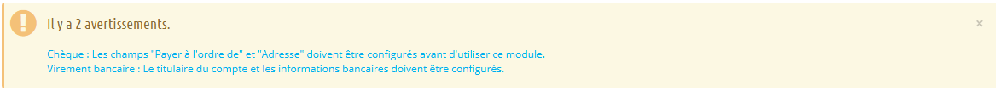
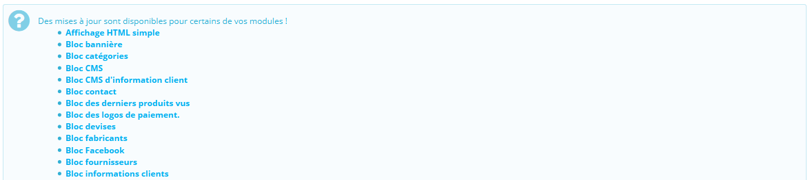
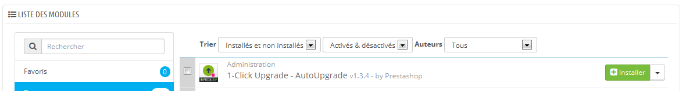
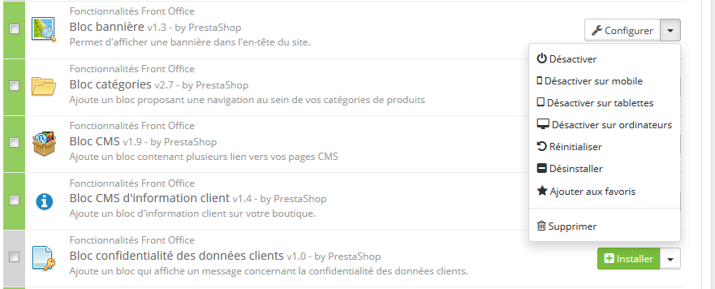
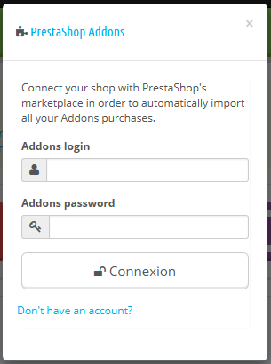
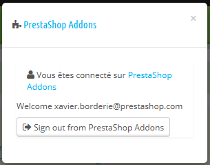

# Vos modules

La page "Modules" du menu du même nom vous donne accès à la liste de modules. Sur cette page vous pouvez installer, désinstaller et configurer chaque module. Tous les modules natifs sont expliqués en détail dans leur propre chapitre, "Configurer les modules natifs". Le présent chapitre explique simplement comment la page "Modules" fonctionne.

## Notification de modules 

En-dessous du titre de la page, vous trouverez par moments des notifications envoyées par les modules installés. La plupart du temps, une notification vous aide à terminer la configuration des modules qui sont installés mais pas encore prêts à être utilisés : mettez à jour ses réglages pour faire disparaître la notification... et faire fonctionner votre module correctement.

Dans le cas où l'un de vos modules dispose d'une mise à jour disponible sur Addons, PrestaShop vous affichera également un avertissement, et un bouton "Mettre à jour tous les modules" apparaîtra en haut de la page. Cliquez sur ce bouton pour tout mettre à jour.

Au-dessus du tableau de modules se trouvent deux boutons, nommés "Vue normale" et "Vue par favoris". Ils changent de manière radicale la manière dont les modules sont listés.

## La liste des modules 

Cette liste vous permet de trouver rapidement le module que vous souhaitez installer, ou dont vous voulez modifier les réglages.

Dans la première section, vous pouvez chercher un module précis, ou filtrer les modules jusqu'à ce que vous trouviez celui que vous cherchez.

* **Champ de recherche**. Les modules sont affichés au fur et à mesure de votre saisie, ce qui rend la recherche plus intuitive et rapide.
* **Sélecteurs de tri**. La liste se recharge automatiquement quand vous faites une sélection, et affiche les modules en fonction de vos réglages.\

  * **Installés et non installés**. La plupart du temps, vous voudrez faire un réglage sur un module installé, ou installer un module. Ce filtre est sans doute le plus utilisé.
  * **Activés et désactivés**. Les modules installés sont les seuls configurables, d'où l'intérêt de ce sélecteur.
  * **Auteurs**. Vous pouvez filtrer les modules par auteur. Par défaut, seul "PrestaShop" est disponible, mais au fur et à mesure que vous ajouterez les modules d'autres auteurs, ce sélecteur saura se montrer très utile.

Sur la gauche se trouve une liste de toutes les catégories de modules avec le nombre de modules de chaque catégorie. Cliquez sur une catégorie pour n'afficher que les modules de celle-ci.\
&#x20;L'une des catégories se nomme "Favoris" et est vide par défaut. Elle permet de rassembler les modules que vous utilisez le plus, et d'y accéder rapidement. Vous pouvez indiquer vos modules favoris avec l'action "Ajouter aux favoris".

Les modules peuvent prendre l'un des quatre états suivants :

* Non-installé.
* Installé mais désactivé.
* Installé et activé.
* Installer et activé, mais avec des avertissements.

Certains modules ont un badge "Populaire". Ces modules sont promus depuis le site Addons. Ils ne sont pas gratuits : le bouton "Installer" est remplacé par un bouton de mise en panier, avec le prix du module. En cliquant sur ce bouton, vous ouvrez la page de ce module sur le site Addons, où vous pouvez l'acheter.

La différence entre la désactivation et la désinstallation

Si vous ne souhaitez plus utiliser un module, vous pouvez au choix le désactiver ou le désinstaller. Le résultat de ces deux actions est a priori le même : le module n'est pas actif, ses options n'apparaissent plus dans votre back-office, et les éléments qu'il a pu ajouter au front-end disparaissent.

La différence se tient dans ce que la désactivation du module conserve la configuration de celui-ci, afin de pouvoir tout récupérer lors d'une éventuelle réactivation, tandis que la désinstallation supprime les données de configuration.

De fait, vous ne devriez ne désinstaller un module que si vous ne vous souciez plus de ses données ou si vous êtes certain que vous n'en aurez plus besoin. Dans le cas où vous ne voudriez même pas du module sur votre boutique, vous pouvez même cliquer sur le lien "Supprimer".

## Effectuer des actions sur les modules 

Voici les actions disponibles en fonction de l'état du module :

* Modules désinstallés :
  * **Installer**. Cette action déclenchera l'installation du module sur votre boutique PrestaShop. Le module sera automatiquement activé. Il se peut qu'il ajoute de nouvelles options à votre back-office.
  * **Ajouter aux favoris**. Cette action ajoutera le module à votre liste de favoris.
* Modules installés :
  * **Configurer**. Certains modules disposent d'une page de configuration. Dans ce cas, ils affichent un lien "Configurer" pour accéder à une nouvelle interface, d'où vous pourrez ajuster leurs réglages.
  * **Désactiver**. Lors de son installation, un module est activé par défaut. Vous pouvez le désactiver, ce qui enlèvera ses options de votre back-office mais conservera ses réglages en vue d'une possible réactivation.
    * **Désactiver sur mobile**. Cette action désactivera la vue front-office du module pour les appareils mobiles (smartphones, etc.).
    * **Désactiver sur tablettes**. Cette action désactivera la vue front-office du module pour les tablettes.
    * **Désactiver sur ordinateurs**. Cette action désactivera la vue front-office du module pour les ordinateurs.
  * **Réinitialiser**. Cette action remet les réglages par défaut de ce module.
  * **Ajouter aux favoris**. Cette action ajoutera le module à votre liste de favoris.
  * **Supprimer**. Cette action enlèvera le module de la liste des modules, et effacera ses fichiers et dossiers de votre serveur.

Les modules les mieux notés sur Addons peuvent se voir promus dans votre liste de module, en fonction de vos réglages de pays. Ils apparaissent au milieu des modules classiques, mais leurs boutons d'action ne sont pas titrés "Installer" mais plutôt "30 €", par exemple. En cliquant sur le bouton, la page Addons du module s'ouvre, d'où vous pouvez vous connecter, acheter et télécharger le module. De là, vous pouvez l'installer sur votre boutique.

## Se connecter à Addons 

Dans la configuration de base, la page des modules ne vous propose que la mise à jour des modules par défaut, fournis avec PrestaShop. Si vous avez acheté des modules sur Addons, la place de marché de PrestaShop, et que vous souhaitez profiter de la mise à jour automatique, il vous faut connecter votre PrestaShop à Addons.

En bas de la liste des catégories de modules, remplissez simplement le formulaire avec vos identifiants Addons, et PrestaShop verra quels sont les modules que vous avez achetés :

Cliquez sur le lien "Addons" en haut de l'écran : cela ouvrira un fenêtre modale avec un formulaire de connexion. Remplissez simplement les champs avec vos informations de connexion, et PrestaShop saura désormais (et mettre à jour) les modules que vous avez acheté. Cliquez à nouveau sur le lien "Addons" pour afficher votre identifiant.

|  |  |
| ------------------------------------------ | ------------------------------------------ |

Si les modules que vous avez achetés sur Addons ne se mettent pas à jour, vérifiez bien que vous êtes connecté sur ce formulaire !
