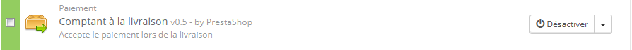
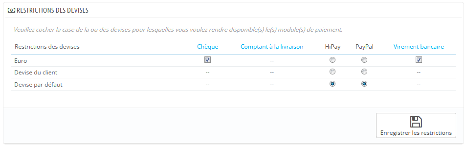
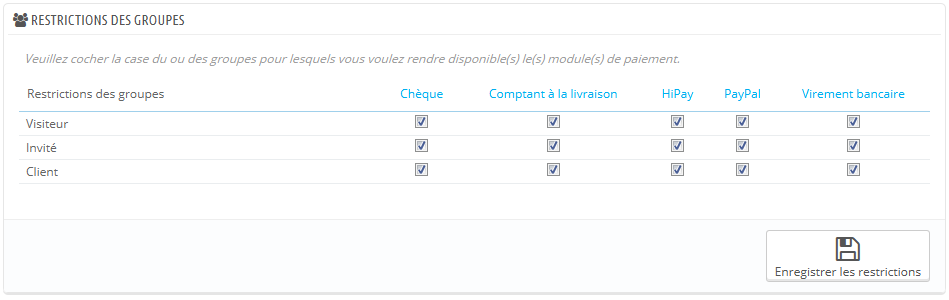
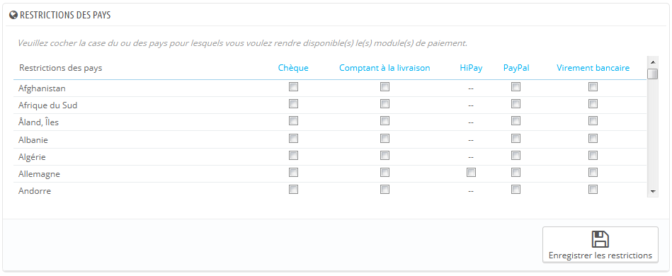

# Paramètres de paiement

Avec PrestaShop, vous pouvez accepter les transactions en provenance de nombreuses méthodes de paiement, comme les chèques, les virements bancaires, le paiement à la réception, et de nombreux modules de partenaires tels que PayPal, Skrill, Hipay, etc.

Sur la page "Paiement", vous pouvez trouver les sections suivantes :

* **Liste des modules**. Un simple raccourci vers la section "Paiement" de la liste des modules, sur la page "Modules". Vous pouvez installer les modules directement depuis cette page.
* Trois sections "restrictions :
  * **Restrictions des devises**. Choisissez les devises que vos modules de paiement peuvent accepter.
  * **Restrictions des groupes**. Choisissez quels groupes d'utilisateurs peuvent utiliser une méthode de paiement donnée.
  * **Restrictions des pays**. Choisissez les pays dont les utilisateurs peuvent utiliser une méthode de paiement donnée.

## Installer un module de paiement 

L'installation d'un module de paiement n'est pas fondamentalement différente de celle d'un module normal : cliquez simplement sur le bouton "Installer", et il ne vous reste plus qu'à configurer le module. Vous devez faire attention à bien le configurer, et vous assurer que ses données pointent bien vers votre adresse ou votre compte bancaire. Configurer un module de paiement signifie que vous devez en premier lieu être connu de votre fournisseur de serveur de paiement, c'est à dire avoir un compte chez lui.

Installons le module "Paiement à la livraison". Trouvez le module "Paiement à la livraison" dans la liste, puis cliquez simplement sur le bouton "Installer". PrestaShop s'occupe de tout, vous envoyant sur la page de la liste des modules, et vous informant du résultat. Par exemple, si le module a besoin d'être configuré avant de pouvoir fonctionner, PrestaShop affichera une notification en haut de la page. Dans le cas du module "Comptant à la livraison", il n'y a rien à configurer.

## Restrictions des modules de paiement par rapport aux devises 

En fonction de la méthode de paiement, les options proposées à un client peuvent changer.\
&#x20;Vous pouvez limiter le choix des méthodes de paiement disponibles en fonction des divises disponibles : vous pourriez préférer que les clients puissent payer avec n'importe quelle devise avec PayPal, mais que ceux utilisant Skrill ne puissent utiliser que le dollar, par exemple.

Par défaut, une devise est disponible pour votre boutique. S'il vous en faut plus, suivez ce processus :

1. Dans la page "Localisation" du menu "Localisation", importer le pack de localisation du pays utilisant la devise qui vous intéresse. Par exemple, les États-Unis pour le dollar américain, le Royaume-Uni pour la Livre Sterling, etc.
2. Dans la page "Devises" du menu "Localisation", activer les devises que vous venez d'importer.

Si vous avez besoin de restreindre l'usage d'un module en fonction de la devise d'un utilisateur, cochez simplement les cases qui s'appliquent à votre cas et cliquez sur "Enregistrer les restrictions".

Comme vous pouvez le constater, en fonction de la méthode de paiement, le choix de devises pour le client va différer :

* Pour certains, comme Paiement à la livraison, vous ne pouvez pas changer les réglages par défaut.
* Pour d'autres, comme Virement bancaire, Paiement par chèque, Skrill, Ogone, etc., vous pouvez changer tous les réglages, sauf "Devise du client" et "Devise par défaut de la boutique", qui reste dans leur état par défaut.
* Enfin, pour d'autres modules comme Hipay ou Paypal, vous pouvez changer tous les réglages, mais vous ne pouvez choisir qu'une option entre "Devise du client" et "Devise par défaut de la boutique", pas les deux à la fois.

Le client peut configurer sa devise à l'aide du menu déroulant au haut de chaque page du front-office.

Vous pouvez configurer la devise par défaut de la boutique depuis la page "Localisation", dans le menu "Localisation".

Si vous modifiez la devise par défaut après avoir configuré vos premiers produits, vous devrez remettre en place les prix de tous les produits. Vous devez vous décider sur la devise par défaut avant de créer les premiers produits.

## Restrictions des modules de paiement par rapport aux groupes 

Vous pouvez limiter le choix des modules de paiement en fonction de certains groupes de clients.

Par exemple, disons que vous préférez que les clients non-professionnels payent par PayPal, Skrill et Hipay, et que les professionnels ne payent que par virement bancaire. En fonction du type de client et de vos choix, les clients ne pourront payer qu'avec les méthodes de paiement que vous avez choisi pour eux.

## Restrictions des modules de paiement par rapport aux pays 

Vous pouvez limiter le choix des méthodes de paiement en fonction du pays d'origine de votre client. Par exemple vous pouvez décider qu'en France, en Espagne et en Allemagne, vous acceptez toutes les méthodes de paiement ; tandis qu'en Italie, au Royaume-Uni ou en Suisse, les clients ne pourront payer que par virement bancaire.

Le tableau liste tous les pays connus. S'il en manque un, vous pouvez l'ajouter en passant par la page "Pays", dans le menu "Localisation".

Ici encore, tout comme la restriction par devise, les options disponibles varient en fonction du module de paiement. :

* Pour certains, vous ne pouvez choisir que votre propre produit.
* Pour d'autres, vous ne pouvez choisir que les pays reconnus par le service : Autriche, Belgique, France, etc.
* Tous les autres modules de paiement par défaut devraient marcher avec tous les pays.

Trouvez le pays que vous recherchez dans la liste alphabétique, puis cochez les cases pour sélectionner ou non les méthodes de paiement que vous souhaitez rendre disponibles aux clients du pays en question. Une fois que tous les paramètres seront configurés, cliquez sur le bouton "Enregistrer", situé en bas de la page.\
&#x20;Par défaut, tous les modules de paiement installés sont configurés pour le pays de la boutique.
