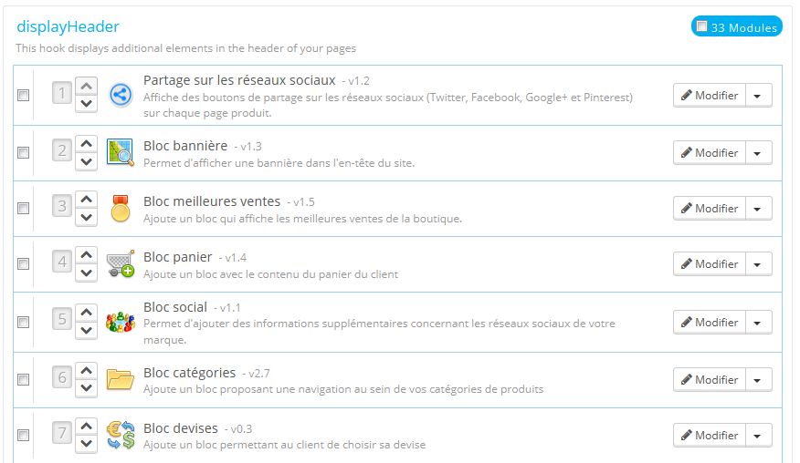
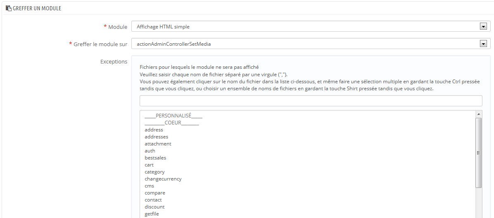
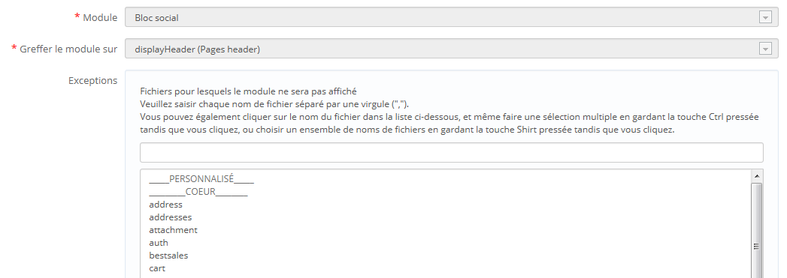
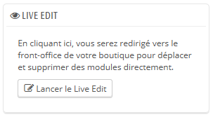
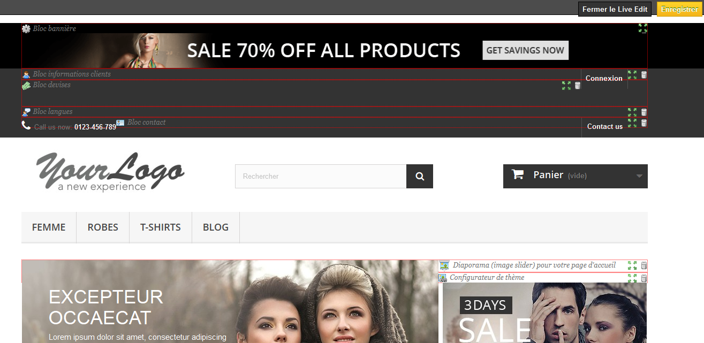

# Positions sur le front-office

Un module peut avoir deux vues : l'un sur le back-office (ses options, ou même son écran de configuration), et l'autre sur le front-office. La partie du front-office correspond à la manière et l'endroit où le module s'affichera sur le thème de votre boutique.

L'ordre dans lequel les modules apparaissent sur votre thème peut être personnalisé, car vous pouvez par exemple souhaiter que le bloc d'un module soit placé plus haut (ou plus bas) dans une section par rapport à d'autres. Dans le jargon PrestaShop, cette démarche est appelée "greffe" (en anglais, _transplanting_), et se pratique en utilisant l'outil disponible depuis la page "Positions" du menu "Modules". Dans les faits, cela vous permet d'attacher un module à l'un des nombreux points d'accroche disponibles dans le thème actuel, sans écrire de code.

La page "Positions" affiche tous les points d'accroche disponibles, ainsi que leurs modules correspondants. Beaucoup des points d'accroche sont vides par défaut, mais les plus utilisés ont facilement une douzaine de modules (le point d'accroche displayHeader a 33 modules par défaut).



En haut de la page, un menu déroulant vous permet de n'afficher que les points d'accroche qui vous intéressent.\
&#x20;Par défaut, cette liste n'affiche que les points d'accroche sur lesquels vous pouvez positionner des fonctions. Cochez la case "Afficher les points d'accroche invisibles" affiche tous les points d'accroche, même ceux sur lesquels vous ne pouvez rien positionner.

L'en-tête de chaque tableau de point d'accroche affiche le nom du point d'accroche, son nom technique, et le nombre de modules attachés. Le tableau liste tous les modules attachés.

Les modules sont présentés dans l'ordre avec lequel ils apparaissent sur le point d'accroche.

## Déplacer un module sur un point d'accroche <a href="#positionssurlefront-office-deplacerunmodulesurunpointdaccroche" id="positionssurlefront-office-deplacerunmodulesurunpointdaccroche"></a>

Il existe deux manières de déplacer un module à l'intérieur d'un point d'accroche :

* Cliquez sur la flèche montante ou descendante. La page sera réactualisée et affichera le nouvel ordre.
* Glissez et déposez la ligne correspondant au module :
  1. Placez le curseur sur le numéro de position, le curseur deviendra une croix fléchée.
  2. Bougez le curseur jusqu'à la position désirée : la ligne du module sera déplacée vers cette position.
  3. Relâchez maintenant le bouton de la souris : la position est maintenant enregistrée.

Pour la plupart des modules, la greffe peut être effectuée facilement depuis le back-office. Certains modules nécessitent de modifier le code afin de transplanter le module.

## Attacher un module à un point d'accroche : la greffe <a href="#positionssurlefront-office-attacherunmoduleaunpointdaccroche-lagreffe" id="positionssurlefront-office-attacherunmoduleaunpointdaccroche-lagreffe"></a>

Au sein de PrestaShop, l'action de "greffer" un module consiste à l'attacher à un point d'accroche. Vous pouvez greffer un module à plus d'un point d'accroche.

Deux choses à savoir avant de greffer un module :

* Certains modules sont conçus pour ne pouvoir être greffés qu'à certains points d'accroche.
* Certains points d'accroche sont conçus pour n'accepter que certains modules.

De fait, restez conscient que vous ne pouvez pas toujours greffer n'importe quel module à n'importe quel point d'accroche.

Assurez-vous de désactiver le cache lorsque vous testez les effets d'un nouveau module sur le front-end. Vous pouvez le désactiver en vous rendant sur la page "Performances" du menu "Paramètres avancés".

Le processus de greffe dispose de sa propre interface :

1. Allez sur la page "Positions" du menu "Modules".
2. Cliquez sur le bouton "Greffer un module" en haut à droite. L'interface de greffe s'affiche. De nombreux modules sont disponibles. Vous pouvez revenir sur votre choix plus tard au besoin.
3. Dans la liste déroulante "Module", choisissez le module que vous voulez greffer.
4. Dans la liste déroulante "Greffer le module sur", choisissez l'emplacement où vous voulez que le module soit greffé.
5. Dans le champ "Exceptions", saisissez le nom du (des) fichier(s) correspondant aux pages sur lesquelles vous ne voulez pas voir le module apparaître.\
   &#x20;Vous pouvez faire une sélection multiple en cliquant sur les fichiers tout en maintenant la touche Ctrl pressée. Désélectionnez les fichiers de la même manière : Ctrl+clic.
6. N'oubliez pas d'enregistrer vos modifications.



Le menu déroulant "Greffer le module sur" vous aide à savoir où le module peut être greffé.

Même si la liste déroulante donne une vision complète des points d'accroche disponible, elle peut ne pas être forcément très claire quand il s'agit de trouver un point en particulier. N'hésitez pas à essayer un autre point si le résultat de votre sélection ne donne pas le résultat attendu.\
La liste donne quelques détails : certains modules ont une description après leur nom, par exemple "Add fields to the form 'attribute value'" pour `displayAttributeForm`. Parcourez les tous pour trouver le bon point d'accroche.

## Modifier un module greffé <a href="#positionssurlefront-office-modifierunmodulegreffe" id="positionssurlefront-office-modifierunmodulegreffe"></a>

Chaque module dispose de deux boutons à la droite de sa ligne : un pour modifier ses réglages, l'autre pour supprimer le module.

Les réglages d'un module se font dans la même interface que celle utilisée pour greffer un module. La différence principale revient à ce que vous ne pouvez modifier les champs "Module" et "Greffer le module sur", qui sont désactivés et grisés. Vous ne pouvez modifier que le réglage des exceptions, qui fonctionne tel que décrit pour la méthode "Attacher un module à un point d'accroche" ci-dessus.\
&#x20;Bien que vous ne puissiez pas modifier les champs "Module" et "Greffer le module sur", ils peuvent servir de rappels pour la position actuelle du module, si vous vouliez le replacer par la suite.



Pour déplacer un module vers un autre point d'accroche, vous devez utiliser l'interface de greffe :

1. Cliquez sur le bouton "Greffer un module" en haut à droite. L'interface de greffe s'affiche.
2. Dans la liste déroulante "Module", choisissez le module que vous voulez déplacer.
3. Dans la liste déroulante "Greffer le module sur", choisissez l'emplacement où vous voulez que le module soit greffé.
4. Dans le champ "Exceptions", saisissez le nom du (des) fichier(s) correspondant aux pages sur lesquelles vous ne voulez pas voir le module apparaître.
5. Enregistrez vos modifications. La liste des points d'accroche apparaît.
6. Rendez-vous sur le point d'accroche où vous avez greffé le module : il devrait y apparaître. Modifiez sa position si besoin est.
7. Rendez-vous sur le point d'accroche d'origine du module, et cliquez sur l'icône de suppression afin d'enlever ce module de ce point. Cela évite qu'un même module apparaisse deux fois.

Vérifiez toujours sur votre front-office que le module apparaît effectivement là il le doit.

## Enlever un module d'un point d'accroche. <a href="#positionssurlefront-office-enleverunmoduledunpointdaccroche." id="positionssurlefront-office-enleverunmoduledunpointdaccroche."></a>

Il y a deux manières d'enlever un module d'un point d'accroche :

* Enlever un seul module : cliquez sur l'icône de suppression, à droite sur la ligne du module.
* Enlever plusieurs modules : sélectionnez les modules en cochant leurs cases respectives, situées à droite sur la ligne de chaque, puis cliquez sur le bouton "Dégreffer la sélection", situé en haut et en bas de la liste des points d'accroche.

## Déplacer un module à la souris : le Live Edit <a href="#positionssurlefront-office-deplacerunmodulealasouris-leliveedit" id="positionssurlefront-office-deplacerunmodulealasouris-leliveedit"></a>

L'autre manière de déplacer les modules dans la page d'accueil est le mode Live Edit, qui intègre la dite page d'accueil au sein d'un outil qui vous permet de placer vos modules visuellement. Vous pouvez y accéder en vous rendant dans la page "Positions" du menu "Module", puis en cliquant sur le bouton "Lancer LiveEdit".



Après avoir cliqué, PrestaShop ouvre la page d'accueil dans une nouvelle fenêtre, avec le script Live Edit sur le haut de la page:

* Tous les blocs sont entourés d'un cadre rouge en pointillé, vous permettant de voir quels blocs vous pouvez déplacer.
* En haut à gauche des pointillés se trouve une icône indiquant le nom du bloc, ce qui vous permet de retrouver facilement les différents blocs.
* En haut à droite des pointillés, vous trouverez deux icônes:
  1. Un icône "Déplacer" : cliquez dessus pour déplacer le module sur la page.
  2. Un icône "Poubelle" : cliquez dessus pour retirer le bloc de la page d'accueil.



Au haut de la page Live Edit, vous trouverez une ligne contenant deux boutons : "Enregistrer" et "Fermer Live Edit".

Le 1er bouton permet de sauvegarder les modifications, le deuxième annule tous les changements effectués durant la session de Live Edit.

Notez qu'après avoir supprimé un module, vous devez aller sur la page "Positions" et utiliser le formulaire "Greffer un module" pour le remettre dans votre boutique.

### Où déplacer les modules ? <a href="#positionssurlefront-office-oudeplacerlesmodules" id="positionssurlefront-office-oudeplacerlesmodules"></a>

Les modules ne peuvent pas être déplacés n'importe où : cela dépend à la fois des points d'accroche du thème, et ce avec quoi chaque point d'accroche du module peut fonctionner (comme nous l'avons indiqué ci-dessus). Par conséquent, vous ne pourrez déplacer la plupart des modules que dans leur contexte : les modules de colonnes peuvent être déplacés à l'intérieur de la colonne ou dans une autre colonne (par exemple, de gauche à droite), tandis que les modules d'accueil (ceux au centre de la page) ne peuvent être déplacés que dans leur zone spécifique.

Afin de vous donner un indice visuel vous indiquant où un module peut être déplacé, PrestaShop affichera un bloc vert vide si l'emplacement et correct, ou un bloc rouge vide si l'emplacement est mauvais.

## Greffer un module en modifiant son code <a href="#positionssurlefront-office-grefferunmoduleenmodifiantsoncode" id="positionssurlefront-office-grefferunmoduleenmodifiantsoncode"></a>

À réserver aux experts : vous devez avoir une bonne connaissance de PHP et HTML avant de changer quoi que ce soit dans le code d'un module.

Certains modules ne peuvent être greffés dans d'autres pages car ils ne possèdent pas le code nécessaire.

Par exemple, le bloc "Recherche rapide" (`/blocksearch`) contient à la fois des modèles pour l'affichage des colonnes ainsi que l'affichage de l'en-tête, tandis que le bloc "Devises" (`/blockcurrencies`) n'a qu'un seul fichier de modèle qui se rapporte uniquement à la section d'en-tête. De même, le bloc de "Produits phares sur la page d'accueil" (`/homefeatured`) ne peut être placé que dans la section de contenu située au centre de la page principale.

Si vous voulez placer des modules simples tels que le bloc "Devises" vers un emplacement pour lequel il n'a pas été conçu, vous aurez à effectuer vous-même la personnalisation.\
&#x20;Les modules plus complexes tels que le module "Produits phares sur la page d'accueil" peuvent également être modifiés pour s'afficher dans d'autres sections de la page, mais il vous faudra pour cela les réécrire en partie afin que leur design fonctionne avec cet emplacement.

Pour personnaliser la greffe d'un module sur un point d'accroche, vous devez lui déterminez sa fonction PHP pour le point d'accroche. Reprenons le bloc "Devises", qui a cette fonction :

```
function hookTop($params)
  {
  ...
  }
```

Ainsi, pour greffer le bloc "Devises" dans la colonne de droite, par exemple, vous devez ajouter la fonction `hookRightColumn()` :

```
function hookRightColumn($params)
  {
  ...
  }
```

Ceci fait, vous devez écrire le code qui affichera le contenu pour la page d'accueil. Au mieux, cela signifiera copier/coller le contenu de la fonction `hookTop()` ; au pire, vous devrez réécrire le contenu de la fonction `hookTop()` afin de fonctionner visuellement au nouvel emplacement.
