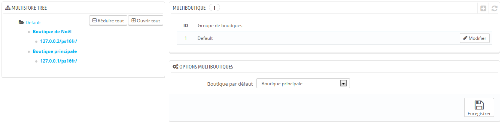
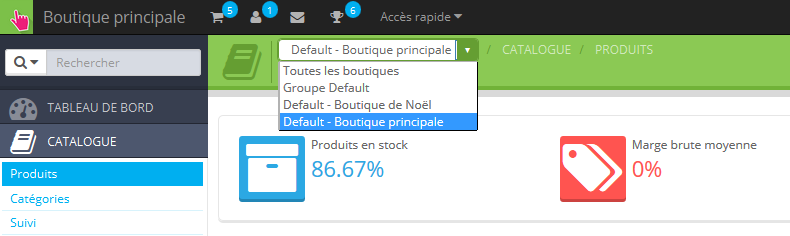
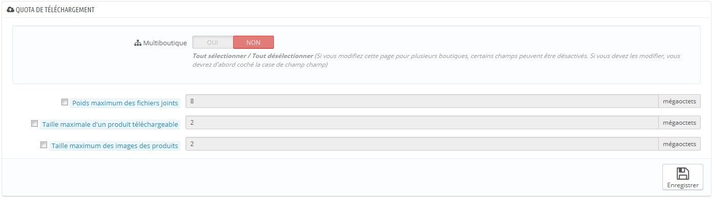

# L'interface multiboutique

## L'interface multiboutique 

### Gérer vos boutiques 

La page "Multiboutique" comprend trois sections principales :

* **Arbre multiboutique**. Vous donne un aperçu global de vos groupes de boutiques, et de leurs boutiques, et même des adresses web rattachées à une boutique. Par défaut, il n'y a qu'une seule boutique, dans le groupe par défaut : votre boutique principale.
* **Groupe de boutique**. Liste les groupes de boutiques disponibles. Vous pouvez les modifier en cliquant sur l'icône "Modifier" à droite.
* **Options multiboutiques**. Liste les options disponibles pour les boutiques existantes.
  * **Boutique par défaut**. La boutique par défaut est celle qui vous sert de point central pour toutes les autres, partage ses détails avec d'autres boutiques (produits, transporteurs, etc.), et est celle qui apparaît quand vous vous connectez à l'administration.

## Un seul back office pour plusieurs boutiques Front-Office 

Une fois que la fonctionnalité multiboutique est activée dans votre installation de PrestaShop 1.5, de nombreux aspects de PrestaShop sont personnalisables pour chaque boutique.

Pour vous permettre de savoir à quelle boutique vos modifications vont être appliquées, PrestaShop ajoute un sélecteur en haut de chaque écran, grâce auquel vous pourrez choisir le champ d'application de vos modifications :

* application à toutes les boutiques de votre installation de PrestaShop.
* application aux boutiques du groupe sélectionné seulement.
* application à la boutique sélectionnée seulement.

Le sélecteur de boutique vous aide à savoir dans quelle boutique vous êtes en train de travailler.

Cela étant, une fois que le mode multiboutique a été activé, nombre des options du logiciel ne peuvent plus être modifiées que dans un contexte global (toutes les boutiques), notamment les pages de configurations : localisation, préférences, paramètres avancés, administration. Ces pages présentent donc les options comme étant désactivées pour tout autre contexte. Cependant, vous pouvez choisir de modifier ces réglages dans un contexte plus local (par groupe de boutiques ou même par boutique) si nécessaire.

En effet, les pages de réglages apparaîtront comme d'habitude dans le contexte "Toutes les boutiques", tandis que tout autre contexte (groupe de boutiques ou boutique seule) affichent des options en plus :

* une option "Oui/Non" en haut de chaque section des pages de réglages.
* une case à cocher pour chaque option.

Ils ont tous la même utilité : vous permettre d'activer les options qui seraient autrement désactivées dans le contexte de boutique en cours. Vous pouvez choisir les options que vous voulez activer, ou activer toutes les options de la section en passant l'option globale à "Oui". Une fois activés, il vous revient de changer la valeur de chaque option : cliquer sur une case ou passer à "Oui" ne changent pas les réglages, ils ne font que vous autoriser à les changer dans ce contexte.

Malgré tout, certaines options ne peuvent pas être modifiées dans un contexte local : ils affichent alors "Vous ne pouvez pas changer la valeur de ce champ de configuration dans le contexte de la boutique actuelle."

Dans le tableau suivant, vous trouverez si un élément peut être personnalisé par boutique, par groupe de boutiques ou pour toutes les boutiques en même temps.

| Élément                                                                                                                                                                                                                                                     | Par boutique | par groupe de boutique | Toutes les boutiques |
| ----------------------------------------------------------------------------------------------------------------------------------------------------------------------------------------------------------------------------------------------------------- | ------------ | ---------------------- | -------------------- |
| Employés                                                                                                                                                                                                                                                    | X            | X                      | X                    |
| Groupes de clients                                                                                                                                                                                                                                          | X            | X                      | X                    |
| Produits                                                                                                                                                                                                                                                    | X            | X                      | X                    |
| — Prix                                                                                                                                                                                                                                                      | X            | X                      | X                    |
| — Déclinaisons et prix                                                                                                                                                                                                                                      | X            | X                      | X                    |
| — Langues                                                                                                                                                                                                                                                   | X            | X                      | X                    |
| — Images multiples (**sauf l'image principale**)                                                                                                                                                                                                            | X            | X                      | X                    |
| 
— Quantités disponibles à la vente, à condition que :
<ul><li>L'option de partage des quantités disponibles à la vente ait été cochée pour le groupe,</li><li>Le groupe ne partage pas ses quantités avec une boutique en dehors du groupe.</li></ul> | X            | X                      |                      |
| — Toutes les autres informations (description, tags, URL simplifiées, etc.)                                                                                                                                                                                 | X            | X                      | X                    |
| Valeurs et Attributs, Caractéristiques                                                                                                                                                                                                                      | X            | X                      | X                    |
| Réductions : règles de promotions panier                                                                                                                                                                                                                    | X            |                        |                      |
| Réductions : règles de promotions catalogue                                                                                                                                                                                                                 | X            |                        |                      |
| Règles de taxes                                                                                                                                                                                                                                             | X            | X                      | X                    |
| Catégories (**sauf l'image principale**)                                                                                                                                                                                                                    | X            | X                      | X                    |
| Transporteurs                                                                                                                                                                                                                                               | X            | X                      | X                    |
| Entrepôts                                                                                                                                                                                                                                                   | X            | X                      | X                    |
| Stock avancé                                                                                                                                                                                                                                                | X            |                        |                      |
| Fournisseurs                                                                                                                                                                                                                                                | X            | X                      | X                    |
| Marques                                                                                                                                                                                                                                                     | X            | X                      | X                    |
| Pages CMS                                                                                                                                                                                                                                                   | X            | X                      | X                    |
| Contacts                                                                                                                                                                                                                                                    | X            | X                      | X                    |
| 
Pays  Le statut d'un pays (activé ou désactivé) est commun à toutes les boutiques auxquelles il est associé.
                                                                                                                                      | X            | X                      | X                    |
| Devises                                                                                                                                                                                                                                                     | X            | X                      | X                    |
| Langues                                                                                                                                                                                                                                                     | X            | X                      | X                    |
| Modules                                                                                                                                                                                                                                                     | X            | X                      | X                    |
| — Points d'accroche et exceptions                                                                                                                                                                                                                           | X            | X                      | X                    |
| — Activation / Désactivation                                                                                                                                                                                                                                | X            | X                      | X                    |
| — Configuration (par exemple nom d'utilisateur et mot de passe pour PayPal)                                                                                                                                                                                 | X            |                        |                      |
| Modules de paiement                                                                                                                                                                                                                                         | X            | X                      | X                    |
| — Restrictions par pays                                                                                                                                                                                                                                     | X            |                        |                      |
| — Restrictions par devise                                                                                                                                                                                                                                   | X            |                        |                      |
| — Restrictions par groupe d'utilisateur                                                                                                                                                                                                                     | X            |                        |                      |
| URLs personnalisées                                                                                                                                                                                                                                         | X            |                        |                      |
| Scènes                                                                                                                                                                                                                                                      | X            | X                      | X                    |
| Comptes service web                                                                                                                                                                                                                                         | X            | X                      | X                    |
| Carrousel d'image (slider) pour votre page d'accueil                                                                                                                                                                                                        | X            |                        |                      |

Notes

**Catégories** : un produit apparaît en front office dans une catégorie donnée d'une boutique si et seulement si il a été associé à cette catégorie dans le contexte de la boutique. En d'autres termes : si les boutiques A et B ont en commun la catégorie C, on peut associer un produit P dans le contexte de la boutique A à la catégorie C, et ce produit P ne sera pas visible dans la boutique B à la catégorie C.

**Transporteurs** : vous pouvez gérer les associations de transporteurs par boutique, par groupe, ou sur l'ensemble des boutiques, mais pas personnaliser un transporteur par boutique. Il faut dupliquer le transporteur si vous souhaitez utiliser un même transporteur avec des tranches de prix différentes sur deux boutiques.

**Entrepôts** : bien que la gestion avancée du stock ne puisse être utilisée qu'avec une boutique à la fois, les entrepôts peuvent être gérés par groupe de boutiques, et vous pouvez simplement gérer les entrepôts pour manipuler le stock de manière avancé.

Pour chaque boutique, vous pouvez définir des prix spécifiques pour les produits, partager tout ou partie du catalogue, changer les images des produits, etc.

Vous pouvez choisir de partager les comptes clients pour permettre à vos clients de s'identifier sur l'ensemble de vos boutiques avec les mêmes identifiants, et même de se connecter à toutes vos boutiques de manière transparente.

Avec la gestion avancée des stocks, vous pouvez gérer plus finement les associations entre les entrepôts et les boutiques.
