# Présentation des interfaces gestion des stocks

/\*\<!\[CDATA\[\*/\
div.rbtoc1597053597911 {padding: 0px;}\
div.rbtoc1597053597911 ul {list-style: disc;margin-left: 0px;}\
div.rbtoc1597053597911 li {margin-left: 0px;padding-left: 0px;}\
\
/\*]]>\*/

* [Présentation des interfaces de gestion des stocks](presentation-des-interfaces-gestion-des-stocks.md#Présentationdesinterfacesgestiondesstocks-Présentationdesinterfacesdegestiondesstocks)
  * [Gestion des stocks depuis la fiche produit](presentation-des-interfaces-gestion-des-stocks.md#Présentationdesinterfacesgestiondesstocks-Gestiondesstocksdepuislaficheproduit)
  * [Gestion des entrepôts](presentation-des-interfaces-gestion-des-stocks.md#Présentationdesinterfacesgestiondesstocks-Gestiondesentrepôts.1)
  * [Gestion du stock](presentation-des-interfaces-gestion-des-stocks.md#Présentationdesinterfacesgestiondesstocks-Gestiondustock)
  * [Mouvements de stocks](presentation-des-interfaces-gestion-des-stocks.md#Présentationdesinterfacesgestiondesstocks-Mouvementsdestocks)
  * [État instantané du stock](presentation-des-interfaces-gestion-des-stocks.md#Présentationdesinterfacesgestiondesstocks-Étatinstantanédustock)
  * [Couverture de stock](presentation-des-interfaces-gestion-des-stocks.md#Présentationdesinterfacesgestiondesstocks-Couverturedestock)
  * [Commandes aux fournisseurs](presentation-des-interfaces-gestion-des-stocks.md#Présentationdesinterfacesgestiondesstocks-Commandesauxfournisseurs)
  * [Configuration](presentation-des-interfaces-gestion-des-stocks.md#Présentationdesinterfacesgestiondesstocks-Configuration)

La gestion des stocks est essentielle à partir du moment où vous vendez des produits dont la quantité s'épuise peu à peu.\
Pour savoir si vous avez besoin de la gestion des stocks avancée de PrestaShop, lisez la page "Concepts généraux" de ce chapitre : [http://doc.prestashop.com/pages/viewpage.action?pageId=20840942](http://doc.prestashop.com/pages/viewpage.action?pageId=20840942).

Si vous souhaitez utiliser la gestion des stocks avancée, vous devez :

* associer vos produits à vos entrepôts ;
* associer vos entrepôts à des transporteurs ;
* associer vos entrepôts à vos boutiques.

La gestion des stocks dans PrestaShop se déroule sur plusieurs écrans, et dispose de deux niveaux différents.

Ces niveaux sont :

* Pas de gestion des stocks : aucune quantité n'est gérée, PrestaShop part du principe que le stock d'un produit est illimité. À n'utiliser que dans le cas où vous ne vendez que des produits dématérialisés (fichiers, services, etc.).
* Gestion des stocks simples : vous pouvez indiquer pour chaque produit le stock dont vous disposez (y compris pour ses déclinaisons). Recommandé si vous avez peu de produits ou un petit entrepôt.
* Gestion des stocks avancée : vous pouvez indiquer où se trouve un produit (ou sa déclinaison) parmi un nombre illimité d'entrepôts (avec différents transporteurs et méthodes de valorisation). Vous pouvez également voir vos mouvements de stocks, l'état de votre stock à l'instant présent, la couverture immédiate de votre stock, et passer des commandes à vos fournisseurs.

Ces écrans sont :

* Préférences > Produits > section "Stock des produits" : c'est ici que vous pouvez activer la gestion des stocks, simple ou avancée. Vous pouvez également autoriser la précommande de produits (gestion de la rupture de stock), et activer des comportements de stockage sur les nouveaux produits.
* Catalogue > Produits > page d'un produit : la page de création/modification d'un produit peut se doter de un à deux onglets :\

  * Quantités :&#x20;
    * En mode Simple, vous pouvez manuellement indiquer les quantités de chaque produit.
    * En mode Avancé, les quantités sont gérées depuis le menu "Stock" de PrestaShop.
  * Entrepôts : en mode Avancé, vous pouvez indiquer l'emplacement du produit ou d'une déclinaison dans un entrepôt.
* Stock : en mode Avancé, vous avez accès à l'ensemble des pages de la gestion des stocks avancée (création d'entrepôts, mouvements de stocks, état du stock, couverture du stock, passage de commandes vos fournisseurs).

Les sections suivantes vous décrivent tous ces écrans un à un.

## Gestion des stocks depuis la fiche produit 

### Gestion des quantités 

Dans PrestaShop 1.4, vous deviez spécifier manuellement les quantités de produits disponibles en boutique.

Dans PrestaShop 1.5 et 1.6, il reste possible de spécifier manuellement les quantités disponibles en boutique. Mais si vous avez activé la gestion avancée des stocks, il est aussi possible de déterminer automatiquement cette quantité en fonction de l'état de votre stock physique. Notez qu'il est donc possible d'activer globalement la gestion avancée des stocks, mais de n'avoir qu'un ou quelques produits utilisant cette fonctionnalité.

Lorsque vous activez l'option "Activer la gestion des stocks" (dans la page "Préférences > Produits"), tous les produits se voient ajoutés un nouvel onglet à leur page d'administration, nommé "Quantités". Cette interface simple, claire et unique vous permet de gérer les quantités disponibles à la vente sur votre (vos) boutique(s) pour un produit et toutes ses déclinaisons éventuelles.

Avec seule cette option activée, vous pouvez gérer les quantités de produit au cas par cas, produit par produit.

Si vous souhaitez que toutes vos quantités de produits soient directement gérées depuis le gestionnaire de stock avancé de PrestaShop plutôt que produit par produit, il vous faut activer une autre option de la page "Préférences > Produits" : "Activer la gestion des stocks avancée".

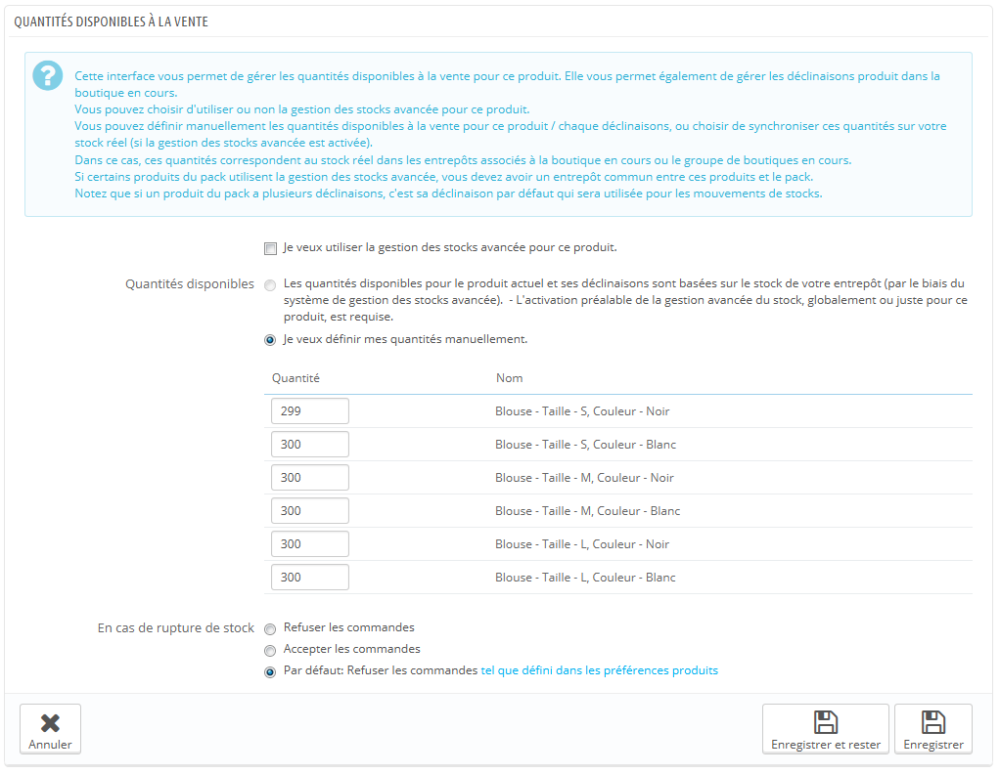

L'onglet "Quantités" s'ouvre avec une section explicative, que ne vous enjoignons à lire en entier. Cette section est suivie par l'interface de gestion des quantités disponibles à la vente elle-même, qui s'ouvre par trois options :

* **Je veux utiliser la gestion des stocks avancée pour ce produit**.
* **Les quantités disponibles pour ce produit sont synchronisées sur le stock physique (utilisable) en entrepôts**.
* **Je veux définir mes quantités manuellement**.

Par défaut, seule la troisième option ("Je veux définir mes quantités manuellement") est activée. Tant que vous n'avez pas coché la première option ("Je veux utiliser la gestion des stocks avancée pour ce produit"), les quantités sont gérées de la même manière qu'elles l'étaient en version 1.4, c'est à dire manuellement : vous ajoutez vous-mêmes les quantités disponibles, et PrestaShop enlèvera des quantités à chaque vente.

Si vous souhaitez que les quantités d'un produit soient synchronisées avec le stock d'un entrepôt (ou plusieurs), il vous faut changer de méthode de gestion des quantités :

1. Cochez la case "Je veux utiliser la gestion des stocks avancée pour ce produit" afin de changer de méthode de gestion.
2. La deuxième option, "Les quantités disponibles pour ce produit sont synchronisées sur le stock physique (utilisable) en entrepôts", est alors disponible. Sélectionnez-la pour synchroniser la quantité disponible de ce produit avec le stock de votre entrepôt.

Dès que vous avez sélectionné la deuxième option, la colonne "Quantité" du tableau n'est plus modifiable : les quantités sont directement reprises du stock actuel indiqué par votre gestionnaire de stock avancé plutôt que depuis l'onglet "Quantités" de chaque produit.

Le cas des packs est particulier. En effet, étant donné qu'il n'est pour le moment pas possible d'ajouter de déclinaisons de produits dans un pack, les développeurs de PrestaShop ont décidé, si besoin est, de se baser, sur la déclinaison par défaut pour décrémenter le stock physique.

Par ailleurs, un message indique le nombre de packs maximum conseillé.

Le reste de cette page est expliqué dans le chapitre "Gérer le catalogue" de ce guide.

### Gestion des fournisseurs 

Il est désormais possible de définir plusieurs fournisseurs pour un même produit. Pour chaque fournisseur associé à un produit, il est possible de spécifier une référence fournisseur et un prix d'achat par défaut pour ce produit ainsi que pour toutes ses déclinaisons. Ces informations seront utilisées lors de commandes fournisseurs.

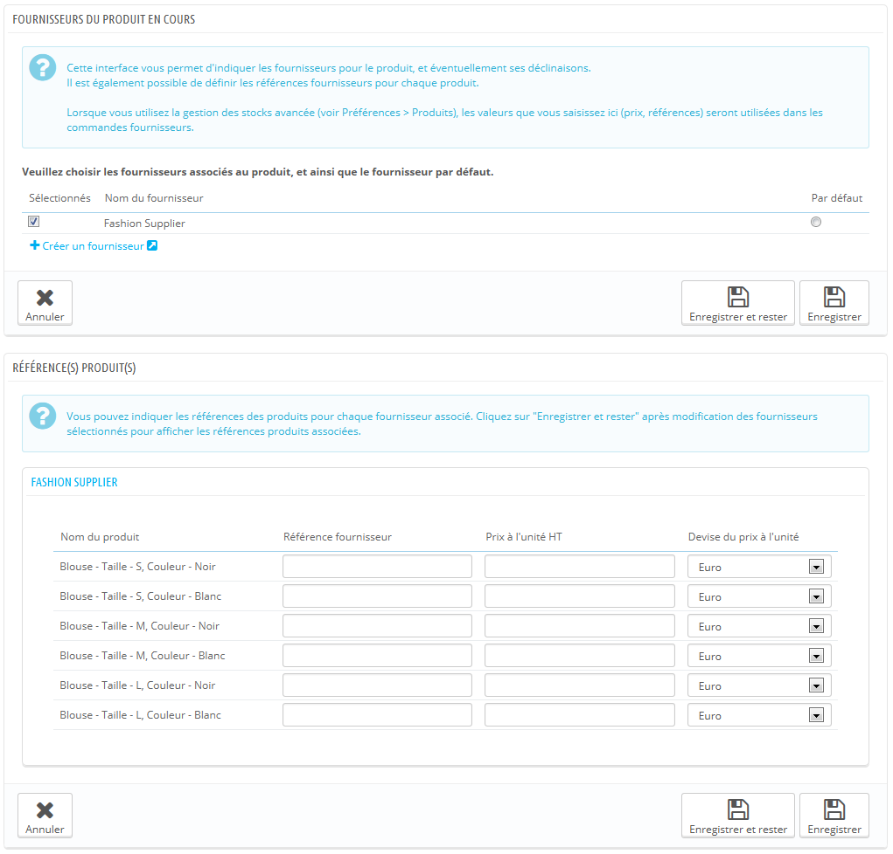

### Gestion des entrepôts 

Si vous avez activé la gestion avancée des stocks, un onglet "Entrepôts" s'ajoute à la fiche produit afin de spécifier dans quel(s) entrepôt(s) peut être stocké le produit en cours et chacune de ses déclinaisons éventuelles. Il est aussi possible de spécifier l'emplacement dans l'entrepôt pour ce produit et ses déclinaisons.

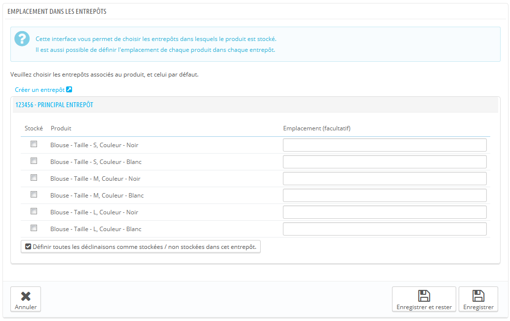

Il convient au préalable de déclarer au moins un entrepôt (voir ci-dessous) avant de pouvoir associer un produit et définir un emplacement. Cette étape est indispensable : il est important de déclarer au minimum un entrepôt dans lequel un produit peut être entreposé. Cela aura un impact fondamental lors de la préparation des commandes dans le cadre du multishipping.

## Gestion des entrepôts 

Avec la gestion avancée de stocks, il est désormais possible de créer un ou plusieurs entrepôts. Pour cela, ouvrez la page "Entrepôts" du menu "Stocks".

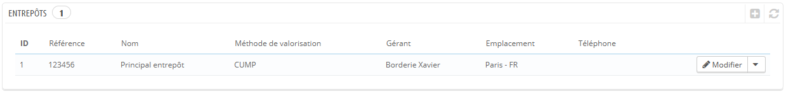

Lorsque vous créez un nouvel entrepôt, vous devez remplir les champs suivants :

* **Référence** et **Nom**. L'identifiant unique de l'entrepôt et son nom. Faites en sorte d'utiliser un nom reconnaissable : vous devez être en mesure de facilement différencier les entrepôts entre eux dans une liste déroulante.
* **Adresse**, Code postal\*, "Ville" et "Pays". L'adresse physique de l'entrepôt/ Cette information sera utilisée sur les commandes à vos fournisseurs.
* **Gérant**. La personne en charge de l'entrepôt, choisie parmi les employés enregistrés sur votre boutique. Si le compte de l'employé n'a pas encore été créé, vous devez impérativement le faire.
* **Transporteur**. Les transporteurs autorisés à s'occuper des envois en provenance de cette boutique. Maintenez la touche Shift enfoncée en cliquant pour choisir plus d'un transporteur.
* **Méthode de valorisation**. La manière dont vous gérez la boutique, en fonction des lois fiscales de votre pays. Lire la section "Règles de gestion des stocks" de ce chapitre pour avoir plus d'information.
* **Devise de valorisation du stock**. Une devise de valorisation pour le stock de cet entrepôt (à choisir parmi les devises enregistrées).

Il n'est pas possible de changer la méthode et la devise de valorisation d'un entrepôt après la première initialisation. Si vous devez changer ce réglage, vous devez recréer l'entrepôt, et supprimer celui mal configuré. Vous pouvez supprimer un entrepôt s'il ne contient plus aucun produit.

Faites attention lorsque vous choisissez vos transporteurs car cela aura un impact fondamental lors de la préparation des commandes dans le cadre du multishipping.

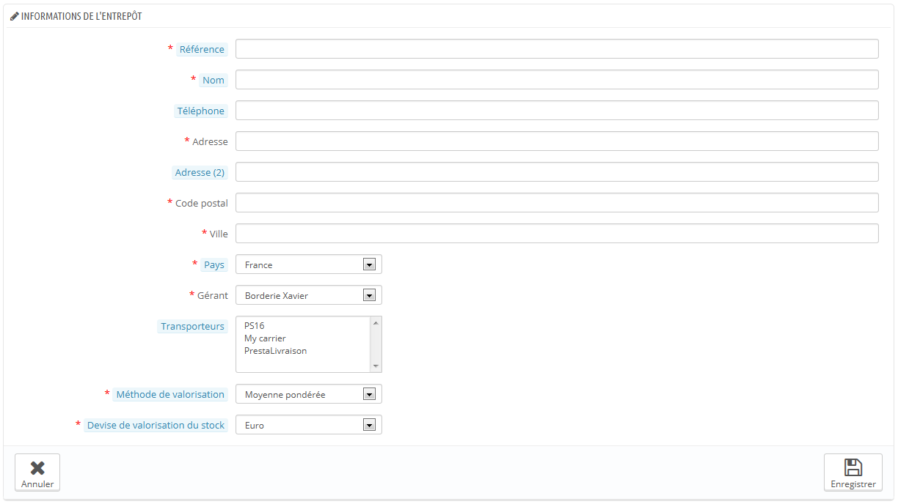

Dans le cas où vous administrez plusieurs boutiques, vous devrez aussi associer chaque boutique à un ou plusieurs de vos entrepôts. Cela permet de définir à partir de quel entrepôt pourront être expédiées les commandes de vos clients sur chaque boutique respective.

Une fois l'entrepôt créé, vous disposez d'une vue synthétique sur celui-ci. Cliquez sur l'icône "Voir" à droite pour avoir un aperçu de ses informations, notamment le nombre de références de produits s'y trouvant, la somme des quantités, une valorisation comptable globale, le détail des produits stockés, et l'historique des mouvements de stocks liés à cet entrepôt.

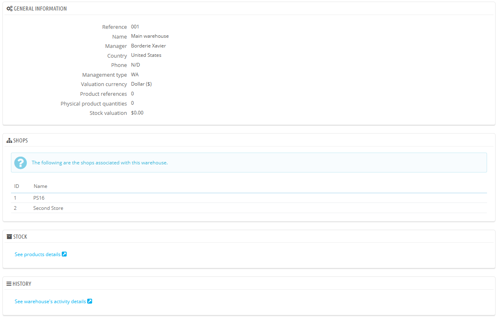

La page des détails d'un entrepôt contient également deux liens :

* **Voir les détails du produit**. Vous amène à la page "Etat instantané du stock" de l'entrepôt.
* **Voir les détails de l'activité de cet entrepôt**. Vous amène à la page "Mouvement de Stock" de l'entrepôt.

## Gestion du stock 

Maintenant que vous avez créé votre ou vos entrepôts, il faut initialiser le stock pour chacun d'eux. Pour cela, allez dans la page "Gestion du stock" du menu "Stock".

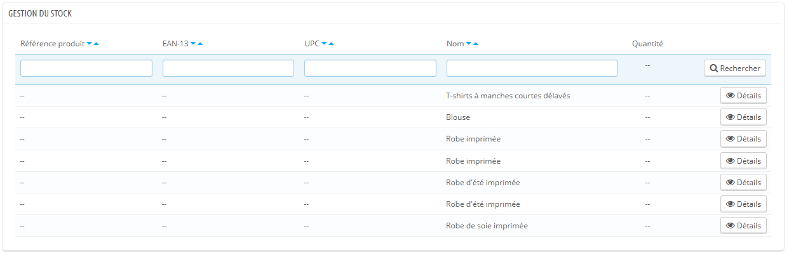

Tous les produits disponibles dans votre catalogue sont listés dans cette interface. Pour les éventuelles déclinaisons, il est possible de les gérer en utilisant l'action "Détails".

Selon le cas, vous pouvez modifier manuellement votre stock grâce à cette interface :

* **Ajouter du stock**. Ajouter du stock pour un produit dans un entrepôt donné.
* **Retirer du stock**. Retirer du stock pour un produit dans un entrepôt donné.
* **Transférer du stock**. Transférer du stock d'un entrepôt à un autre.

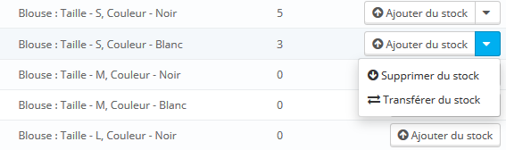

Les deux dernières actions n'apparaissent que s'il y a déjà du stock du produit en question dans l'un des entrepôts.\
L'action "Transférer du stock" n'apparaît que si vous avez au moins deux entrepôts enregistrés.

### Ajouter du stock à un entrepôt 

Pour ajouter du stock, utilisez l'action "Ajouter du stock" (flèche vers le haut) en relation avec le produit ou déclinaison de produit souhaitée. Une page s'ouvre, où les informations importantes du produit sont rappelées afin de l'identifier de façon certaine (référence, codes EAN-13 et UPC et dénomination). Cette information ne peut pas être changée dans ce formulaire, donc elle est grisée.

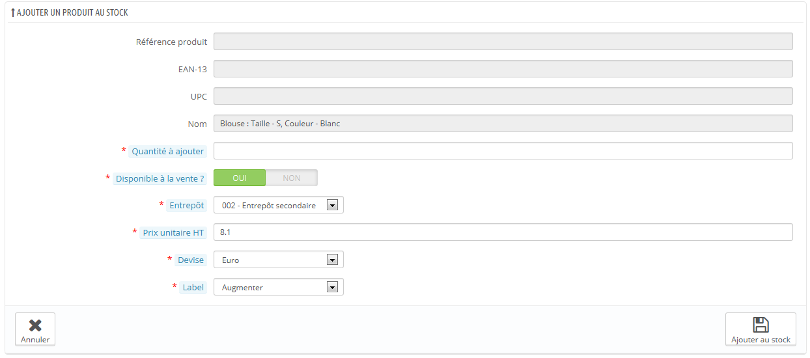

Vous devez alors spécifier :

* **Quantité à ajouter**. Le nombre doit être positif. Vous ne pouvez pas enlever de la quantité en utilisant un nombre négatif.
* **Disponible à la vente ?**. Si cette quantité de stock est utilisable en boutique ou bien simplement entreposée et réservée à un usage ultérieur.
* **Entrepôt**. L'entrepôt dans lequel le produit doit être ajouté. Le formulaire ne vous laisse ajouter du stock de ce produit que dans un entrepôt à la fois. Si vous devez ajouter du stock de ce produit dans plus d'un entrepôt, vous devez reprendre tout le processus d'ajout pour chaque entrepôt.
* **Prix unitaire HT**. Le prix unitaire du produit au moment de l'ajout en stock (pour la valorisation).
* **Devise**. La devise du prix unitaire. Si la devise n'est pas disponible, vous pouvez la créer dans la page "Devises" du menu "Localisation", ou importer une devise depuis la page "Localisation" de ce même menu, en important le pack de localisation du pays de la devise que vous voulez utiliser.
* **Label**. Un libellé pour le mouvement de stock généré, pour référence future. C'est purement informatif.

En survolant avec votre curseur les champs "Quantité à ajouter" et "Prix unitaire HT", vous aurez un rappel des valeurs saisies lors du dernier ajout.

Tout ce qui est lié aux valorisations est géré automatiquement selon le mode de gestion choisi dans chaque entrepôt. De même pour les conversions de devises.

### Retirer du stock d'un entrepôt 

Lorsque vous voulez retirer une certaine quantité de stock d'un produit, vous devez utiliser l'action "Supprimer du stock" (flèche vers la bas, disponible uniquement quand il y a déjà des produits en stock). Une nouvelle page s'ouvre, contenant un formulaire où est affichée les informations les plus importantes, afin de vous aider à identifier le produit avec certitude (référence, codes EAN13 et UPC, et son nom). Ces informations ne peuvent pas être changées depuis ce formulaire, donc elles sont grisées.

Vous devez alors spécifier :

* **Quantité à supprimer**. Le nombre doit être positif. Vous ne pouvez pas supprimer de la quantité en utilisant un nombre négatif.
* **Utilisable à la vente**. Si cette quantité doit être retirée parmi celles utilisables en boutique ou parmi l'ensemble du stock (y compris les quantités réservées).
* **Entrepôt**. Dans quel entrepôt retirer cette quantité. Le formulaire ne vous laisse retirer du stock de ce produit que dans un entrepôt à la fois. Si vous devez retirer du stock de ce produit dans plus d'un entrepôt, vous devez reprendre tout le processus de retrait pour chaque entrepôt.
* **Label**. Un libellé pour le mouvement de stock généré, pour référence future. C'est purement informatif.

Tout ce qui est lié aux valorisations est géré automatiquement selon le mode de gestion choisi dans chaque entrepôt. De même pour les conversions de devises.

### Transférer du stock d'un entrepôt à un autre 

Le transfert de stock permet de transférer des produits d'un entrepôt à un autre, ou d'un état à l'autre (utilisable en boutique / réservé) au sein du même entrepôt. Vous devez utiliser l'action "Transférer du stock" (flèches transversales, disponible uniquement s'il y a déjà du stock de ce produit). Une page s'ouvre, où les informations importantes du produit sont rappelées afin de l'identifier de façon certaine (référence, codes EAN13 et UPC et dénomination). Cette information ne peut pas être changée dans ce formulaire, donc elle est grisée.

Vous devez alors spécifier :

* **Quantité à transférer**. Le nombre doit être positif.
* **Entrepôt d'origine**. L'entrepôt "source", depuis lequel vous souhaitez transférer des produits, ou dans lequel vous souhaitez modifier l'état de certains stocks.
* **Disponible à la vente dans l'entrepôt d'origine?**. Si la quantité à retirer de l'entrepôt "source" doit l'être parmi celles utilisables en boutique ou parmi celles réservées
* **Entrepôt destinataire**. L'entrepôt "cible", vers lequel vous souhaitez transférer des produits. Si vous voulez simplement modifier l'état de certains stocks dans votre entrepôt "source", faites attention de bien choisir le même entrepôt en source comme en destination.
* **Disponible à la vente dans l'entrepôt destinataire ?**. Si la quantité à ajouter dans l'entrepôt "cible" est utilisable en boutique ou réservée. C'est également l'option à utiliser lorsque vous souhaitez simplement modifier l'état d'une partie de votre stock dans l'entrepôt "source" :
  * Si vous ne voulez pas changer l'état lors d'un transfert entre deux entrepôt : assurez-vous que les deux réglages "Disponible à la vente ?" sont identiques.
  * Si vous souhaitez changer l'état, que ce soit au sein d'un même entrepôt ou lors d'un transfert entre deux entrepôts : assurez-vous que les deux réglages "Disponible à la vente ?" sont différents.

Tout ce qui est lié aux valorisations est géré automatiquement selon le mode de gestion choisi dans chaque entrepôt. De même pour les conversions de devises.

## Mouvements de stocks 

Cette interface permet de consulter l'historique des mouvements de stocks. Il est possible d'afficher tous les mouvements de stocks ou bien ceux liés à un entrepôt. Des filtres peuvent être appliqués pour affiner votre recherche.

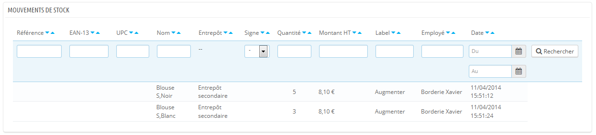

Quand la sélection "Filtrer les mouvements par entrepôt" est sur un entrepôt, il est possible d'exporter en CSV la liste ainsi obtenue.

## État instantané du stock 

Cette interface permet d'obtenir un aperçu précis de votre stock, que ce soit globalement ou par entrepôt. Les nombres affichés sont corrects à l'affichage de la page.

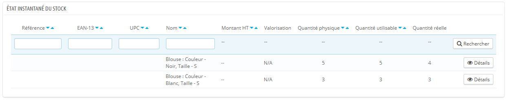

Pour chaque produit ou déclinaison de produit, les indicateurs suivants sont disponibles :

* Prix unitaire (HT).
* Valorisation du produit en fonction de la quantité physique de stock.
* Quantité disponible en stock.
* Stock disponible à la vente.
* Quantité réelle (comme expliqué précédemment).

En fonction de la méthode de valorisation choisie, la répartition des prix unitaires et des valorisations associées est disponible en cliquant sur l'action "Détails" (icône "+").

De plus, pour un entrepôt donné, vous disposez de deux moyens d'exporter la liste affichée au format CSV :

* Exporter les indicateurs liés aux quantités.
* Exporter les indicateurs liés aux valorisations (prix).

## Couverture de stock 

Cette interface vous permet de consulter la couverture de votre stock. Celle-ci indique le nombre de jours de consommation que le stock peut couvrir. Cette information est utile pour prévoir à l'avance les réapprovisionnements nécessaires. Elle est calculée en fonction des mouvements précédemment enregistrés.

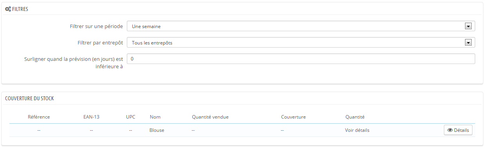

Vous pouvez consulter la couverture de stock pour l'ensemble des entrepôts ou pour un entrepôt en particulier.\
&#x20;Vous pouvez aussi choisir la période (une semaine, deux semaines, trois semaines, un mois, six mois et un an) sur laquelle les mouvements de stocks enregistrés seront pris en compte pour le calcul de la couverture.\
&#x20;Enfin, vous pouvez mettre en évidence le stock dont le nombre de jours de consommation est inférieur à une valeur (en jours) saisie. Cela surlignera les produits concernés afin de les identifier rapidement.

Pour obtenir la couverture de stock des déclinaisons d'un produit, il vous faudra utiliser l'action "Détails" pour le produit souhaité.

Enfin, il est possible de recevoir des alertes sur la couverture de stock d'un produit. Le module de notification par e-mails (mailalerts) peut prendre en compte la couverture du stock. Il est donc possible de donner un nombre de jours de couverture à partir desquels vous recevrez une notification. Lisez la documentation de ce module.

## Commandes aux fournisseurs 

L'une des fonctionnalités majeure de la gestion des stocks est la possibilité de passer des commandes à des fournisseurs afin de gérer les réapprovisionnements.\
&#x20;Cette interface vous permet de gérer l'ensemble de vos commandes à vos fournisseurs, ainsi que des modèles de commandes réutilisables.

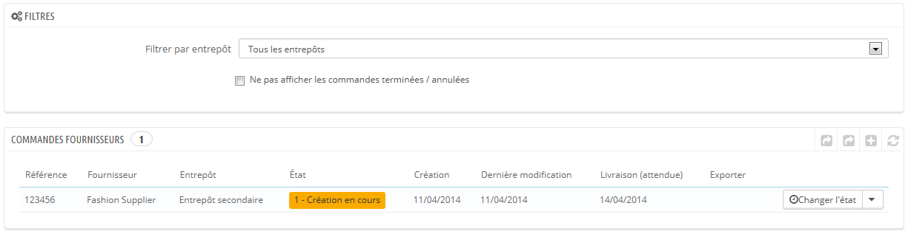

La création d'un modèle de commande fonctionne comme la création d'une commande (excepté le champ "Date de livraison"). Seul le processus de création d'une commande sera donc expliqué.

### Création d'une commande 

La création d'une commande à un fournisseur se décompose en deux étapes : créer la commande, puis y ajouter des produits.

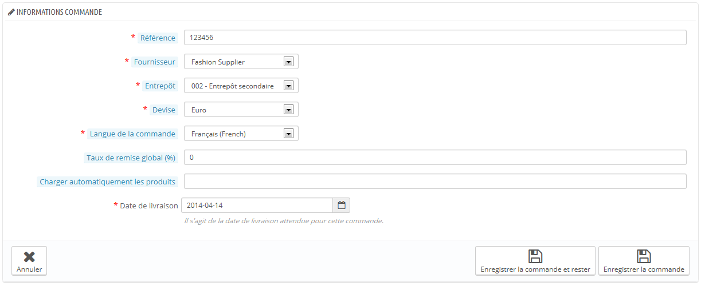

Commencez donc par définir les entêtes de la commande :

* Spécifiez une référence unique. Il s'agit d'une référence administrative ; n'utilisez donc pas un nombre qui vous semble unique.
* Sélectionnez un fournisseur. Si le fournisseur désiré n'est pas dans la liste déroulante, vous devez le créer en passant par la page "Fournisseurs" du menu "Catalogue".
* Sélectionnez un entrepôt pour la réception de la commande. Vous devez avoir déjà créé au moins un entrepôt.
* Sélectionnez une devise dans laquelle sera formalisée la commande. Si besoin est, vous pouvez créer ou importer une devise, en passant respectivement par les pages "Devises" ou "Localisation" du menu "Localisation".
* Sélectionnez une langue dans laquelle sera formalisée la commande. Si besoin est, vous pouvez créer ou importer une langue, en passant par respectivement par les pages "Langues" ou "Localisation" du menu "Localisation".
* Si besoin est, spécifiez une remise globale sur la commande en pourcentage. Vous pouvez laisser le champ à "0" si vous n'avez pas de remise sur cette commande.
* Si besoin, spécifiez la quantité physique d'un produit en dessous de laquelle tous les produits doivent être réapprovisionnés, et donc ajoutés automatiquement à la commande. Chaque produit pré-ajouté aura comme quantité à commander la quantité saisie retranchée de la quantité déjà disponible.
* Spécifiez une date prévisionnelle de livraison.

La seconde étape consiste à ajouter des produits à la commande. Pour réaliser cette seconde étape, vous pouvez soit :

* Cliquez sur le bouton "Enregistrer la commande et rester".
* Cliquez sur le bouton "Enregistrer". Vous êtes alors ramené à la liste des commandes fournisseurs : cliquez sur l'action "Modifier" de la commande que vous venez de créer.

L'interface du formulaire de création de commande a été mise à jour pour présenter un second formulaire sous les champs déjà remplis. Vous devez utiliser ce second formulaire pour ajouter des produits à votre commande, à l'aide du moteur de recherche intégré. Les produits que vous ajoutez apparaissent dans une nouvelle liste.

Pour chaque produit, il convient de spécifier ou mettre à jour le prix d'achat unitaire hors taxes, la quantité à commander, un éventuel taux de taxe applicable, et une éventuelle remise spécifique pour ce produit.

Une fois que la commande est créée, elle apparaît dans la liste avec l'état "Création en cours". Cet état vous permet d'afficher et de modifier les informations que vous avez saisies ainsi que d'ajouter des produits à la commande. Vous ne pourrez pas modifier la commande une fois que vous aurez passé son état à "Commande validée".

Il est impossible de supprimer une commande fournisseur : vous ne pouvez que l'annuler.

Une fois la commande créée, vous devez continuer le processus, en indiquant les changements d'état dans l'interface de PrestaShop. C'est à cela que sert le premier bouton d'action de la liste. Cliquez sur l'icône "Modifier l'état" pour ouvrir le formulaire de changement d'état. Lisez la section "Changer l'état d'une commande fournisseur" ci-dessous pour avoir plus d’information.

### Création d'un modèle de commande 

L'intérêt du modèle est qu'il sert de base pour générer une commande fournisseur.

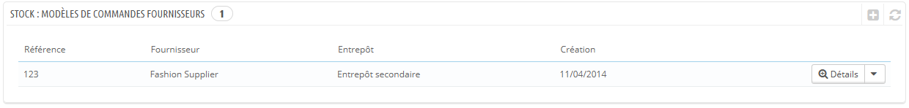

Le processus de création d'un modèle de commande fournisseur est le même que celui d'une commande, sauf que :

* Il n'est pas demandé de spécifier une date prévisionnelle de livraison.
* la valeur saisie pour "Charger automatiquement les produits" sera la quantité à commander pour les produits chargés et non le différentiel stock / valeur saisie.

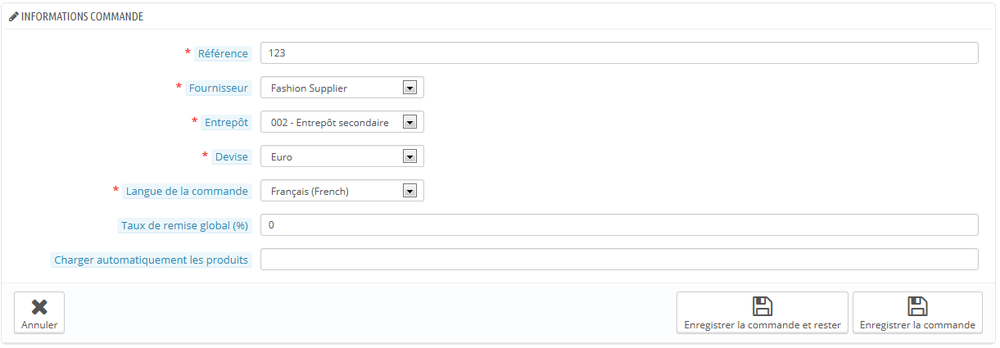

Par ailleurs, contrairement à une commande fournisseur normale :

* Un modèle ne possède pas d'état.
* Un modèle peut être supprimé.
* Un modèle n'a pas d'historique de modifications.

Une fois que vous avez créé le modèle, il suffit d'utiliser l'action "Utiliser ce modèle pour créer une commande fournisseur" (l'icône "deux fenêtres") pour lancer la création d'une commande.

### Changer l'état d'une commande fournisseur 

Chaque commande dispose de plusieurs actions. L'une d'entre elles vous permet de modifier l'état. Il y a six différents états possibles par défaut, mais vous pouvez ajouter les vôtres (lire la section "Configuration") de ce chapitre.

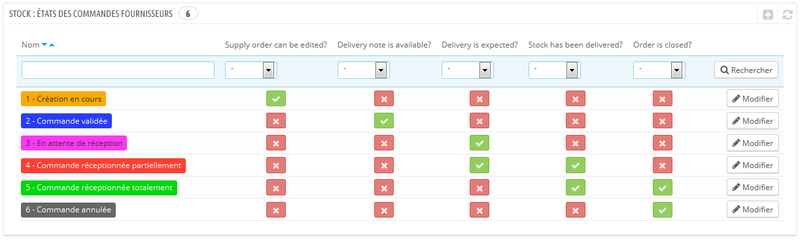

Un état de commande vous aide à comprendre le mouvement de votre stock en un coup d'oeil grâce à leur code couleur. Voici la signification des six états par défaut :

1. **Création en cours**. C'est l'étape de création de la commande où il est possible de tout modifier à volonté.
2. **Commande validée**. Cet état valide la commande et fige les informations y figurant (prix d'achat, quantités, ...). À cette étape, une nouvelle action apparaît dans la colonne Actions, qui permet d'éditer au format PDF le bon de commande à envoyer au fournisseur.
3. **En attente de réception**. Dès que le fournisseur a reçu votre bon de commande et validé celui-ci, vous devez passer la commande à l'état "En attente de réception".
4. **Commande réceptionnée partiellement**. Dès qu'une première réception de produit à lieu, vous devez passer la commande dans cet état. Des réceptions multiples sont possibles et un historique est conservé pour chaque produit. A chaque réception, le stock est automatiquement incrémenté.
5. **Commande réceptionnée totalement**. Lorsqu'une commande est réceptionnée complètement ou partiellement suite à une annulation partielle, il faut la passer dans cet état. Les stocks ne seront donc plus affectés à ce niveau et il n'est plus possible de faire d'actions sur la commande.
6. **Commande annulée**. Cet état concerne les commandes annulés peu importe la raison. Les stocks ne seront donc plus affectés à ce niveau et il n'est plus possible de faire d'actions sur la commande.

À chaque changement d'état, l'interface de changement d'état évolue afin de proposer uniquement les états possibles en fonction de l'état en cours. Les états qui ne sont pas disponibles sont grisés.

### Détails d'une commande fournisseur 

En cliquant sur l'action "Voir" de la liste des commandes, vous pouvez avoir une vision synthétique de votre commande.\
Vous pouvez également télécharger le bon de commande généré en PDF (a condition que vous aviez validé la commande) depuis la liste de commandes ou depuis la page de changement d'état.

L'action "Détails" vous permet d'afficher l'historique de changement d'état pour la commande en cours.

### Enregistrement d'une réception de produits 

Vous devez changer l'état de votre commande fournisseur au sein de PrestaShop dès que des actions sont prises dans le monde réel. Pour ce faire, utilisez l'icône "Changer l'état" dans le colonne "Actions" de la liste de commandes. Le formulaire de cette page pré-sélectionne toujours l'état logique suivant, mais vous pouvez choisir n'importe lequel des états disponibles.

Tandis que vous préparez la commande fournisseur, laissez son état sur "Création en cours". Une fois que vous avez terminé de préparer la commande, passez-la à "Commande validée", puis imprimez la commande PDF que vous enverrez à votre fournisseur. Dès que votre fournisseur a confirmé avoir reçu votre commande, passez l'état à "En attente de réception".

Durant les états "En attente de réception" et "Commande réceptionnée partiellement", une nouvelle action est rendue disponible dans la colonne "Actions". À l'aide de l'icône "camion", l'action "Mettre à jour les réceptions en cours" vous permet d'enregistrer la réception de produits dans un ordre donné durant la journée écoulée..\
Le formulaire qui s'ouvre après avoir cliqué sur cette action "camion" vous permet de voir combien d'articles sont attendus, et d'indiquer la quantité de produits livrés pour chaque produit durant cette journée. Cliquez sur le bouton "Mettre à jour la sélection" pour indiquer que les produits cochés ont bien été reçus, dans la quantité que vous avez indiquée avec le champ "Quantité reçue aujourd'hui ?". La case à gauche de chaque ligne doit être cochée pour que PrestaShop la prenne en compte.

Cette opération peut être faite autant de fois que nécessaire, et il est possible de recevoir et intégrer dans le stock plus de produits qu'attendu.

Si vous avez reçu moins de produits qu'attendu, PrestaShop passe automatiquement l'état de la commande à "Commande réceptionnée partiellement".

Pour chaque produit, un historique des réceptions est disponible (action "Détails" ou "+"), ainsi qu'une indication sur la quantité reçue, attendue, et restante. Si "quantité reçue" est égale à la "quantité attendue", la ligne correspondante sera affichée en vert. Si la "quantité reçue" est supérieure à la "quantité attendue", la ligne correspondante sera affichée en rouge.

Quand tous les produits d'une commande ont été reçus, vous devez manuellement changer l'état de la commande fournisseur pour "Commande réceptionnée totalement". Cela met fin au processus de commande fournisseur, et une nouvelle action d'export apparaît, que vous pouvez utiliser pour télécharger un fichier CSV contenant toutes les informations liées à cette commande.

### Import CSV 

Via l'interface dédiée aux imports CSV, il est possible d'importer des commandes et des produits à commander.

### Export CSV 

Via l'interface de commandes aux fournisseurs, il est possible de filtrer la liste des commandes ou les détails de ces commandes, à exporter, selon les filtres disponibles dans la liste (référence, fournisseur, etc.).\
&#x20;Par ailleurs, il est possible de ne pas afficher les commandes terminées ou annulées, à l'aide des cases à cocher appropriées.

## Configuration 

Cette interface permet de configurer et personnaliser :

* Les états possibles pour une commande à un fournisseur.
* Les libellés de mouvements de stocks.
* Les libellés par défaut pour certains mouvements de stocks utilisé de façon standard dans la solution.

### Ajouter un nouvel état de commande par défaut 

Il est possible d'ajouter des états personnalisés selon votre activité. Il n'est pas possible de supprimer les états par défaut.

La liste sur la page principale vous permet d'avoir une meilleure vision des états disponibles, et leur impact sur une commande.

Cliquez sur le bouton "Créer" pour atteindre le formulaire de création.

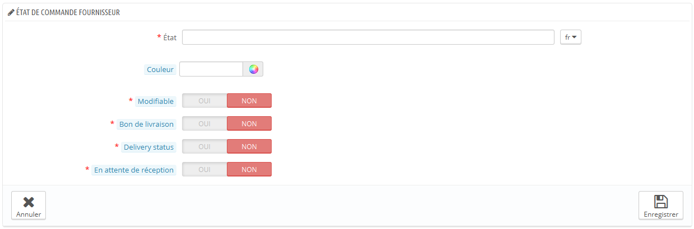

Un statut a un libellé, une couleur, et permet de définir si :

* La commande est modifiable. Tant que la commande est modifiable, vous ne pouvez pas l'envoyer au fournisseur.
* Le bon de commande peut être généré.
* Une réception de produits est en attente, ce qui signifie que vous n'avez pas reçu tous les produits commandés.
* Une réception de produits est en cours, ce qui signifie que vous attendez encore que vos produits arrivent.

### Ajouter un libellé de mouvements de stock 

Il est aussi possible d'ajouter des libellés de mouvements de stock. Cliquez sur le bouton "Créer" de la section "Libellés de mouvements de stock" pour ouvrir le formulaire de création.

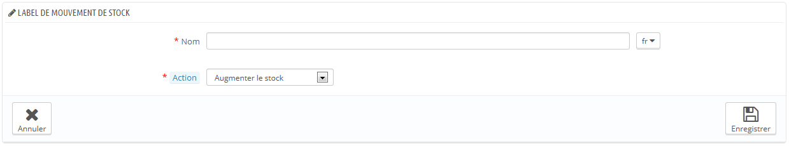

Il suffit de définir un libellé et spécifier s’il correspond à un ajout de stock ou un retrait de stock. Ces libellés seront utilisables lors d'un ajout/retrait/transfert de stock manuel (comme expliqué précédemment).

### Modifier les états des commandes fournisseurs 

Il est possible de choisir les états des commandes fournisseurs par défaut pour les cas standards suivants :

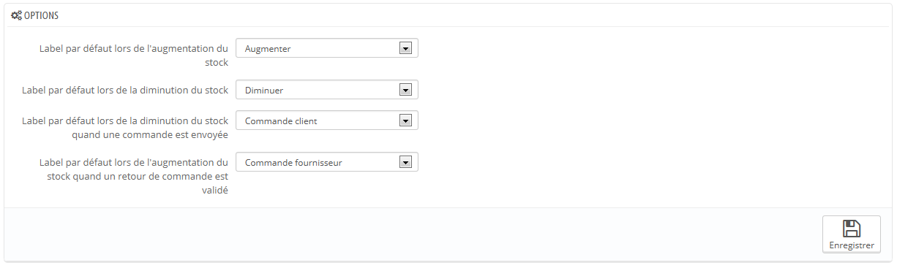

* Incrémentation du stock (manuellement).
* Décrémentation du stock (manuellement).
* Décrémentation du stock suite à l'expédition d'une commande d'un client.
* Incrémentation du stock suite à une réception de produit sur une commande fournisseur.
