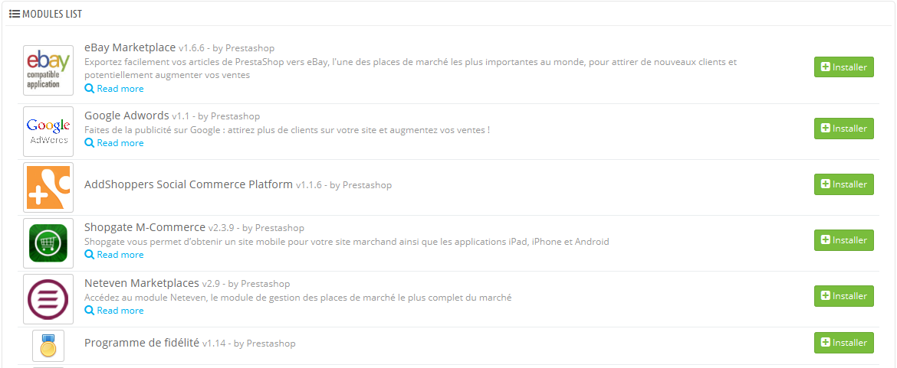

# Modules marketing

Cette page réunit en un même endroit les modules les plus importants en termes de marketing pour votre installation de PrestaShop. Elle sert de raccourci vers les modules de certaines catégories de la page "Modules".

Les modules de cette page viennent pour la plupart des catégories "Publicité et Marketing" et "Guides d'Achats" de la page "Modules".

Vous pouvez installer les modules directement depuis cette page. Quand vous cliquez sur le bouton "Installer", le module s'installe et vous êtes envoyé à la page "Modules", d'où vous pouvez ouvrir la configuration du module en cliquant sur son lien "Configurer". Vous pouvez également revenir à la page "Marketing" pour ouvrir la page de configuration du module, ou supprimer, désactiver, réinitialiser ou désinstaller le module, en fonction de son état.
