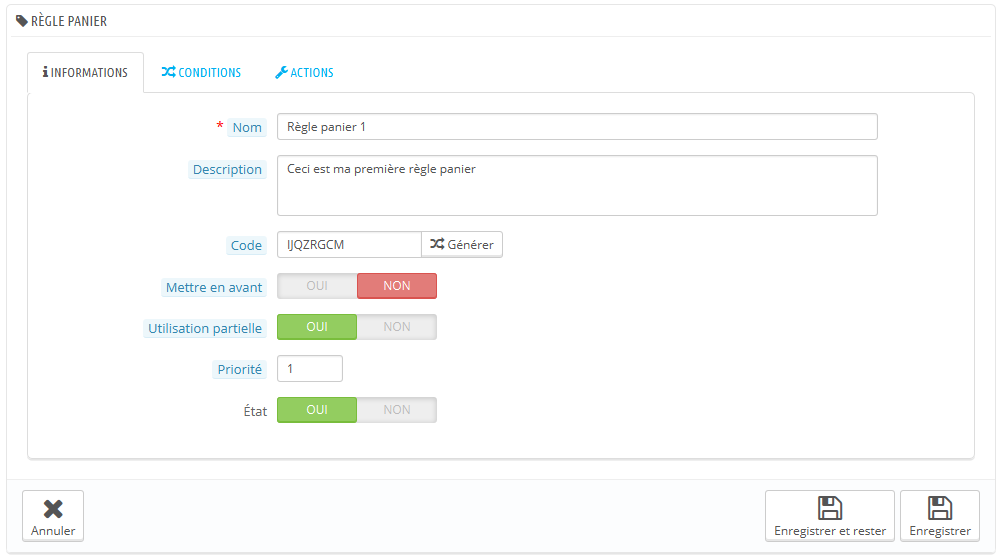
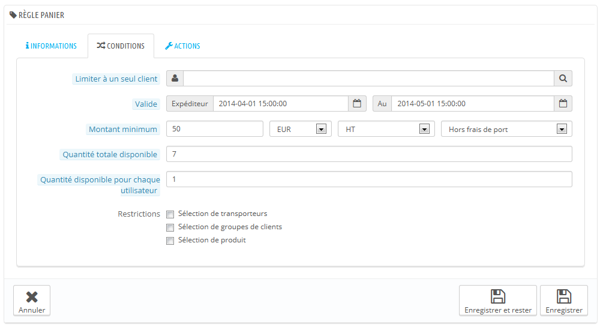
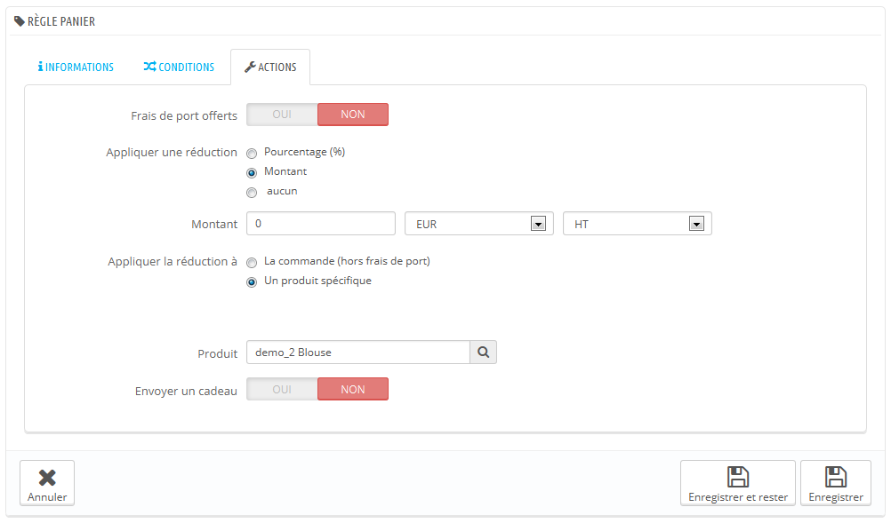
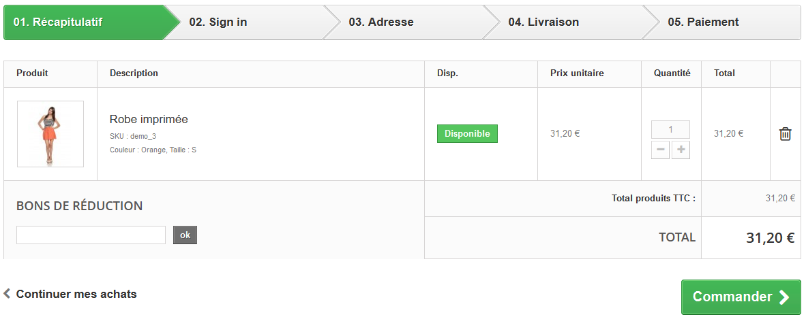

# Règles paniers

La page des règles paniers vous donne accès à un outil qui remplace et améliore le système de bons de réduction de PrestaShop 1.4. Les utilisateurs chevronné de PrestaShop ne seront pas surpris des fonctionnalités qui ont été ajoutées, mais devront s'adapter au nouveau nom : quand le présent guide mentionne les bons de réduction, il s'agit en fait des règles paniers – qui sont elles-mêmes bien différentes des avoirs.

La différence entre un avoir, un bon de réduction et une règle panier

Un avoir est avant tout une preuve écrite qu'un produit a été retourné. La plupart du temps, le client peut s'en servir comme d'un bon de réduction

Un bon de réduction est un code promotionnel qui n'a pas à être lié à un retour marchandise ou à un remboursement, et peut prendre plus de formes qu'un simple avoir :

* une réduction sur une commande (en pourcentage).
* une réduction sur une commande (un montant précis).
* la livraison gratuite.

Vous pouvez appliquer un bon de réduction à tous vos clients, ou un groupe de clients, ou à un seul client ; vous pouvez également lui donner une date d'expiration.

Une règle de panier est une version améliorée du bon de réduction : en plus de faire ce que pouvait faire un bon de réduction dans PrestaShop 1.4, le système règles paniers introduit avec PrestaShop 1.5 vous permet de :

* Donner un nom à la réduction.
* Autoriser le client à n'utiliser qu'une partie de la réduction.
* Mettre en place des priorités entre règles paniers.
* Indiquer la compatibilité entre règles paniers.
* Faire en sorte que la réduction ne fonctionne qu'avec certains transporteurs.
* Faire en sorte que la réduction ne fonctionne qu'avec une sélection de produits et/ou de catégories et/ou de marques et/ou de fournisseurs et/ou d'attributs... ou tous en même temps si nécessaire !
* Faire en sorte que la réduction comprenne la livraison gratuite et/ou une réduction sur la commande et/ou un produit gratuit... ou tous en même temps si nécessaire !

Dans ce guide, "règle panier" et "bons de réduction" sont synonymes et interchangeables.

La page "Règles paniers" liste les règles actuellement en place, que vous pouvez activer ou désactiver en cliquant sur les icônes de la colonne "État".

## Créer une nouvelle règle panier 

Un bon de réduction peut être créé automatiquement après un retour produit, mais vous pouvez en créer vous-même à n'importe quel moment, en le ciblant de manière très spécifique.

Le formulaire de création dispose de trois onglets, ce qui vous permet de construire vos règles et bons très précisément.

### L'onglet Information 

Le premier onglet, "Information", contient les identifiants et principaux réglages de la règle.

* **Nom**. Le nom apparaîtra pour le public, donc restez sobre.
* **Description**. La description n'est pas publique. Elle aide vos employés à mieux comprendre pourquoi cette règle a été créée.
* **Code**. Donnez à votre règle un code unique. Vous pouvez soit en créer un à la main (et donc en profiter pour le rendre lisible, par exemple 1BONPOURJACQUES), soit demander à PrestaShop de générer une chaîne unique en cliquant sur "Générer". Bien entendu, vous pouvez également utiliser n'importe quel générateur de chaîne (comme [http://www.random.org/strings/](http://www.random.org/strings/)).\
  Notez que si vous ne mettez pas de code en place, la règle s'appliquera à tout utilisateur correspondant aux autres conditions de la règle:
  * S'il y a un code, le client doit le saisir dans le champ dédié lors du processus de paiement.
  * S'il n'y a pas de code, la règle s'applique automatiquement à tous les clients pouvant en profiter.
* **Mettre en avant.** Si cette option est activée, PrestaShop indiquera au client qu'un bon d'achat correspondant au contenu de son panier est disponible et peut être utilisé.
* **Utilisation partielle**. Si cette option est désactivée, le bon ne peut être utilisé qu'une fois, même si son montant n'est pas totalement utilisé. Si elle est activée, un nouveau bon sera généré dans le cas où le bon utilisé n'est pas complètement utilisé.
* **Priorité**. Si un client (ou un groupe de clients) a droit à plus d'un bon, ou si plus d'un bon peuvent être appliqués à une commande, alors PrestaShop appliquera les bons un à un par ordre alphabétique. Vous pouvez changer cet ordre en mettant une priorité plus basse à votre bon. Par défaut, tous les bons ont une priorité de 1. Si vous réglez la priorité à un chiffre plus élevé, le bon sera appliqué après les bons ayant un chiffre plus bas.
* **État**. Vous pouvez désactiver et réactiver un bon quand vous l'estimez nécessaire.

### Onglet Conditions 

Le deuxième onglet, "Conditions", contient un large jeu de possibilités, vous permettant de cibler précisément qui pourra profiter de cette règle.

* **Limiter à un seul client**. C'est ici que vous indiquez si le bon que vous créez est destiné à un seul client. Par exemple, si vous avez un délai de livraison et que vous souhaitez faire un geste commercial, vous pouvez créer un bon pour ce client que lui ou elle seul peut utiliser. Pour rapidement trouver le client, saisissez les premières lettres de son prénom, nom ou adresse e-mail dans le champ textuel.\
  &#x20;Si ce champ reste vide, PrestaShop en comprendra que la règle s'applique à n'importe quel client... à moins que vous n'ayez spécifié un groupe de client comme condition supplémentaire (voir la case "Sélection de groupes de clients " plus bas).
* **Valide**. La validité par défaut est d'un mois, mais vous pouvez réduire ce délai à une semaine ou même une journée.
* **Montant minimum**. Le montant minimal d'une commande à partir duquel la règle s'applique. Le bon ne sera applicable que si la commande du client dépasse le montant indiqué. Vous pouvez choisir d'inclure ou non les taxes et frais de port dans ce montant.
* **Quantité totale disponible**. Vous permet de régler la quantité de bon générés : mettez soit "1" si le bon est destiné à un seul client, ou n'importe quel nombre si le bon est destiné aux premiers qui l'utilisent.
* **Quantité disponible par utilisateur**. Vous pouvez configurer le nombre de fois ou un bon peut être utilisé par un même utilisateur. Ce nombre doit être au moins égal à la quantité totale disponible ci-dessus.
  * Si ce nombre est inférieur que la quantité totale disponible, alors un seul client ne sera pas en mesure de tous les utiliser.
  * Laissez-le à "1" pour faire en sorte que chaque client ne puisse utiliser le bon qu'une fois. Dans ce cas, assurez-vous que le bon s'applique à un groupe plutôt qu'à un seul client.

Les cases à cocher en bas de la section sont très importantes, car elles vous aident à filtrer encore plus ce à quoi ou à qui la règle s'applique.

* **Sélection de transporteurs**. Vous pouvez faire en sorte que le client ne puisse accéder à cette règle que s'il choisit un transporteur spécifique pour ses colis.
* **Sélection de groupes de clients**. Une option très utile. Grâce à l'outil de création de groupes de PrestaShop, vous pouvez créer des réductions qui ne s'appliquent qu'à une sélection de clients, et y ajouter d'autres conditions à l'aide de l'outil de création de règles paniers.
* **Compatibilité avec les autres règles paniers**. Par défaut, une commande peut bénéficier de plusieurs règles de paniers simultanément. Avec cette option, vous pouvez indiquer à PrestaShop que cette règle ne peut pas être combinée à d'autres règles. Cette option n'apparaît que si vous avez déjà au moins une autre règle enregistrée.
* **Sélection de produit**. Un autre outil très utile, qui vous permet de créer des bons automatiques pour les commandes contenant certains produits précis. Cet outil est expliqué en détail ci-après.
* **Sélection de boutique**. Par défaut, une règle panier s'applique à toutes vos boutiques. Avec cette option, vous pouvez faire en sorte qu'une règle ne s'applique qu'à une sélection de vos boutiques.

L'option "Sélection de produit" ouvre un tout nouveau formulaire, et vous permet de créer non seulement des bons par produit, mais également par catégorie, par marque, par fournisseur et même par attribut. Qui plus est, vous pouvez combiner ces possibilités afin de préciser votre ciblage client autant que possible.

Par exemple, vous pouvez créer des bons automatiques pour vos clients de la forme "Achetez 3 produits Apple pour avoir la livraison gratuite !"\
&#x20;Il s'agit réellement d'un outil dans l'outil de création de règles paniers, et son usage est assez spécifique. Vous pouvez ajouter autant de sélection de produits que nécessaire en suivant le parcours suivant :

1. Cliquez sur le lien "Sélection de produit" pour ajouter une nouvelle section.
2. Indiquez le nombre de produits nécessaires pour que la réduction s'applique.
3. Ajoutez au moins une règle, du type que vous souhaitez : produits, attributs, catégories, marques, fournisseurs. Vous pouvez ajouter autant de règles par sélection de produit que vous le souhaitez, et même une seul par type si nécessaire.
4. En cliquant sur "OK", une nouvelle ligne est ajoutée à la sélection. Pour chaque type, vous devez donner des détails sur le contenu auquel la règle s'applique. Cliquez sur le lien "Choisir" et une fenêtre s'ouvre listant le contenu disponible pour ce type (produits, catégories...). Déplacez le contenu du panneau de gauche à celui de droite en utilisant le bouton "Ajouter, puis fermez la fenêtre en cliquant sur le "X" en haut à droite de celle-ci. Si un seul contenu est sélectionné, le champ du contenu affichera son nom ; autrement, il indiquera le nombre de contenus sélectionnés.

Vous pouvez ajouter autant de règles que nécessaire au sein d'une sélection. Ces règles s'accumulent : soit elles s'appliquent toutes, soit la promotion n'est pas appliquée.

Les sélections de produits fonctionnent indépendamment : vous pouvez en ajouter autant que nécessaire, et elles n'auront aucun impact entre elles. Cela vous permet de créer tout un ensemble de produits auxquels la règle panier s'applique.

### Onglet Actions 

Le troisième et dernier onglet, "Actions", vous permet de décider de la promotion elle-même.

* **Frais de port offerts**. Cette règle offre les frais de port aux utilisateurs qui peuvent l'appliquer.
* **Appliquer une réduction**.
  * **Pourcentage (%)**. Cette règle applique un pourcentage du prix total de la commande. Par exemple, admettons que la commande coûtera 200€ avant l'application des taxes. Si l'on donne à la règle une valeur de 15%, les clients bénéficiant de la règle ne paieront plus que 170€ (avant les taxes et les frais de port).
  * **Montant**. Cette règle applique une réduction monétaire sur la commande totale. Par exemple, supposons que la commande coûte 200€ avant l'application des taxes. Si l'on donne à la règle une valeur de 20€, les clients bénéficiant de la règle ne paieront plus que 180€ (avant les taxes et les frais de port).
  * **Aucune**. La règle n'applique aucune réduction sur la commande. Choisir cette option fait disparaître la section suivante, "Appliquer la réduction à".
* **Appliquer la réduction à**.
  * **La commande (hors frais de port)**. La commande s'applique à toute la commande.
  * **Un produit spécifique**. Vous pouvez choisir le produit spécifique auquel la réduction s'applique : saisissez les premières lettres du produit, et choisissez dans la liste les noms correspondants.
  * **Le produit le moins cher**. Disponible uniquement pour l'option "En pourcentage (%)".
  * **Le(s) produit(s) sélectionné(s)**. Le client peut choisir à quels produits la réduction doit être appliquée. Disponible uniquement pour l'option "En pourcentage (%)".
* **Envoyer un cadeau**. Vous pouvez choisir d'offrir un cadeau sous certaines conditions (et donc ne pas faire de réduction). Un champ apparaît : saisissez les premières lettres du produit, et choisissez dans la liste les noms correspondants.

Une fois que vous avez tout enregistré, vous pouvez envoyer le code du bon à vos clients, ou laisser le système des règles paniers s'en occuper automatiquement, selon vos réglages.

Le bon apparaîtra dans la page "Règles paniers" du menu "Promotions". Vous pouvez l'effacer ou le modifier quand vous le souhaitez. Si le bon est configuré pour un groupe ou un client en particulier, alors il apparaîtra sur le front-office, dans la section "Mes bons de réduction" du compte de l'utilisateur ainsi que dans le panier (s'il le souhaite). Ils peuvent alors choisir quel bon appliquer à leur commande.

Les règles paniers qui s'appliquent à tous les utilisateurs n'apparaissent pas dans la page "Mes bons de réduction" du client : il doit les connaître afin de les appliquer. Il vous revient de les tenir au courant des promotions publiques.

Afin d'appliquer une règle panier, le client doit se rendre dans son panier et saisir le bon dans le champ "Bon de réduction" et cliquer sur "Ajouter". Le client ne pourra pas appliquer le bon si l'achat est déjà validé.

Une fois appliqué, le résumé du panier affiche l'impact du bon sur le montant de la commande.

