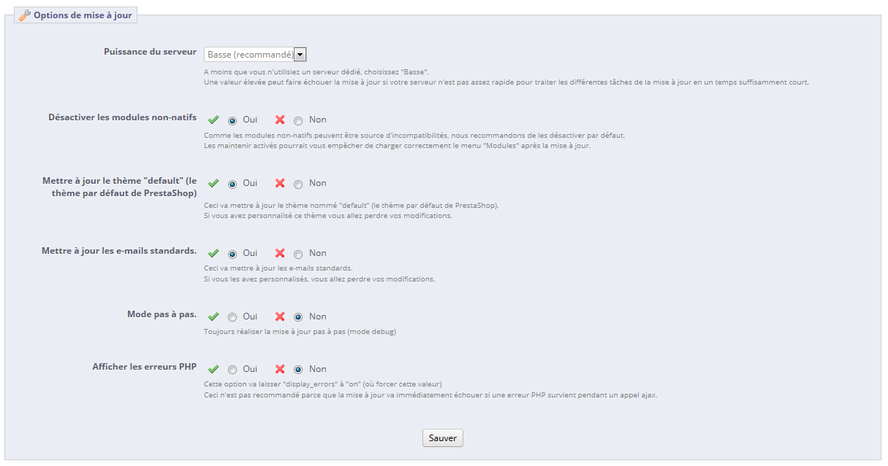

# Mise à jour automatique

**Contenu**

* [Mise à jour automatique](mise-a-jour-automatique.md#Miseàjourautomatique-Miseàjourautomatique)
  * [Télécharger et installer le module "Mise à jour en 1 clic"](mise-a-jour-automatique.md#Miseàjourautomatique-Téléchargeretinstallerlemodule%22Miseàjouren1clic%22)
  * [L'écran de configuration](mise-a-jour-automatique.md#Miseàjourautomatique-L%27écrandeconfiguration)
  * [Le processus de mise à jour](mise-a-jour-automatique.md#Miseàjourautomatique-Leprocessusdemiseàjour)
  * [Revenir à la version précédente : la section restauration](mise-a-jour-automatique.md#Miseàjourautomatique-Reveniràlaversionprécédente:lasectionrestauration)

## Mise à jour automatique <a href="#miseajourautomatique-miseajourautomatique" id="miseajourautomatique-miseajourautomatique"></a>

L'outil de mise à jour automatique de PrestaShop permet aux propriétaires de boutiques de sauvegarder et mettre à jour leur site en quelques clics, et ce sans connaissance technique.

Le module "Mise à jour un 1 clic" devait être disponible par défaut dans votre page "Modules" (dans la catégorie "Administration") : cliquez simplement sur son bouton d'installation, et vous pourrez l'utiliser pour passer à la dernière version de PrestaShop.

Vous ne devriez jamais mettre à jour votre boutique directement. L'outil de mise à jour automatique peut ne pas fonctionner dans certaines situations, et il se peut que vous ne puissiez pas revenir en arrière.

La méthode la plus sûre consiste à avoir à disposition une copie exacte de votre boutique, que ce soit sur votre propre ordinateur ou dans un autre dossier de votre hébergement web. Cette copie doit contenir tous vos produits, vos catégories, vos thèmes, vos modules, vos traductions, vos réglages, etc.

Faites une mise à jour d'essai sur cette copie de votre boutique. Une fois la mise à jour faite, parcourez toutes les pages de votre front-office et de votre back-office afin de vous assurer que tout est bien à sa place. Si ce n'est pas le cas, alors l'outil de mise à jour automatique fonctionne mal avec votre configuration. Vous pouvez utiliser la méthode de mise à jour manuelle, qui est normalement déconseillée et prend beaucoup plus de temps, mais qui peut marcher dans votre situation.

### Télécharger et installer le module "Mise à jour en 1 clic" <a href="#miseajourautomatique-telechargeretinstallerlemodule-miseajouren1clic" id="miseajourautomatique-telechargeretinstallerlemodule-miseajouren1clic"></a>

Si le module d'autoupgrade n'est pas disponible dans votre installation de PrestaShop 1.4 ou 1.5, vous pouvez le télécharger gratuitement depuis le site Addons.

Même si vous avez déjà installé le module "Mise à jour en 1 clic", assurez que vous utilisez bien sa dernière version :

* PrestaShop 1.4 : vérifiez le numéro de version dans l'onglet "Modules", puis comparez-le à celui en ligne sur le site Addons (voir ci-dessous). Si les numéros de versions diffèrent, téléchargez-le et mettez-le à jour.
  * Pour mettre à jour le module : désinstallez-le et supprimez-le depuis l'administration de PrestaShop, puis copiez le dossier "/autoupgrade" de l'archive du module (téléchargée depuis le site Addons) vers le dossier "/modules" de votre installation de PrestaShop. Enfin, installez le module dans votre administration.
* PrestaShop 1.5 et versions suivantes : PrestaShop vérifiera automatiquement l'existence de nouvelles versions de vos modules sur le site Addons. Si une nouvelle version est disponible, PrestaShop affichera le bouton "Mettre à jour !" à côté du bouton "Installer/Désinstaller". Cliquez-le pour que PrestaShop télécharge et mette à jour le module pour vous.

Pour installer le module de mise à jour automatique, suivez simplement le processus normal d'installation d'un module PrestaShop :

1. Téléchargez le module 1-Click Upgrade depuis PrestaShop Addons : [http://addons.prestashop.com/fr/outils-administration-modules-prestashop/5496-autoupgrade.html](http://addons.prestashop.com/fr/outils-administration-modules-prestashop/5496-autoupgrade.html) sur votre ordinateur.
2. Dans le back-office de PrestaShop, allez dans la page "Modules" du menu du même nom.
3.  Cliquez sur le bouton "Ajouter un module", situé en haut à droit de la liste des modules disponibles.

    Si vous mettez à jour à partir de la version 1.4, cliquez sur le lien "Ajouter un module depuis mon ordinateur", situé en haut à gauche.
4. Dans le formulaire qui s'ouvre, cliquez sur le bouton "Naviguer...", puis trouver et sélectionner le fichier Zip du module qui vous venez de télécharger.
5. Cliquez sur le bouton "Mettre ce module en ligne". PrestaShop enverra le module sur votre serveur, le décompressera, et placera ses fichiers dans le dossier `/modules`.

Le module est maintenant disponible dans votre liste de modules (dans la catégorie "Administration"), mais il vous faut encore l'installer :

1. Dans la page des modules, trouvez le module "Mise à jour en 1 clic" : saisissez "Mise à jour en 1 clic" ou "autoupgrade" dans le moteur de recherche de modules (pas dans le moteur de recherche global situé en haut de l'écran). Un lien direct vers le module devrait apparaître dès les premières lettres. Cliquez-le.
2. PrestaShop affiche ensuite le module dans la liste principale.
3. Cliquez sur le bouton "Installer" du module.

Le module est maintenant prêt à être configurer et utiliser.

### L'écran de configuration <a href="#miseajourautomatique-lecrandeconfiguration" id="miseajourautomatique-lecrandeconfiguration"></a>

L'écran de configuration du module s'ouvre à partir de la catégorie "Administration" de la liste de modules, en cliquant sur le lien "Configuration" du module.

L'écran de configuration peut également se trouver :

* PrestaShop 1.4 : sous l'onglet "Outils", dans le sous-onglet "1-Click Upgrade".
* PrestaShop 1.5 : dans le menu "Paramètres avancés", page "1-Click Upgrade".

Cet écran vous présente une série de sections vous donnant accès à des informations, des outils et de réglages.

#### Bienvenue <a href="#miseajourautomatique-bienvenue" id="miseajourautomatique-bienvenue"></a>

Cette courte section sert de rappel : une mise à jour n'est jamais totalement sûre, et vous devriez donc vous assurez avant toute chose d'avoir à votre disposition une sauvegarde complète et récente de vos fichiers et vos données. Ainsi, si la mise à jour devait échouer, vous seriez toujours en mesure de remettre votre boutique dans son état initial – moyennant un peu de travail pour remettre en place vos fichiers et données sauvegardés.


Notez que le module de mise à jour réalise ses propres sauvegardes afin de vous permettre de revenir en arrière après une mise à jour. Nonobstant, vous devriez toujours faire vos propres sauvegardes.

#### La liste des points à vérifier avant la mise à jour <a href="#miseajourautomatique-lalistedespointsaverifieravantlamiseajour" id="miseajourautomatique-lalistedespointsaverifieravantlamiseajour"></a>

La section "La liste des points à vérifier avant la mise à jour" vous donne de précieuses informations sur votre installation actuelle de PrestaShop, et la manière dont elle pourrait fonctionner avec l'outil de mise à jour.


Vous devez vous assurer que les différents points de contrôle sont validés avant de lancer la mise à jour.

* **Le module de mise à jour en 1 clic est à jour (votre version est vx.x.x)**. Si vous venez de le télécharger, il est probable que vous avez la toute dernière version.\
  &#x20;Si vous ne disposez effectivement pas de la dernière version du module, un bouton apparaîtra, nommé "Installer la dernière version en cliquant sur 'Ajouter depuis mon ordinateur'". En le cliquant, vous arriverez à la page "Modules". De là, cliquez sur le lien "Ajouter un module depuis mon ordinateur" pour afficher le formulaire pré-rempli. Cliquez sur le bouton "Téléchargez ce module" pour lancer sa mise à jour. Enfin, retournez sur la page de configuration du module 1-Click Upgrade pour continuer vos vérification d'avant la mise à jour.
* **Le dossier racine de votre boutique doit être accessible en écriture (permissions CHMOD appropriées)**. Si les permissions de lecture/écriture ne sont pas bien en place, vous devrez les corriger, à l'aide d'un client FTP tel que FileZilla.\
  &#x20;Vous trouverez plus d'information sur le CHMOD dans la section "Compatibilité système et configuration système" du Guide de démarrage.
* **L'option "Safe mode" de PHP doit être désactivée**. Le Safe Mode de PHP est une fonctionnalité obsolète du langage, et qui ne devrait plus être utilisée. Vous devez mettre à jour la configuration PHP de votre serveur, ou demander à votre hébergeur de le faire pour vous.
* **La directive PHP "allow\_url\_fopen" doit être activée ou alors CURL doit être installé**. PrestaShop a besoin d'aller télécharger l'archive de la nouvelle version sur les serveurs du projet, et il ne peut pas le faire si PHP n'a pas l'autorisation explicite de le faire, via la directive `allow_url_fopen`. Vous devez mettre à jour la configuration PHP de votre serveur, ou demander à votre hébergeur de le faire pour vous.
* **Vous devez mettre votre boutique en maintenance**. Votre boutique doit être en maintenance durant l'intégralité du processus (sauvegarde des fichiers et de la base de données, mise à jour automatique, vérification), ce afin d'éviter que vous clients ne perdent leur commande... et que vous perdiez des clients. Le module peut désactiver votre boutique pour vous : cliquez simplement sur le bouton "Cliquez ici pour mettre votre boutique en mode maintenance". Vous pouvez également choisir de désactiver la boutique vous-même, en passant par la page des préférences de la boutique :
  * PrestaShop 1.4 : désactivez la boutique dans l'onglet "Préférences".
  * PrestaShop 1.5 : désactivez la boutique dans la page "Maintenance" du menu "Préférences".
* **Vous devez désactiver toutes les fonctionnalités de cache de PrestaShop**. Vous devez les désactiver pour l'intégralité du processus. Le module ne le fera pas à votre place.
  * PrestaShop 1.4 : désactivez le cache dans la page "Performances", sous l'onglet "Préférences".
  * PrestaShop 1.5 : désactivez le cache dans la page "Performances" du menu "Paramètres avancés".
* **Vous devez désactiver le thème mobile**. Tout comme le mode de maintenance doit être activé pour empêcher vos clients de se connecter, le thème mobile doit être désactivé pour que ces mêmes clients ne se connectent pas à votre site via le thème mobile...
* **La valeur time limit de PHP doit être suffisamment haute ou totalement désactivée (Valeur actuelle: xxx)**. La mise à jour automatique peut se révéler être un processus long, car il nécessite le téléchargement de l'archive depuis prestashop.com, sa décompression sur le serveur, le remplacement des fichiers actuels, puis le déclenchement de la mise à jour elle-même. De fait, les réglages de PHP peuvent être trop stricts, et empêcher complètement la mise à jour, au pire en plein milieu de celle-ci. Avec ce champ, PrestaShop vous indique si les réglages sont suffisants. Idéalement, vous devriez voir une coche verte.

Tous les indicateurs doivent être au vert pour que la mise à jour puisse fonctionner. Autrement, le bouton de mise à jour n'apparaîtra pas.

Lorsque votre boutique est hébergée sur votre serveur local ([`http://localhost`](http://localhost) ou [`http://127.0.0.1`](http://127.0.0.1)), le module de mise à jour automatique comprend que le mode maintenance n'est pas nécessaire, étant donné que personne autre que vous n'a accès au site. De fait, même si vous n'êtes pas en mode maintenance, le module indique ce test comme étant validé.

#### Commencer la mise à jour <a href="#miseajourautomatique-commencerlamiseajour" id="miseajourautomatique-commencerlamiseajour"></a>

Cette section compare votre version de PrestaShop avec la dernière en date. Vous pouvez d'un coup d'oeil si vous avez besoin de faire une mise à jour ou non. Si vous savez qu'une nouvelle version plus récente que celle présentée est disponible, vous pouvez déclencher une nouvelle vérification de version en cliquant sur le bouton "Vérifier si une nouvelle version est disponible".


Par défaut, l'outil de mise à jour est réglé pour passer votre boutique à la version mineure suivante. Cela signifie que si vous utilisez une version de la branche 1.4.x, l'outil ne vous proposera par de passer à la dernière version 1.6.x, mais à la dernière version 1.4.x. De fait, si vous voulez passer de la version 1.4.x à la dernière version 1.6.x, vous devez cliquer sur le bouton "Plus d'options (mode expert)". Cela ouvrira une nouvelle section, nommée "Mode expert", où vous pouvez choisir le canal de distribution à partir duquel vous voulez faire la mise à jour.\
&#x20;Cette section se révèle également très utile lorsque vous voulez passer à une version autre qu'une version stable (par exemple, une version RC, beta, voire alpha).

Avant de lancer la mise à jour, vous devez vous assurer de bien comprendre les réglages des sections "Options de sauvegarde" et "Options de mise à jour", placées en bas de la page et qui sont décrites plus loin dans ce chapitre. Faites en sorte de bien toutes les prendre en compte.

**Mode expert**

Cette section vous permet de cibler exactement vers quelle version vous souhaitez mettre à jour votre installation actuelle de PrestaShop.


Les options sont :

* **Canal**. Choisissez le canal de distribution que vous souhaitez utiliser. La sélection recommandée est "Versions mineures", ce qui signifie "n'importe quelle version stable plus récente que celle actuellement installée". Les autres options sont :
  * **Versions majeures**. Les versions stables suivantes de la dernière branche : étant donné que la dernière branche actuelle est la 1.5.x, l'outil de mise à jour utilisera la dernière version de cette branche (au moment d'écrire ces lignes, la 1.5.2).
  * **Versions mineures**. _Il s'agit du réglage par défaut._ Passe la boutique à la dernière version de la branche actuellement installée : si vous utilisez PrestaShop 1.4.2, l'outil vous proposera de passer à la 1.4.9, même si la 1.5.2 est disponible.
  * **Versions candidates (RC)**. Ces versions sont jugées suffisamment stables pour être testées par le public, mais pas suffisamment testées pour devenir une version stable.
  * **Versions bétas**, **Version alphas**. Ce sont des versions en cours de développement. À utiliser à vos risques et périls.
  * **Versions privées**. Ponctuellement, les développeurs de PrestaShop mettent en ligne une version de test privée. Si vous disposez de la bonne adresse et de la clé hash, vous pouvez mettre à jour vers cette version en utilisant ce canal. Si vous cochez la case "Autoriser les mise à jour majeures", vous indiquez que vous ne souhaitez faire de mise à jour que s'il s'agit d'une version majeure.
  * **Archive locale**. À utiliser si vous avez téléchargé la version vers laquelle vous voulez faire la mise à jour, et que vous l'avez mise en ligne telle quelle dans le dossier `/admin/autoupgrade/download`.
  * **Répertoire local**. À utiliser si vous avez téléchargé la version vers laquelle vous voulez faire la mise à jour, que vous l'avez décompressée et que vous avez mis son contenu en ligne dans le dossier `/admin/autoupgrade/latest/prestashop`. Ce dossier `/prestashop` doit provenir directement de l'archive que vous avez téléchargée.
* **Branche**. Indique si quoi que ce soit est disponible dans le canal choisi.
* **Nom**. Le nom de la dernière version dans le canal choisi.
* **URL**. L'URL de la dernière version dans le canal choisi.
* **MD5**. Le hash de vérification de la dernière version dans le canal choisi.
* **Changelog**. Un lien vers la liste des modifications de la version choisie.

#### Comparaison des versions <a href="#miseajourautomatique-comparaisondesversions" id="miseajourautomatique-comparaisondesversions"></a>

Pour les plus curieux d'entre vous, cette section affiche le nombre de différences entre votre version actuelle et la version du canal choisi.


Dans le cas où vous avez fait des modifications aux fichiers mêmes de PrestaShop au lieu de passer par de codes d'override, cette liste peut vous aider à savoir si vos modifications sont en sécurité ou non.\
&#x20;Dans tous les cas, vous pouvez pérenniser vos modifications en les plaçant dans des fichiers d'override. Lisez la documentation pour les développeurs si vous désirez plus d'information.

#### Restaurer <a href="#miseajourautomatique-restaurer" id="miseajourautomatique-restaurer"></a>

Cette section n'apparaît qu'une fois qu'une mise à jour a déjà était faite.

Voir la section "Revenir à la version précédente" ci-dessous.

#### Options de sauvegarde <a href="#miseajourautomatique-optionsdesauvegarde" id="miseajourautomatique-optionsdesauvegarde"></a>

Ces options vous permettent de mieux contrôler le processus de sauvegarde :

* **Sauvegarder ma base de données et mes fichiers**. Vous _devez_ sauvegarder vos fichiers, et le prendre s'en chargera pour vous. Vous ne devriez jamais désactiver ce réglage, sauf si on vous le demande.
* **Sauvegarder mes images**. Vous devriez également laisser le module s'occuper de vos images, afin de pouvoir faire une réinstallation propre après avoir remis en ligne vos fichiers.


#### Options de mise à jour <a href="#miseajourautomatique-optionsdemiseajour" id="miseajourautomatique-optionsdemiseajour"></a>

Ces options vous permettez de mieux contrôler le processus de mise à jour :

* **Puissance du serveur**. Certains hébergeurs mutualisés ne proposent que des serveurs à faible performance, ce qui peut gêner votre processus de mise à jour, voire le faire rater. "Basse" est sélectionné par défaut, mais si vous êtes certain d'avoir un serveur puissance, vous pouvez monter à "Moyenne", voire "Haute".
* **Désactiver les modules non-natifs**. Nous vous recommandons de choisir "Oui" pour cette option, car certain module peuvent se révéler récalcitrants durant le processus de mise à jour.
* **Mettre à jour le thème "default" (le thème par défaut de PrestaShop)**. Le processus de mise à jour supprime le thème par défaut et le remplace par sa dernière version. Si vous avez fait des modifications directement dans le demain, vous pouvez les protéger en choisissant "Non".\
  &#x20;Pour rappel, il n'est pas recommandé de modifier le thème par défaut! Vous devriez en faire une copie, et faire vos modifications dans cette copie.
* **Mettre à jour les e-mails standards**. Une mise à jour peut apporter son lot de modèles d'e-mail. Par défaut, la mise à jour remplace les modèles existants par ceux de la version plus récente, et ajoute les nouveaux modèles. Si vous avez personnalisé vos modèles, nous vous recommandons de les conserver. Vous devrez alors personnaliser vos nouveaux modèles afin de correspondre au style global de votre boutique.
* **Mode pas à pas**. _Uniquement dans PrestaShop 1.5+_. une fois activé, cette option fait en sorte que le module fasse une pause à chaque étape, et attende votre confirmation.
* **Afficher les erreurs PHP**. _Uniquement dans PrestaShop 1.5+_. Une fois activé, le module affichera les erreurs PHP, ce qui peut vous aider à repérer les problèmes serveurs qui resteraient autrement cachés hors de vue.



### Le processus de mise à jour <a href="#miseajourautomatique-leprocessusdemiseajour" id="miseajourautomatique-leprocessusdemiseajour"></a>

Une fois tous les indicateurs au vert dans la section "La liste des points à vérifier avant la mise à jour", le bouton de mise à jour apparaît dans la section "Mise à jour", accompagné d'une indication de la version de Smarty que vous utilisez, l'adresse web à partir de laquelle la nouvelle version sera téléchargée.

Cliquez sur le bouton "Mettre PrestaShop à jour maintenant !" pour lancer le processus.

Une fois le processus lancé, la page de configuration est remplacée par deux sections : "Journal d'activité" et "Restaurer".

Le journal d'activité vous donne une liste détaillée de ce que l'outil de mise à jour est en train de faire, dans une section que vous pouvez faire défiler :

* Fichiers supprimés : seuls les fichiers d'exemple sont supprimés, tel que les classes d'override vides et les contrôleurs.
* Nom de l'archive de sauvegarde : le nom suit la convention `auto-backupfiles_Vversioninitiale_date-heure-hash.zip`
* Fichiers ajoutés à l'archive de sauvegarde : tous les fichiers restants de votre installation actuelle sont placés dans l'archive Zip.
* Tables de la base de données ajoutées à l'archive de sauvegarde : vos fichiers sont importants, mais l'intégralité de votre catalogue est stocké dans votre base de données, et il est donc important de la conservé dans la même archive.
* Fichiers supprimés : principalement des modules, contrôleurs, classes, et fichiers CSS et JavaScript. Maintenant que vos fichiers ont été sauvegardés dans l'archive de sauvegarde, ils peuvent être supprimés en toute sécurité.
* Fichiers copiés depuis la nouvelle archive : tous les fichiers actuels sont remplacés par ceux de la nouvelle version.
* Fusion des fichiers de traduction.
* Création, effacement, modification et mise à jour des tables de la base de données.
* Vidage des dossiers temporaires : s'il le peut, l'outil de mise à jour essayera d'effacer le contenu du dossier de cache.

Le journal d'activité mentionne de nombreux fichiers tout du long du processus. Vous n'avez pas à lire toutes ces notifications, elles ne sont là que pour vous aider en cas d'erreur.

Vous saurez que le processus est terminé quand apparaîtra en vert le message "Mise à jour terminée". Vous devez maintenant vérifier que votre boutique est toujours fonctionnelle (affichage du thème, test de commande en tant que client, ...). Le module vous propose déjà quelques actions à réaliser.\
L'outil de mise à jour vous indique par ailleurs que vous devez réactiver votre boutique, mais avant cela, faites en sorte de vérifier que tout fonctionne correctement dans votre back-office : pas d'erreur, tous les produits et catégories sont en place avec leurs images et fichiers attachés, etc. Tant que vous n'avez pas fait cette vérification, il vaut mieux ne pas rouvrir l'accès à votre site.

Au premier chargement, les pages peuvent paraître mal organisées/cassées : votre navigateur conserver les fichiers dans un cache, et il est probable qu'il affichera la nouvelles interface avec les anciens fichiers CSS. Pensez donc bien à recharger la page plusieurs fois, ou même directement à vider votre cache navigateur, jusqu'à obtenir l'interface attendue.

Lorsque vous passez de la version 1.4 à la version 1.6, vos menus ne seront pas rangés de la même manière qu'ils le seraient si vous aviez fait directement une installation de la version 1.6.

Cela tient au fait que les onglets de PrestaShop 1.4 ont été réorganisés en menus lors de la version 1.5, et que de nombreuses options ont été déplacées afin de créer des menus cohérents. Par ailleurs, l'outil de mise à jour part du principe que vos onglets 1.4 ont pu être personnalisés ou déplacés, que ce soit par vous-même ou par l'action d'un module. De fait, plutôt que de supprimer les réglages en place, l'outil de mise à jour prend les onglets tels qu'il les trouve, et ne les réorganise pas dans l'ordre par défaut des menus de la 1.6.

Si vous souhaitez modifier la position des pages d'un menu une fois que vous avez mis à jour en 1.6, allez dans la page "Menus" du menu "Administration", et réarrangez les pages.

Une fois que vous vous êtes assuré que votre installation de PrestaShop fonctionne correctement, vous pouvez réactiver la boutique à l'aide de l'option dans la page "Maintenance" du menu "Préférences", puis faites des tests sur votre front-office : parcourez les produits, triez-les, essayez d'en acheter un, etc. Bref, lancez-vous dans un processus complet d'achat, afin de vous assurer que vous n'allez pas perdre des ventes.

**Tout fonctionne-t-il correctement ? Félicitations, vous disposez désormais d'une installation de PrestaShop à jour !**

Erreur JavaScript

Sur certaines configurations serveur, un message d'erreur peut apparaître, disant "Erreur Javascript (parseJSON) détectée pour l'action "upgradeNow". Début de la restauration ..."

Pour résoudre ce problème, suivez ces étapes :

* Ouvrez votre fichier `php.ini` et activez (décommentez) les extensions MySQLi et MySQL PDO. Si vous n'avez pas accès au fichier `php.ini`, contactez votre hébergeur à ce propos.
*   Ouvrez le fichier `/modules/autoupgrade/db/Db.php` et trouvez ces lignes (autour de la ligne 210) :

    ```
    public static function getClass()
    {
        $class = 'MySQL';
        /*if (PHP_VERSION_ID >= 50200 && extension_loaded('pdo_mysql'))
            $class = 'DbPDO';
        else if (extension_loaded('mysqli'))
            $class = 'DbMySQLi';*/
        return $class;
    }
    ```

    Décommentez simplement ces lignes (retirez `/*` et `*/`). Elles devraient ressembler à cela :

    ```
    public static function getClass()
    {
        $class = 'MySQL';
        if (PHP_VERSION_ID >= 50200 && extension_loaded('pdo_mysql'))
            $class = 'DbPDO';
        else if (extension_loaded('mysqli'))
            $class = 'DbMySQLi';
        return $class;
    }
    ```

Ceci fait, relancez le processus de mise à jour automatique.

### Revenir à la version précédente : la section restauration <a href="#miseajourautomatique-reveniralaversionprecedente-lasectionrestauration" id="miseajourautomatique-reveniralaversionprecedente-lasectionrestauration"></a>

Malheureusement, toutes les mises à jour ne se terminent pas par un succès – et c'est bien pourquoi vous devriez **toujours** faire une sauvegarde de vos données et fichiers, et pourquoi PrestaShop réalise une sauvegarde supplémentaire sur lesdits fichiers et données lui-même (sur laquelle vous ne devriez pas forcément compter, évidemment. **Faites vos propres sauvegardes**).

S'il se trouve que votre mise à jour s'est mal déroulée, les sauvegardes de PrestaShop sont stockées sur votre serveur, vous pouvez les retrouver dans la section "Restaurer" de la page de configuration du module de mise à jour.\
&#x20;Les fichiers de sauvegarde sont créés dès que le processus de sauvegarde est lancé, et sont disponibles aussitôt, dans la liste "Choisissez votre sauvegarde".\
&#x20;Choisissez la plus récente. La date et l'heure de la création du fichier de sauvegarde sont directement dans son nom : `Vversion-date-heure-hasard`, par exemple "V1.4.9.0\_20120907-114024-f85f41a" pour une sauvegarde d'une installation précédente de PrestaShop 1.4.9, réalisée le 7 septembre 2012 à 11 h 40 min 24 s.

Le bouton "Restaurer" déclenche deux actions :

* Prend les fichiers de la dernière sauvegarde, et les réinstalle en lieu en place des fichiers de l'installation actuelle.
* Prend les données de la dernière sauvegarde, et les réinstalle en lieu et place de celles de la base de données actuelle.

Sélectionnez l'archive de sauvegarde vers laquelle vous souhaitez revenir, et cliquez sur le bouton "Restaurer". Comme pour le processus de mise à jour, l'interface entière disparaît pour ne laisser que le "Journal des activités" et la section "Restaurer". Vous pouvez suivre le processus de restauration en parcourant le journal. Une fois la mise à jour terminée, rechargez la page pour vérifier que tout est bien revenu à sa place.
