# Installazione di Prestashop

**Table of contents**

/\*\<!\[CDATA\[\*/\
div.rbtoc1597225800411 {padding: 0px;}\
div.rbtoc1597225800411 ul {list-style: disc;margin-left: 0px;}\
div.rbtoc1597225800411 li {margin-left: 0px;padding-left: 0px;}\
\
/\*]]>\*/

* [Installazione di Prestashop](installazione-di-prestashop.md#InstallazionediPrestashop-InstallazionediPrestashop)
  * [Istruzioni di installazione veloce](installazione-di-prestashop.md#InstallazionediPrestashop-Istruzionidiinstallazioneveloce)
  * [Istruzioni dettagliate](installazione-di-prestashop.md#InstallazionediPrestashop-Istruzionidettagliate)
    * [Il download e la decompressione dell'archivio PrestaShop](installazione-di-prestashop.md#InstallazionediPrestashop-Ildownloadeladecompressionedell%27archivioPrestaShop)
    * [Caricamento di Prestashop](installazione-di-prestashop.md#InstallazionediPrestashop-CaricamentodiPrestashop)
    * [Creazione di un database per il tuo negozio](installazione-di-prestashop.md#InstallazionediPrestashop-Creazionediundatabaseperiltuonegozio)
    * [Avvio dell' auto-installer](installazione-di-prestashop.md#InstallazionediPrestashop-Avviodell%27auto-installer)
    * [Completamento dell'installazione](installazione-di-prestashop.md#InstallazionediPrestashop-Completamentodell%27installazione)

Questo capitolo è stato scritto per coloro che intendono installare PrestaShop sul proprio server web online.\
Se si desidera installare PrestaShop sul proprio computer, si devono prima seguire le istruzioni di questa pagina: [Installazione di PrestaShop sul tuo computer](installazione-di-prestashop-sul-tuo-computer.md).

Se hai già letto le istruzioni di questa pagina, passa alla sezione "Creazione di un database per il tuo negozio" della pagina corrente.

## Installazione di Prestashop 

PrestaShop è molto facile da installare. Una volta che tutti i file sono sul server web, dovresti essere in grado di iniziare a configurare il tuo negozio in non meno di cinque minuti nella maggior parte dei casi: il processo di installazione è molto semplice, in quanto il programma di installazione si prende cura di tutto. Gli utenti meno esperti potrebbero avere bisogno tra 10 e 20 minuti per completare l'intero processo.

Prima di iniziare, assicurati di avere tutti i requisiti a disposizione: spazio server presso un provider di hosting, nome di dominio, client FTP, editor di testo. Fai in modo di seguire le istruzioni riportate in "Di cosa hai bisogno per cominciare" prima pagina: [http://doc.prestashop.com/display/PS16/Di+cosa+hai+bisogno+per+cominciare](http://doc.prestashop.com/display/PS16/Di+cosa+hai+bisogno+per+cominciare).

Alcuni web-hosts offrono l'installazione in 1-click per farti risparmiare tempo e cominciare più velocemente. L'utilizzo di questi può drasticamente ridurre il tempo di installazione per gli utenti inesperti.&#x20;

* InMotion Hosting: [http://www.inmotionhosting.com/](https://secure1.inmotionhosting.com/cgi-bin/gby/clickthru.cgi?id=prestashop\&campaign=endocumentation\&page=336)
* OVH Italia: [https://www.ovh.it/item/moduli/ecommercio/prestashop.xml](https://www.ovh.it/item/moduli/ecommercio/prestashop.xml)
* OVH France: [http://www.ovh.com/fr/web/prestashop/](http://www.ovh.com/fr/web/prestashop/)
* OVH UK: [http://www.ovh.co.uk/items/modules/ecommerce/prestashop.xml](http://www.ovh.co.uk/items/modules/ecommerce/prestashop.xml)

Those web-hosts mostly use the following script libraries:

* SimpleScripts: [https://www.simplescripts.com/script\_details/install:PrestaShop](https://www.simplescripts.com/script\_details/install:PrestaShop),
* Installatron: [http://installatron.com/apps?locale=en#cmd=browser\&display=prestashop](http://installatron.com/apps?locale=en#cmd=browser\&display=prestashop),
* Softaculous: [http://www.softaculous.com/apps/ecommerce/PrestaShop](http://www.softaculous.com/apps/ecommerce/PrestaShop).

Alcuni di questi script supportano anche l'update in 1-click, che è inestimabile.

Altri hosts hanno i loro script di installazione. Verificare con il proprio host per maggiori informazioni.

Ultimo ma non meno importante, PrestaShop ha una propria soluzione di hosting: registrandoti sul PrestaBox, puoi scaricare tutti gli ostacoli tecnici di hosting sul nostro team, potendo concentrarti sul tuo negozio, i clienti e le vendite. Visita [https://www.prestabox.com/](https://translate.googleusercontent.com/translate\_c?act=url\&depth=1\&hl=it\&ie=UTF8\&prev=\_t\&rurl=translate.google.it\&sl=en\&tl=it\&u=https://www.prestabox.com/\&usg=ALkJrhhbLBk91gYbpcgrBPPfp9BuZNVP0Q) per maggiori informazioni.

### Istruzioni di installazione veloce 

Ecco la breve serie di istruzioni per coloro che hanno già dimestichezza con l'installazione di applicazioni PHP / MySQL su un server web. Se la mancanza di dettagli ti dà fastidio, troverai le istruzioni dettagliate nella sezione successiva di questo capitolo.

1. Scaricare e decomprimere il pacchetto PrestaShop se non l'hai già fatto.
2. Creare un database per il negozio PrestaShop sul server web se è possibile. Nel caso in cui non vi sia nessun utente MySQL che ha tutti i privilegi per l'accesso e la modifica di questo database, createlo.
3. Caricate i file e le cartelle PrestaShop nella posizione scelta sul vostro server web. Non caricare la cartella radice `/prestashop` direttamente: ma solo i file e le cartelle che contiene.
4. Eseguire lo script di installazione PrestaShop mediante l'accesso alla URL pubblica relativa alla posizione scelta scelto in un browser web. Dovrebbe essere l'URL dove hai caricato i file PrestaShop.
5. Segui le istruzioni su ogni schermata del programma di installazione.
6. Una volta che l'installazione è terminata, eliminare la cartella `/install` e dare un nome personalizzato per la cartella `/admin` , per motivi di sicurezza. In realtà Prestashop 1,6 di norma esegue autonomamente queste due operazioni, quindi nonostante la guida ufficiale inglese ne indichi l'esecuzione abbiamo deciso di barrarlo, controllate comunque che vengano eseguite in modo automatico queste due operazioni &#x20;

PrestaShop dovrebbe ora essere installato e pronto per essere configurato! Continuare ai [Primi passi con PrestaShop 1.6](../guida-per-lutente/primi-passi-con-prestashop-1.6.md) capitolo della Guida per l'utente.

### Istruzioni dettagliate 

#### Il download e la decompressione dell'archivio PrestaShop 

E' possibile scaricare l'ultima versione di Prestashop da [http://www.prestashop.com/it/download](http://www.prestashop.com/it/download)

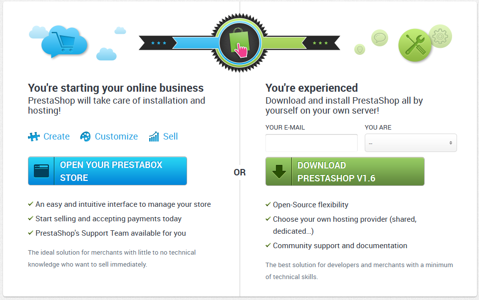

Hai solo una opzione di download: l'ultima versione stabile, pronta per tutti i tipi di negozi online.

Se avete bisogno di scaricare una qualsiasi delle versioni precedenti, vai a questo indirizzo: [http://www.prestashop.com/en/developers-versions](http://www.prestashop.com/en/developers-versions) . Scorrere fino alla sezione "versioni precedentemente rilasciate".

Si noti che non è mai consigliabile utilizzare qualsiasi altra versione diversa da quella stabile.

Fare clic sul pulsante "Download" e salvare l'archivio sul vostro computer (ad esempio sul desktop). Si dovrebbe ottenere un file denominato "prestashop\_1.6.0.4.zip" (o equivalente, secondo i numeri di versione).

Il file scaricato è un archivio Zip, cioè un file che contiene tutti i file di PrestaShop in forma compressa. Per continuare con il processo, **è necessario decomprimere l'archivio.**

Se il sistema operativo non supporta nativamente i file Zip, è possibile scaricare e installare uno strumento dedicato, come ad esempio:

* Windows:
  * 7-zip: [http://www.7-zip.org/](http://www.7-zip.org/)
  * WinZip: [http://www.winzip.com/win/en/index.htm](http://www.winzip.com/win/en/index.htm)
  * WinRAR: [http://www.rarlab.com/](http://www.rarlab.com/)
* Mac OS X:
  * iZip: [http://www.izip.com/](http://www.izip.com/)
  * WinZip Mac: [http://www.winzip.com/mac/](http://www.winzip.com/mac/)
  * Zipeg: [http://www.zipeg.com/](http://www.zipeg.com/)

Utilizzando uno strumento Zip, estrai il contenuto dell'archivio in un percorso noto sul tuo disco rigido (ad esempio sul Desktop). **Non caricare il file Zip direttamente sul vostro web server.**

**In caso il vostro fornitore di host vi abbia fornito anche un file manager con gli strumenti di decompressione e spostamento file, potete anche caricare la cartella compressa, impiegando meno tempo.**

L'archivio Zip è dotato di due cose nella sua radice:

* La cartella "prestashop", che contiene tutti i file PrestaShop che dovrai caricare sul server web.
* Il file "Install\_PrestaShop.html", che apre questa stessa pagina nel browser predefinito.

Il "Install\_PrestaShop.html" non deve essere caricato sul vostro server web.

#### Caricamento di Prestashop 

Ora dovresti avere uno spazio di hosting a tua disposizione (altrimenti, leggi il capitolo "Di cosa hai bisogno per cominciare" di questa guida), e una cartella sul disco rigido con l'archivio PrestaShop decompresso.

Questo passaggio ti fa caricare i file PrestaShop sul tuo spazio di hosting. Questo viene fatto collegando il computer al server utilizzando uno strumento noto come "client FTP", che dovrebbe essere stato installato durante la lettura del capitolo "Di cosa hai bisogno per cominciare" . Useremo il software gratuito FileZilla ([http://filezilla-project.org/](http://filezilla-project.org/)).

Collegati al tuo spazio di hosting utilizzando il client FTP, utilizzando i dettagli di connessione forniti dal tuo host web (altrimenti, contattare il proprio host). Una volta connesso, è il momento di trasferire i file PrestaShop dal computer al server.

In FileZilla (o qualsiasi altro client FTP), sfoglia le cartelle locali fino a trovare quella che contiene i file PrestaShop. Mantienilo aperto nella sezione "sito locale" a sinistra.

Nella sezione "sito remoto" (a destra), selezionare il percorso in cui si desidera PrestaShop sia pubblicamente disponibile (radice del dominio, sotto-cartella, sub-dominio ...). Questo può cambiare molto, a seconda sia dell'host che delle vostre esigenze:

* Il tuo host:
  * Alcuni host possono richiedere di inserire i file in una cartella specifica, come ad esempio `/htdocs` , `/public_html` , `/web` , `/www` ,`/yourdomainname.com` , ecc
  * Server FTP altri host 'semplicemente ti fanno accedere direttamente nello spazio corretto di caricamento.
* Le vostre esigenze:
  * Se volete che il vostro negozio sia il sito principale per il nome di dominio (ad esempio, [http://www.example.com](http://translate.googleusercontent.com/translate\_c?depth=1\&hl=it\&rurl=translate.google.it\&sl=en\&tl=it\&u=http://www.example.com/\&usg=ALkJrhi6owo19pjRRVMTNJ8NpS1SkLxIng) ), carica PrestaShop alla cartella principale dello spazio di upload (che può dipendere dal host).
  * Se volete che il vostro negozio di essere in una sottocartella del tuo nome a dominio ( [http://www.example.com/shop](http://translate.googleusercontent.com/translate\_c?depth=1\&hl=it\&rurl=translate.google.it\&sl=en\&tl=it\&u=http://www.example.com/shop\&usg=ALkJrhilGGqwfFAeJF\_NARWRI2y4v\_vubw) ), è necessario creare prima la cartella tramite FileZilla (fare clic destro e scegliere "Create directory"), poi carica PrestaShop in quella cartella.
  * Se volete che il vostro negozio di essere in un sottodominio del tuo nome a dominio ( [http://shop.example.com](http://translate.googleusercontent.com/translate\_c?depth=1\&hl=it\&rurl=translate.google.it\&sl=en\&tl=it\&u=http://shop.example.com/\&usg=ALkJrhijXH4XhsBYevfuSFb8p4FcumBLhw) ), è necessario creare prima detto sub-dominio. Questo dipende dal vostro host: si potrebbe essere in grado di farlo semplicemente aggiungendo una nuova cartella con il tuo client FTP, o potrebbe essere necessario creare sub-dominio tramite pannello di amministrazione del vostro host. Leggiti la documentazione di supporto del tuo host prima. Una volta creato, seleziona la cartella del sottodominio, e caricare PrestaShop lì.

Sul lato sinistro di FileZilla, si dovrebbe ora avere la cartella locale dove si trovano i file PrestaShop dall'archivio Zip, e sul lato destro, la posizione di destinazione. Se non lo avete ancora fatto, caricarlo è semplice: selezionare tutti i file e le cartelle dalla cartella locale (utilizzare Ctrl-A), e usando il sitema di drag\&drop rilasciandoli nella cartella remota, oppure fare clic destro sulla selezione e scegliere " Upload "nel menu contestuale.

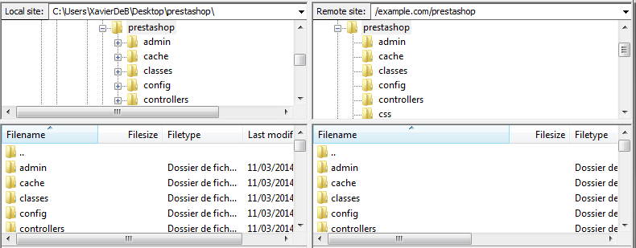

Il caricamento può richiedere diversi minuti (solitamente mezzora o più a seconda della connessione), siccome PrestaShop utilizza più di 7500 file e quasi 1000 cartelle. Dopo un po ', tutti i file e le cartelle di PrestaShop dovrebbe essere on-line. Ottimo!

#### Creazione di un database per il tuo negozio 

Prima di poter effettivamente installare PrestaShop, è necessario assicurarsi che il server MySQL abbia un database pronto per ospitare i dati di PrestaShop. In caso contrario, è necessario crearne uno.

La creazione di un database può essere fatta utilizzando qualsiasi strumento di amministrazione del database. Useremo lo strumento phpMyAdmin gratuito ([http://www.phpmyadmin.net/](http://www.phpmyadmin.net/)), che dovrebbe essere preinstallato sulla maggior parte di web hosting.

Alcuni hosts preferiscono dare ai clienti un pannello di controllo grafico, come cPanel, Plesk o altri progettati su misura. Assicurati di leggere la documentazione del vostro host sulla gestione di database MySQL, creando un database per il tuo negozio seguendo le loro spiegazioni specifiche.\
In tal caso non ti servirà una volta creato il database e il relativo utente di seguire la procedura qua sotto in phpMyAdmin.&#x20;

Connettiti a phpMyAdmin utilizzando le credenziali dell'account, che il tuo host ti ha fornito. Dovrebbe essere accessibile tramite un URL normale, legato al nome del dominio o il nome di dominio dell'host.

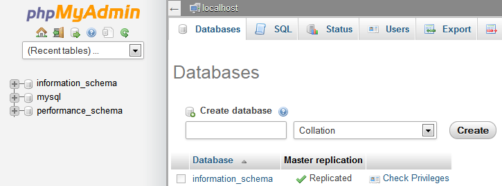

Nella colonna di sinistra, è possibile vedere le banche dati attualmente disponibili sul server MySQL. Alcuni di loro devono essere lasciati stare, perché sono entrambi utilizzati da phpMyAdmin o dall'host: `phpmyadmin` , `mysql` , `information_schema` , `performance_schema` e altri. Leggi la documentazione del fornitore di hosting per sapere se uno di questi può essere utilizzato come database predefinito.

In entrambi i casi, è possibile creare un nuovo database nuovo di zecca andando nella scheda "Database" e utilizzando il modulo centrale denominato "Crea nuovo database". Basta inserire un nome univoco e fare clic su "Crea". Il nome del database verrà aggiunto alla lista di sinistra. È ora possibile utilizzare per memorizzare i dati di PrestaShop.

#### Avvio dell' auto-installer 

Ora arriva il punto dove si arriva tutti: l'installazione di PrestaShop.

Il processo di installazione è abbastanza facile, in quanto è semplificata, con auto-installazione di PrestaShop. Dovreste essere in grado di completarla in una manciata di minuti. Leggi attentamente ogni pagina, di modo che non ti sfugga nulla.

Per avviare il programma di installazione, è sufficiente passare alla posizione di PrestaShop sul server web: lo script rileverà automaticamente che PrestaShop non è ancora installato, e vi porterà l'auto-installer. \
È anche possibile digitare direttamente l'indirizzo del `/install` cartella: [`http://www.example.com/prestashop_folder/install`](http://www.example.com/prestashop\_folder/install).

Se si effettua una installazione sul proprio computer, l'installazione deve essere eseguita nella cartella PrestaShop sul server web locale, che dovrebbe essere disponibile a [`http://127.0.0.1/prestashop`](http://127.0.0.1/prestashop).

Da lì in poi, devi solo leggere, fare clic e compilare alcuni moduli.

Ci sono 6 punti. Nella parte superiore della pagina, l'assistente di installazione vi offre una visualizzazione di dove siete nel processo: i volti grigi si trasformano in volti sorridenti dopo ogni passo che si completa.

**passo 1: Pagina di Benvenuto**

Questa pagina è una rapida introduzione al processo di installazione. È possibile scegliere la lingua in cui il programma di installazione mostrerà le sue istruzioni.

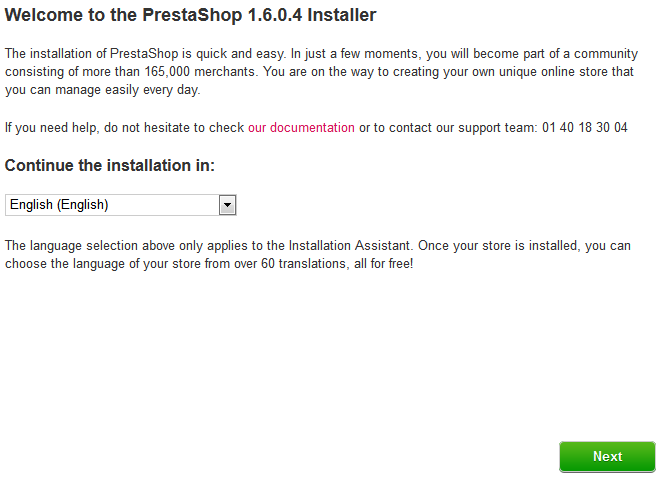

Vedrete anche un link al sito della documentazione ([http://doc.prestashop.com/](http://doc.prestashop.com/)), e il numero di telefono di supporto PrestaShop. Potete saperne di più sul nostro servizio di assistenza andando su: [http://support.prestashop.com/en/](http://support.prestashop.com/en/).

Selezionare la lingua in cui desideri visualizzare il programma di installazione, quindi fai clic sul pulsante "Avanti". Questo imposterà anche la lingua di default per l'installazione di PrestaShop - ma poi potrai attivare anche altre lingue.

**passo 2: Licenza di PrestaShop**

Questa seconda pagina è una semplice informativa da accettare: PrestaShop è gratuito e distribuito sotto un certo insieme di licenze open-source. Semplicemente non si può utilizzare questo software se non siete d'accordo con i termini delle licenze, e questo passo ti richiede di riconoscerle in modo esplicito.

Leggi le licenze di PrestaShop:

* _Open Software License 3.0_ per PrestaShop, che puoi anche leggere a [http://www.opensource.org/licenses/OSL-3.0](http://www.opensource.org/licenses/OSL-3.0).&#x20;
* _Academic Free License 3.0_ per moduli e temi, che puoi anche leggere a [http://opensource.org/licenses/AFL-3.0](http://opensource.org/licenses/AFL-3.0).

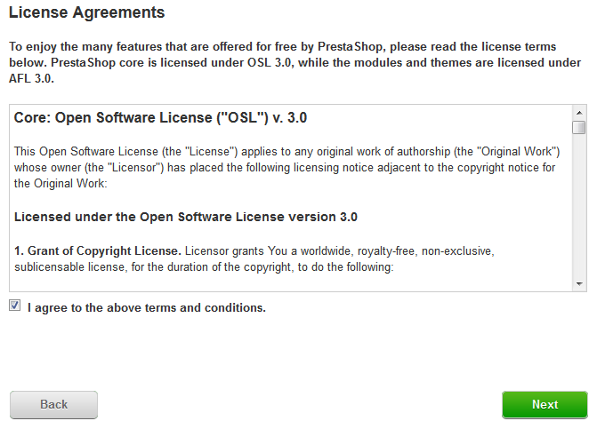

You must agree to both licenses in order to install PrestaShop.

Devi accettare entrambe le licenze per installare PrestaShop.

Per accedere alla fase successiva, è necessario selezionare la casella "Accetto i termini e le condizioni di cui sopra", quindi fare clic su "Avanti". Se non si accettano esplicitamente le licenze, non è possibile installare PrestaShop: il pulsante "Avanti" non sarà neppure cliccabile.

**Passo 3 & 4: compatibilità di Sistema & Informazioni del Negozio**

La terza pagina permette un rapido controllo di tutti i parametri del server sul vostro host. Nella maggior parte dei casi, non vedrete questa pagina, perché se non viene trovato nulla di sbagliato, si viene portati direttamente alla quarta pagina, "informazioni del Negozio". Se è così, si può ancora andare a dare un'occhiata alla terza pagina cliccando sul link "compatibilità di sistema" nella barra laterale sinistra.

Se qualcosa dovesse andare storto durante il controllo del server che accade nella terza fase, il programma di installazione visualizza la pagina "compatibilità di sistema", dove si possono vedere tutti i controlli con esito negativo.

**Compatibilità del sistema**

Questa pagina controlla che tutto sia a posto con la configurazione del server: impostazioni PHP, le autorizzazioni per file e cartelle, strumenti di terze parti, ecc

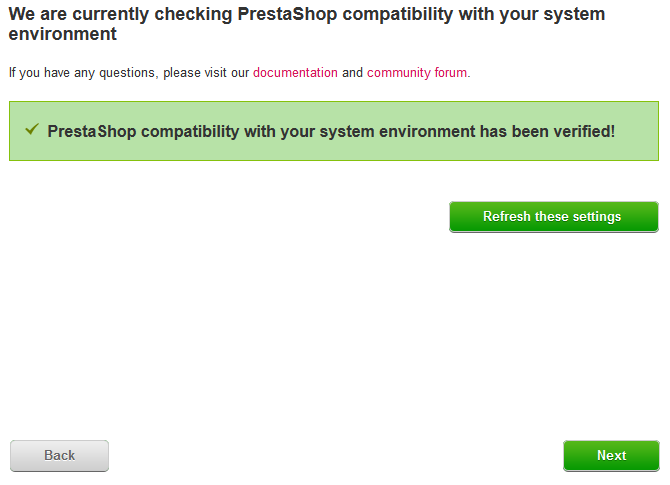

Se qualcosa va storto, l'installatore si ferma qui, mostrandoti i pochi dettagli tecnici che hanno bisogno di essere modificati, sia esso cambiando la configurazione di PHP o aggiornando le autorizzazioni dei file.

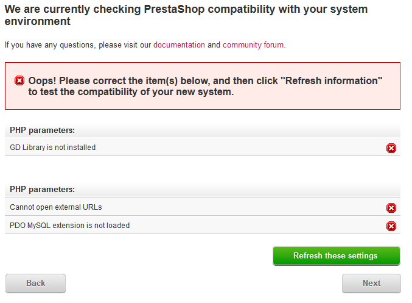

Ecco un elenco dei controlli eseguiti durante questo terzo passo:

| Check                                                                        | How/where to fix it?                                                                                       |
| ---------------------------------------------------------------------------- | ---------------------------------------------------------------------------------------------------------- |
| E' PHP 5.1.2 or superiore installato?                                        | Web server                                                                                                 |
| Può PrestaShop uploadare file?                                               | php.ini file (`file_uploads`)                                                                              |
| Può PrestaShop creare nuovi files e cartelle?                                | File browser / FTP client / command line                                                                   |
| La GD Library è installata?                                                  | php.ini file (`extension=php_gd2.so`)                                                                      |
| MySQL è supportato?                                                          | php.ini file (`extension=php_pdo_mysql.so`)                                                                |
| Controllo ricorsivo dei permessi di scrittura su \~/config/                  | File browser / FTP client / command line                                                                   |
| Controllo ricorsivo dei permessi di scrittura su \~/cache/                   | File browser / FTP client / command line                                                                   |
| Controllo ricorsivo dei permessi di scrittura su \~/log/                     | File browser / FTP client / command line                                                                   |
| Controllo ricorsivo dei permessi di scrittura su \~/img/                     | File browser / FTP client / command line                                                                   |
| Controllo ricorsivo dei permessi di scrittura su \~/mails/                   | File browser / FTP client / command line                                                                   |
| Controllo ricorsivo dei permessi di scrittura su \~/modules/                 | File browser / FTP client / command line                                                                   |
| Controllo ricorsivo dei permessi di scrittura su \~/override/                | File browser / FTP client / command line                                                                   |
| Controllo ricorsivo dei permessi di scrittura su \~/themes/default/lang/     | File browser / FTP client / command line                                                                   |
| Controllo ricorsivo dei permessi di scrittura su \~/themes/default/pdf/lang/ | File browser / FTP client / command line                                                                   |
| Controllo ricorsivo dei permessi di scrittura su \~/themes/default/cache/    | File browser / FTP client / command line                                                                   |
| Controllo ricorsivo dei permessi di scrittura su \~/translations/            | File browser / FTP client / command line                                                                   |
| Controllo ricorsivo dei permessi di scrittura su \~/upload/                  | File browser / FTP client / command line                                                                   |
| Controllo ricorsivo dei permessi di scrittura su \~/download/                | File browser / FTP client / command line                                                                   |
| Controllo ricorsivo dei permessi di scrittura su \~/sitemap.xml              | File browser / FTP client / command line                                                                   |
| Può PrestaShop aprire URLs esterni?                                          | php.in file (`allow_url_fopen`)                                                                            |
| PHP's "register global" è impostato su off?                                  | php.ini file (`register_globals`)                                                                          |
| La compressione GZIP è attivata?                                             | .htaccess file                                                                                             |
| L'estensione Mcrypt è disponibile?                                           | php.ini file (vedi [http://php.net/manual/en/mcrypt.setup.php](http://php.net/manual/en/mcrypt.setup.php)) |
| PHP's "magic quotes" è disattivato?                                          | php.ini file (`magic_quotes_gpc`)                                                                          |
| L'estensione Dom è caricata?                                                 | `--enable-dom` compile time option                                                                         |
| L'estensione PDO MySQL è caricata?                                           | php.ini file (`extension=php_pdo_mysql.so`)                                                                |

Mentre cambiare la configurazione di PHP può essere fatto solo caso per caso a seconda del livello di accesso al server, e quindi può essere spiegato solo in dettaglio, l'aggiornamento dei permessi dei file è più facile da spiegare.

Le autorizzazioni sono il modo in cui un filesystem concede i diritti di accesso a specifici utenti o a gruppi di utenti, che controllano la loro capacità di visualizzare o apportare modifiche a file e cartelle. L'installatore ha bisogno di fare alcune modifiche ai file che hai caricato, e se il filesystem non permette questi cambiamenti attraverso autorizzazioni appropriate, il programma di installazione non può completare il suo processo.

Quindi, se l'installatore mostra che alcuni file o cartelle non dispongono dell'autorizzazione appropriata, è necessario Cambiare queste autorizzazioni . Questo richiederà di accedere ai file sul vostro server web, utilizzando il vostro client FTP (come FileZilla) o la riga di comando.

Collegatevi al vostro account sul server utilizzando il client FTP, passare alla cartella di PrestaShop, e trovare le cartelle che sono contrassegnate dal programma di installazione, ma hanno bisogno di un cambiamento di autorizzazione.

CHMOD

Il cambio di permessi di file / cartelle su un sistema Unix / Linux è chiamato "CHMOD", proprio come il comando che ha lo stesso nome (vedi: [http://en.wikipedia.org/wiki/Chmod](http://en.wikipedia.org/wiki/Chmod) – è possibile trovare una spiegazione dei permessi dei file qui: [http://www.elated.com/articles/understanding-permissions/](http://www.elated.com/articles/understanding-permissions/)).\
Dare a file o cartelle "un permesso di scrittura" si chiama "fare un chmod 755" o "chmod 775", a seconda dell host.

Alcuni hosts potrebbero richiedere l'utilizzo di CHMOD 777, anche se non è raccomandato per qualcosa di più di una necessità momentanea. \
Se dovete usare CHMOD 777 per installare PrestaShop, assicuratevi di passare ad un ambiente più sicuro (per esempio, 775 per le cartelle e 664 per i file), una volta che hai finito l'installazione. \
Leggi la documentazione del tuo host con attenzione.

Grazie a FileZilla (e la maggior parte dei client FTP), non c'è bisogno di utilizzare comandi Unix. La maggior parte dei client FTP permettono di modificare le autorizzazioni in modo semplice e graficamente: una volta che hai trovato un file o una cartella che ha bisogno di un tale cambiamento, fai clic destro su di esso, e nel menu contestuale scegli "I permessi dei file ...". Si aprirà una piccola finestra.

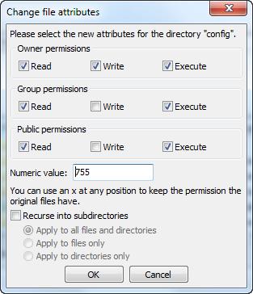

A seconda della configurazione del server (che non da sempre una mano), sarà necessario verificare sia le casellle di  "Leggi" che di "Esegui",  e almeno le righe di "proprietario"e "Gruppo" per la colonna "Scrittura". Alcuni hosts potrebbero richiedere di avere la casella di pubblico "Scrivi" selezionata, ma attenzione: raramente è una buona cosa avere qualcuno sul server che sia in grado di modificare il contenuto della vostra installazione PrestaShop.

Alcune cartelle potrebbero avere bisogno di avere tutti i propri file e le sottocartelle con le stesse autorizzazioni. In tal caso, selezionare la casella "ricorsivamente nelle sottodirectory".

Mentre cambi le autorizzazioni nel tuo client FTP, dovresti controllare regolarmente che hai fatto le modifiche giuste eseguendo nuovamente i controlli di compatibilità del programma di installazione: fai clic sul pulsante di installazione "Ricarica queste impostazioni", con la frequenza necessaria. \
Una volta che tutti gli indicatori sono verdi, è possibile fare clic su "Avanti". Se non è possibile averli tutti verdi, almeno assicurarsi che il programma di installazione mostri il messaggio  "La compatibilità PrestaShop con il vostro ambiente di sistema è stato verificata!" nella parte superiore della pagina.

**Informazioni di sistema**

Quì è dove si può iniziare a personalizzare il tuo negozio: dare un nome e un logo, indicare la sua attività principale, e indicare le informazioni personali per il proprietario del negozio (che è obbligatorio per legge nella maggior parte dei paesi) ..

Non utilizzare i due punti nel nome del tuo negozio, in quanto potrebbe impedire a qualche caratteristica di funzionare (ad esempio, invio e-mail potrebbe fallire).

È possibile sostituire i due punti con un trattino se avete bisogno di avere due sezioni nel titolo. Per esempio, potete scrivere "MyStore - Il posto migliore per i prodotti da acquistare" invece di "MyStore: Il posto migliore per i prodotti da acquistare".

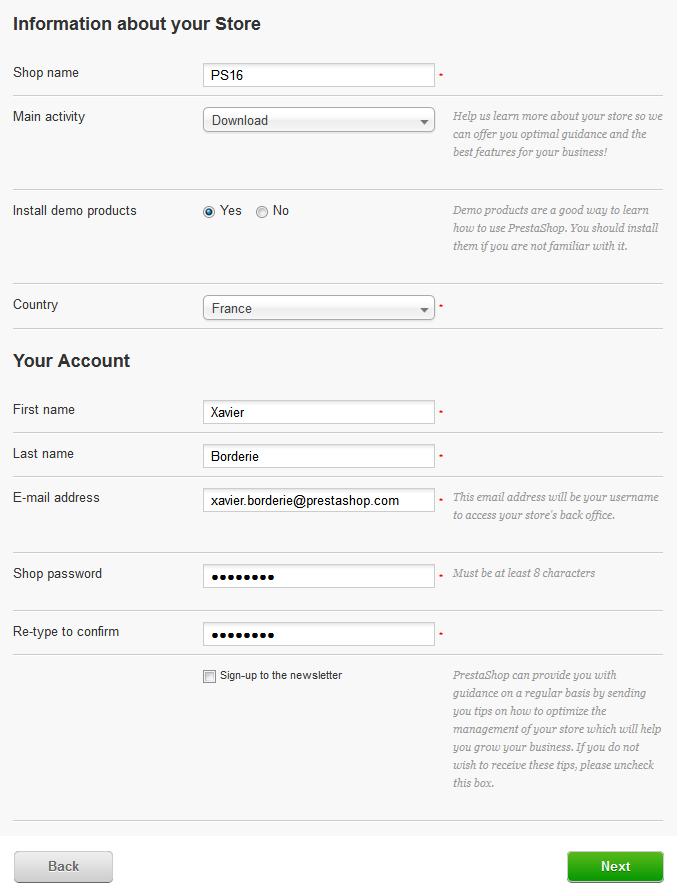

Per quanto riguarda il logo, ricordati che apparirà:

* Su tutte le pagine del tuo negozio (a seconda del tema).
* Nel tuo back-office.
* In tutte le e-mail inviate ai tuoi clienti.
* In tutti i documenti contrattuali (fatture, autorizzazioni di ritorno, ecc.)

Pertanto, non tenere il logi di PrestaShop predefinito, per ovvie ragioni.

Fi clic su "successivo" per continuare.

**Passo 5: Configurazione di sistema**

Questa pagina contiene un modulo che consente di dire PrestaShop il server database e il database che dovrebbe utilizzare, insieme a pochi altri dettagli. Tutte queste informazioni dovrebbero essere fornite dal proprio web hosting.

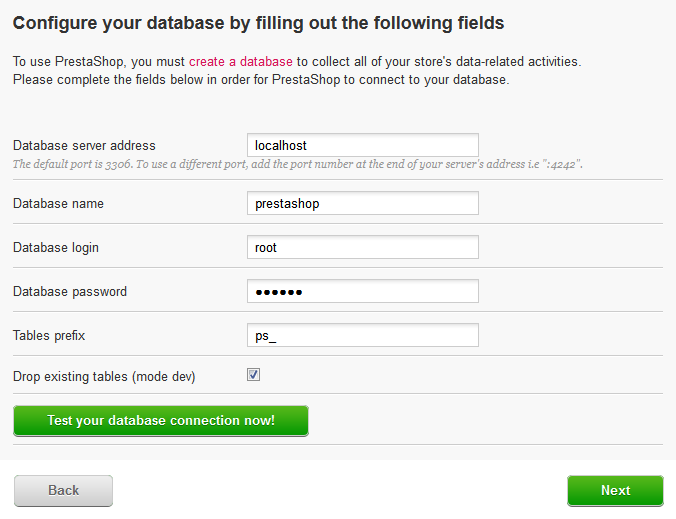

Compila tutti i campi con le informazioni di connessione al database fornito dal vostro web-host:

* **Database server address**. Il nome host del server MySQL. Può essere legato al nome del dominio (ad esempio [http://sql.example.com](http://sql.example.com) ), legato al tuo host web,(ad esempio [http://mysql2.alwaysdata.com](http://mysql2.alwaysdata.com)), o essere semplicemente un indirizzo IP (per esempio 46.105.78.185 ).
* **Database name**.  Il nome del database in cui si desidera PrestaShop memorizzi i propri dati. Questo è sia un database esistente sul server MySQL, o quello che si è creato con phpMyAdmin (o qualsiasi altro strumento SQL) nella sezione "Creazione di un database per il tuo negozio" di questa guida.
* **Database login**. Il nome dell'utente MySQL che ha accesso al database.
* **Database password**. La password dell'utente MySQL.
* **Database engine**. Il motore di database è il core del server di database. InnoDB è quello di default e si dovrebbe usare, ma il più tecnico tra voi potrebbe desiderare di scegliere un altro motore. Generalmente, non è necessario modificare l'impostazione predefinita.
* **Tables prefix**. Il prefisso per le tabelle del database. " `ps_` "è l'impostazione predefinita, risulta nelle tabelle PrestaShop SQL con nomi come"`ps_cart` "o" `ps_wishlist` "; ma serve solo se è necessario installare più di una istanza di PrestaShop sullo stesso database, quindi è necessario utilizzare un prefisso diverso per ogni installazione. Tuttavia, si raccomanda di creare un database per ogni installazione di PrestaShop, se il vostro host web consente.Meglio ancora: fare una installazione di PrestaShop, e abilitare la funzione multistore al fine di gestire molti negozi dallo stesso back-end di PrestaShop.
* **Drop existing tables**. Questo è disponibile solo in modalità sviluppatore "Dev". Quando si reinstalla PrestaShop, è possibile scegliere di eliminare le tabelle del database PrestaShop esistenti al fine di cominciare su un database pulito.

Fai clic su "testare la connessione database ora!" per controllare di aver inserito le informazioni del server corrette.

Fari clic su "successivo": l'installazione comincerà a configurazione il tuol negozio, creando e popolando le tabelle del database, ecc Questo potrebbe richiedere alcuni minuti: per favore sii paziente e non toccare tuo browser!

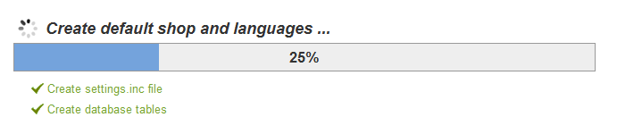

Il programma di installazione eseguirà le seguenti cose:

* Creerà il file `settings.inc.php` e vi scriverà dentro le impostazioni.
* Creerà le tabelle del database.
* Creerà il negozio di default con le sue lingue di default.
* Popolerà le tabelle del database.
* Configurerà le informazioni del negozio.
* Installerà i moduli di default.
* Installerà i dati dimostrativi (prodotti, categorie, utenti, pagine CMS, ecc.)
* Installerà il tema.

Una volta fatto, il tuo negozio è installato e pronto per essere configurato!

#### Completamento dell'installazione 

Come si può leggere direttamente sulla pagina finale del processo di installazione, ci sono un paio di azioni da eseguire prima di poter lasciare il programma di installazione.

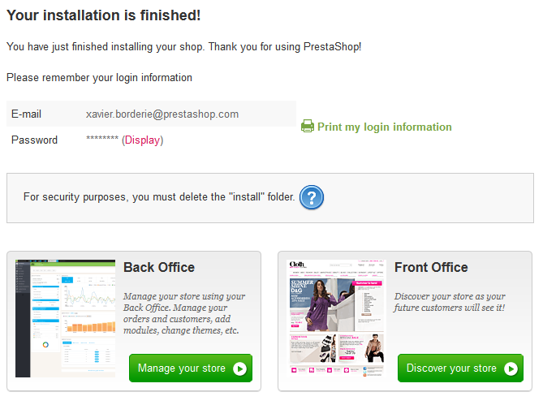

Un modo semplice per migliorare la sicurezza della tua installazione è quello di eliminare alcuni file e cartelle importanti. Questo viene fatto utilizzando il client FTP, direttamente sul server. Gli elementi da eliminare sono:

* La cartella "/ install" (imperativo).
* La cartella "/ docs" (facoltativo), a meno che non sia necessario testare lo strumento di importazione con i file di importazione di esempio che questa cartella contiene.
* Il file "README.md" (facoltativo).

Fare clic sul pulsante "Gestione store" in modo da accedere alla vostra area di amministrazione.

Un altro modo per garantire la sicurezza della tua installazione è quello di utilizzare un nome personalizzato per la cartella amministrazione: cambiare la cartella "admin" in qualcosa di unico per te, come "4dmin-1537" o "MySecReT4dm1n". \
**Annotare il nuovo nome per la nuova cartella "admin",** perché da ora in poi per accedere alle pagine di amministrazione utilizzerai questo indirizzo!

Infine, per chiudere tutti gli accessi potenzialmente dannosi, usare il client FTP per aggiornare i file e le cartellecon le autorizzazioni per 664, o 666 se il vostro host lo richiede. Se si scopre che i diritti di accesso sono troppo bassi per far lavorare alcuni moduli, è necessario impostare le autorizzazioni di nuovo a 755.

**Congratulazioni!** **L'installazione è ora completa.**

Accedere al PrestaShop back-office andando nella cartella appena rinominata "admin", e iniziare a riempire il tuo catalogo di prodotti, aggiungendo i corrieri e le spese di spedizione, l'aggiunta di produttori e fornitori, cambiare il tema, e in generale la configurazione delle molte impostazioni per soddisfare i tuoi gusti ed esigenze. Dai una occhiata a "Primi passi con PrestaShop 1.6" del capitolo "Guida per l'Utente" per ulteriori informazioni:[http://doc.prestashop.com/display/PS16/Primi+passi+con+PrestaShop+1.6](http://doc.prestashop.com/display/PS16/Primi+passi+con+PrestaShop+1.6) .

Si consiglia di eseguire regolarmente il backup del database e dei file, preferibilmente su più di un computer, in caso di problemi legati all'hardware o alla sicurezza.
