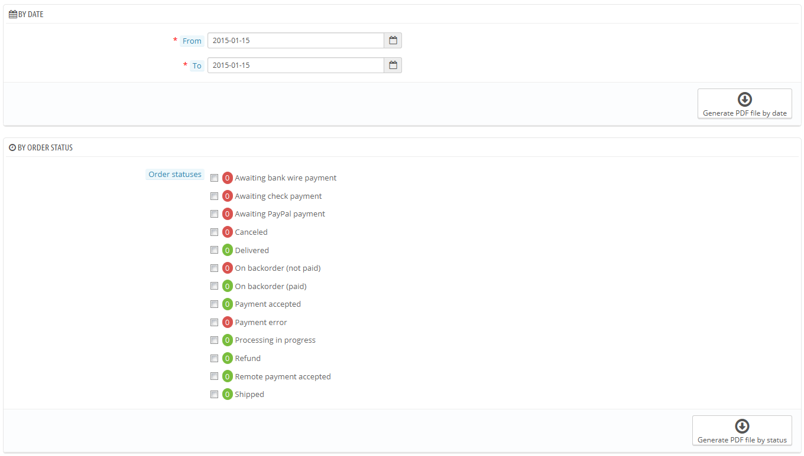

# Fatture

Ogni volta che viene validato un ordine nel tuo negozio, si genera una fattura che viene inviata al tuo cliente. Puoi scaricare le fatture di un singolo ordine dalla pagina dell'ordine. La pagina "Fatture" nel menu "Ordini" ti permette di scaricare una selezione di fatture di ordini passati, in formato PDF, tutte in una volta (Nello stesso file di Pdf).

Puoi ottenere un unico file pdf contenente più fatture secondo due criteri:

* **Per data**. E' molto utile quando hai necessità di stampare tutte le fatture di un determinato mese, o di una settimana. Seleziona la data iniziale e la data finale e clicca sul tasto  "Genera Pdf per data".
* **In base allo status dell'ordine**. Necessario quando devi stampare in modo preciso gli ordini che sono stati cancellati, rimborsati o ordini in arretrato.  PrestaShop ti aiuta indicando il numero delle fatture che hanno tali status all'interno, in parentesi.

In entrambi i casi, le fatture vengono generate in un unico file in Pdf, ognuna con le sue pagine. Non puoi invece avere un singolo file pdf per ogni fattura per un certo periodo o tipo di status utilizzando questa pagina.

Se vuoi personalizzare l'aspetto delle tue fatture, devi cambiare i files dei template.

I files dei template pdf si trovano nella cartella `/pdf` . Apri il file `invoice.tpl` e modifica i suoi links : è un file HTML con dei tags Smarty.

## Opzioni fatture 

Puoi scegliere se avere o meno le fatture disponibili per i tuoi clienti non appena l'ordine viene fatto, così come il Prefisso Fattura ed il numero fattura che vuoi sia stampato nella versione stampata della fattura. Questa funzione di aiuta a semplificare la gestione del tuo account.

* **Abilitare le fatture**. Quando è disattivato, il tuo cliente non riceverà la fattura dopo l'acquisto. Dovrai essere in grado di gestire la fatturazione se il tuo cliente la richiede.
* **Attivare la scomposizione delle tasse.**  Una novità della versione _1.6_. Quando è attivato, la fattura elenca tutte le varie tasse che vengono applicate nell'ordine, invece di una sola percentuale.
* **Attivare la immagine del prodotto.** Novità nella versione _1.6.1._ Quando attivata, aggiunge l'immagine del prodotto accanto al nome del prodotto nella fattura.
* **Prefisso della fattura**. In automatico,  PrestaShop usa una lingua adattata nei prefissi delle fatture:  "IN" in Englese , "FA" in Francese (per  "_facture_"), "CU" in Spagnolo (per "_cuenta_"), etc. Puoi decidere di avere dei codici per la lingua, invece : "EN", "FR", "SP", etc. Naturalmente puoi anche scegliere di avere un unico prefisso per ogni lingua, o non avere alcun prefisso.\
  &#x20;PrestaShop genererà il numero di fattura in base a come sono settate:: "#IN000001", "#FA000002", etc.
* **Numero della fattura**. Se avevi già ordine e fatture prima di iniziare ad usare, puoi utilizzare questa opzione per iniziare la numerazione delle fatture da un numero più alto
* **Testo libero.** Novità nella versione _1.6.1.0_.  Questo campo ti permette di aggiungere del testo nella fattura, nel caso che la tua legislazione richieda che vengano inserite delle informazioni in più. Nella fattura, apparirà al di sotto dei vari metodi di pagamento. Naturalmente, puoi utilizzare questo campo testo libero per aggiungere qualsiasi testo tu ritenga necessario.
* **Testo a piè pagina**. Puoi utilizzare questa opzione per avere un testo fisso alla fine di tutte le tue fatture. Il testo apparirà sotto il nome del tuo negozio nelle fatture.
* **Modello fattura**. In base ai tuoi temi, puoi usare più  di uno stile per le fatture. Provali prima con una fattura finta, in modo da poter scegliere quello che preferisci.  Se conosci come scrivere codice in  HTML, puoi anche aggiungere i tuoi modelli di fattura o modificare quelli esistenti: sono posizionati nella cartella `/pdf/` folder  nella tua installazione di  PrestaShop.
* **Utilizzare il disco come  cache per le tue fatture in PDF** . Puoi scegliere di archiviare le fatture nel server di  PrestaShop's piuttosto che nella server cache. Questa opzione da un lato ti aiuta a risparmiare memoria, ma dall'altra rallenta la produzione in Pdf, quindi utilizzalo con cognizione di causa.

Non dimenticarti di salvare le modifiche.

Quando i tuoi clienti richiedono le loro fatture, puoi indirizzarli alla sezione "Cronologia Ordini" del loro account, dove vengono mantenute disponibili tutte le loro fatture.
