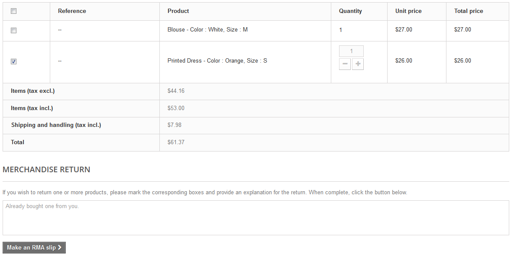
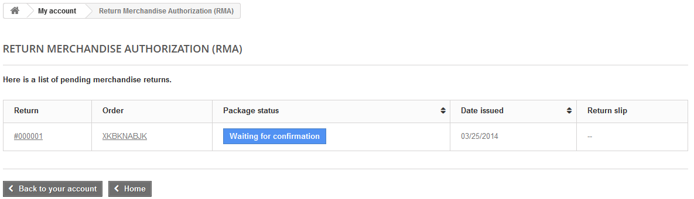
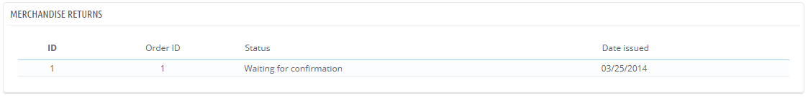

# Merce resa

La pagina "Merce resa" di offre una lista di processi  RMA  (Autorizzazione alla restituzione di merce).

In basso nella pagina, hai la possibilità di abilitare i clienti alla restituzione della merce (opzione "abilita le restituzioni").  Devi semplicemente fare una scelta, indicare il numero di giorni entro i quali si può richiedere la restituzione, e salvare il settaggio: in questo modo i clienti possono essere abilitati a richiedere una autorizzazione alla restituzione. Puoi anche modificare il prefisso per il numero di restituzione, o scegliere di non averne.&#x20;

## Processo per la resa della merce: come lo vede il cliente 

Una volta che hai abilitato l'opzione  RMA nel tuo back office, il cliente può scegliere di restituire un articolo (se l'ordine è ancora nel periodo di tempo in cui è possibile farlo). Per farlo, lui o lei deve:

1. Accedere alla sezione "cronologia ordini" nel suo account.
2. Selezionare l'ordine con l'articolo da restituire.
3. Selezionare il prodotto/i che vogliono restituire spuntando la casellina accanto al nome del prodotto.
4. (opzionale) Aggiungere una spiegazione, in modo che i tuoi collaboratori possano capire meglio perchè il cliente sta restituendo quel prodotto.\
   \

When is it possible to return an order?

1. I resi devono essere abiitati (Opzione "abilita i resi").
2. L'ordine deve essere entro il periodo di validità.
3. Gli ordini devono essere stati in almeno uno dei seguenti condizioni:

*

    * Almeno due condizioni di cui uno ha l'opzione "inserisci l'ordine come pagato" abilitata e l'altro ha l'opzione "inserisci l'ordine come spedito" abilitata\
      Oppure
    * Una condizione in Cui entrambi le opzioni (inserisci ordine come pagato - inserisci ordine come spedito) siano abilitate

    Le condizioni possono venire modificate nella pagina "Statuses" nel menu "Ordini".

Una volta che il modulo viene completato, il cliente clicca su "Fai un RMA) e la richiesta viene inviata al gestore del negozio (tu). La richiesta appare come "In attesa di conferma) nella pagina "Autorizzazione per la resa della merce" del cliente, accessibile dalla sua pagina account.

## Processo per la resa: come lo vedi tu 

La richiesta di restituzione appare nel tuo back office. Prima come "In attesa di conferma".

Il processo può prevedere più passaggi, che vengono indicati dallo stato de RMA. Ci sono solo una manciata di stati/condizioni che seguono l'intero processo della resa:

* In attesa di conferma.
* In attesa del pacco.
* Pacco ricevuto.
* Resa negata.
* Resa completata.

Dipende ora solo da te se accettarla o negarla:

1. Clicca sul nome della richiesta di restituzione per vedere maggiori dettagli.
2. Modifica lo status per continuare il processo di resa o per bloccarlo.
   * Se vuoi bloccare il processo di resa (e negare al cliente il rimborso) devi semplicemente scegliere "Restituzione negata"
   * Se sei d'accordo che la merce venga restituita e rimborsata al cliente, devi invece seguire i seguenti passaggi:
     1. Scegli il passaggio successivo nel processo "In attesa del pacco". Questo farà si che venga inviata una  e-mail al cliente dove gli viene detto che può restituire il prodotto.
     2. Una volta che hai ricevuto il pacco, modifica lo status del RMA in "pacco ricevuto".
     3. Per finire, una volta che l'intero processo si è concluso (sia che il cliente sia stato rimborsato o che tu abbia inviato una nota di credito) modifica lo status RMA in "restituzione completata" .
3. Convalida.

## Rimborsare un cliente 

Un ordine può venire rimborsato, sia parzialmente che totalmente. Questo si può fare usando due tasti posti nella barra in alto nella pagina dell'ordine o nella pagina  RMA.

I tasti d'azione cambiano in base allo status dell'ordine. Per esempio, una volta che l'ordine è in "Consegna" i tasti "Aggiungi un prodotto" e "Elimina un prodotto" diventano "Prodotti da rendere" "Rimborso parziale".

La restituzione dei prodotti non viene attivata in automatico. Per attivarla, vai alla pagina "Restituzione dei prodotti" nel menu "Ordini" ed attiva l'opzione nella sezione in basso nella pagina. Quest si applicherà a tutti i prodotti ed a tutti gli ordini.

* **Prodotti restituiti**. Da usare solo quando il cliente ha effettivamente restituito i prodotti: una volta che il prodotto è stato ricevuto, puoi segnarlo come restituito direttamente dal modulo dell'ordine. Clicca su "Prodotti restituiti" ed apparirà una nuova colonna nella lista prodotti, intitolata "Resi". Controlla la casella dei prodotti interessati, indica la quantità di prodotti che sono stati restituiti, e clicca sul tasto "Prodotti restituiti" in basso nella tabella.
* **Restituzione parziale**. Da usare quando devi restituire solo una parte dell'ordine e non l'intero ordine, sia perchè il cliente ha restituito il prodotto ordinato, sia come una gentilezza per un prodotto danneggiato che il cliente sceglie di tenere comunque. Clicca su "Resa parziale" ed apparirà una nuova colonna nella lista prodotti, "Resa parziale". Inserisci l'ammontare e la quantità di ogni prodotto interessato, scegli una delle opzioni possibili nella lista (vedi sotto) e clicca sul tasto "resa parziale"&#x20;

Quando inserisci un prodotto come restituito o da rimborsare, vi sono 4 opzioni possibili bella lista prodotti\_

* **Prodotti di nuovo in magazzino.** Una volta verificati, PrestaShop considererà il prodotti restituiti nuovamente disponibili per la vendita, e quindi si avrà un aumento del numero di questo prodotto nel magazzino. Non devi utilizzare questa opzione quando il prodotto viene restituito in quanto rotto....
* **Genera una nota di credito**. Una volta verificato, viene generata una nota di credito per gli articoli selezionati. Una nota di credito fa si che il tuo negozio sappia che della merce è stata restituita che è stato emesso un rimborso. Il cliente potrà utilizzare la nota di credito per un altro ordine.
* **Generare un voucher**. Una volta verificato, viene creato un voucher  per l'ammontare degli articoli selezionati. Un voucher ha la forma di un codice sconto che il cliente deve utilizzare nel momento in cui procede al pagamento dell'ordine.
* Puoi modificare i vouchers del cliente guardando nella pagina del cliente: dalla pagina dell'ordine in corso, clicca nel link sotto il nome del cliente nella sezione "Informazioni sul cliente"; una volta che sei nella pagina del cliente, vai alla sezione  "Vouchers" . Puoi modificare il voucher cliccando sulla icona "Modifica".
* **Rimborsare i costi di spedizione.** Puoi scegliere di rimborsare i costi di spedizione del prodotto restituito, un gesto sempre molto apprezzato.

Se il cliente ha utilizzato la carta di credito per pagare l'ordine, il sistema di pagamento può effettuare il rimborso direttamente sulla carta, o puoi farlo tu. Se il pagamento è stato effettuato con un assegno o con un bonifico, devi effettuare il rimborso da te, poi contrassegnare l'ordine che ha ricevuto un rimborso manuale dal back office (nella pagina dell'ordine)
