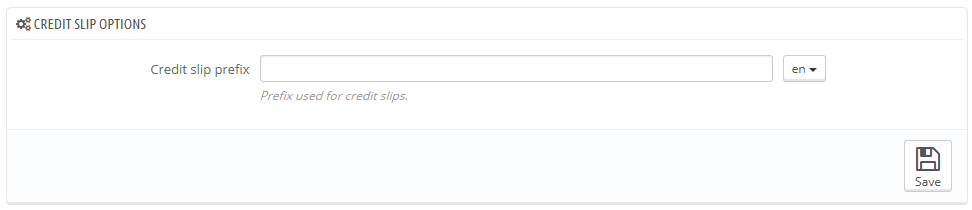

# Note di credito

Dopo aver accordato un reso, dovresti ricevere un pacco dal tuo cliente. Una volta ricevuto il pacco, devi creare una nota di credito dalla pagina dell'ordine. Può essere chiamata nota di accredito o . Le note di credito non vengono create nella pagina "Note di credito" , ma vengono solo elencate qua. Questa pagina può essere utilizzata anche per generare una nota di credito in formato PDF.

## Opzioni per consegnare una nota di credito 

C'è solo un'opzione in questa pagina:

* **Prefisso per la nota di credito**. Potresti volere un lingua particolare per le tue note, così come non volerne affatto.

PrestaShop genera il numero di nota in base alle tue impostazioni.

Non dimenticare di salvare le modifiche.

## Creare una nota di credito 

Quando sei nella lista degli ordini (Pagina "ordini"), clicca sull'ordine relativo all'artico restituito per avere maggiori informazioni - ovviamente questo è possibile se hai già indicato che il cliente può restituire i prodotto.

Sotto la tabella "prodotti", fai di seguito:&#x20;

1. Spunta l'articolo restituito.
2. Spunta la casella "Prodotti di nuovo in magazzino" se vuoi rimettere il prodotto nel tuo magazzino..
3. Spunta la casella "genera una nota di credito".To make a customer happy after committing an error in their order, consider giving him a voucher by checking the box next to "Generate a Voucher."
4. Puoi anche rimborsare i costi di spedizione cliccando su successivo  "includi spedizione".\
   \

Once you have selected all the options you want, confirm by clicking on "Return products."

The credit slip is now created and will be available in the Order Details well as in the "Credit Slips" page.\
From there, you can click the link to download the PDF file.\
The customer will see the slip in his or her "My Account" section.

If you have created a voucher, customers will see it in the "My vouchers" section of their account. If they click on it, it should look something like this:

The amount of the returned item(s) is added to the voucher. The customer can use the discount code (listed in the far left of the column) next time he or she places an order.
