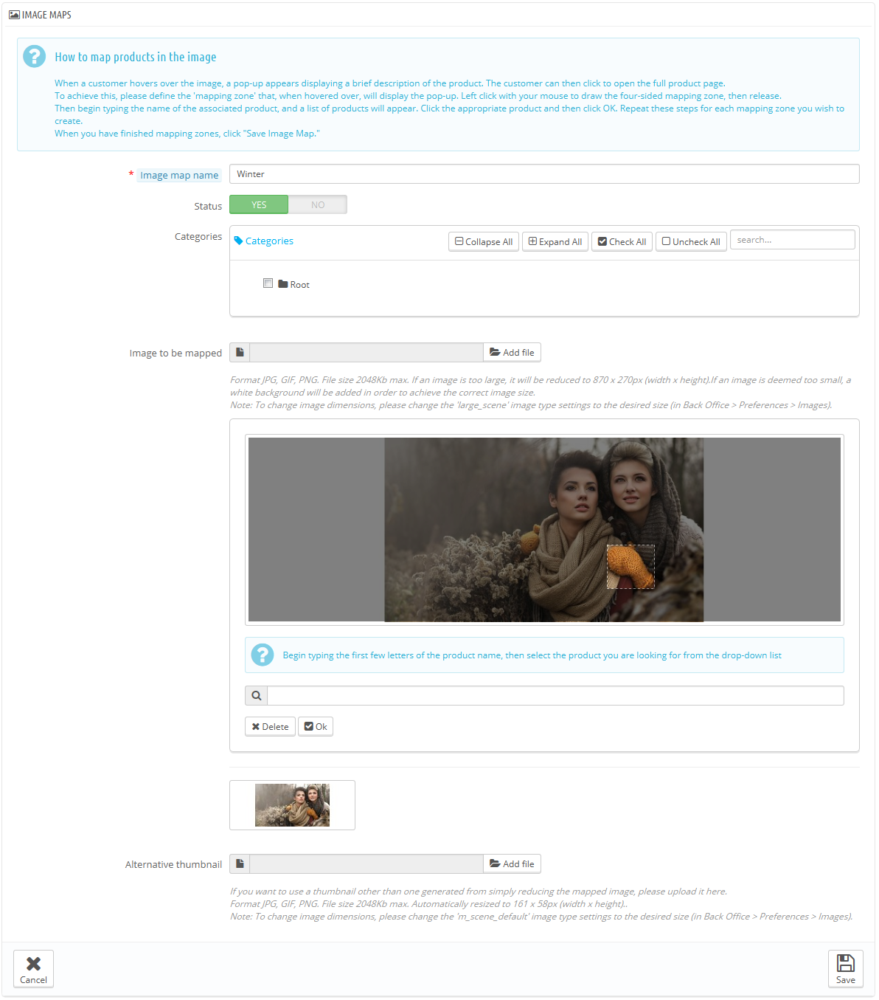

# Creare mappature di immagini

Image maps era una funzione disponibile dalla versione 1.1 of PrestaShop, fino alla versione 1.5 inclusa.\
**La nuova versione di PrestaShop 1.6 non ha più disponibile questa funzione, ma i negozi aggiornati alla versione 1.6 possono ancora utilizzarla.**

Se hai appena installato PrestaShop 1.6 e vuoi ancora utilizzare la image maps, ecco come fare:

1. Apri " Amministrazione" > pagina menu.
2. Clicca su "Aggiungi un menu"
3. Nel modulo, dai un nome alla pagina (a priori, "Image Maps), e digita "AdminScenes" nel campo "Class" . Lascia il campo "Module" vuoto e scegli "Catalog" per la pagina principale (parent page).
4. Salva il modulo. La pagina image maps page apparirà nella pagina scelta..

**Tieni presente che questa funzione non viene più approvata e che non viene più supportata.**

La mappatura dell'immagine consiste nell'assegnare più zone cliccabili all'immagine in modo che diverse pagine prodotto possono essere aperte cliccando sulla singola immagine. Questa funzione rende molto gradevole il vostro sito, facilitando la navigazione da parte del cliente.

Prima di creare una mappatura dell'immagine, devi avere un'immagine che riproduca tutte le variabili del prodotto, o più prodotti in una volta.

Cliccando sulle opzioni del  menu "Image Mapping" , vai in un'altra pagina, che elenca le mappe delle immagini già registrate, se vi sono.

Per creare una nuova mappa, clicca sul tasto  "Aggiungi una nuova mappa di immagine". Da lì vai ad uno schermo di creazione.

* **Nome della mappa immagine.** Dai un nome alla mappa immagine.
* **Status**. Se la mappa è disponibile o meno. Puoi scegliere di eliminare la sua disponibilità finchè non hai settato tutti i collegamenti.
* **Immagine da mappare**. Seleziona l'immagine che vuoi venga rappresentata nella mappa immagine, poi clicca su "Salva e resta". La pagina verrà ricaricata con le foto che hai caricato ed anche altre opzioni.

Ora andiamo ad imparare come settare una mappa immagine. Clicca ovunque sull'immagine e trascina il mouse sopra uno dei prodotti, in modo che si si evidenzi/che emerga la parte di immagine che vuoi sia cliccabile dall'utente.

Ciò che hai selezionato sarà chiaro ed illuminato, mentre il resto dell'immagine si scurisce. Fai attenzione ad allineare i bordi della selezione con la zona entro la quale l'utente potrà cliccare.

Una volta che hai fatto questo:

1. Nel campo appena sotto l'immagine, digita le prime lettere del prodotto associato alla zona selezionata.\
   nel nostro esempio, digitiamo "abito" ed appaiono varie scelte. Scegliamo "abito stampato.
2. Conferma la scelta cliccando "OK". Hai creato la tua mappa immagine.

Ripeti queste operazioni per tutti i prodotti dell'immagine che vuoi rendere disponibili con un click.

Le zone cliccabili sono visibili grazie all'icona "+". Passando sopra l'immagine con il mouse, puoi vedere una piccola finestra dove compaiono il nome dell'immagine, l'immagine di default, una breve descrizione, il prezzo.

Se hai commesso un errore sull'area da cliccare, puoi ridimensionarla stringendo i lati o gli angoli.

Se lo desideri, puoi eliminare l'area cliccabile semplicemente selezionando l'area e cliccando sul tasto "cancella" all'interno dell'immagine.

Infine, puoi assegnare la mappa immagine ad una categoria. Questo viene fatto cliccando sulle caselle nella tavola "Categorie"

Dopo che hai apportato tutte le modifiche, salva tutte le impostazioni.

La mappa immagine è ora disponibile nel tuo negozio, nelle categorie scelte.
