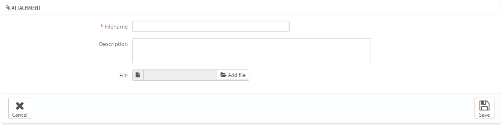

# Gestire gli allegati

PrestaShop ti dà la possibilità di rendere disponibili per i tuoi clienti, alcuni files, prima che procedano ai loro acquisti. &#x20;

Per esempio,  vendi materiale elettronico e vuoi che i tuoi clienti leggano le istruzioni su come funziona un apparecchio. Puoi caricare la documentazione necessaria.\
Puoi anche far si che ci sia direttamente un manuale in pdf direttamente disponibile per essere scaricato dalla pagina prodotto.

Ogni prodotto può avere degli allegati, ognuno di essi inserito individualmente nella loro tabella "Allegati" sulla sinistra, come spiegato nel capitolo precedente "Aggiungere prodotti e categorie di prodotti"- Quella pagina ti fa accedere a tutti i files allegati del tuo negozio: se devi associare un file a più prodotti, in questo modo dovrai caricarlo solo una volta.

Puoi anche caricare degli allegati prima di associarli ai prodotti. Questo può essere fatto dalla pagina "Allegato" nel menu "Catalogo".

Il procedimento per registrare un nuovo allegato nel tuo negozio si effettua come segue:

1. Clicca su "Aggiungi nuovo", ed appare un modulo.
2. **Nomefile**. Dà al tuo allegato un nome, in tutte le lingue necessarie.
3. **Descrizione**. Inserisci una breve descrizione, anche qui in tutte le lingue necessarie.
4. Clicca su "Aggiungi file" per selezionare il file da caricare dal tuo computer..
5. Clicca su "Salva".

Vieni poi reindirizzato all'elenco degli allegati, dove apparirà il tuo nuovo file. E' ora disponibile per tutti i prodotti attraverso la tasto "Allegati" .

Ora apparirà il tasto  "Download"  nel tuo negozio on line ed i clienti potranno scaricarlo se necessario.
