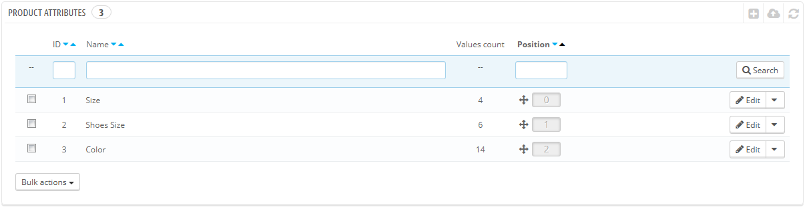
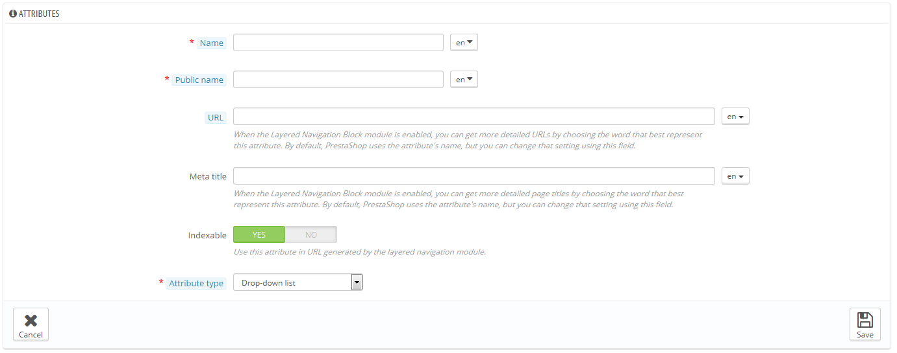
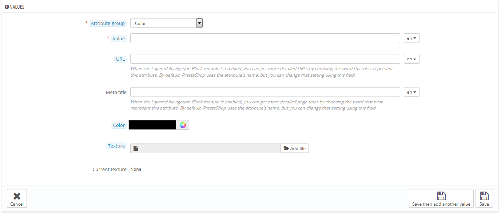

# Gestire gli Attributi Prodotto

Le caratteristiche/qualità sono la base della varianti del prodotto (o "combinazioni" nell'interfaccia di PrestaShop): puoi creare delle varianti di un prodotto solo se c'è almeno una delle sue caratteristiche cambiano.

Puoi pensare alle caratteristiche come proprietà di un prodotto che può cambiare all'interno di varianti, mantenendo lo stesso nome prodotto: colore, capacità, taglia, peso, ecc. Puoi usare qualsiasi dato che cambia tra le varie versioni dello stesso prodotto, tranne il prezzo.

La differenza tra una caratteristica (attribute) e la qualità (feature) dipendono dal prodotto. Alcuni prodotti potrebbero avere le stesse proprietà, una è una caratteristica che serve a produrre varianti, un' altra che è solo una caratteristica invariabile.

Per esempio, un cliente può comprare un iPod sulla base di certe caratteristiche (colore, spazio del disco fisso) ma non sulle qualità (peso o grandezza).

Nello stesso modo, alcuni negozi potrebbero vendere magliette che variano in base a caratteristiche (colore, taglia, genere) ma non sulle qualità (peso).

Le caratteristiche vengono configurate su una base per prodotto, dalla pagina "Prodotti" nel menu "Catalogo", ma prima devono essere registrate nel negozio usando la pagina "Caratteristiche del prodotto" nel menu "Catalogo".

Questa pagina presenta una lista di tutte le caratteristiche attualmente registrate. Puoi modificarle o eliminarle usando i tasti sulla parte destra della tabella, o mostrare i valori cliccando il tasto "Mostra" che apre una nuova tabella.

Puoi anche impostare l'ordine di presentazione delle caratteristiche nella presentazione nella pagina iniziale del negozio cliccando sulle frecce, o trascinando e lasciando ogni riga quando il mouse si passa sopra la colonna "Posizione".

## Creare nuove caratteristiche 

Per aggiungere una nuova caratteristica, o in altre parole, aggiungere un gruppo di varianti (colore, capacità, materiale, ecc), devi cliccare su "Aggiungi una nuova caratteristica). Appare una nuova pagina.

Riempi il modulo:

* **Nome**. L'esatta descrizione della caratteristica. Deve essere breve ma precisa, in modo da non confondersi con altre caratteristiche.
* **Nome pubblico.** Il nome della caratteristica, come viene mostrata ai clienti nella pagina prodotto. Dal momento che alcune caratteristiche potrebbero avere lo stesso nome per un contenuto diverso, questo campo deve ti dà la possibilità di presentarlo in modo corretto all'interno del contesto del prodotto, ed poter ancora distinguere una caratteristica dall'altra con un nome simile ma con diverso significato.
* **Tipo di caratteristica**. Ti dà la possibilità di decidere se la pagina di un prodotto debba mostrare questi valori in un menu a tendina, o un tasto radio, o con un colore.

Ci sono anche altre tre opzioni disponibili quando attivi il modulo Blocco di navigazione a livelli. Non sono strettamente collegati alla layered navigation: forniscono un Url diretto a ciascuna variante di ogni prodotto. In questo modo, il cliente non solo può inviare un link diretto ad un amico, ma rende possibile anche un miglioramento nei motori di ricerca.

* **URL**. La parola da usare nell'Url. Di default, PrestaShop usa il nome pubblico della caratteristica.
* **Meta titolo**. La parola da usare nel titolo della pagina. Di default, PrestaShop usa il nome pubblico della caratteristica.
* **Indicizzabile.** Se i motori di ricerca devono indicizzare questa caratteristica o no.
* Il cliente può raggiungere l' URL semplicemente cliccando su una caratteristica dalla pagina prodotto: l' URL si modificherà per aggiungere un dettaglio finale, come per esempio\_ `#/color-metal` or `#/disk_space-16gb/color-green`.

Il generatore di navigazione a livelli non utilizza queste possibilità, da qui il testo della descrizione "Specifico formato Url nella generazione dei livelli" e "Utilizza questa caratteristica nell'Url generato dal modulo di layered navigation".

Salva le tue caratteristiche per ritornare alla lista delle caratteristiche. Devi ora aggiungere nuovi valori alle tue caratteristiche.

## Creare un nuovo valore. 

Clicca su "Aggiungi un nuovo valore". Appare una nuova pagina.

Riempi il modulo:

* **Tipo di caratteristica**. Dalla lista a tendina, seleziona una delle possibilità disponibili.
* **Valore.** Give a value to the attribute: "Red", "16 Gb", "1.21 gigowatts"...

I prossimi campi vengono mostrati solo se la caratteristica è un tipo di colore.

* **Colore**. Se la caratteristica è un colore, puoi inserire il valore usando il codice colore  in HTML color code (per esempio "#79ff52" o "bluchiaro"), oppure usare il codice colore per mostrare il tono corretto del colore.
* **Texture.** Se il tuo prodotto non ha un colore omogeneo ma uno, ma uno per esempio a strisce tigrate, puoi caricare una piccola immagine che verrà mostrata  nella pagina prodotto. Ricorda che questa prenderà il posto del colore in Html dal campo di sopra. Clicca sul tasto "Salva" per iniziare a caricare. Puoi anche usare questa opzione per far si che il cliente possa scegliere il tipo di colore da una foto di tua produzione invece che da un colore. Come questo possa essere mostrato sul l'interfaccia utente  dipende dal tema che stai usando.
* **Texture corrente**. Una volta che hai caricato il file con il texture, viene mostrato in questa sezione come promemoria.

Puoi anche aggiungere più valori per la medesima caratteristica salvando le tue modifiche usando "Salva e poi aggiungi un altro valore".

Due altre opzioni sono disponibili quando attivi il modulo "Blocco layered navigation. Non sono strettamente collegati alla layered navigation: essi offrono un Url diretto per ogni variante del prodotto. In questo modo non solo il cliente sarà in grado di inviare il link corretto ad un amico, ma anche aiutare a migliorare il posizionamento nei motori di ricerca.

* **URL**. La parola da usare nell'URL. Di default, PrestaShop usa il nome del valore.
* **Meta titolo**. La parola da usare nell' URL. Di default, PrestaShop usa il nome del valore.

Il cliente può andare all' URL semplicemente cliccando sulla caratteristica sulla pagina prodotto, e l'Url cambierà per aggiungere un dettaglio finale, per es. `#/color-metal` or `#/disk_space-16gb/color-green`.

Il generatore di layered navigation non l'utilizza, da qui "Lo specifico formato Url nel generatore block layered " .

Once your attributes are in place and their values are set, you can create product variations (or "combinations") in each product's "Combinations" tab, from the "Products" page under the "Catalog" menu.
