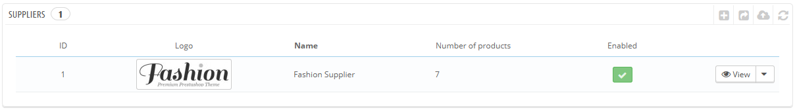
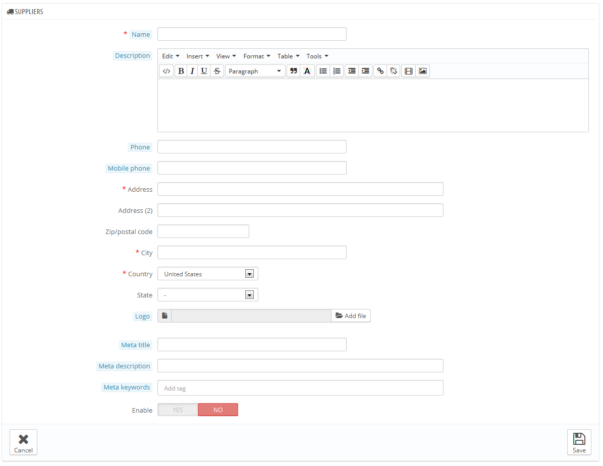

# Gestire i Fornitori

Registrare i fornitori può essere facoltativo se hai già dei produttori che ti forniscono direttamente i prodotti. Dipende dalle tue necessità, ma se i tuoi fornitori sono diversi dai produttori, sarebbe meglio che siano entrambi registrati nel tuo sistema, associando ciascuno ad ogni prodotto.

In PrestaShop, un fornitore è colui che ti fornisce un prodotto.

Anche se produci da te i prodotti che vendi, devi creare la tua azienda come fornitore.

Così come per i produttori, i visitatori del tuo sito possono accedere rapidamente a tutti i prodotti dei tuoi fornitori. Questo rende la navigazione più semplice per loro. In termini di visibilità, compilando tutti i campi, migliori la tua posizione nei motori di ricerca.

Clicca su "Aggiungi un fornitore" ed appare un modulo.

Riempi tutti i campi:

* **Nome**. Indica il nome del fornitore in modo da semplificare le ricerche dei tuoi visitatori.
* **Descrizione**. Aggiungi una descrizione più complessa del tuo fornitore ,delle loro attività e prodotti.\
  Puoi inserire dettagli delle loro specialità e promuovere la qualità dei loro prodotti. La descrizione del fornitore sarà visibile nel tuo negozio.
* I campi indirizzo (telefono, indirizzo, cap, città, stato, Paese). Il campo "Stato" appare solo per paesi importanti.
* **Logo**. Avere un logo dei fornitori è essenziale: fa si che i clienti abbiamo la stessa fiducia nel tuo negozio, che hanno nei confronti de fornitore/marchio.
* Campi SEO  (Titolo, Meta descrizione, meta parole chiave). Offre le stesse funzioni che hanno nelle categorie.
  * **Meta titolo**. Il titolo che apparirà nei motori di ricerca quando viene fatta una richiesta da parte di un cliente.
  * **Meta descrizione**. Una breve presentazione di poche righe nel tuo sito, che catturi l'interesse dell cliente. Questa apparirà nei risultati della ricerca.
  * **Meta parole chiave**. Le parole chiave che devi definire in modo che il tuo sito sia riportato nel motori di ricerca. Puoi inserirne parecchie, separate da virgole, anche delle frasi, che devono essere inserite tra virgolette.
* **Abilitare**. Puoi disabilitare un fornitore, anche temporaneamente. In questo modo lo eliminerai dalla lista fornitori nella parte anteriore del negozio.

Salva le modifiche in modo da poter ritornare poi alla lista fornitori. Da qui, puoi:

* Clicca sul nome o sul logo di un fornitore, in tal modo avrai tutti i prodotti associati ad esso. Se non ce ne sono, devi lavorare su una base per prodotto, dalla pagina "Prodotti" nel menu "Catalogo", usando il tasto a sinistra "Associazioni" per ogni prodotto. \
  Lo stesso risultato viene ottenuto cliccando l'icona corrispondente sulla destra.&#x20;
* Disattivare un fornitore, cliccando sul segno di spunta verde. Una volta disabilitato, apparirà la spunta rossa, cliccando nuovamente si riabilita il fornitore.
* Modificare/eliminare un fornitori cliccando sui rispettivi tasti a destra.&#x20;
