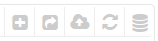
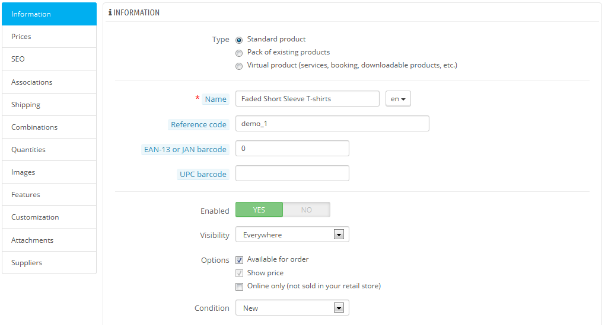
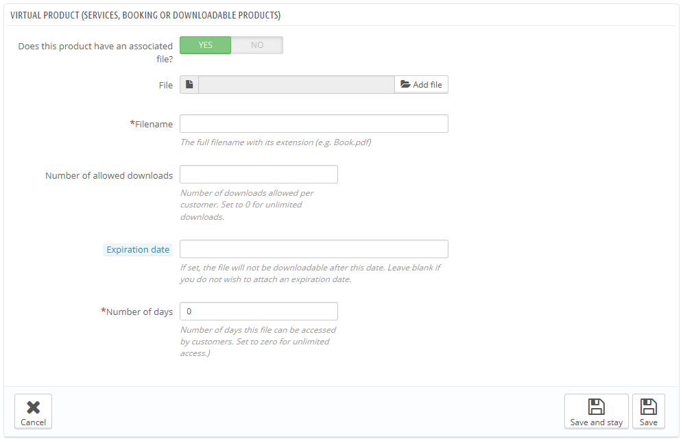

# Gestire i Prodotti

## Gestire Prodotti 

Puoi gestire i prodotti nel tuo negozio utilizzando la pagina “Prodotti”, nel menu “Catalogo”. &#x20;

Cliccare sull’opzione "Prodotti" del menu "Catalogo" ti porta alla lista dei tuoi prodotti correnti, esposti assieme ai loro dettagli principali: ID, foto, nome, riferimenti, categorie, ecc.

Sezioni in questo capitolo:

* [Gestione dei prodotti](http://doc.prestashop.com/display/PS16/Managing+Products#ManagingProducts-ManagingProducts)
  * [La Lista Prodotti](gestire-i-prodotti.md#GestireiProdotti-La-Lista-Prodotti)
  * [I Pulsanti Globali Della Pagina Di Creazione Prodotto](gestire-i-prodotti.md#GestireiProdotti-I-Pulsanti-Globali-Della-Pagina-Di-Creazione-Prodotto)
  * [Compilare le Informazioni del Prodotto](gestire-i-prodotti.md#GestireiProdotti-Compilare-le-Informazioni-del-Prodotto)
  * [Impostare il Prezzo di un Prodotto](gestire-i-prodotti.md#GestireiProdotti-Impostare-il-Prezzo-di-un-Prodotto)
  * [Ottimizzare la posizione del tuo prodotto nei motori di ricerca (SEO)](gestire-i-prodotti.md#GestireiProdotti-SEO)
  * [Managing the Product's Associations](gestire-i-prodotti.md)
  * [Evaluating Shipping Cost: Size, Weight, Carrier](http://doc.prestashop.com/display/PS16/Managing+Products#ManagingProducts-EvaluatingShippingCost:Size,Weight,Carrier)
  * [Adding Product Combinations](http://doc.prestashop.com/display/PS16/Managing+Products#ManagingProducts-AddingProductCombinations)
  * [Managing Product Quantities](http://doc.prestashop.com/display/PS16/Managing+Products#ManagingProducts-ManagingProductQuantities)
  * [Configuring the Product's Images](gestire-i-prodotti.md)
  * [Configuring Product Features](http://doc.prestashop.com/display/PS16/Managing+Products#ManagingProducts-ConfiguringProductFeatures)
  * [Managing Customization](http://doc.prestashop.com/display/PS16/Managing+Products#ManagingProducts-ManagingCustomization)
  * [Managing Attachments](http://doc.prestashop.com/display/PS16/Managing+Products#ManagingProducts-ManagingAttachments)
  * [Setting the Product's Supplier](gestire-i-prodotti.md)
  * [Managing Warehouses (advanced)](http://doc.prestashop.com/display/PS16/Managing+Products#ManagingProducts-ManagingWarehouses\(advanced\))
* [Creating a Pack of Products](http://doc.prestashop.com/display/PS16/Managing+Products#ManagingProducts-CreatingaPackofProducts)
* [Creating a Virtual Product](http://doc.prestashop.com/display/PS16/Managing+Products#ManagingProducts-CreatingaVirtualProduct)

### La Lista Prodotti 

Cliccare sull’opzione "Prodotti" del menu "Catalogo" ti porta alla lista dei tuoi prodotti correnti, esposti assieme ai loro dettagli principali: ID, foto, nome, riferimenti, categorie, ecc.

Accanto alla lista prodotto, questa pagina ti mostra quattro statistiche dal tuo negozio:

* Percentuale di articoli in magazzino,
* Percentuale di margine commerciale medio,
* Percentuale di vendite durante gli ultimi 30 giorni,
* Numero di prodotti disabilitati.

L’opzione "Filtra per categoria” ti permette di mostrare solo i prodotti pertinenti alla tua ricerca corrente, così come riorganizzare la posizione dei prodotti all’interno di una categoria.&#x20;

| 
  <strong>Posizione prodotto</strong>

Non puoi riorganizzare l’intera lista dei prodotti. I prodotti sono esposti così come compaiono nel tuo negozio (incrementando il numero ID), e il cliente può scegliere l’ordine dei prodotti utilizzando gli algoritmi di suddivisione disponibili: prezzo più basso per primo, prezzo più alto per primo, nome prodotto dalla A alla Z, nome prodotto dalla Z alla A, prima in magazzino, riferimento più basso per primo, riferimento più alto per primo.

Puoi organizzare i prodotti su una base per-categoria cliccando sulla casella "Filtra per categoria". Questo aprirà una piccola interfaccia elencante tutte le tue categorie e sotto-categorie. Selezionare una categoria filtra automaticamente la lista dei prodotti per mostrare solamente i prodotti dalla categoria selezionata. Aggiunge anche una colonna "Posizione" alla tabella, con cui puoi ordinare il prodotto sulla pagina categoria. Questo viene fatto muovendo le file in su e in giù o cliccando sulle frecce.

L’ordine del tuo prodotto può essere disabilitato dalla scelta di smistamento dell’utente.

Nota che, quando cambi l’ordine display nella lista prodotti del back-office (cliccando sulla freccia del nome colonna in modo da smistare i prodotti abbinati a quella colonna), la colonna “Posizione” non mostra frecce né ti permette di spostare più file. Essa mostra invece il numero di posizione del prodotto. Per essere in grado di posizionare prodotti di nuovo, clicca sul pulsante “Reset”.
 |
| ------------------------------------------------------------------------------------------------------------------------------------------------------------------------------------------------------------------------------------------------------------------------------------------------------------------------------------------------------------------------------------------------------------------------------------------------------------------------------------------------------------------------------------------------------------------------------------------------------------------------------------------------------------------------------------------------------------------------------------------------------------------------------------------------------------------------------------------------------------------------------------------------------------------------------------------------------------------------------------------------------------------------------------------------------------------------------------------------------------------------------------------------------------------------------------------------------------------------------------------------------------------------------------------------------------------------------------------------------------------------------------------------------------------------------------------------------------------------------------------------------------------------------------------------------------------------------------------------------------------------------------------- |

Finalmente, in cima alla lista prodotti verranno mostrati quattro pulsanti:

*
  * **Aggiungi nuovo prodotto**. Crea un nuovo prodotto.
  * **Esporta**. Scarica un file CSV di tutti i prodotti nel tuo catalogo.
  * **Importa**. Ti invia alla pagina opzione Importa CSV, da dove puoi importare i tuoi file CSV.
  * **Aggiorna la Lista**. Ricarica la lista dei prodotti per mostrare gli ultimi cambiamenti.
  * **Esporta al Manager SQL.** Apre lo strumento SQL Manager  di PrestaShop (nel menu "Parametri Avanzati”, da cui puoi interrogare PrestaShop con affermazioni SQL ("SELECT ... FROM ... WHERE ...").\
    &#x20;Se la tua lista prodotti fosse filtrata (dal nome, per esempio), allora l’affermazione SQL predefinita la porterà all’interno dell’account (per esempio, "WHERE 1 AND b.\`name\` LIKE '%blouse%'").

Puoi aggiungere nuovi prodotti cliccando su"Aggiungi nuovo". Apparirà una casella con molte tabelle nella colonna di sinistra e due pulsanti in cima: "Torna alla lista" e "Aiuto".

### I Pulsanti Globali Della Pagina Di Creazione Prodotto 

Come impostazione predefinita, la pagina di creazione prodotti ha due pulsanti che troverai nella maggior parte delle pagine amministrative: "Moduli raccomandati" e "Aiuto".

Al fondo di ciascuna pagina ci sono tre pulsanti:

* **Salva**. Salva qualunque modifica hai fatto a ciascuno dei dati per il prodotto corrente, e ti riporta alla lista prodotto.
* **Salva e Rimani**. Salva qualunque modifica hai fatto/compiuto su ciascuno dei dati per il prodotto corrente, e ti tiene sul tab corrente. Questo è particolarmente utile quando vuoi cambiare tab(s) senza perdere le tue modifiche al tab corrente, o per vedere le tue modifiche immediatamente applicate.
* **Cancella**. Ti riporta semplicemente indietro alla lista prodotto, senza salvare alcuna modifica che hai fatto in alcuno dei tab da questa pagina.&#x20;

.png>)

Non appena dai un nome al tuo nuovo prodotto e clicchi sul pulsante "Salva e rimani" al fondo, appariranno più pulsanti nella parte superiore della pagina prodotto:

* **Anteprima**. Mostra la front-page del tuo prodotto. E’ molto mobile, dal momento che funziona anche se il prodotto è disabilitato (Tab“Informazioni”).
*   **Duplica**. Crea un’esatta copia del prodotto corrente. E’ molto utile se dovessi usare i dati del prodotto corrente come template per un altro nuovo prodotto, e non dover creare tutti i dati del nuovo prodotto manualmente. Per esempio, due prodotti possono essere molto diversi, ma condividere le stesse associazioni, corrieri o impostazioni di rifornimento\

    | 
 <strong>Non duplicare più volte</strong> <strong></strong> Se hai bisogno di creare differenti versioni dello stesso prodotto per via della sua varietà di colori, capacità, dimensioni, ecc., dovresti allora creare combinazioni per il prodotto corrente invece di duplicarlo X  volte. Vai al tab “Combinazioni” sulla sinistra, come viene spiegato nella sezione di questo capitolo “Aggiungere Combinazioni Prodotto”.
 |
    | ----------------------------------------------------------------------------------------------------------------------------------------------------------------------------------------------------------------------------------------------------------------------------------------------------------------------------------------------------------------------------------------------------------------------------------------------------------------------------------------------------------- |

    * **Vendite Prodotto**. Ti reindirizza alla pagina "Dettagli prodotto" della dashboard (statistiche) ("Stats" menu), che ti fornisce un grafico di entrambe le visite a questa pagina prodotto, e anche le sue vendite.
    * **Elimina questo prodotto**. Rimuove tutti i dati per il prodotto corrente, comprese le sue immagini, combinazioni, caratteristiche, ecc.
    * **Moduli raccomandati**. Apre una finestra modale che ti consiglia come installare alcuni moduli popolari dal mercato Addons di PrestaShop.&#x20;

### Compilare le Informazioni del Prodotto 

Il primo tab contiene le informazioni di base del prodotto.&#x20;

La prima linea è essenziale: indica se il prodotto è un pacchetto (una combinazione di almeno due prodotti), un prodotto virtuale (file scaricabile, servizio, ecc.), o semplicemente un classico prodotto inviato via mail. Per ora, esploreremo solamente i prodotti classici, occupandoci di pacchetti e prodotti virtuali nelle specifiche sezioni di questo capitolo.Icon

| 
 Ci sono molte altre opzioni connesse ai prodotti nella pagina “Prodotti” dal menu “Preferenze”:
<ul><li>

<ul><li>

<ul><li>Numero di giorni nei (per) quali il prodotto è considerato ‘nuovo’.</li><li>Ordine prodotto predefinito.</li><li>Abilita gestione magazzino avanzata.</li><li>ecc.</li></ul></li></ul></li></ul>
Dovresti controllare attentamente che queste impostazioni globali siano impostate come desideri.
 |
| --------------------------------------------------------------------------------------------------------------------------------------------------------------------------------------------------------------------------------------------------------------------------------------------------------------------------------------------------------------------------------------------------------------------------------------------------------------------------------------------------------------------- |

Cominci con quattro caselle di testo:

*   **Nome**. La prima cosa da completare è il nome prodotto, che apparirà nei risultati dei motori di ricerca. Accanto alla casella troverai un codice lingua, che ti permette di scegliere la lingua con la quale intendi modificare o creare il nome. \
    \

    | 
 Devi dare un nome al prodotto almeno nella lingua predefinita prima di salvarlo. Non sarai in grado di salvare fino a che il prodotto non avrà un nome– e molti altri tab richiedono che il prodotto, per essere  accessibile, sia salvato.  Assicurati di tradurre ciascuna casella in tutte le lingue che il tuo negozio supporta. Per farlo, clicca sul codice lingua vicino alla casella, e scegli la lingua con cui intendi modificare il testo.
 |
    | ------------------------------------------------------------------------------------------------------------------------------------------------------------------------------------------------------------------------------------------------------------------------------------------------------------------------------------------------------------------------------------------------------------------------------------------------------------------------------------------------------------------------------------ |
* **Codice di Riferimento**. Questo è il tuo riferimento interno. Potrebbe essere un numero, o il suo riferimento dalla posizione del deposito o il suo fornitore, o qualsiasi cosa che lo renda unico.
* **EAN-13 o codice a barre JAN**. Questi sono i numeri del codice a barre del prodotto, usati in tutto il mondo per identificarlo. Puoi usare sia un EAN-13 o un numero JAN.
  * Un EAN-13 è il numero articolo internazionale 13-digit del prodotto. Leggi di più su Wikipedia: [http://en.wikipedia.org/wiki/International\_Article\_Number\_%28EAN%29](http://en.wikipedia.org/wiki/International\_Article\_Number\_\(EAN\)).
  * Uno JAN è specific del Giappone, ma è compatibile con l’EAN internazionale. Leggi di più su Wikipedia: [http://en.wikipedia.org/wiki/Japanese\_Article\_Number](http://en.wikipedia.org/wiki/Japanese\_Article\_Number).
* **UPC**. Un codice a barre 12-digit, più usato in America del Nord, UK, Australia e Nuova-Zelanda. Leggi di più su Wikipedia: [http://en.wikipedia.org/wiki/Universal\_Product\_Code](http://en.wikipedia.org/wiki/Universal\_Product\_Code).

Poi vengono quattro opzioni:

* **Abilitato**. Se non vuoi che questo prodotto sia immediatamente disponibile o visibile dai tuoi clienti, cambia l’opzione in "No".
* **Visibilità**. Inoltre, puoi scegliere di avere il prodotto disponibile attraverso canali differenti:
  * **Ovunque**. I clienti possono arrivare al prodotto scorrendo il catalogo, cercando il nome del prodotto, o usando direttamente il suo URL.
  * **Catalogo**. I clienti possono arrivare al prodotto scorrendo il catalogo o usando direttamente il suo URL.
  * **Ricerca**. I clienti possono arrivare al prodotto cercando il suo nome o usando direttamente il suo URL.
  * **Da nessuna parte**. I client possono solo arrivare al prodotto usando il suo URL. Non lo troveranno scorrendo attraverso il catalogo o cercando il suo nome. Questa impostazione è utile per creare prodotti privati accessibili solo da pochi visitatori fidati, anche temporaneamente (puoi cambiare questa impostazione in qualunque momento).   &#x20;
* **Opzioni**. Un paio di opzioni specifiche.
  * **Disponibile per l’ordine**. Deselezionando questa casella, I clienti non saranno in grado di aggiungere questo prodotto al loro carrello. Questo lo renderebbe più simile a una modalità Catalogo  prodotto singolo (a confronto con la preferenza “Modalità catalogo”).
  * **Mostra prezzo**. Se l’opzione (soprastante) "disponibile per l’ordine" è deselezionata, puoi scegliere di mostrare il prezzo del prodotto (nondimeno) (anche se i visitatori non saranno in grado di comprarlo) o scegliere di non mostrarlo.
  * **Solo online (non venduto nel negozio)**. Se il tuo business dispone di negozi “mattoni e malta”, quest’opzione risulterà inestimabile qualora un prodotto dovesse solo essere venduto online, non in negozio – questo impedisce ai clienti di controllare il prezzo di un prodotto online, quindi venire nel tuo negozio nella speranza di comprarlo direttamente, e perciò evitare le spese di spedizione.
* **Condizione**. Non tutti i negozi vendono nuovi prodotti. Questa opzione ti permette di indicare la condizione del prodotto:
  * **Nuovo**. Il prodotto è nuovo di zecca, sigillato nel suo pacco originale.
*
  *
    * **Usato**. Il prodotto è stato venduto almeno una volta prima, e usato probabilmente da qualcun altro (seconda mano). Dovrebbe venire nel suo pacco originario, che dovrebbe essere chiuso con del nastro adesivo.
    * **Messo a nuovo**. Il prodotto è stato restituito per varie ragioni (“graffi, ammaccature o altre forme di danno cosmetico che non interessano la prestazione dell’unità). Leggi di più su Wikipedia: [http://en.wikipedia.org/wiki/Refurbishment\_%28electronics%29](http://en.wikipedia.org/wiki/Refurbishment\_\(electronics\)).

Ora che tutti questi dettagli sono incisi sulla pietra, puoi cominciare ad aggiungere una descrizione per il tuo prodotto.\
&#x20;Descrivere bene il tuo prodotto è essenziale, sia per il cliente (più informazioni, meglio è), sia per i motori di ricerca (aiuterà il tuo negozio a comparire in più richieste di ricerca).&#x20;

.png>)Al fondo dello schermo, i due campi descrizione ricoprono ognuno un obiettivo diverso:

* Il campo **"Descrizione breve"** ti autorizza a scrivere una descrizione breve che apparirà nei motori di ricerca e nella descrizione di categoria per il tuo prodotto. \
  Questo campo è limitato ai 400 caratteri come impostazione predefinita: se si eccede tale limite, PrestaShop provvederà ad avvertirti con un messaggio in rosso al di sotto del campo. Puoi cambiare quel limite nella pagina preferenze “Prodotto”, dove troverai l’opzione “Dimensione massima della descrizione breve”.
* Il campo **"Descrizione"** ti permette di scrivere una descrizione completa del tuo prodotto, che apparirà direttamente sulla pagina prodotto. Il text editor offre un’ampia gamma di opzioni per creare descrizioni visivamente attraenti (font, dimensione, colore del testo, ecc.).\
  &#x20;Mentre il secondo campo non ha limiti, nel primo i contenuti sono troppo lunghi: sforzati di fornire le informazioni essenziali in un modo che risulti coinvolgente, e il tuo prodotto dovrebbe andar bene.\
  \

Sotto il campo "Descrizione", puoi trovare un piccolo strumento per aggiungere una delle immagini che hai allegato al prodotto (attraverso il tab “Immagini”) alla “Descrizione”, utilizzando tag immagine. Clicca su “Clicca qui” per aprire lo strumento.

.png>)

Seleziona semplicemente l’immagine che vuoi, scegli la sua posizione in relazione al testo e la sua dimensione, e PrestaShop genererà un tag immagine che potrai in seguito inserire direttamente nella descrizione (preferibilmente tra due paragrafi, o al principio di un paragrafo).

Nel campo **"Tag"**, aggiungi alcuni termini e parole chiave che aiuteranno i tuoi clienti a trovare facilmente ciò che stanno cercando.&#x20;

.png>)

Sono esposti nel negozio al blocco “Tag” (se disponibile). Se non vuoi che il blocco tag venga mostrato, ti basta disabilitare il modulo “Blocco Tag” (nella pagina “Moduli”).

| 
 <strong>Differenze con PrestaShop 1.4</strong>

PrestaShop 1.4 ti permetteva di indicare il costruttore del prodotto direttamente in questo tab. A partire dalla versione 1.5, questa impostazione deve essere trovata nel tab "Associazioni" sulla sinistra. Stessa cosa per il campo "Categoria predefinita", le categorie associate, e il campo "Accessori".

La versione 1.4 ti permette anche di indicare la dimensione e il peso del pacchetto finale. A partire dalla versione 1.5, queste impostazioni devono essere trovate nel tab “Spedizione” sulla sinistra.

Il campo "Location" della versione 1.4 può essere trovato nel tab opzionale "Magazzini" sulla sinistra, disponibile solo se hai abilitato la Gestione Avanzata Magazzino (menu "Impostazioni", pagina "Products”, sezione "Magazzino prodotti").
 |
| ------------------------------------------------------------------------------------------------------------------------------------------------------------------------------------------------------------------------------------------------------------------------------------------------------------------------------------------------------------------------------------------------------------------------------------------------------------------------------------------------------------------------------------------------------------------------------------------------------------------------------------------------------------------------------------------------------------------------------------------------------------------------------------------------------------------------------------------------------------------------------------------------------------- |

Una volta inserite tutte queste informazioni, salva il tuo lavoro, dopodiché verrai mandato alla tua lista dei prodotti. Se salvi cliccando su “Salva e rimani”, sarai in grado di continuare a lavorare alla presentazione del tuo prodotto.

### Impostare il Prezzo di un Prodotto 

Viene tutto eseguito nella casella "Prezzi" sulla sinistra. La sezione dei prezzi può essere piuttosto intimidatoria, con campi che si influenzano l'un l'altro e tasse da tenere in considerazione – ma in verità è tutto abbastanza semplice.

.png>)

Imposta il prezzo che comparirà nel tuo negozio seguendo le sotto indicate istruzioni:

* **Prezzi all’ingrosso**. Ti dà la possibilità di conoscere immediatamente il prezzo all’ingrosso, il prezzo di fabbrica e quindi puoi confrontarlo con il prezzo di vendita e calcolare facilmente il guadagno.
* **Prezzo al dettaglio**. I prezzi dei tuoi prodotti al netto delle tasse.&#x20;
* **Tassazione**. La tassa applicabile ai prodotti. Puoi scegliere tra le varie aliquote che hai impostato.\
  &#x20;Se  hai bisogno di creare nuove aliquote, clicca sul pulsante “Crea una nuova tassa”. L’inserimento della nuova aliquota si trova nel menu “Localizzazione”
* **Usa Ecotax  (Tassa inclusa)**. Il valore della eco-tassa  per questo prodotto. Questo valore è già incluso nel prezzo di vendita. Tu devi dichiarare tale tassa all’ufficio erariale del tuo paese.\
  &#x20;_Nota: non è un campo  visibile di default_.  Se devi includere la tassa ecologica, devi prima attivarla: vai nel menu "Localizzazione", seleziona la pagina "Tasse", sezione “Opzione tasse” (in fondo alla pagina) e scegli "Si" all’opzione "Usa ecotax".
* **Prezzo al dettaglio con tasse**. Visualizza il prezzo del prodotto , tasse incluse. Tu puoi modificare il valore e si aggiornerà  automaticamente  il “prezzo al dettaglio prima delle tasse” a seconda della tassazione che hai scelto.
* **Prezzo unitario**.  Ti permettere di essere conforme alle normative locali che richiedono che venga mostrato il prezzo unitario.\
  Ad esempio se stai vendendo una confezione  di 6 lattine, devi inserire in questo campo il prezzo di ogni lattina ed indicare “lattina” nel campo. La descrizione sulla stessa riga si aggiornerà di conseguenza
* **Come mostrare l'icona “in offerta/in saldo" nella pagina del prodotto e nel testo all’interno del listino prodotti.**\
  Controlla/spunta check box per far vedere che il tuo prodotto è in svendita visualizza il tuo prodotto in saldo, sia nella scheda prodotto sia nella lista prodotti. Apparirà un’icona “In saldo/in offerta” sotto il prodotto. Puoi modificare il logo cambiando il file: `themes/default/img/onsale_en.gif`
* **Prezzo di vendita finale**. Questo prezzo, incluso gli sconti impiegati, si aggiornerà mentre scrivi.\
  \

IconaTu puoi  riempire tutti i campi "prezzo di vendita incluso le tasse"   e scegliere l’aliquota da applicare, ed il campo calcolerà  automaticamente calcolare il prezzo al dettaglio al netto delle tasse. Puoi fare anche l’operazione inversa.

A questo punto hai tutte le informazioni essenziali per creare una pagina prodotto base. Puoi salvarla ed utilizzarla immediatamente per la vendita. Ma  continua a leggere, siccome ci sono ancora molti dettagli che puoi aggiungere al tuo prodotto per renderlo più attraente ai tuoi clienti.&#x20;

**Prezzi particolari: Gestione dello sconto**

Puoi cambiare il prezzo totale in base alla quantità di prodotti acquistati dal tuo cliente, in base al gruppo, al paese ecc.  Questo può essere fatto nella sezione “prezzo particolare” nel tab “prezzi” Clicca sul pulsante “aggiungi un nuovo prezzo particolare” per mostrare la form per crearlo.

.png>)

Questo è un modo molto facile per creare un prezzo scontato per questo prodotto (e tutte le sue combinazioni).

Click "Aggiungi un prezzo specifico", e compare una form.

* **Per**. Questo ti dà la possibilità di essere molto specifico riguardo ai diversi gruppi a cui applicare il prezzo, includendo le valute, i paesi e pure i gruppi di clienti  (dei quali parleremo in un altro  capitolo.).
* **Cliente**. Puoi scegliere di essere ancora più specifico e stabilire direttamente a chi è rivolto lo sconto che stai creando. Inizia a scrivere le prime lettere del nome o del cognome del cliente, e seleziona quelli che vuoi.
* **Combinazione**. Puoi scegliere di far si che un prezzo specifico si applichi a tutte le combinazioni di prodotto, o solo ad una.  Se desideri che si applichi a più di una combinazione ma non a tutte, devi creare un prezzo specifico per ogni combinazione.
* **Disponibile da/a**. Qui puoi definire delle date entro quali lo sconto è attivo. Cliccando ogni selezionatore si apre un calendario, semplificando tutto il processo.
* **A partire da \[] unità**. Contiene il valore a partire dal quale lo sconto si applica. Di default c'è "1", che significa una qualsiasi quantità.
* **Applica uno sconto di (tasse escluse.)**. Qui è dove puoi stabilire un prezzo arbitrario, a prescindere da ogni calcolo o prezzo regolare. Tieni questo campo a "0" per usa il prezzo di default.\
  **Lascia il prezzo base**. Spunta questa casella per resettare il "Prezzo prodotto"  ed evitare che tu stesso possa modificarlo.
* **Applica uno sconto di**. Lo sconto che verrà applicato una volta che il cliente avrà scelto la quantità di prodotto. Usa il selezionatore per inserire il tipo discount (sia una somma specifica nella valuta corrente, sia  una percentuale del prezzo di default.

Una volta che hai scelto i valori, clicca "Salva e resta": un resoconto degli sconti inseriti apparirà sotto. Lo sconto sarà immediatamente visibile nel negozio.\
Se vuoi cancellare un valore, clicca sull'icona  del cestino sulla pagina.

Se desideri costruire degli sconti più complessi, leggi la sezione "Regole del prezzo" nel capitolo "Creare regole del prezzo e vouchers" in questa guida.

#### Managing Price Priority Gestione priorità del prezzo 

Ad un cliente potrebbero corrispondere più prezzi o sconti, anche se hai un dettagliato elenco di prezzi e quantità di sconti, per gruppi di clienti o per negozi (in un contesto di più negozi). PrestaShop quindi usa un set di priorità per far si che venga applicato una singola regola di prezzo a tali clienti. Tu potresti volere, per esempio, che il gruppo utente sia più importante della valuta.

Puoi modificare le impostazioni di default di PrestaShop default settings usando la sezione "gestione delle priorità" .

.png>)

L'ordine di importanza impostato è:

1. Negozio (in un contesto di più negozi).
2. Valuta.
3. Paese.
4. Gruppo.

Una casella in fondo dà la possibilità di aggiornare le impostazioni di tutti i prodotti. Se il checkbox  non viene spuntata, tutte le modifiche si applicheranno solo al prodotto corrente.

### Ottimizzare la posizione del tuo prodotto nei motori di ricerca (SEO) 

Per migliorare il tuo listino prodotto ed incrementare la visibilità del tuo negozio, suggeriamo di riempire con cura tutti i vari campi Seo: i meta titoli, le meta descrizioni, le parole chiave e gli Urls amici.Icona

"SEO"  sta per "Search Engine Optimization" :"Ottimizzazione del motore di ricerca". Puoi leggerne di più su  Wikipedia:[http://en.wikipedia.org/wiki/Search\_engine\_optimization](http://en.wikipedia.org/wiki/Search\_engine\_optimization)

Conosci le migliori pratiche   SEO practices per l' e-commerce! Scarica e leggi la "Guida completa per il Seo"  di PrestaShop, completamente gratuita :[http://www.prestashop.com/en/white-paper-seo](http://www.prestashop.com/en/white-paper-seo)

Per accedere alle informazioni Seo del prodotto, apri la Tab "Seo" a sinistra .

.png>)

I campi in questa pagina di permettono di ottimizzare direttamente la visibilità del tuo catalogo nei motori di ricerca.

* **Meta titolo**. Questo è il campo più importante, in quanto è il titolo che apparirà in tutti i motori di ricerca. Sii molto pratico: devi convincere l'utente del motore di ricerca a cliccare sul tuo link, non quello di un altro sito. Assicurati che il titolo sia unico per quel prodotto nel tuo sito.
  * un buon esempio: "Levi's 501® Original Jeans - Tidal Blue - Original Fit".
  * Un brutto esempio: "Item #02769869B bestseller".
* **Meta descrizione**. La descrizione di un prodotto in poche righe (ideale in meno di 155 caratteri) ,che deve catturare l'interesse del cliente. Questa apparirà nei risultati di alcuni motori di ricerca, in base alla richiesta della ricerca: alcuni motori di ricerca potrebbero scegliere di mostrare le parole chiave ricercate direttamente nel contenuto della pagina. Assicurati che la descrizione sia unica per quel prodotto nel tuo sito.&#x20;
* **URL amici**. Questo è un altro campo importante. Ti dà la possibilità di riscrivere gli indirizzi dei tuoi prodotto come desideri. Per esempio, invece di avere un indirizzo tipo:\
  [http://www.myprestashop.prestashop.com/index.php?id\_product=8\&controller=product](http://www.myprestashop.prestashop.com/index.php?id\_product=8\&controller=product)\
  puoi ottenere:\
  [http://www.myprestashop.prestashop.com/8-name-of-the-product.html](http://www.myprestashop.prestashop.com/8-name-of-the-product.html).\
  Tutto ciò che devi fare è indicare nel campo "Url amico" le parole che vuoi che appaiano invece che il nome di default, separato da trattini.\
  Il tasto "**Generare**" rende facile creare un url amico adatto al nome del prodotto. Una volta che è generate, puoi modificare l'url  prodotto se necessario.

L'icona "Url amici" funziona solo se è abilitata la riscrittura dell'Url. Puoi far ciò nella pagine "Seo\&Urls" nella sezione "Set up Urls"

Troverai maggiori informazioni sulla pagina "Seo\&Urls" nel capitolo "Capire le preferenze" in questa guida

Gestire le associazioni dei prodotti  &#x20;

Creare delle associazione per i tuoi prodotti significa collegarli ad altro contenuto nel tuo database:

* Categorie dei prodotti.
* Altri prodotti (accessori).
* Produttori.

.png>)

#### Categorie dei prodotti 

La sezione "categorie associate" The "Associated categories" ti permette di selezionare in che categoria deve apparire il prodotto. Puoi selezionarne più di una, ma ricordati che è meglio  per i clienti che la categoria contenga solo prodotti equivalenti o simili. Devi quindi evitare di selezionare categorie principali e preferire le sotto categorie.\
Per esempio, la categoria "telefoni"  può avere la sotto categoria "marche"  (Apple, Samsung, Nokia, ecc.) come pure la sotto categoria "caratteristiche  (smart-phone, cellulare apribile, ecc). Scegli tu il modo più giusto per i tuoi clienti,  per indicare le categorie.

Se pensi di aver bisogno di aggiungere una categoria, salva prima il prodotto che hai creato prima di cliccare il pulsante "Crea una nuova categoria". La creazione di una categoria verrà spiegata in un'altra sezione di questa guida.

Il selezionatore "Categoria di default" è utile quando un articolo viene inserito in più categorie. Serve principalmente per spiegare  che categoria usare se il cliente arriva al tuo sito attraverso un motore di ricerca, dal momento che il nome della categoria apparirà nell'url del prodotto.

Prodotti in evidenzaIcone

Flaggando la casella " "Home" ti permette di evidenziare quel prodotto nella homepage del tuo negozio, purchè il tuo **theme** lo permetta. Per eliminare un prodotto dalla lista di prodotti in evidenza, basta togliere la selezione "Home".

#### Accessori. 

Il campo "Accessori"  ti dà la possibilità di scegliere quali prodotti importanti associare a quel prodotto, di suggerirli ai tuoi clienti quando visitano la pagina del prodotto (se il **theme"** lo permette. Digita le prime lettere del prodotto e selezionalo. Il prodotto viene aggiunto nel campo in basso.

.png>)

Puoi associare un prodotto con quanti altri prodotti ritieni necessario. Clicca sulla croce per eliminare l'associazione.\
Una associazione va solo verso una direzione: il prodotto associato non mostrerà l'associazione al prodotto corrente nella sua pagina.Icona

Aggiunta o l'eliminazione di accessori non viene automaticamente salvata ! Non dimenticarti di cliccare il pulsante "Salva".

#### Produttori 

Un prodotto può essere associato ad un produttore. Scegline uno dal menu a tendina, o crea un nuovo produttore se è necessario (ma salva prima il prodotto corrente prima di cliccare sul link "Crea un nuovo produttore").

### Valutazione dei costi di spedizione: Misure, peso, spedizioniere 

Non bisogna dimenticare i costi di spedizione: questi possono anche raddoppiare il costo finale dell'ordine, e devi essere molto chiaro su di essi - i clienti odiano le sorprese.

.png>)

La casella "Spedizione" sulla sinistra, ti permette di fornire alcuni importanti dettagli sull'imballaggio del prodotto:

*   **Larghezza, profondità, altezza e peso dell'imballaggio.**  Dovresti cercare di riempire ogni campo, perché conoscere le esatte misure e peso dell'imballaggio non è utile solo a te, ma  PrestaShop può anche indirizzare specifiche misure/pesi a idonei spedizionieri in modo automatico, in base a questi dati. Il prezzo finale dell'ordine apparirà al cliente una volta che PrestaShop o il cliente abbiano selezionato lo spedizioniere. Icona

    Questi valori utilizzano il peso, volume, distanza e dimensione di default, così come sono stati inseriti nella pagina "Localizzazione" del menu "localizzazione"&#x20;

    Questi valori non devono essere a numero intero. Se i tuoi prodotti pensano meno di 1 libbra, puoi usare il "." per indicare le frazioni:

    * 123 libbre
    * 1.23 libbre
    * 0.23 libbra (uguale a  3.68 once)
    * etc.
* **Tasse di trasporto addizionali.**  Questo può essere utile per particolari prodotti che sono difficili da imballare o molto pesanti.&#x20;
* **Spedizionieri**. Puoi scegliere che certi prodotti vengano spediti solo da spedizionieri selezionati. Se non ci sono spedizionieri selezionati, allora qualsiasi spedizioniere può essere disponibile per gli ordini.

### Aggiungere combinazioni di prodotti.  

Potresti spesso trovarti a vendere lo stesso prodotto in diverse versioni: hanno lo stesso nome, ma possono variare in colore, capacità, larghezza dello schermo, o altre caratteristiche. Quasi sempre queste caratteristiche sono comuni: potresti avere una versione rossa di un prodotto disponibile con una capacità da 1 gb o 2, o con uno schermo da 12 pollici o 15 pollici. Ecco perchè PrestaShop chiama queste versioni "combinazioni": il tuo magazzino di prodotti può essere composto da diverse varianti del singolo prodotto, che sono solo le diverse caratteristiche combinate nei vari modi.Icona

Non puoi creare delle combinazioni se prima non hai inserito in modo corretto tutte le caratteristiche del prodotto in PrestaShop.\
Inoltre, non dovresti creare delle combinazioni per delle caratteristiche che i tuoi clienti potrebbero non essere in grado di scegliere.

La creazione di caratteristiche viene effettuata nella pagina "Caratteristiche del prodotto" dal menu "Catalogo, e viene spiegata in dettaglio nel capitolo con lo stesso titolo in questa guida.&#x20;

.png>)

Come possano essere associate le varie caratteristiche dipende da te, PrestaShop ti offre due modi per farlo.

#### Metodo manuale 

Questo metodo ti aiuta a creare delle combinazioni una dopo l'altra. Quindi, devi utilizzarlo sia per prodotti con poche combinazioni, sia con prodotti con delle combinazioni molto particolari che non possono essere create in modo affidabile usando il metodo automatico (vedi la prossima sezione).

.png>)

Per aggiungere una nuova variante al tuo prodotto bastano pochi passi. Clicca su "Nuova combinazione" in basso nella pagina, accanto al pulsante "Salva". Appare una scheda:

* **Coppia attributo-qualità  Attribute-value pair**.
  1. Dal menu a tendina, scegli un gruppo di attributi, per esempio "Colori". Il contenuto dei valori/qualità si aprirà di conseguenza.
  2. Scegli l'attributo qualità che vuoi includere, per esempio "blu".
  3. Clicca sul pulsante "Aggiungi" ed apparirà nel selezionatore. \
     Puoi aggiungere tutte le coppie attributo-qualità che ti servono per una combinazione.\
     Puoi aggiungere solo una coppia per ogni attributo per ogni combinazione: non è possibile di avere sia "Colore:Blu" e "Colore:Rosso" nelle tue coppie; se fosse necessario, dovrai creare nuovi attributi, per esempio "Colore principale" e "colore secondario".\
     Puoi cancellare la coppia attributo-qualità selezionandolo e cliccando sul pulsante "Cancella"&#x20;
* **Riferimento, EAN-13 & UPC**. Se necessario, puoi indicare il riferimento della combinazione, sia EAN-13, sia i numeri UPC in ogni campo, come se stessi creando una nuova marca di un nuovo prodotto in PrestaShop. Questi numeri possono essere usati dal tuo magazzino o dallo spedizioniere, quindi assicurati di compilare questi campi, sono spesso essenziali per la tua attività.&#x20;
* **Prezzo all'ingrosso**. Questo campo è importante se il prezzo originale del prodotto cambia se diventa una combinazione.
* **Impatto sul prezzo/peso/prezzo unitario**. Se la combinazione comporta un impatto sul prezzo, peso, prezzo unitario del prodotto originale, scegli il giusto menu a tendina, seleziona "Aumenta" o "Riduci" a seconda del contesto, e riempi il campo che appare, con il valore di tale impatto.&#x20;
* **Ecotax**. La tassa ecologica specifica per questa combinazione (se è abilitata l'opzione eco tassa).
* **Quantità minima**. Potresti preferire che questa combinazione venga venduta solo in gradi quantitativi. Usa questo campo per definire il numero di articoli da vendere in grandi quantità.
* **Data di disponibilità.**  Se il prodotto è esaurito, puoi indicare quando il prodotto sarà nuovamente disponibile.
* **Immagine**. Vengono mostrate le immagini che sono collegate al prodotto originale (caricate usando la scheda "Immagini" a sinistra) . Scegli le immagini che meglio rappresentano questa combinazione.
* **Default**. Clicca su questa casella se vuoi che la combinazione che stai creando sia quella principale per questo prodotto.

Quando hai inserito tutti i dettagli possibili della combinazione, salva le modifiche del prodotto usando il tasto "Salva e resta". La tua combinazione apparirà nella lista degli attributi in fondo allo schermo.

Differenze con PrestaShop 1.4Icona

In PrestaShop 1.4, c'era una scheda "raccoglitore di colore" in fondo alla lista di combinazioni, da dove potevi scegliere di avere o meno  una lista di colori sulla pagina del prodotto.

Con PrestaShop 1.5, questa opzione è stata tolta e migliorata. Quando crei un nuovo attributo (nel menu "Catalogo", pagina "Attributi & qualità"), puoi utilizzare il menu a tendina "Tipo di attributo (Attribute type) per scegliere se la pagina iniziale lo mostri come menu a tendina, o lista di pulsanti, o come raccoglitore di colori.&#x20;

#### Metodo automatico Automatic method 

Se hai troppi diversi prodotti o varietà, puoi utilizzare il "generatore di combinazioni di prodotti"   "Product Combinations Generator." Questo ti permette di generare automaticamente tutte le combinazioni e possibilità.

Cliccando su "Generatore di combinazioni di prodotti"  "Product combinations generator" ti porta ad una scheda completa.

.png>)Icona

Potrebbe apparire un avviso di fare attenzione, che dice "Perderai tutte le modifiche non salvate. Sei sicuro di voler procedere?" Questo significa che il tuo prodotto ha già delle combinazioni. Se accetti, si cancelleranno tutte le combinazioni che non hai ancora salvato. Fai attenzione, salva sempre il lavoro fatto prima di usare il generatore.

Su lato sinistro di questa pagina ci sono gli attributi ed i loro valori. Seleziona le combinazioni cliccando sui nomi dei valori (se ne vuoi selezionare più di uno, mantieni premuto il tasto Ctrl), poi clicca "aggiungi".\
Per esempio, potresti selezionare i valori "blu", "S",  M, L.\
Per rimuovere una selezione esistente, seleziona i loro valori e clicca "Cancella".

Una volta che le varietà sono state selezionate, puoi modificare l'impatto sul prezzo del prodotto e sul peso, in ogni selezione. Non è obbligatorio farlo: potrebbero essere gli stessi prezzi e gli stessi pesi.\
Inserisci la quantità di ogni prodotto nel campo "quantità di default" in basso. Fai attenzione, bisogna che sia la stessa per ogni combinazione. Per esempio, 200 prodotto in ogni combinazione = 2 colori\*1taglia\*200 = 400 prodotti in tutto.\
Puoi aggiungere un riferimento di default per questa combinazione se può essere necessario ai fini amministrativi.\
Clicca sul pulsante "Genera queste combinazioni""Generate these Combinations", e PrestaShop ti rimanderà al tasto "Combinazioni"  "Combinations" , con tutte le combinazioni generate. Se necessario, puoi ora modificarle una ad una.

Come puoi vedere il generatore di combinazioni ti aiuta a risparmiare molto tempo quando ha molti attributi da mettere insieme, tipo taglie e materiali. Crea automaticamente tutte le possibili combinazioni, che poi compariranno nella pagina pubblica del prodotto, nel tasto "Combinazioni" (se il tema lo supporta).\
Se non vuoi tenere tutte le combinazioni generate o se non sono tutte perfettamente uguali (diversi riferimenti, prezzi, data di disponibilità), puoi cancellarle (icona del cestino) o modificarla (icona del file) dalla lista di combinazioni del prodotto. L'icona a stella modifica la combinazione di selezionata in combinazione di default, in tal caso viene evidenziata in blu.

**Gestione della quantità di prodotti**

Le quantità di prodotti viene gestita in un'unica casella. Funziona in modo molto semplice: la pagina ti presenta una tavola con tutte le combinazioni del prodotto corrente (se non vi sono combinazioni, la tabella ha una unica riga). Dipende da te se inserire lo stock iniziare per tutte le combinazioni. PrestaShop userà questo dato per determinare quando un prodotto sta per essere esaurito o quando è già  esaurito.&#x20;

#### Opzioni della gestione delle giacenze Stock Management Options 

La casella quantità supporta la funzionalità avanzata della gestione delle giacenze, se attivata. Questo significa che se le combinazioni del prodotto corrente sono distribuite tra diverse locazione delle scorte, PrestaShop è in grado di gestire l'esatto posizionamento di ogni combinazioni, anche all'interno di ogni magazzino.

.png>)

Automaticamente, devi gestire le quantità del prodotto corrente a mano, per ogni combinazione, da questa pagine. Con la funzione di gestione avanzata delle scorte attivata, puoi  contare sulle funzioni di gestione del magazzino di PrestaShop per gestirlo.

Per utilizzare la gestione magazzino avanzata per il prodotto corrente, flaggare la casella "Voglio usare il sistema di gestione magazzino avanzata per questo prodotto". Una volta fatto, l'opzione "Quantità disponibili per il prodotto corrente e le sue combinazioni sono basate sulla scorta di magazzino" diviene disponibile. Cliccala, e non potrai più modificare le quantità di prodotto attuale dalle pagine "quantità": ora dipende dalla gestione del magazzino.&#x20;

#### Esaurito  

L'opzione "Esaurito"  "When out of stock"  ti dà la possibilità di che PrestaShop agisca quando il prodotto è esaurito: non accettare ordini (il prodotto non è più disponibile per la vendita) o accettare gli ordini (si fanno delle pre-vendite). La terza opzione e l'opzione di default semplicemente usa l'impostazione di default (Menu "preferenze", pagina "Prodotti", sezione "scorte prodotto", opzione "permettere gli ordini per prodotti esauriti"  ("Preferences" menu, "Products" page, "Product Stock" section, "Allow ordering of out-of-stock products" option).

#### Impostazioni di disponibilità  

In fondo alla pagina, puoi gestire il modo esatto in cui PrestaShop deve agire in base alla disponibilità del prodotto corrente.&#x20;

.png>)

Le opzioni sono:

* **Mostrare un testo quando il prodotto è disponibile .Displayed text when in-stock**. Ti dà la possibilità di mostrare un messaggio ai visitatori quando il prodotto è in magazzino, per esempio "articolo disponibile". Li rassicura sul fatto che poi spedire immediatamente il prodotto.
* **Testo mostrato quando il prodotto può essere pre ordinato. Displayed text when allowed to be back-ordered**.  Ti permette di mostrare un messaggio ai tuoi visitatori, quando un prodotto è esaurito ma puoi ancora ordinarlo (così come si può fare usando la selezione "Quando esaurito"  "**When out of stock**"), per esempio "Ordina in anticipo ora" ".  Questo li riassicura sul fatto che il tuo negozio potrà spedire il prodotto non appena sarà nuovamente disponibile.

Puoi anche configurare le impostazioni generali che si applicano a tutti i tuoi prodotti: l'opzione di default è di rifiutare gli ordini, ma può essere modificato nelle preferenze "Prodotti" (opzione "Permette gli ordini per prodotti esauriti)  ("Allow ordering of out-of-stock products" option), che viene spiegata in modo esauriente nel capito "Capire le preferenze " "Understanding the Preferences" in questa guida.

### Configurare le immagini dei prodotti Configuring the Product's Images 

La casella "Immagini" The "Images" sulla parte sinistra viene utilizzata per inserire le foto nella pagina dei prodotti. Devi caricare le immagini per il prodotto, includendo tutte le sue combinazioni (colore, taglie, forme, ecc).

.png>)

Per aggiungere una o più immagini al tuo prodotto:&#x20;

1. Clicca sul pulsante "aggiungi files "  "Add files" e poi seleziona almeno un file con l'immagine da caricare. Puoi selezionare quante immagini ritieni necessarie, tenendo premuto il tasto Ctrl mentre selezioni i files, oppure puoi selezionare una immagine alla volta. PrestaShop mostrerà le immagini scelte in una lista, con la loro dimensione, ed un pulsante per eliminarle.&#x20;
2. La dimensione massima dei files immagini viene definita da PrestaShop in base alle impostazioni del server PHP. La dimensione può essere ridotta nella pagina preferenze "Immagini" , nella sezione "immagini prodotto "Product images".
3. Metti una didascalia all'immagine. Verrà  mostrata se l'immagine non potrà essere visibile - cosa che può anche essere importante per l'ottimizzazione nel motore di ricerca.&#x20;
4. Clicca sul pulsante carica ( upload) per mettere on line il file.
5. Le immagini caricate appariranno in una nella tabella sotto il pulsante. Se hai più di una immagine, puoi scegliere che immagine bisogna utilizzare come immagine default o di copertina, cliccando sul pulsante rosso "non inserire" ( "no entry") e lo rendi un segno di spunta. Quell'immagine di copertina apparirà anche automaticamente nella pagina del prodotto nel tuo negozio\
   Puoi anche cliccare sull'anteprima per mostrare poi l'immagine a dimensione piena.

Una volta che hai caricato tutte le immagini dei prodotti, potrai anche modificare l'ordine delle immagini trascinandole tra le righe della tabella quando il cursore del mouse diventa un cursore che muove.&#x20;

### Configurare le caratteristiche dei prodotti. Configuring Product Features 

La tabella "Caratteristiche "The "Features" è dove puoi specificare le caratteristiche dei tuo prodotto (per es. peso, materiali, paese di origine, ecc).

.png>)

Quando crei caratteristiche e qualità   (per esempio: fatto a maglia in lana e micro fibre) , le assegni ai prodotti quando serve. Questo significa che non devi riempire tutti i campi caratteristiche per ogni prodotto, ma devi semplicemente riempire i valori necessari e poi applicarle più tardi.

Icona

Il motore di confronto di PrestaShop's  si basa unicamente sulle caratteristiche: queste vengono confrontante.

Inoltre, siccome il confronto del prodotto lavora sulla base per-categoria, deve anche assicurarti che tutti i prodotti in una determinata categoria abbiano le stesse caratteristiche, con diverse qualità che vengono confrontate tra loro.

Ricordati che al contrario delle combinazioni, queste qualità non cambiano, e sono valide per tutti i prodotti (cioè tutte le combinazioni avranno le stesse caratteristiche).

#### Creare una caratteristica Creating a feature 

Prima di aggiungere una caratteristica al prodotto, devi crearla per un uso generale nel tuo negozio. Puoi andare sia nella pagina "Caratteristiche"  "Features"  del menu "Catalogo" "Catalog", o puoi cliccare direttamente sul pulsante "Aggiungi una nuova caratteristica "  "Add a new feature". Ti apparirà un avviso "Perderai tutte le modifiche non salvate. Sei sicuro di voler procedere?"  "You will lose all unsaved modifications. Are you sure that you'd like to proceed?" – Assicurati di aver salvato tutte le modificare prima di confermare.&#x20;

Caratteristiche e qualità/valore delle caratteristiche vengono spiegate in dettaglio nella sezione ad esse dedicate nella guida.

#### Assegnare una qualità ed una caratteristica ad un prodotto Assigning a value and feature to a product 

Qui daremo per scontato che hai già inserito tutte le caratteristiche e tutte le qualità/valori delle caratteristiche.

Nel tabella "Caratteristiche" del prodotto corrente, sulla sinistra, vengono elencate tutte le caratteristiche presenti nel tuo negozio. Non tutte si riferiscono a questo prodotto: PrestaShop prenderà come rilevanti solo quelle caratteristiche dove hai   di fatto inserito un valore.

Puoi inserire un valore manualmente, nel campo di lato a destra, o puoi usare dei dati pre definiti (come inseriti quando la caratteristica è stata inserita) se sono disponibili.  \
Se non c'è alcun valore disponibile per una caratteristica, appare la scritta  "N/A"  (abbreviazione per "non disponibile" o "non applicabile), seguita dal pulsante "aggiungi dei valori pre definiti prima"   "Add pre-defined values first" .

Se scegli di utilizzare dei valori personalizzati, non dimenticarti di inserirli in ogni lingua che il tuo negozio utilizza. Utilizza il selettore di lingua per cambiare la lingua.

Se ci sono dei valori predefiniti disponibili, appariranno in un elenco a tendina. Clicca semplicemente e scegli il valore corretto.&#x20;

Una volta che hai inserito tutte le caratteristiche importanti, salva tutte le modifiche perché vengano applicate direttamente sulla pagina iniziale.&#x20;

Ricorda, se una caratteristica non ha alcun valore assegnato, non verrà presa in considerazione per questo prodotto, e non sarà visibile nel tuo negozio.&#x20;

### Gestire la personalizzazione Managing Customization 

PrestaShop  dà la possibilità ai tuoi clienti di personalizzare il prodotto che andranno ad acquistare.&#x20;

Esempio: sei un gioielliere al dettaglio ed i tuoi clienti hanno la possibilità di incidere il loro gioiello con un testo o un'immagine. I tuoi clienti possono inserire il testo o l'immagine quando fanno l'ordine.&#x20;

Il vantaggio di questa funzione è che offre ai clienti un servizio personale, che apprezzeranno senz'altro.&#x20;

Vediamo come configurare questa funzione. Nella casella  "Personalizzazione " a sinistra, puoi indicare il tipo di contesto (file o testo) che può essere personalizzato.

.png>)

* **Campi File.** Mette il nr indicato di pulsanti di caricamento file nella pagina ordine. Ogni pulsante accetta un solo file, quindi metti tanti campi quanti vuoi permettere ai tuoi clienti di caricare.&#x20;
* **Campi testo**. Mette il numero indicato di campi testo nella pagina ordine. Puoi inserire quanti campi testi sono necessari.
* Esempio: se dai la possibilità al tuo cliente di usare 5 righe di testo, ed ogni riga è di 14 caratteri, poi aggiungere 5 campi ed indicare il numero di caratteri permessi. Non puoi limitare il numero di caratteri nella riga.\
  \

Una volta che hai aggiunto il numero necessario per ogni campo, clicca "Salva e resta" "Save and stay". La pagina si ricaricherà e vedrai tanti campi testo quanti necessari.

Riempi ognuno di esso con la giusta etichetta pubblica: questo sarà un indicatore per il tuo cliente, quindi sii molto chiaro su ciò che ti aspetti.

Per esempio, se accetti immagini per copertine di libri, puoi usare:

* "Copertina frontale  (20.95 x 27.31 cm, colore)".
* "Retro copertina  (20.95 x 27.31 cm, nera e bianca)".
* "Dorso (20.95 x 1.716 cm, colore)".

Lo stesso per il testo: se il cliente può fare incidere delle parole sul prodotto, puoi usare:

* "Prima riga  (24 caratteri)".
* "Seconda riga (24 caratteri)".
* "ultima riga, firma, (16 caratteri)".

**Eliminare dei campi**  Se alla fine hai inserito troppi campi, puoi semplicemente modificare il numero di campi necessari per ognuno dei due e cliccare "salva e resta" "Save and stay". La pagina si ricaricherà con il corretto numero di campi, con preservati i primi.&#x20;

Una volta che tutti i campi sono stati inseriti, non dimenticarti di salvare le modifiche.&#x20;

#### Dalla parte del cliente.  

Una volta che un un prodotto può essere personalizzato dal cliente, la pagina iniziale del prodotto ha un nuovo tasto, accanto a "Maggiori informazioni" : "Personalizzazione del prodotto"

Il cliente deve scegliere il/i file/s e/o aggiungere delle parole e salvare prima di aggiungere il prodotto al carrello.

L'immagine ed il testo creato dal cliente apparirà nel carrello finale.

La compravendita procede poi come il solito.

#### Dalla parte del venditore. 

Una volta che l'ordine è stato confermato dal cliente, il venditore riceve un avviso nel back  office.

Può verificare l'ordine, che riporterà le immagini ed il testo nella lista prodotti, per ogni prodotto. Il venditore deve solo scaricare le immagini (cliccando sull'immagine nell'ordine) o copiare il testo ed usarlo nella sua funzione di personalizzazione.&#x20;

Il resto dell'ordine e la consegna procedono come di solito.

### Gestire gli allegati. Managing Attachments 

PrestaShop ti permette di fornire alcuni files ai tuoi clienti prima dell'acquisto. Questo è possibile utilizzando il tasto "Allegati" sulla sinistra.

.png>)

Per esempio, se vendi materiale elettronico e vorresti  che i tuoi clienti leggano un documento su come si usa un prodotto. Puoi caricare il documento a tale scopo.\
Puoi anche semplicemente avere un manuale in Pdf disponibile per il download a destra sulla pagina del prodotto.

Aggiungere un allegato è davvero veloce:

1. Inserisci il nome del file dell'allegato (non è obbligatorio sia il nome originale) .
2. Inserisci una descrizione. Questo aiuterà a distinguere i files caricati.
3. Clicca su "Aggiungi file" per selezionare il file che devi caricare. Quando hai scelto il file, PrestaShop lo carica e viene mostrato nella lista.
4. L'allegato appare nella lista "Allegati disponibili": devi selezionarlo cliccando su "Aggiungi" per inserirlo nella lista "Allegati per questo prodotto"&#x20;
5. Salva cliccando sul tasto "Salva" o sul tasto "Salva e resta".

Ora apparirà il tasto  "Download"  sulla pagina del prodotto (se il theme lo supporta) ed i tuoi clienti potranno scaricare il file che hai appena caricato.

Se devi rimuovere l'allegato, seleziona "Allegati per questo prodotto" e clicca sul tasto "Rimuovi". Il file verrà spostato nella sezione "Allegati disponibili" se ti servirà di rimetterlo più avanti.

Puoi vedere tutti i files allegati nel tuo negozio, aggiungerne altri o rimuoverne alcuni, andando nella pagina "Allegati" nel menu "Catalogo". Questo fa si che tu possa usare gli allegati già caricati per altri files; se ti serve associare un file a più prodotti, in questo modo lo carichi una volta sola.

### Inserire il fornitore  

Indicare il fornitore di un prodotto non è davvero importante  per il cliente (e comunque sempre meno importante che il produttore), ma potrebbe risultare essenziale per la tua gestione interna, e non meno importante nella gestione del magazzino: devi solo sapere da chi acquisti il prodotto. Il fornitore del prodotto interessato viene inserito con il tasto "Fornitori" sulla sinistra.&#x20;

.png>)Icona

Non puoi utilizzare questa funzione se non hai almeno un fornitore inserito nel negozio. I fornitori vengono creati nella pagina "Fornitori" nel menu "Catalogo".

Le istruzioni complete per inserire i fornitori si trovano in questo capitolo della guida.\
Puoi accedere alla pagina direttamente, cliccando sul tasto "Creare un nuovo fornitore"&#x20;

Associando il prodotto ad uno o più fornitori è davvero facile: clicca sulla casella corrispondente al tuo fornitore e salva le modifiche.

Se il prodotto è associato a più produttori, puoi scegliere quale deve essere quello predefinito cliccando sul tasto di opzione sulla sinistra&#x20;

Nota: I tasti di opzione  "Default"  non sono disponibili di base. Per selezionarli, devi cliccare su "Salva e resta" in modo da selezionare un altro fornitore predefinito&#x20;

#### Riferimento del prodotto Product reference(s) 

La pagina del fornitore presenta anche una tabella che ti dà la possibilità di inserire i precisi riferimenti ed il prezzo unitario e la valuta per ogni combinazione di prodotto. Se il prodotto ha più id un fornitore, la tabella ti apre solo la combinazione collegata al primo fornitore, gli altri non sono disponibili. Clicca sul nome del fornitore per aprire la tabella, e chiudere le altre.

.png>)

### Gestire il magazzino  (avanzato) 

Una volta che hai attivato l'opzione di gestione avanzata del magazzino (nella pagina delle preferenze "Prodotti") questa tabella di rende disponibili tutti i prodotti, e ti dà la possibilità di indicare in che magazzino è depositato il prodotto.

.png>)Icona

Non puoi utilizzare questa funzione se non hai almeno un magazzino registrato nel tuo negozio. I magazzini vengono creati nella pagina "Magazzino" nel menu "Stock".

Le istruzioni per registrare i magazzini sono disponibili in un altro capitolo della guida (Gestire lo stock)\
You can access the creation form by clicking on the "Create a new warehouse" button.

Il tasto "Magazzini"  ti presenta una tabella dove puoi inserire l'esatta posizione di ogni combinazione di prodotto (se esistono) in ogni magazzino. Se hai registrato più di un magazzino, la tabella ti mostra il primo, gli altri non sono visibili. Clicca sul nome del magazzino in modo da aprire la sua sotto tabella e chiudere gli altri.

Per ogni magazzino, puoi inserire la combinazione di prodotti che sono immagazzinati in quel momento ed un campo testo di dà la possibilità di indicare precisamente la sua posizione nel tuo magazzino. Puoi scrivere qualsiasi cosa in quel campo: per es. "corsia 5", "vicino agli album dei Radiohead"  "A07 E08 H14", qualsiasi cosa aiuti te o il tuo imballatore a trovare il prodotto nel modo più rapido possibile.

## Creating a Pack of Products 

You may wish to sell a pack of products made of several items. I.e.: a computer start-up pack composed of the computer itself, a monitor, and a printer. PrestaShop makes it easy for you to create a "pack" product and add other products from your catalog to this pack.

Packs enable you to simplify preparing orders. They also allow customers to take advantage of special prices and offers.Icon

You cannot currently add combinations or virtual products to a pack.\
If you need to have packs with combinations, you will have to create single products for each combination. This is a known limitation that will be fixed in a coming version of PrestaShop.Icon

You cannot add an existing pack within a new pack, or import the content of an existing pack into a new pack.

The process to create a pack is similar to the one for creating a regular product:

1. Go to the "Products" page, under the "Catalog" menu.
2. Click the "Add New" button.
3. From the "Information" tab on the left, change the product type to "Pack of existing products ".

A new tab appears on the left, titled "Pack". This tab only features two text fields and a button:

* The first field is used to search for products that are already registered in your shop.
* The second field is used to indicate the quantity of chosen product should be added to the pack.
* The button adds the product to the pack.

.png>)

You can add as many products as you would like to the pack.

You can remove a product from the pack simply by clicking the trashcan icon next to it.

Once you are done with the "Pack" tab, you can edit the content of all the other available tabs as if you would for a regular product.

## Creating a Virtual Product 

Your shop may feature (partly or exclusively) virtual products – that is, products that are not shipped, but rather downloaded: entertainment tickets, e-books/PDF files, real-life services...\
PrestaShop makes it easy for you to create a virtual product

The process to do this is similar to the one for creating a simple product:

* Go to the "Products" page, under the "Catalog" menu.
* Click the "Add New" button.
* From the "Information" tab on the left, change the product type to "Virtual Product".

The tabs on the left change:

* The "Virtual Product" tab appears, to which you will be redirected as soon as you change the product type.
* The "Shipping product" tab disappears.

The new tab only features one option at first: it asks if the virtual product you are creating has a file attached (i.e., if your customer will pay to download something).

* If not, leave it at that: you are selling a service, and nothing needs to be downloaded.
* If yes, click the "Yes" option.

When you click "Yes", PrestaShop opens a new form within the tab, from which you can upload the file you intend to sell:

* **Filename**. The name of the file. This field is automatically filled after the file has been uploaded. It is not recommended to change it to another value.
*   **File**. Click the "Browse" button to find the file on your hard drive. As soon as you have selected a file, the upload begins.Icon

    The maximum file-upload size setting depends on your server's settings, and cannot be increased from PrestaShop.

    If you have access to your server's `php.ini` file, these are the values you should change:

    * `upload_max_filesize = 20M`
    * `post_max_size = 20M`

    If you do not have access to the `php.ini` file, contact your web host about this.Icon

    You should compress your file in zip format, in order to avoid the browser misinterpreting `.exe` or `.jpg` file formats. Browsers automatically download zip files for the customer, no question asked.

    If you are selling a high resolution image, uploading it using this form does not prevent you from uploading its thumbnail in the "Images" tab on the left.
* **Number of allowed downloads**. You can set the number of time the file can be downloaded once the customer has bought it. You might prefer to limit this to 1, or 5. If you want to keep it unlimited, set the text field to 0.
* **Expiration date**. Virtual files can be of promotional nature, or lose their selling value after a certain date. If so, you can set the expiry date after which the product will not be available on your shop anymore. Leave it blank if there is no expiry date.
* **Number of days**. You can set the number of days after which the download link becomes non-functioning. If there is no limit, set the text field to 0.

Once you are done with the "Virtual Product" tab, you can edit all the other available tabs as if you would for a regular product.
