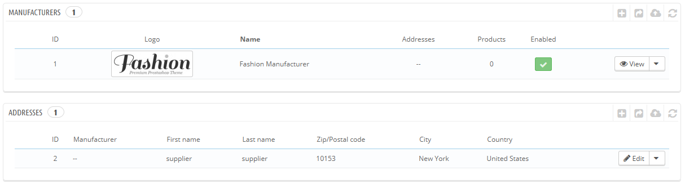
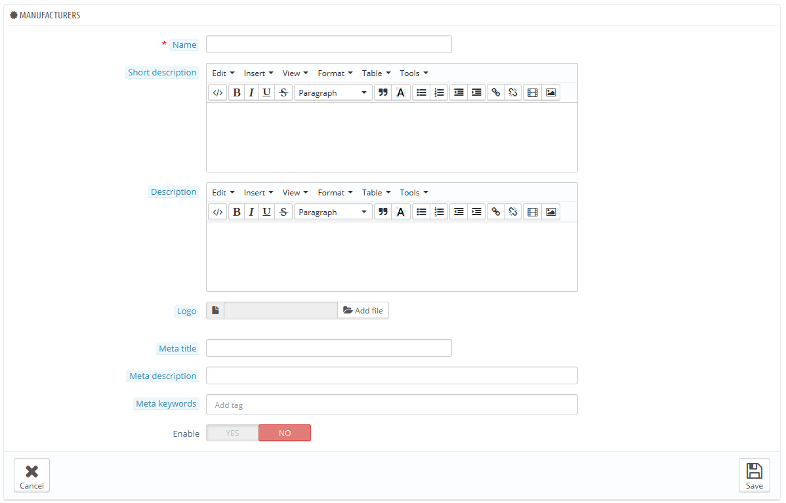
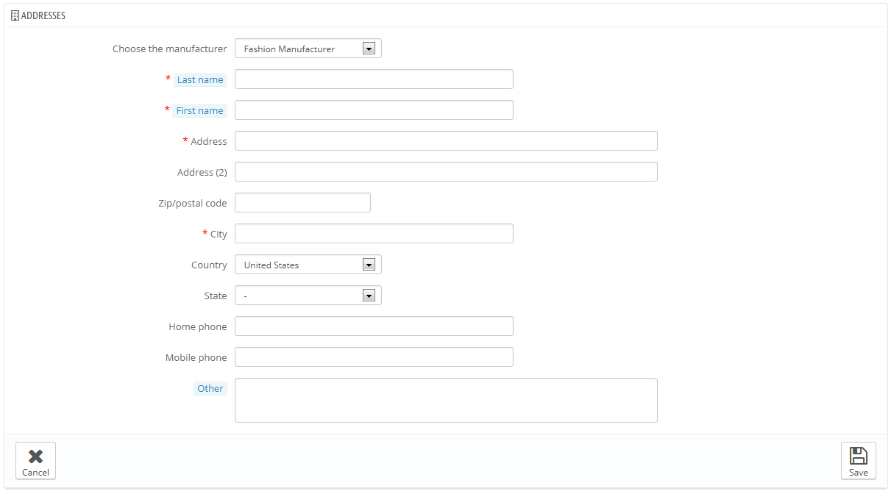

# Gestire i Produttori

A meno che tu non produca i tuoi prodotti da te, devi sempre registrare i tuoi produttori in  PrestaShop.

In PrestaShop, un produttore è il marchio dietro al prodotto. Se vendi i tuoi stessi prodotti, devi creare almeno una ditta quale produttore: questo aiuta i tuoi clienti a trovare ciò che stanno cercando, ed aiuta anche i motori di ricerca.

Nella parte iniziale del tuo negozio, i produttori vengono ordinati alfabeticamente. Non puoi modificare tale ordine.

I nuovi produttori sono automaticamente disattivati. Devi attivarli affinchè appaiano on line - anche se non vi sono ancora prodotti.

Inserendo delle informazioni sui produttori, i visitatori del tuo sito hanno un rapido accesso a tutti i prodotti di un tale produttore. Questo rende più facile la navigazione nel sito. In termini di visibilità, riempiendo tutti i campi migliora la tua posizione nei motori di ricerca.

## Creare un produttore. 

Clicca su "Aggiungi un nuovo produttore" ed appare un modulo.

Riempi tutti i campi:

* **Nome.**  Indica il nome del produttore per semplificare le ricerche da parte dei visitatori.\
  **Breve descrizione.**  La descrizione che apparirà nei motori di ricerca quando un utente effettua una ricerca. E' limitata a 100 caratteri
* **Descrizione.**  Per aggiunge una più completa descrizione del tuo produttore, delle sue attività e dei suoi prodotti.\
  Puoi inserire in dettaglio le loro specialità e promuovere la qualità dei loro prodotti. La descrizione del produttore sarà visibile nel tuo negozio tra gli altri.
* **Logo**. E' essenziale avere il logo del produttore: questo porta i tuoi clienti a dare la stessa fiducia che darebbero al produttore/o marchio anche al tuo negozio.
* Campio SEO (Titolo, meta descrizione, meta parole chiave) hanno la stessa funzione che hanno nelle categorie.
  * **Meta titolo**. Il titolo che apparirà nei motori di ricerca quando viene fatta una ricerca da parte di un cliente.
  * **Meta descrizione**. La presentazione del tuo sito in poche righe, che siano accattivanti per il cliente. Apparirà nei risultati delle ricerche.
  * **Meta parole chiave**. Le parole chiavi che devi inserire per far sì che il tuo sito venga richiamato nei motori di ricerca. Puoi inserirne diverse, separate da virgole, così come delle frasi, che devono venire indicate tra virgolette.
* **Attivare**. Puoi disattivare un produttore anche temporaneamente. Con questa funzione il produttore viene eliminato dalla lista dei produttori dalla parte iniziale del tuo negozio.

Salva le modifiche in modo ritornare alla lista produttori. Da qua puoi:

* Cliccare sul nome o sul logo del produttore, ed andare nella lista di prodotti a lui associati. Se non ce ne sono, puoi associarli lavorando su una base per prodotto, dalla pagina "Prodotti" nel menu "Catalogo", usando per ogni prodotto il tasto "Associazioni" sulla sinistra.  \
  Ottieni lo stesso risultato cliccando sull'icona "Vedi" a destra sulla pagina.
* Disattivare un produttore, cliccando sul "Si" verde. Una volta che è disattivato, appare un "NO" rosso, clicca per riattivarlo nuovamente.
* Modificare o cancellare un produttore cliccando sui rispettivi tasti a destra sulla riga.

## Aggiungere l'indirizzo del produttore. 

In fondo alla pagina "Produttori" c'è la sezione "Indirizzi". Ogni produttore ha il proprio indirizzo registrato in PrestaShop. Questo serve principalmente a te, in questo modo hai sempre un indirizzo per contattare il produttore direttamente disponibile in  PrestaShop.

Clicca sul tasto "Aggiungi indirizzo del produttore" e sia apre un modulo.

Assicurati di aver scelto il giusto produttore e riempi più campi possibili.
