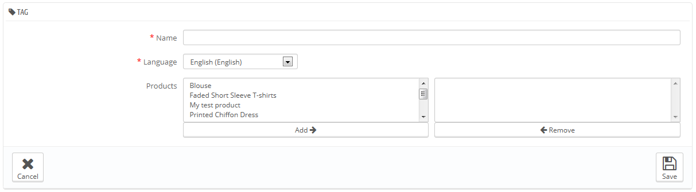

# Gestire i Tags

La funzione  tagging ti abilita ad associare i prodotti con delle parole chiave. I tuoi clienti possono usare le parole chiavi per ricercare facilmente e velocemente i prodotti che stanno cercando.

Per esempio, diciamo che il cliente voglia trovare un lettore  MP3 nel tuo negozio. Per poter trovare il prodotto corrispondente alla ricerca fatta dal cliente, bisogna che ci sia un tag associato a "Lettore Mp3" con  "iPod Nano".

I tags dei prodotti non sono le stesse cose delle pagine di parole chiave: non hanno alcun diretto impatto nei risultati dei motori di ricerca.

Per lavorare al posizionamento nei motori di ricerca, apri il tasto "SEO" per la creazione di di ogni pagina prodotto.

Ci sono due modi di far questo.

## Prima soluzione: quando stai creando un nuovo prodotto 

Puoi associare più tags ad ogni prodotto nel momento in cui lo crei in  PrestaShop, direttamente dal campo  "Tags" nelle  "Informazioni " del prodotto. Vedi anche il precedente capitolo del manuale " "Aggiungi prodotti e categorie prodotti".

## Seconda Soluzione: Gestire i  Tags 

La pagina "Tags" nel menu "Catalogo" di permette di creare dei nuovi tags e di gestire i tags esistenti. Una volta che hai associato i tags ai tuoi prodotti, avrai una lista molto importante di tags. La pagina  "Tags" ti aiuterà a gestirli tutti.

Per crearne uno nuovo, clicca su "Aggiungi nuovo", ed apparirà una pagina di creazione.

Questa interfaccia ti permette di aggiungere tags ad uno o a più prodotti.

* **Nome**. Dai un nome al tuo tag. Deve essere breve ed andare subito al punto, in modo da aiutare i tuoi clienti a trovare i prodotti associati invece che ostacolarli.
* **Lingua**. Indica in quale lingua deve apparire il tag nel tuo negozio.  PrestaShop è sufficientemente intelligente da non mostrare parole chiavi in spagnolo ai clienti che scelgono la versione francese del sito, per esempio.
* **Prodotti**. Seleziona i prodotti ai quali vuoi applicare i tags, dalla colonna destra. Tieni premuto il tasto Ctrl della tua tastiera per poter selezionare più prodotti in una volta.

Una volta che hai salvato la pagina, il tag nominato si applicherà a tutti i prodotti elencati nella lista a destra.

Per aggiungere lo stesso tag per altre lingue, ripeti l'operazione, solo cambiando la lingua.

Dopo aver salvato il  tag, vieni reindirizzato all'elenco di tags, dove puoi modificarli o cancellarli, e perfino cancellarli tutti insieme utilizzando il tasto alla fine dell'elenco.\
Accanto alle icone modifica e cestino, un numero indica quanti prodotti utilizzano il tag.

Da ora in poi, quando i tuoi clienti faranno una ricerca nel tuo sito, i risultati che avranno dipenderanno dai tags che hai associato ai prodotti.
