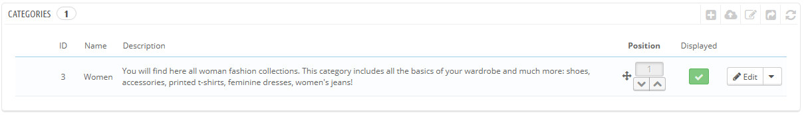

# Gestire le Categorie

## Gestire le categorie <a href="#gestirelecategorie-gestirelecategorie" id="gestirelecategorie-gestirelecategorie"></a>

## Le categorie sono essenziali, siccome ti danno la possibilità di raggruppare dei prodotti equivalenti. Questa aiuta i clienti a trovare la giusta via nel tuo catalogo, e restringere la ricerca quando stanno cercando un prodotto specifico. Le categorie facilitano il cliente nel trovarli e confrontarli (grazie anche alla funzione di Prestashop di confronto del prodotto). <a href="#gestirelecategorie-lecategoriesonoessenziali-siccometidannolapossibilitadiraggrupparedeiprodottiequi" id="gestirelecategorie-lecategoriesonoessenziali-siccometidannolapossibilitadiraggrupparedeiprodottiequi"></a>

Dovresti creare una nuova categoria dal momento che hai almeno due prodotti con caratteristiche uguali. I prodotto in una categoria dovrebbero essere confrontabili, se non intercambiabili. Ricordati di questo quando aggiungi nuovi prodotti e crei nuove categorie.

Puoi anche scegliere di non creare alcuna categoria, ed avere tutti i prodotti raggruppati sotto una singola categoria, "Home". Ma poi i clienti non saranno in grado di confrontare i prodotti.

Puoi anche decidere di non essere interessato alla funzione di confronto, e preferire piuttosto di costruire le tue categorie in modo libero. In tal caso, devi disabilitare la funzione confronto: va alla pagina delle preferenze e metti 0 nell'opzione "Confronto prodotto".

Quando crei una categoria prodotto, devi focalizzarti su una unica cosa: i prodotti in questa categoria devono essere confrontabili attraverso le loro caratteristiche (non le loro qualità). Non è solo utile per i tuoi clienti, ma è anche necessario nella funzione confronto-prodotto in PrestaShop's.

Le categorie vengono gestite nella pagina "Categorie" del menu "Catalogo". Questa pagina mostra una tabella con le categorie esistenti, con le informazioni principali. Per mostrare le sotto categorie, cliccare sulla categoria e sulla sotto categoria successiva o seleziona "Mostra" nel menu azione.



Usando l'icona nella colonna "Mostrato" della tabella, puoi indicare quali vuoi nascondere ai clienti cliccando l'icona verde, facendola diventare rossa.

Tutte le categorie sono sottocategorie della categoria "Home".\
Per modificare la categoria  "Home"  (o una qualsiasi altra categoria selezionata), cliccare sul tasto "Modifica" quando la tabella mostra le categorie radici.

Per creare una nuova categoria (o una sub-categoria di una categoria esistente), cliccare sul tasto "Aggiungi nuova" da qualsiasi livello di categorie.


Translate your categories!

Assicurati di tradurre ogni campo in ogni lingua che usi nel tuo negozio. Per far ciò, clicca sul tasto della lingua accanto al campo, e scegli la lingua che vuoi modificare.

Prima di tutto, devi inserir alcune informazioni generali::

* **Nome**. Dai un nome alla categoria. Che sia breve e descrittivo, e scegli le parole con cura: i tuoi clienti si baseranno su quelle mentre navigano nel tuo negozio.
* **Mostrato**. Indica se è mostrato (cioè, se sia o meno disponibile ai tuoi clienti). Per esempio, potresti volere posticipare la visione di una nuova categoria ai clienti in quanto non è ancora competata.
* **Categoria principale.**  _Non compare quando stai creando una categoria radice._  Se desideri creare una sotto categoria che appartiene ad una categoria diversa dalla home page, scelsi sotto quale categoria apparirà. La forma è la stessa di quando crei una categoria radice o una sottocategoria. La sola differenza è che quando clicchi "Aggiungi nuovo" da un sotto livello di categorie,  PrestaShop capisce che vuoi creare una sotto categoria, e di conseguenza imposta l'opzione "Categoria principale" .
* **Descrizione**. Devi completare questo campo, perchè non solo sarà utile ai tuoi impiegati, ma alcuni temi potrebbero anche utilizzarlo, mostrandolo ai clienti.
* **Immagine**. Clicca su "Aggiungi file" per caricare un' immagine che rappresenti questa categoria dal tuoi computer.
* **Meta titolo**. E' il titolo che apparirà nei motori di ricerca quando un cliente fa una richiesta.
* **Meta descrizione**. E' la presentazione della tua categoria in poche righe, intesa a catturare l'interesse del cliente. Comparirà nei risultati della ricerca.
* **Meta parole chiave**. Sono le parole chiave che devi inserire in modo che il tuo sito compaia nei motori di ricerca. Puoi inserirne parecchie, separate sia da virgole che da espressioni, che devono essere indicate tra punti interrogativi.
* **URL amici.** Ti dà la possibilità di riscrivere gli indirizzi delle tue categorie come preferisci. Per esempio, invece di avere un indirizzo come [http://www.example.com/category.php?id\_category=3](http://www.example.com/category.php?id\_category=3), puoi avere [http://www.example.com/123-name-of-the-category](http://www.example.com/123-name-of-the-category).\
  &#x20;In questo caso, tutto ciò che devi fare è indicare nel campo "Url amico" le parole che vuoi che appaiano invece che "nome-di-categoria" separate dal trattino.
* **Accesso di gruppo**. Restringe l'accesso alla categoria ed ai suoi prodotti solo ad alcuni clienti. Per vedere queste categorie, i tuoi acquirenti devono appartenere ad un gruppo utenti. Controlla la pagina "Gruppi" nel menu "Clienti" per maggiori informazioni.
*   **Categoria radice**. Appare solo quando crei una categoria radice.  Potresti voler usare questa nuova categoria come una nuova categoria radice, invece che "Home." In tal caso questa opzione è quella da usare.

    La categoria radice è molto utile nei multi-negozi. Immagina di avere 3 negozi con diversi, o parzialmente diversi prodotti e categorie: potresti voler utilizzare una diversa categoria radice per ogni negozio.

    La categoria radice in questo modo riflette la categoria "home" di ogni negozio, così se non vuoi avere gli stessi prodotti nella homepage di ogni negozio, ti servono diverse categorie radici. In questo modo è più facile assegnare le categorie ad ogni negozio ed avere diversi prodotti nella categoria principale.

Una volta che hai finito di configurare la tua categoria, salva e sarai pronto a riempirla di prodotti.

Una nuova categoria non apparirà automaticamente nel menu del tuo negozio. Per mostrarla, devi modificare il menu con il modulo "Menu superiore orizzontale (quando usi il tema di default), o qualsiasi modulo che devi gestire nel menu.

### Navigazione e modifica delle categorie <a href="#gestirelecategorie-navigazioneemodificadellecategorie" id="gestirelecategorie-navigazioneemodificadellecategorie"></a>

Il tasto "Modifica" nella barra dei tasti, dà la possibilità di modificare la categoria principale della sotto categoria in quel momento utilizzata. Questo significa che quando stai vedendo le sotto categorie, cliccando sul tasto "Modifica" potrai modificare la categoria  "Home".

Puoi cliccare su ogni categoria sulla tabella: facendo così aprirai quella categoria, e mostrare tutte le sue sotto categorie. In effetti, questo cambierà il contesto dell'interfaccia: cliccando il tasto "Modifica" si modificherà la categoria principale corrente, e cliccando su "Aggiungi nuovo", si aprirà la scheda di creazione della nuova categoria con le opzioni "Categoria principale" per la categoria principale corrente.

### Importare ed esportare categorie <a href="#gestirelecategorie-importareedesportarecategorie" id="gestirelecategorie-importareedesportarecategorie"></a>

Oltre ai pulsanti "Aggiungi nuovo" e "Modifica", ci sono anche altri tre tasti sulla barra dei tasti:

* **Esportare.** Dà la possibilità di scaricare la lista di tutte le categorie in formato CSV.
*   **Importare.** Apre la pagina  "parametri avanzati > importa CSV ", con gli attesi set di dati "Categorie". Vai al capitolo "capire i parametri avanzati " per imparare di più sull'importazione di files CSV.\
    Il tuo file CSV dovrà seguire il seguente formato:

    ```
    ID;Nome;Descrizione;Posizione;Mostrato;
    3;iPods;Now that you can buy movies from the iTunes Store and sync them to your iPod, the whole world is your theater.;1;1;
    4;Accessories;Wonderful accessories for your iPod;2;1;
    5;Laptops;The latest Intel processor, a bigger hard drive, plenty of memory, and even more new features all fit inside just one liberating inch. The new Mac laptops have the performance, power, and connectivity of a desktop computer. Without the desk part.;3;1;
    ```

    L'identificatore di categoria è l' ID, non il nome della categoria.
* **Aggiornare la lista**. Ricarica la lista delle categorie con tutte le modifica che hai fatto.

Vi sono ulteriori opzioni di importazione nella pagina  "Importare CSV " nel menu  "Parametri avanzati".

### Aggiungere dei prodotti alla categoria. <a href="#gestirelecategorie-aggiungeredeiprodottiallacategoria." id="gestirelecategorie-aggiungeredeiprodottiallacategoria."></a>

Per aggiungere un prodotto alla categoria, devi aprire la pagina di configurazione del prodotto ed andare al suo tasto "Associazione" sulla sinistra. Qui è dove puoi assegnare le categorie alle quali il prodotto  appartiene.&#x20;

La categoria "Home" è una categoria speciale, dove puoi evidenziare o promuovere i prodotti di ogni categoria facendoli apparire nel blocco "prodotti presentati". Di default, puoi mostrare solo 8 prodotti nella homepage.

Il blocco "prodotti presentati" dipende dal modulo "prodotti presentati nella homepage". Se vuoi più (o meno) prodotti sulla homepage, configura questo modulo (dalla pagina"Moduli" nel menu "Moduli").

Nota: non devi rimuovere un prodotto dalla sua categoria originale per inserirlo nella homepage. Un prodotto può essere inserito in ogni categoria necessaria.
