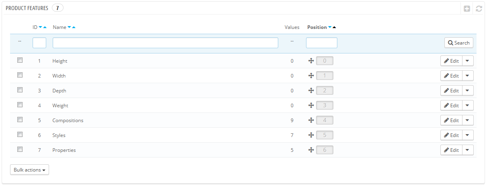
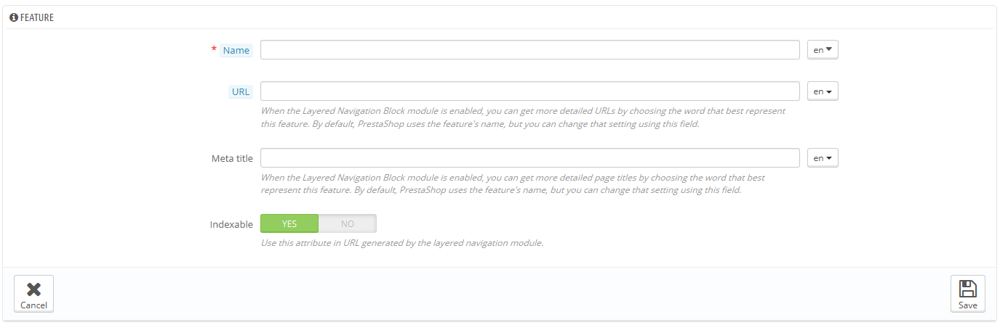
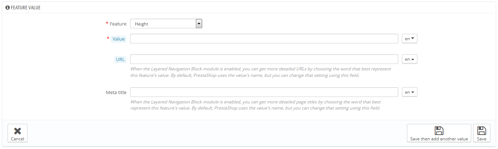

# Gestire le Funzioni Prodotto

Le qualità sono delle caratteristiche intrinseche del prodotto: rimangono uguali in tutte le varianti del prodotto (o combinazioni).\
Dovresti pensare prima alle qualità allo stesso modo in cui pensi alle caratteristiche del prodotto (vedi sopra), con l'unica differenza che non puoi creare della varianti del prodotto basate sulle qualità.

La differenza tra un attributo ed una qualità dipende dal prodotto. Alcuni prodotto possono avere le stesse qualità, una può essere una caratteristica creata per avere più varianti di un prodotto, un'altra potrebbe essere solo una caratteristica invariabile.

Per esempio, un cliente può comprare un iPod che varia in base alle caratteristiche (colore, spazio del disco) ma non su qualità come peso o grandezza.

Nello stesso modo un altro negozio potrebbe vendere delle magliette che variano in base alle caratteristiche (colore, taglia, genere) ma non sulla qualità (peso).

Le qualità vengono configurate su una base per prodotto, nella pagina "Prodotto" nel menu "Catalogo", ma prima devono essere registrate nel tuo negozio usando "Caratteristiche" nel menu  "Catalogo".

Puoi decidere l'ordine delle caratteristiche utilizzando le frecce nella colonna "posizione".\
La colonna "Azioni" offre la possibilità di "modificare", "Cancellare" e "vedere" che si possono cliccare per vedere i valori della caratteristica. Da qua, puoi ordinare, modificare o cancellare le caratteristiche che, se ti serve.

## Aggiungere una caratteristica 

Clicca su "Aggiungi una nuova caratteristica". Compare un semplice modulo. Qui è dove dai il nome alla caratteristica: per esempio, i tipi di cuffie che vengono dati con un riproduttore musicale.&#x20;

Dai un nome a questa nuova caratteristica, salvala e ritorna alla lista attributi.

Sono disponibili ulteriori 3 opzioni quando attivi il modulo Layered Navigation Block. Non sono strettamente connessi con la navigazione layered : offrono un URL diretto ad ogni variazione di prodotto. In questo modo, non solo il cliente è in grado di inviare il link corretto ad un amico, ma aiuta anche a migliorare il posizionamento nei motori di ricerca. Il generatore di navigazione li utilizza.

* **URL**. La parola da usare nell'URL. Di default, PrestaShop utilizza il nome pubblico della caratteristica.
* **Meta titolo**. La parola da utilizzare nel titola della pagina. Di default, PrestaShop utilizza il nome pubblico della caratteristica.
* **Indicizzabile**. In base al fatto se i motori di ricerca devono indicizzare questa caratteristica o meno.

Il cliente può raggiungere l' URL semplicemente cliccando su una caratteristica dalla pagina prodotto: l'URL cambierà aggiungendo un dettaglio finale, per esempio `#/color-metal` or `#/disk_space-16gb/color-green`.

## Aggiungere un valore ad una caratteristica 

Clicca su "Aggiungi un nuovo valore alla caratteristica" Appare un altro modulo.

Riempi il modulo:

* **Caratteristica**. Dalla lista a tendina, seleziona una delle caratteristiche disponibili.
* **Valore**. Dà un valore all'attributo: "5 kg", "27 cm", etc.

...e salva il valore. Puoi aggiungere ulteriori valori per lo stesso tipo di caratteristica salvando le modifiche con "Salva ed aggiungi un altro valore".

Sono disponibili ulteriori 2 opzioni quando attivi il modulo Layered Navigation Block. Non sono strettamente connessi con la navigazione layered : offrono un URL diretto ad ogni variazione di prodotto. In questo modo, non solo il cliente è in grado di inviare il link corretto ad un amico, ma aiuta anche a migliorare il posizionamento nei motori di ricerca. Il generatore di navigazione li utilizza.

* **URL**. La parola da usare nell'URL. Di default, PrestaShop utilizza il nome pubblico della caratteristica.
* **Meta titolo**. La parola da utilizzare nel titola della pagina. Di default, PrestaShop utilizza il nome pubblico della caratteristica.

Il cliente può raggiungere l' URL semplicemente cliccando su una caratteristica dalla pagina prodotto: l'URL cambierà aggiungendo un dettaglio finale, per esempio `#/color-metal` or `#/disk_space-16gb/color-green`.
