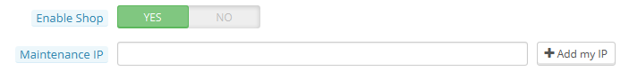
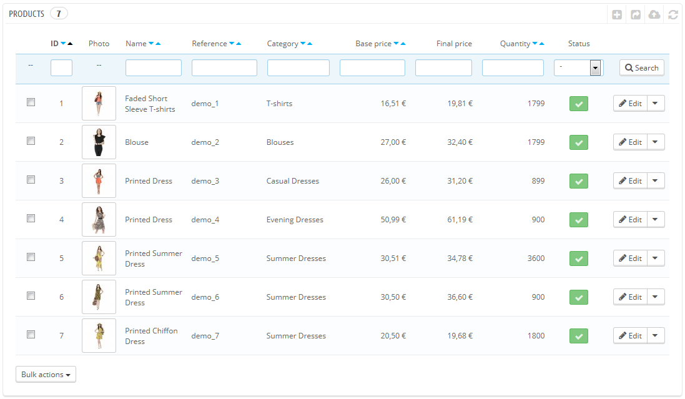
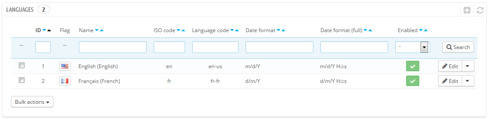

# Primi passi con PrestaShop 1.6

**Table of contents**

* [Primi passi con Prestashop 1.6](primi-passi-con-prestashop-1.6.md#PrimipassiconPrestaShop1.6-PrimipassiconPrestashop1.6)
  * [Disattiva il tuo negozio](primi-passi-con-prestashop-1.6.md#PrimipassiconPrestaShop1.6-Disattivailtuonegozio)
  * [Elimina il contenuto della prima opzione](primi-passi-con-prestashop-1.6.md#PrimipassiconPrestaShop1.6-Eliminailcontenutodellaprimaopzione)
  * [Configura le informazioni del tuo negozio](primi-passi-con-prestashop-1.6.md#PrimipassiconPrestaShop1.6-Configuraleinformazionideltuonegozio)
    * [Le impostazioni base del negozio](primi-passi-con-prestashop-1.6.md#PrimipassiconPrestaShop1.6-Leimpostazionibasedelnegozio)
    * [Lingue Negozio](primi-passi-con-prestashop-1.6.md#PrimipassiconPrestaShop1.6-LingueNegozio)
    * [Informazioni dipendenti](primi-passi-con-prestashop-1.6.md#PrimipassiconPrestaShop1.6-Informazionidipendenti)
  * [Configura i tuoi metodi di pagamento](primi-passi-con-prestashop-1.6.md#PrimipassiconPrestaShop1.6-Configuraituoimetodidipagamento)
  * [Configura corrieri e spedizione](primi-passi-con-prestashop-1.6.md#PrimipassiconPrestaShop1.6-Configuracorrieriespedizione)
  * [Scegli il tuo tema](primi-passi-con-prestashop-1.6.md#PrimipassiconPrestaShop1.6-Scegliiltuotema)
  * [Crea i tuoi prodotti e le categorie dei prodotti](primi-passi-con-prestashop-1.6.md#PrimipassiconPrestaShop1.6-Creaituoiprodottielecategoriedeiprodotti)
  * [Crea il tuo contenuto statico](primi-passi-con-prestashop-1.6.md#PrimipassiconPrestaShop1.6-Creailtuocontenutostatico)
  * [Crea il tuo top menu](primi-passi-con-prestashop-1.6.md#PrimipassiconPrestaShop1.6-Creailtuotopmenu)
  * [Attiva il tuo negozio](primi-passi-con-prestashop-1.6.md#PrimipassiconPrestaShop1.6-Attivailtuonegozio)

## Primi passi con Prestashop 1.6 

Dovrai spendere una gran quantità di tempo assicurandoti che ogni parte del tuo futuro negozio online sia impostata correttamente, sicura, convalidata e pronta per il business.

Nonostante sia facile installare PrestaShop e costruire il tuo business online, non può trattarsi di un lavoro da 5 secondi: ti stai occupando di prodotti, clienti, corrieri e, cosa più importante, vero denaro corrente che fluirà dai tuoi clienti al tuo conto bancario. Non abbiamo dubbi sul fatto che vorrai assicurarti che niente vada storto nel processo di validazione di un ordine, nell’avere i prodotti nella tua posizione di archiviazione, quindi impacchettati e spediti ai tuoi clienti senza un solo problema tecnico, o anche senza niente di imprevisto che si verifichi senza che tu ne sia a conoscenza.

PrestaShop è uno strumento davvero completo, e il numero di possibilità di utilizzo può sembrare disarmante. Questo capitolo ti guiderà quindi attraverso alcune azioni di base da compiere al fine di impostare il tuo negozio prima del grande lancio. Molto può e deve essere fatto prima che tu lanci il tuo negozio, ma questi passi sono passi di configurazione necessari per qualunque negozio.&#x20;

### Disattiva il tuo negozio 

Consideriamo che tu sia ancora all’interno della prima ora dalla tua installazione di PrestaShop, nel caso di un singolo negozio.

Disattivare il tuo negozio significa assicurarsi che nessuno può avervi accesso mentre sei occupato a fare modifiche, creare prodotti, impostare prezzi e tasse, installare moduli di pagamento, corrieri (nuovi temi)… Questo procedimento si chiama “ mettere il tuo negozio in modalità manutenzione”.

Nel tuo back-office, vai alla pagina "Preferenze / Manutenzione" . Questa pagina presenta due semplici impostazioni:

* **Abilita Negozio**. Impostalo semplicemente su "No", e il tuo front-end mostrerà la pagina di manutenzione ai tuoi visitatori, che stabilisce semplicemente che il tuo negozio tornerà presto online.
* **Manutenzione IP**. Qui è dove devi mettere il tuo indirizzo IP, così da poter avere accesso alla tua front page e navigare nel tuo negozio come se fosse disponibile per tutti. Da fare necessariamente ogni volta che metterai il tuo negozio in modalità manutenzione, dal momento che avrai sempre bisogno di navigare nel tuo front-end per assicurarti che tutto sia nel posto giusto.\
  &#x20;Clicca semplicemente sul pulsante "Aggiungi il mio IP".  Puoi aggiungere più indirizzi IP separandoli con le virgole.&#x20;

Se hai già deciso quali sono i tuoi temi e prodotti, puoi semplicemente mettere il tuo negozio in modalità Catalogo. Questo significa che i clienti possono navigare nel tuo negozio, non verrà mostrato alcun prezzo e non saranno in grado di aggiungere niente al loro carrello fino a quando non disattiverai la modalità Catalogo.

Puoi attivare la modalità catalogo andando alla pagina “Preferenze / Prodotti”, dove figura come prima opzione.

### Elimina il contenuto della prima opzione 

L’installazione predefinita include una manciata di prodotti – principalmente abbigliamento femminile. Il loro unico scopo è di aiutarti a esplorare l’organizzazione di un vero negozio. Dopo aver imparato le complessità dei legami tra prodotti, categorie, ordini e clienti, dovresti eliminare tutti questi articoli così da dare nuova vita al tuo negozio.&#x20;

Devi quindi eliminare tutti i dati predefiniti, il che significa:

* Prodotti e loro...
  * categorie
  * attributi
  * caratteristiche
  * produttori
  * rifornitori
  * mappe immagine
  * tag
* ordini
  * messaggi ordine
* clienti
  * carrelli per la spesa dei clienti
* corrieri
  * fasce di prezzo
  * fasce di peso
* contatti & negozi (elimina o adatta ai bisogni del tuo business)
* pagine CMS  (elimina o adatta ai bisogni del tuo business)

Questo però significherebbe navigare attraverso i diversi schermi del back-office eliminando i contenuti pagina dopo pagina; c’è un modo molto più semplice per farlo:

1. Vai alla pagina "Moduli > Moduli".
2. Trova il modulo "Database Cleaner" e clicca sul pulsante "Install".
3. Verrai immediatamente portato alla sua pagina configurazione  (in caso contrario, clicca sul pulsante "Configurazione").
4. Leggi e accetta l’avviso, quindi clicca sul pulsante "Cancella Catalogo": eliminerà tutti i tuoi prodotti e i loro attribute, produttori, ecc.
5. Leggi e accetta l’avviso, quindi clicca sul pulsante "Cancella Ordini & Clienti": eliminerà tutti i tuoi clienti e i loro ordini, carrelli, ecc.
6. Clicca sul pulsante "Controlla & Correggi" per affinare i limiti di integrità del tuo database.
7. Clicca sul pulsante "Pulisci e ottimizza" per riorganizzare il deposito fisico dei dati (tabella) e dati (degli indici associate), per ridurre lo spazio deposito e migliorare l’efficienza I/O quando accedi alle tabelle.

NON SI TORNA INDIETRO. Assicurati di cliccare su questi pulsanti solo se intendi ripulire il tuo database dai suoi contenuti predefiniti

### Configura le informazioni del tuo negozio 

Ora che hai un negozio ripulito puoi cominciare a crearne uno tuo, e questo implica impostare qualunque cosa, a partire dalle tue informazioni personali e preferenze fino ai tuoi gradimenti.

#### Le impostazioni base del negozio 

Dovresti fare attenzione alle seguenti impostazioni, molte delle quali sono importanti perché sono esposte sul front-office, e quindi in bellavista ai tuoi clienti.

Alcune di queste impostazioni richiedono che configuri un modulo invece di cambiare una delle preferenze di PrestaShop.

Configurare un modulo è semplice:

1. Vai alla pagina "Moduli” sotto il menu "Moduli".
2. Scrivi il nome del modulo (o parte di esso) nella casella di ricerca del modulo. Dovrebbe esporre i risultati man mano che scrivi. &#x20;
3. Una volta trovato il modulo, clicca sul pulsante "Configura", e segui le istruzioni.

Per avere più informazioni riguardo a tutti i moduli presentati qui, dovresti leggere la specifica documentazione di ognuno di loro.&#x20;

| Impostazione                           | Descrizione                                                                                                                                                                                                                                                                                                                                                                                 | Dove trovarlo                                                                                                                                                                                                                                                                                                                                                                                                                                                                                                                                                              |
| -------------------------------------- | ------------------------------------------------------------------------------------------------------------------------------------------------------------------------------------------------------------------------------------------------------------------------------------------------------------------------------------------------------------------------------------------- | -------------------------------------------------------------------------------------------------------------------------------------------------------------------------------------------------------------------------------------------------------------------------------------------------------------------------------------------------------------------------------------------------------------------------------------------------------------------------------------------------------------------------------------------------------------------------- |
| Nome negozio                           | Definisce il tuo marchio, specialmente sui motori di ricerca (Google, Yahoo!, Bing...).                                                                                                                                                                                                                                                                                                     | Menu "Impostazioni", pagina "Contatti negozio ", poi nella sezione "Dettagli contatto", modifica l’opzione "Nome negozio"                                                                                                                                                                                                                                                                                                                                                                                                                                                  |
| Shop logo                              | 
Definisce visivamente il tuo marchio. Il logo predefinito dice  "YourLogo" come incentivo per usare il tuo.  Esposto in alto a destra di ogni pagina del tuo negozio, così come nelle tue fatture e in altre e-mail automatiche.
                                                                                                                                                  | Menu "Impostazioni", pagina “Temi”, sezione “Aspetto", quindi cambia le varie immagini predefinite al tuo logo.                                                                                                                                                                                                                                                                                                                                                                                                                                                            |
| Valuta negozio predefinita             | La valuta in cui vuoi impostare il prezzo predefinito per i tuoi prodotti.                                                                                                                                                                                                                                                                                                                  | 
Menu "Localizzazione", pagina "Localizzazione", sezione "Configurazione". Se la valuta non è disponibile, devi prima importare il pacchetto di localizzazione per il suo paese: usa lo strumento "Importa un pacchetto di localizzazione” dalla stessa pagina.
                                                                                                                                                                                                                                                                                                   |
| Info servizio clienti                  | 
Un blocco che mostra il numero di telefono per il tuo servizio clienti, e un pulsante per inviarti un e-mail. Esposto sulla colonna di destra del front-office'
                                                                                                                                                                                                                   | Modulo "Blocco contatto”.                                                                                                                                                                                                                                                                                                                                                                                                                                                                                                                                                  |
| 
Info azienda / Info contatti
 | 
Un blocco che mostra l’indirizzo del tuo contatto, il numero di telefono per il tuo servizio client e un link per inviarti una e-mail. Mostrato nel footer del front-office.
                                                                                                                                                                                                      | Modulo "Info blocco contatto"                                                                                                                                                                                                                                                                                                                                                                                                                                                                                                                                              |
| Pubblicità                             | 
Un blocco che mostra un’immagine con un link per un altro sito.  Mostrato nel front-office, colonna sinistra.
                                                                                                                                                                                                                                                                     | Modulo "Blocco Pubblicità ".                                                                                                                                                                                                                                                                                                                                                                                                                                                                                                                                               |
| Slider immagini                        | Lo slider mostra molte immagini, scorrendole una dopo l’altra. Si tratta di un forte segno distintivo per il tuo negozio e i tuoi prodotti. Solitamente posti in alto e al centro della homepage.                                                                                                                                                                                           | Modulo "Slider immagini per la tua homepage".                                                                                                                                                                                                                                                                                                                                                                                                                                                                                                                              |
| Pagine CMS                             | 
I contenuti di pagine statiche, come "Chi siamo", "Consegna", "Nota Legale", "Termini e Condizioni", e "Pagamento Sicuro". Alcune hanno contenuti predefiniti che dovresti adattare al tuo business; altre sono vuote, e dovresti incollarvi sopra il tuo testo. Esposto nel blocco "Informazioni" nella colonna sinistra, e nella sezione "Informazioni" del footer.
             | Menu "Impostazioni", pagina "CMS", quindi modifica e crea pagine a volontà.                                                                                                                                                                                                                                                                                                                                                                                                                                                                                                |
| Social network                         | 
Un blocco che mostra tre link: la pagina Facebook della tua azienda, il suo account Twitter, and il feedback RSS per il suo blog (o il sito "eventi correnti"). Come impostazione predefinita, tutti questi link conducono ai siti PrestaShop dell’azienda. E’ importante che tu cambi i siti raggiungibili dai link con i tuoi. Esposto nella sezione  "Seguici" del footer. 
 | Modulo " Blocco Social networking ".                                                                                                                                                                                                                                                                                                                                                                                                                                                                                                                                       |
| Top menu                               | La parte in alto del tema predefinito utilizza un menu top per indicare categorie alle quali il visitatore può accedere, così come link per altre località – per esempio, l’installazione predefinita ha un link "Blog" che invia l’utilizzo al blog PrestaShop ufficiale.                                                                                                                  | Modulo " Top Menu orizzontale".                                                                                                                                                                                                                                                                                                                                                                                                                                                                                                                                            |
| Contenuto homepage                     | Il tema predefinito contiene molti contenuti demo: testi, immagini, link, ecc. Se hai intenzione di usare quell tema per il tuo negozio invece di comprare il tuo tema, dovresti assicurarti di rimuovere prima tutti i contenuti predefiniti.                                                                                                                                              | 
Modulo "Configuratore Tema": questo modulo gestisce molte cose sul tuo tema. Principalmente, ti permette di spegnere e accendere alcune funzioni (pulsanti condivisione social, top banner, loghi di pagamento, etc.), e cosa forse più importante, ti permette di aggiungere/cambiare facilmente immagini sulla tua homepage. Modulo " Blocco informazioni CMS personalizzato ": questo modulo ti aiuta a gestire gli ultimi due blocchi al fondo dell’homepage, giusto prima del footer: il blocco “Spedizione gratuita ecc.”e quello “Blocco Personalizzato” 
 |

Queste sono le impostazioni predefinite più in vista nel tuo front-end, almeno con il tema prefefinito. La colonna “Dove trovarlo” ti permette di vedere dove puoi trovare l’interfaccia per cambiare questi aspetti del tuo negozio. Questa guida utente ti fornirà più dettagli per ciascuna interfaccia.&#x20;

#### Lingue Negozio 

PrestaShop è in grado di funzionare con molte lingue, sia sul front-office che sul back-office. Appena viene abilitato nel tuo back-office più di un linguaggio, ciascuna casella di testo del back-office viene accompagnata da un selettore codice lingua, atto a indicare la lingua corrente, su cui puoi cliccare per scegliere un’altra lingua con la quale scrivere il contenuto di quella casella.&#x20;

Come impostazione predefinita, PrestaShop è installato con due lingue: quella usata durante l’installazione del software e il Francese. Per gestire le lingue attualmente installate, vai alla pagina “Localizzazione / Lingue “. Ti mostra una tabella con le lingue disponibili.&#x20;

Le lingue attualmente abilitate hanno un “Sì” verde, mentre le altre hanno un “No” rosso. Clicca su  "Sì" per disabilitare il linguaggio selezionato; clicca su "No" per riabilitarlo.

Puoi installare e abilitare molte lingue, se sei convinto che il tuo negozio ne abbia bisogno, tuttavia presta attenzione al fatto che dovrai tradurre i tuoi contenuti per tutte le lingue abilitate: nomi prodotto, descrizioni, tag, nomi e descrizioni categoria , contenuti statici (pagine CMS), impostazioni modulo, ecc.

Puoi facilmente importare molte altre lingue nella pagina “Localizzazione / Localizzazione”, e abilitarle poi nella pagina "Localizzazione / Lingue".

#### Informazioni dipendenti 

Nel caso ci fossero persone intente ad aiutarti con il tuo negozio (siano queste la tua famiglia, i tuoi amici, o dipendenti pagati), avresti bisogno di creare un account dipendenti per ognuno di loro –  solo per sapere chi ha fatto cosa. L’altro vantaggio è che puoi dare loro profili specifici e altrettanto specifici diritti di accesso alle pagine amministrazione: per esempio, potresti non volere che tutti avessero accesso alle tue statistiche, le tue fatture o le tue impostazioni di pagamento.\
&#x20;Puoi creare tanti profili quanti sono necessari.

Per creare un nuovo account dipendenti, vai al menu "Amministrazione", seleziona "Dipendenti", e clicca sul pulsante "Aggiungi nuovo dipendente". Dagli un nome, come  "Martin Doe" o "Gestore spedizione", e salva.\
&#x20;Un account può essere usato da tante persone quanto è necessario – ma ti avvisiamo di crearne uno per ciascun aiutante.

Ora che disponi di un account appropriato per questo dipendente, dovresti dare a quell’account permessi specifici, su misura dei compiti del dipendente. Come impostazione predefinita, un nuovo profile non può fare molto. Sta a te impostare esattamente le parti del tuo negozio alle quali il tuo profilo dovrebbe avere accesso. Può essere un compito tedioso, tuttavia è molto importante.\
&#x20;Per assegnare permessi all’account di un dipendente, devi usare l’opzione  "Profilo" nella pagina creazione account: questo menu ti permette di prendere il profilo dell’account (SuperAdmin, traduttore, ecc.)

Puoi modificare i permessi in questo modo: vai al menu "Amministrazione", seleziona "Permessi", e seleziona il profile che hai intenzione di cambiare. Apparirà una lunga lista di permessi: modificali a piacimento. Le tue modifiche saranno salvate automaticamente.

### Configura i tuoi metodi di pagamento 

Il tuo negozio è concepito per farti guadagnare denaro, e questo è possibile solo se usi almeno un modulo di pagamento. Molti moduli sono già disponibili nell’installazione predefinita, che puoi installare e configurare (dalla pagina “Moduli” sotto il menu “Moduli”, alla categoria “Pagamenti & Gateways” e creare restrizioni per loro (alla pagina "Pagamento" sotto il menu "Moduli"). Molti moduli di pagamento richiedono che imposti prima un account del servizio per il quale sono stati creati.

Vai alla sezione "Pagamento" del capitolo di questa guida "Rendere operativi i moduli nativi" al fine di imparare tutto su di loro.

Puoi anche installare altri moduli di pagamento, scaricati dal mercato di  Addons: [http://addons.prestashop.com/en/4-payments-gateways-prestashop-modules](http://addons.prestashop.com/en/4-payments-gateways-prestashop-modules)

Assegno e bonifico bancario sono gli unici due metodi di pagamento abilitati predefinitivamente. Se decidi di tenerli, hai bisogno di configurarli con le tue informazioni: controllo ordine e indirizzo, account del proprietario, dettagli bancari (IBAN, BIC, ecc.).

Questi moduli di pagamento sono configurati attraverso i moduli “Bonifico Bancario” e “Pagamento con assegno”, che puoi trovare alla categoria “Pagamenti & Gateways” della lista dei moduli.&#x20;

### Configura corrieri e spedizione 

I prodotti venduti nel tuo negozio devono essere spediti ai tuoi clienti – a meno che tu venda esclusivamente prodotti scaricabili; in tal caso il menu “Spedizione” (ti sarà di poco aiuto).

Se stai vendendo i tuoi prodotti da te con la mail regolare del servizio postale, o hai redatto un contratto con un corriere, dovresti impostare queste informazioni all’interno di PrestaShop.

Vai al capitolo "Gestire Spedizione" di questa guida per saperne di più sulla spedizione e sui corrieri.

 **Come impostazione predefinita il ritorno mercanzia non è abilitato.** Se vuoi permettere ai tuoi clienti di restituire prodotti e ottenere un rimborso o un coupon, puoi farlo all’opzione “Opzioni restituzione merce”\
&#x20;della pagina “Restituzione Prodotto”, sotto il menu "Ordini".\
&#x20;La restituzione prodotto è spiegata al capitolo di questa guida “Gestire gli Ordini”.

### Scegli il tuo tema 

Il tuo negozio dovrebbe avere il proprio tema per ottenere uno stile distintivo, e quindi essere più riconoscibile, separato dai tanti altri negozi online. &#x20;

Ci sono tanti temi che puoi scegliere dal mercato PrestaShop Addons: [http://addons.prestashop.com/en/3-templates-prestashop](http://addons.prestashop.com/en/3-templates-prestashop).

Puoi anche scegliere di creare il tuo tema, o fartelo creare da uno sviluppatore. Consulta la Guida Designer di PrestaShop per avere aiuto.

Una volta che il tuo tema è installato, dovresti esplorarlo appieno in modo da conoscerlo a fondo ed essere in grado di aiutare i clienti in un qualunque circostanza. Leggi con attenzione la documentazione.

Puoi e dovresti personalizzare alcuni aspetti del tema, specialmente il suo logo in varie situazioni (intestazione, mail, fattura, ecc.) Puoi farlo utilizzando la pagina preferenze “Temi”, che puoi trovare sotto il menu “Preferenze”.&#x20;

Scegli i tuoi moduli

PrestaShop è associato, raggruppato a più (in) di un centinaio di moduli). Questi sono molto vari: analitici, funzioni front-office, pagamento, spedizione... Dovresti esplorare i moduli disponibili in modo tale da sapere quali intendi abilitare, e quali preferiresti invece tenere disabilitati.

Vai ai capitol di questa guida "Gestire Moduli" e "Far funzionare i moduli nativi" per capire tutto di (essi, loro).

Puoi trovare anche molti altri moduli sul mercato di Addons: [http://addons.prestashop.com/en/2-modules-prestashop](http://addons.prestashop.com/en/2-modules-prestashop)

Ogni volta che attivi e configuri un modulo, assicurati che funzioni bene tra i confini del tuo tema, nel caso le sue funzioni abbiano impatto sul front-end del tuo negozio.&#x20;

### Crea i tuoi prodotti e le categorie dei prodotti 

Questo è descritto nei dettagli all’interno del capitolo "Aggiungere Prodotti e Categorie Prodotti”.

### Crea il tuo contenuto statico 

Se ancora non l’hai fatto, dovresti prenderti del tempo per scrivere il contenuto per le varie pagine statiche già disponibili nella tua installazione PrestaShop, o quelle che reputi siano necessarie. &#x20;

Alcune pagine esistono già, ma il loro contenuto dovrebbe essere controllato tre volte, dal momento che queste hanno un impatto molto forte sullo stato legale del tuo negozio, tra le altre cose.

Le pagine predefinite sono "Chi siamo", "Consegna", "Nota Legale", "Termini e Condizioni", e "Pagamento Sicuro". Alcune di loro hanno un contenuto predefinito, che dovresti aggiornare; alcune altre sono vuote e dovresti incollarvi sopra il tuo testo.\
&#x20;Per modificare queste pagine, vai al menu "Preferenze", clicca la pagina "CMS” quindi scegli la pagina che intendi modificare o creane di nuove.

Puoi creare tante pagine quante ne ritieni necessarie.

### Crea il tuo top menu 

Ora che hai categorie prodotto e pagine CMS, dovresti organizzarle nel top menu in una maniera logica e coinvolgente.

Puoi farlo usando il modulo " Top menu orizzontale”: vai alla pagina "Moduli", scrivi "menu" nella scheda di ricerca moduli, e dovresti trovare il modulo. Abilitalo se disabilitato, quindi configuralo: rimuovi le pagine o categorie che ritieni superflue, aggiungi altre pagine, e muovi il contenuto fino a che non sarai soddisfatto della gerarchia del tuo menu.

### Attiva il tuo negozio 

Ora che tutto è fatto e impostato, puoi aprire finalmente il tuo negozio al pubblico.

Vai alla pagina "Preferenze / Manutenzione", e cambia le due opzioni:

* **Abilita Negozio**: impostalo su "Sì".
* **Manutenzione IP**: rimuovi il tuo IP dalla lista. Questo è opzionale: il tuo negozio funzionerà ancora anche se lascerai il campo così com’è.\
  &#x20;Il tuo negozio dovrebbe essere ora totalmente pronto per ricevere i suoi primi visitatori… e prendere i suoi primi ordini!&#x20;
