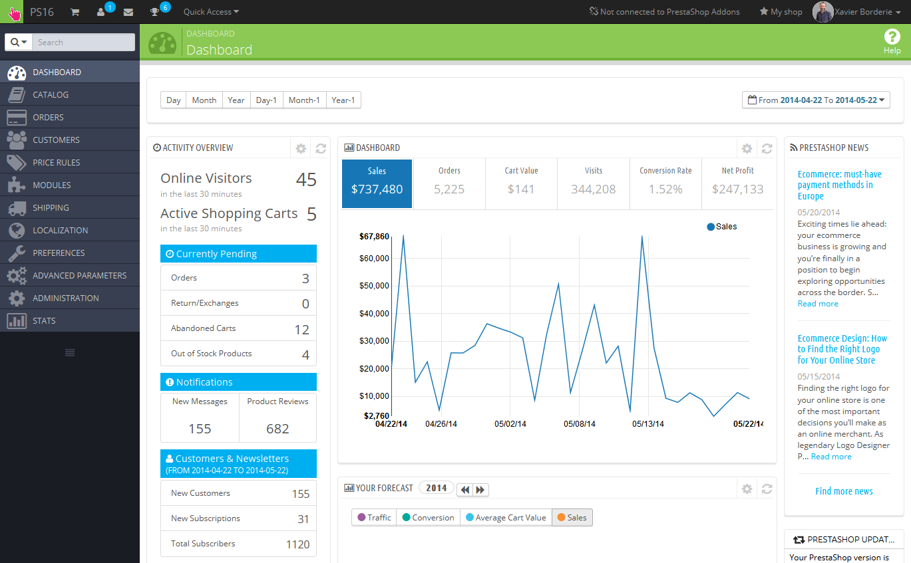
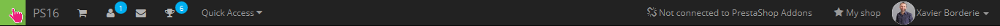

# Scoprire l'Area Amministrativa

**Table of contents**

* Scoprire l'Area Amministrativa\

  * [Panoramica dell'interfaccia principale](http://doc.prestashop.com/display/PS16/Discovering+the+Administration+Area#DiscoveringtheAdministrationArea-Overviewofthemaininterface)
    * [La barra superiore](http://doc.prestashop.com/display/PS16/Discovering+the+Administration+Area#DiscoveringtheAdministrationArea-Thetopbar)
    * [I menu](http://doc.prestashop.com/display/PS16/Discovering+the+Administration+Area#DiscoveringtheAdministrationArea-Themenus)
  * [I pulsanti](http://doc.prestashop.com/display/PS16/Discovering+the+Administration+Area#DiscoveringtheAdministrationArea-Thebuttons)
  * [Aiuto contestuale](http://doc.prestashop.com/display/PS16/Discovering+the+Administration+Area#DiscoveringtheAdministrationArea-Contextualhelp)
  * [La Dashboard](http://doc.prestashop.com/display/PS16/Discovering+the+Administration+Area#DiscoveringtheAdministrationArea-TheDashboard)
    * [La barra orizzontale](http://doc.prestashop.com/display/PS16/Discovering+the+Administration+Area#DiscoveringtheAdministrationArea-Thehorizontalbar)
    * [La colonna sinistra](http://doc.prestashop.com/display/PS16/Discovering+the+Administration+Area#DiscoveringtheAdministrationArea-Theleftcolumn)
    * [La colonna centrale](http://doc.prestashop.com/display/PS16/Discovering+the+Administration+Area#DiscoveringtheAdministrationArea-Thecentralcolumn)
    * [La colonna destra](http://doc.prestashop.com/display/PS16/Discovering+the+Administration+Area#DiscoveringtheAdministrationArea-Therightcolumn)

## Scoprire l'Area Amministrativa 

Ora che hai installato PrestaShop 1.6 e sei entrato propriamente all’interno della tua area amministrazione, dovresti assicurarti di trovare agilmente la tua via attraverso la sua interfaccia amministrativa, capire le sue notifiche e sapere dove trovare un po’ di informazioni specifiche.

| 
 Il design dell’area amministrativa è stato completamente rinnovato con la versione 1.6 di PrestaShop per poter essere più intuitivo ed ergonomico– e lavorare meglio sui dispositivi mobili.

Mentre la maggior parte delle pagine e opzioni 1.5 sono sempre dove puoi aspettarti che siano, potrebbe volerci del tempo per abituarsi.
 |
| ----------------------------------------------------------------------------------------------------------------------------------------------------------------------------------------------------------------------------------------------------------------------------------------------------------------------------------------------------------------------------------------------------------------- |

\
&#x20;Abbiamo creato questo capitolo con l’intenzione di aiutarti a sfruttare al meglio la tua scoperta della dashboard di PrestaShop. E’ stata progettata per essere molto ergonomica e facile da usare, tieni presente però che dovresti leggere l’intera guida per poter assimilare perfettamente il tuo nuovo strumento di business online.&#x20;

Panoramica dell'interfaccia principale

Prenditi il tempo per analizzare la Dashboard – cioè la prima pagina che vedi quando accedi al tuo back-office. Non solo ti mostra un riassunto di tutto quello che hai bisogno di sapere a proposito del tuo negozio in qualunque momento, insieme a link veloci per la pagina d’azione principale ma, per la prima volta in PrestaShop, ti dona anche consigli su cosa dovresti guardare.&#x20;

#### La barra superiore 

At the top of the back office is a black bar containing a handful of links:\
\

Sulla cima del back-office c’è una barra nera che contiene una manciata di link:

* **(nome del tuo negozio)**. Da qualsiasi pagina, ti riporta alla Dashboard.
* **Icona carrello**. Uno strumento che indica il numero dei nuovi ordini, se ce ne sono. Cliccandoci sopra apri un pannello che presenta i nuovi ordini dall’ultima volta che hai cliccato quell’icona. Da lì in poi, puoi mostrare o uno dei nuovi ordini o andare alla lista degli ordini.
* **Icona persona**. Un tooltip che indica il numero dei nuovi clienti, se ce ne sono. Cliccandoci sopra apri un pannello che presenta gli ultimi clienti registrati. Da lì in poi, puoi mostrare o uno dei nuovi clienti o andare alla lista dei clienti. \
  \
  &#x20;
* **Icona Lettera**. Un tooltip che indica il numero dei nuovi messaggi, se ce ne sono. Cliccandoci sopra apri un pannello che presenta gli ultimi messaggi di servizio del cliente. Da qui in avanti, puoi mostrare o uno dei nuovi messaggi o andare alla lista dei messaggi.
* **Icona trofeo.** Un tooltip che indica il numero dei nuovi articoli, se ce ne sono. Cliccandoci sopra apri un pannello che presenta i tuoi progressi come commerciante. Da lì in poi puoi raggiungere la pagina piena di badge e punti, dal modulo “Competenza  Commerciante”.
* **Accesso veloce**. E’ il menu dei link veloci, che presenta i link più utili, come impostato nella pagina “Accesso veloce” all’interno del menu “Amministrazione”.
* **Link “Non connesso a PrestaShop Addons"**. Apre una finestra modale che ti permette di connettere il tuo negozio al mercato di Addons, ricevendo così aggiornamenti dai moduli e dai temi che hai acquistato.
* **Link "Il mio negozio"**. Apre una nuova tabella browser con il front-end del tuo negozio.
* **Link (il tuo nome)**. Un semplice pannello a tendina con un promemoria dell’account amministrativo con il quale sei attualmente connesso.
  * **Link "Le mie preferenze"**. Ti porta alla pagina preferenze del tuo account, dove puoi stabilire alcune opzioni personali (per esempio, il linguaggio del back-office o la tua password).\
    **Link "Esci".** Ti disconnette dall’account utente corrente.\

#### I menu 

Oltre alle tue attività giornaliere volte ad amministrare il tuo negozio, dovrai scorrere tra le diverse pagine e opzioni del back-office. \
\

| 
 Per impostazione predefinita, il menu di sistema in PrestaShop 1.6 è mostrato sul lato sinistro della pagina. Puoi scambiare il menu sulla sommità della pagina utilizzando  l’opzione "Display admin menu" nella tua pagina preferenze utente (alla quale puoi accedere attraverso il link che porta il tuo nome nella barra superiore)

In formato verticale od orizzontale, il contenuto di ciascun menu è mostrato quando il mouse sorvola l’etichetta del menu, riducendo così la necessità di caricare nuove schermate solo per accedere alle opzioni del menu. Oltre a questo, il formato verticale può essere minimizzato solo alle sue icone cliccando sull’icona “linee parallele” al fondo dello stesso. 
 |
| --------------------------------------------------------------------------------------------------------------------------------------------------------------------------------------------------------------------------------------------------------------------------------------------------------------------------------------------------------------------------------------------------------------------------------------------------------------------------------------------------------------------------------------------------------------------------------------------------------------------------------------------------------------------------------------------------------------------------------------------------------------------------------------------------------------------------------------------------------------------- |

.png>)

Ogni menu si riferisce a un determinato insieme di compiti e contesti:

* **Cerca campo con lista a tendina.** Ti permette di cercare nei contenuti del tuo negozio.
* **Catalogo**. Questo è il cuore del tuo negozio, dove aggiungerai prodotti, creerai categorie, imposterai corrieri e rifornitori, ecc.
* **Ordini**. Una volta che i clienti cominceranno ad aggiungere prodotti nei loro carrelli spesa, vedrai ordini in questo menu, con le conseguenti fatture. Qui è anche dove gestisci restituzioni di mercanzia, note di credito e servizio clienti per ordine, tra le altre cose.
* **Clienti.** Qui puoi accedere a tutte le informazioni riguardo ai tuoi clienti, e modificare i loro indirizzi, creare gruppi di clienti ai quali puoi applicare sconti speciali, gestire servizio clienti e perfino titoli sociali, se necessario.
* **Regole di prezzo**. Un menu veramente specifico, che ti permette di creare facilmente coupon e riduzioni di prezzo attraverso una serie di regole.
* **Moduli**. Estendi il potere e l’utilità del tuo negozio aggiungendo e attivando moduli: più di un centinaio sono disponibili come impostazione predefinita, e molti altri sono disponibili per l’acquisto sul mercato Addons ([http://addons.prestashop.com/](http://addons.prestashop.com/)). Qui è anche dove puoi gestire i temi e posizionare i blocchi di contenuto dal tuo modulo sul tema (compresa la funzione Live Edit). Un’ultima pagina di menu ti permette di applicare impostazioni globali ai moduli di pagamento.
* **Spedizione**. Tutto ciò che pertiene ai corrieri e alle spese di spedizione, così come al marketing.
* **Localizzazione**. Ti aiuta a personalizzare il tuo negozio con valori locali, come lingua e traduzione, valuta, unità, tasse, regole tasse ed entità geografiche (regioni, nazioni, ecc.).
* **Preferenze**. PrestaShop è una soluzione e-commerce ampiamente configurabile, e puoi modificare praticamente ognuna delle sue caratteristiche utilizzando le preferenze multifunzione.
* **Parametri avanzati**. Questo menu contiene link a strumenti e pagine informative troppo specifiche per figurare in altri menu, come le impostazioni di servizio Web, strumenti di backup per database, o la pagina prestazione, tra gli altri.
* **Amministrazione**. Qui ci sono le impostazioni pertinenti al back-office stesso; per esempio, il contenuto del menu Quick Access, la lista dei dipendenti e dei permessi, o l’ordine del menu, tra gli altri.
* **Statistiche**. Questo menu ti dà accesso a tutte le numerose statistiche e i grafici raccolti e generati da PrestaShop.&#x20;

Questi sono i menu predefiniti. Nota che i moduli possono aggiungere nuove opzioni alle pagine esistenti, nuove pagine ai menu esistenti, e pure nuovi menu.

Inoltre, un menu è disponibile solo se viene impostata l’opzione corretta:

* **Magazzino**. Questo menu ti dà accesso alla funzione di gestione magazzino, dove puoi gestire depositi, movimento scorte e rifornimento ordini.\
  &#x20;E’ disponibile attraverso la pagina impostazioni "Prodotti": basta attivare l’opzione "Abilita la gestione avanzata del magazzino" (nella sezione "Magazzino prodotti") e salva le tue modifiche per vedere apparire il menu.

Tutti i menu predefiniti, compreso il menu "Magazzino", sono analizzati approfonditamente in questa guida utente. &#x20;

### I pulsanti 

Molte delle pagine del back-end utilizzano pulsanti ricorrenti, o in cima o al fondo dello schermo. Per esempio, la pagina edizione prodotto può avere fino a 8 pulsanti disponibili al tempo stesso.

Più che semplici scorciatoie, esse aprono funzioni correnti che userai molto spesso.

I pulsanti disponibili variano molto, a seconda del contesto, pertanto due diverse pagine potrebbero non avere la stessa serie di pulsanti. Tuttavia, ce ne sono alcuni che ti capiterà di vedere spesso:

* **Aggiungi nuovo**. Apre la pagina di creazione del contesto corrente.
* **Moduli raccomandati**. Apre una finestra pop-in che contiene i moduli disponibili nel contesto corrente. &#x20;
* **Aiuto**. Apre la documentazione online per la pagina corrente.\
  \

Il pulsante "moduli raccomandati" ti mostra i moduli che si applicano al contesto corrente. Per esempio, alla pagina "Spedizione > Corrieri", verranno mostrati i moduli dalla categoria di moduli "Spedizioni & Logistica". E’ molto utile quando hai bisogno di trovare velocemente il modulo da installare e configurare per ottenere un determinato risultato. &#x20;

Molte delle forme del back-office sono corroborate con pulsanti al fondo dello schermo:

* **Salva**. Salva i contenuti della pagina corrente e ritorna alla lista degli articoli esistenti.
* **Salva e rimani**. Salva il contenuto della pagina corrente e tiene la pagina aperta.
* **Cancella**. Ritorna alla lista degli articoli esistenti.&#x20;

### Aiuto contestuale 

Dalla versione 1.6.0.7 di PrestaShop, la documentazione del software è integrata direttamente nell’interfaccia amministrativa: cliccare sul pulstante"Help" da qualunque pagina di back-office riduce la larghezza dell’interfaccia principale in modo da aggiungere una nuova colonna sulla destra, contenente la documentazione per quella sezione di back-office.

Un altro click sul pulsante “Help” chiude l’aiuto contestuale. Se non chiudi la colonna aiuto, PrestaShop capisce che la desideri esposta su tutte le pagine del back-office, così manterrà la colonna aperta fino a che non ci cliccherai sopra per chiuderla.&#x20;

|  Se la zona display del browser è più bassa di 1220 pixel di profondità, allora PrestaShop aprirà la documentazione contestuale in una nuova finestra browser piuttosto che ridurre lo spazio dello schermo dedicato all’interfaccia principale. |
| ----------------------------------------------------------------------------------------------------------------------------------------------------------------------------------------------------------------------------------------------------------------------------------------------- |

Al fondo della colonna aiuto, un piccolo modulo ti permette di dire al team PrestaShop se la sezione aiuto è stata utile per te oppure no. Valuta la pagina aiuto cliccando su uno dei 5 livelli di soddisfazione. Se clicchi su uno dei livelli più bassi, PrestaShop aprirà un piccolo modulo che ti permetterà di specificare i tuoi pensieri a proposito. Puoi riempire il modulo e cliccare sul pulsante “Invia”, o chiudere il modulo cliccando sulla croce; in questo caso verrà inviata al nostro server solo la tua valutazione.

### La Dashboard 

Esploriamo adesso i contenuti della Dashboard. Per un nuovo utente potrà sembrare affollata, ma scoprirai che fornisce un eccellente riassunto delle attività giornaliere del tuo negozio.

La Dashboard è divisa in 4 aree principali: una barra orizzontale e tre colonne.

Demo modeIcon

| 
 <strong>Modalità demo</strong>  Come impostazione predefinita, la Dashboard usa finti dati per permetterti di visualizzare meglio a che cosa si riferiscono le varie statistiche.     Se stai usando PrestaShop per un vero negozio online, devi disabilitare questi finti dati in modo da utilizzare i tuoi: clicca su "No" nel blocco "Demo mode" sullo schermo in basso a destra.  
 |
| -------------------------------------------------------------------------------------------------------------------------------------------------------------------------------------------------------------------------------------------------------------------------------------------------------------------------------------------------------------------------------------------------------------------------------------------------------------------- |

#### La barra orizzontale 

Sulla sommità della Dashboard c’è una barra singola che ti aiuta a scegliere il periodo di tempo per le statistiche della dashboard mostrate al momento. Sono disponibili tre serie di opzioni:

* Giorno corrente, mese o anno.
* Giorno precedente, mese o anno.
* Selezione data precisa (il pulsante sulla destra, che apre un selettore data).

Scegliere un’opzione aggiorna tutti i blocchi di contenuto presenti sulla Dashboard, così che possano mostrare i dati solo per il periodo di tempo selezionato. I blocchi che non sono basati sulle statistiche non cambiano.&#x20;

Per scegliere un periodo di tempo, puoi cliccare la prima e l’ultima data di quel periodo nel calendario (l’ordine non importa), o puoi scrivere le date nelle caselle di testo al formato YYYY-MM-DD. Clicca "Applica" per vedere cambiare la Dashboard sulla base delle tue impostazioni.

.png>)

Puoi anche comparare tra loro due periodi di tempo controllando la casella "Confronta Con". Seleziona il secondo periodo come faresti per il primo (i due possono anche sovrapporsi), quindi clicca sul pulsante "Applica".\
&#x20;Comparando i due periodi, alcuni dei blocchi contenuto si aggiorneranno per indicare l’evoluzione dei dati (guarda per esempio il blocco principale "Dashboard", che presenta dati dal modulo Dashboard Trends).

#### La colonna sinistra 

.png>)

Come impostazione predefinita, questa colonna ti presenta dati tratti dal modulo Attività Dashboard, che fornisce le figure principali dal tuo database in un’occhiata veloce:

* Visitatori online negli ultimi 30 minuti.
* Carrelli spesa attivi negli ultimi 30 minuti.
* Ordini al momento in sospeso, richieste di reso/scambio, carrelli abbandonati e prodotti esauriti.
* Notifiche per nuovi messaggi, richieste d’ordine e recensioni prodotti.
* Nuovi clienti e iscrizioni alla newsletter.
* Statistiche del traffico: visite, solo visitatori, fonti di traffico e link diretti.&#x20;

#### La colonna centrale 

La colonna centrale è dove il termine “dashboard” trae la sua importanza: quest’area della Dashboard presenta all’utente (tu) i numeri più importanti pertinenti alle attività giornaliere del suo negozio, insieme a un grafico di vendite e una lista degli ultimi ordini. Ogni volta che accederai all’area amministrativa del tuo negozio, guarderai per prima cosa l’evoluzione compiuta da questi numeri. In breve, qui è dove vedi il tuo negozio vivere e respirare.

Come impostazione predefinita, in questa colonna ci sono tre blocchi di contenuti che sono gestiti dai moduli:

* **Pannello di controllo** (Modulo Dashboard Trends). E’ il blocco di informazione principale della Dashboard. Con i suoi vari grafici, ti aiuta a vedere agilmente se il tuo negozio sta andando nella giusta direzione oppure no. Clicca su uno dei tipi di grafico per visualizzarlo. In aggiunta, quando si confrontano due periodi di tempo, il grafico mostra l’evoluzione di ciascuna figura in percentuale. Sorvola il grafico con il tuo mouse per vedere i dettagli.

\
.png>)\
&#x20;Cliccando sulla sua icona di configurazione (in alto a destra) apri una nuova pagina dove puoi impostare varie spese per il tuo negozio (tariffa di bonifico bancario, tariffa media di spedizione, spese di hosting , ecc.), al fine di indicare meglio i tuoi trend.

* **Le tue previsioni** (Modulo obiettivi Dashboard). Questo blocco ti presenta gli obiettivi per prossimi mesi e come sta andando il tuo negozio a confronto con loro. Scorri il grafico con il mouse per vedere I dettagli.

.png>)

A seconda dei tuoi risultati mensili, dovresti aggiornare i tuoi obiettivi  imminenti. Puoi stabilire i tuoi obiettivi nel modulo configurazione del blocco (in alto a destra del blocco), e inserirvi le tue aspettative mese per mese in termini di traffico, tasso di conversione, valore medio di carrello. La colonna “Vendite” verrà aggiornata assieme agli obiettivi stabiliti in altre colonne, (per esempio, per 1000 visitatori con un tasso di conversione del 2% e un valore medio di carrello di $10, otterrai 1000\*(2/100)\*10 = $200). Puoi cambiare la valuta nella pagina “Valute” sotto il menu “Localizzazione”.&#x20;

* **Prodotti e vendite** (Modulo Prodotti Dashboard) Questo blocco ti presenta una tabella dei tuoi ultimi ordini e una valutazione dei tuoi prodotti: best seller, più visti e top ricerche (quelle cercate nel modulo ricerca del tuo negozio, non dai motori di ricerca).&#x20;

.png>)

Puoi stabilire il numero di articoli da mostrare in ciascun blocco aprendo il modulo configurazione del blocco.

#### La colonna destra 

Quest’ultima colonna è informativa: ti fornisce le ultime notizie da [PrestaShop.com](http://prestashop.com), notifiche riguardanti le nuove versioni di PrestaShop, e utili link.

Include anche il blocco "Modalità Demo", dal quale puoi disabilitare I falsi dati usati per impostazione predefinita sulla Dashboard e usare i tuoi dati raccolti dal sistema delle statistiche di PrestaShop.
