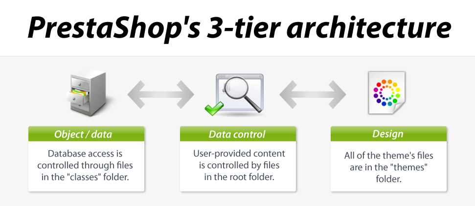
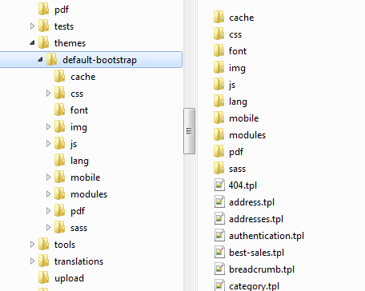

# Theme development fundamentals

**Theme development fundamentals:**&#x20;

* ****[Concept](theme-development-fundamentals.md#Themedevelopmentfundamentals-Concept)
  * [Model](theme-development-fundamentals.md#Themedevelopmentfundamentals-Model)
  * [View](theme-development-fundamentals.md#Themedevelopmentfundamentals-View)
  * [Controller](theme-development-fundamentals.md#Themedevelopmentfundamentals-Controller)
  * [How a theme works](theme-development-fundamentals.md#Themedevelopmentfundamentals-Howathemeworks)
  * [Theme-specific folders](theme-development-fundamentals.md#Themedevelopmentfundamentals-Theme-specificfolders)
* [General information](theme-development-fundamentals.md#Themedevelopmentfundamentals-Generalinformation)
  * [How a theme works](theme-development-fundamentals.md#Themedevelopmentfundamentals-Howathemeworks.1)
  * [Theme-specific folders](theme-development-fundamentals.md#Themedevelopmentfundamentals-Theme-specificfolders.1)
  * [Overview of a theme's folder](theme-development-fundamentals.md#overview-of-a-themes-folder)
* [Technologies](theme-development-fundamentals.md#Themedevelopmentfundamentals-Technologies)
  * [Basics](theme-development-fundamentals.md#Themedevelopmentfundamentals-Basics)
  * [Smarty 3](theme-development-fundamentals.md#Themedevelopmentfundamentals-Smarty3)
  * [Bootstrap v3](theme-development-fundamentals.md#Themedevelopmentfundamentals-Bootstrapv3)
  * [Sass and Compass](theme-development-fundamentals.md#Themedevelopmentfundamentals-SassandCompass)
* [Advices](theme-development-fundamentals.md#Themedevelopmentfundamentals-Advices)
  * [Browser extensions](theme-development-fundamentals.md#Themedevelopmentfundamentals-Browserextensions)
  * [Best practices](theme-development-fundamentals.md#Themedevelopmentfundamentals-Bestpractices)

## Concept 

PrestaShop's templating system enables web-designers and developers to easily build their own theme, provided they have a solid technical grounding.

The templating system is based on a 3-tier architecture:

* **Data tier (data objects)**. Database access is controlled through files in the `/classes` folder.
* **Application tier (data control)**. User-provided content is controlled by files in the root folder.
* **Presentation tier (design)**. All of the theme's files are in the `/themes` folder.

A theme belongs to the Presentation tier: your template files, located in the `/themes` folder, will handle the data sent by the Application tier, and return information to the Application tier.

See Wikipedia for more information on the 3-tier architecture: [http://en.wikipedia.org/wiki/Multitier\_architecture#Three-tier\_architecture](http://en.wikipedia.org/wiki/Multitier\_architecture#Three-tier\_architecture)

A 3-tier architecture has many advantages:

* It is easier to read the software's code.
* Developers can add and edit code faster.
* Graphic designer and HTML integrators can work with the confines of the `/themes` folder without having to understand or even read a single line of PHP code.
* Developers can work on additional data and modules that the HTML integrators can make use of.

This is the same principle as the Model–View–Controller (MVC) architecture, only in a simpler and more accessible way.\
Learn more about MVC on Wikipedia: [http://en.wikipedia.org/wiki/Model-view-controller](http://en.wikipedia.org/wiki/Model-view-controller)

### Model 

A model represents the application's behavior: data processing, database interaction, etc.

It describes or contains the data that have been processed by the application. It manages this data and guarantees its integrity.

### View 

A view is the interface with which the user interacts.

Its first role is to display the data that is been provided by the model. Its second role is to handle all the actions from the user (mouse click, element selection, buttons, etc.), and send these events to the controller.

The View does not do any processing; it only displays the result of the processing performed by the model, and interacts with the user.

### Controller 

The Controller manages synchronization events between the Model and the View, and updates both as needed. It receives all the user events and triggers the actions to perform.

If an action needs data to be changed, the Controller will "ask" the Model to change the data, and in turn the Model will notify the View that the data has been changed, so that the View can update itself.

### How a theme works 

A PrestaShop theme is a set of files which you can edit in order to change the look of your online shop.

Here are a few important tidbits:

* All themes have their files located in the `/themes` root folder.
* Each theme has its own sub-folder, in the main themes folder.
* Each theme is made of template files (`.tpl`), image files (`.gif`, `.jpg`, `.png`), one or more CSS files (`.css`), and sometimes even JavaScript files (`.js`).
* Each theme has a 180\*200 `preview.jpg` image file in its folder, enabling the shop-owner to see what the theme looks like directly from the back office, and select the theme appropriately.

### Theme-specific folders 

As a theme developer, there are mostly 5 PrestaShop folders you must be aware of:

* `/modules`: this is where all the modules are located. A module has templates files, can also redefine theme parts.
* `/themes`: this is where all the themes are located. The default 1.5 theme is in the `/default` folder (in 1.4, it was `/prestashop`).
* `/mails`: this is where all the e-mail templates are located. E-mail templates should ideally reflect the style and design of the main theme. Each sub-folder contains language-specific templates
* `/img`: this is where all the store's images are located. **Theme-specific images are stored in the theme's own `/img` folder.**
* `/pdf`: this is where all the document models are located.

## General information 

### How a theme works 

A PrestaShop theme is a set of files which you can edit in order to change the look of your online shop.

Here are a few important tidbits:

* All themes have their files located in the `/themes` root folder.
* Each theme has its own sub-folder, in the main themes folder.
* Each theme is made of template files (`.tpl`), image files (`.gif`, `.jpg`, `.png`), one or more CSS files (`.css`), and sometimes even JavaScript files (`.js`).
* Each theme has a 180\*200 `preview.jpg` image file in its folder, enabling the shop-owner to see what the theme looks like directly from the back office, and select the theme appropriately.

### Theme-specific folders 

As a theme developer, there are mostly 5 root folders you must be aware of:

* `/modules`: this is where all the modules are located. A module has templates files, can also redefine theme parts.
* `/themes`: this is where all the themes are located.\

  * The default 1.6 theme is in the `/default-bootstrap` folder.
  * The default 1.5 theme was in the `/default` folder.
  * The default 1.4 theme was in the `/prestashop` folder.
* `/mails`: this is where all the e-mail templates are located. E-mail templates should ideally reflect the style and design of the main theme. Each sub-folder contains language-specific templates.
* `/img`: this is where all the store's images are located. **Theme-specific images are stored in the theme's own `/img` folder.**
* `/pdf`: this is where all the document models are located.

### Overview of a theme's folder

Here is an overview of the file structure of a PrestaShop theme (here, the default theme):

* The `/css` folder contains all CSS files.
  * The `/sass` folder contains all the Sass `.scss` source files, before they are compiled into the CSS files.
* The `/font` folder contains the needed font files.
* The `/img` folder contains all images.
* The `/js` folder contains all the JavaScript files.
* The `/lang` folder contains the theme's translations. Its access rights should be set at CHMOD 666 (for instance), so that the back office translation tool can read and write into it.
* The `/mobile` folder contains the mobile version of the theme.
* The `/modules` folder contains the needed template files for many modules.
* The root of the folder contains TPL files only (Smarty files), as well as the `preview.jpg` thumbnail file.

## Technologies 

### Basics 

Just like any website, PrestaShop's themes are displayed as a mix of HTML, CSS and JavaScript. These three languages form the foundation of any site on the Web, and you should know them before attempting to edit an existing theme or create a brand new one.

More specifically, the default template (`/themes/default-bootstrap`) uses HTML5, CSS3 and jQuery-driven JavaScript ([http://jquery.com/](http://jquery.com/)). We use jQuery v1.11+.

### Smarty 3 

At its core, a PrestaShop's theme is based on the Smarty 3 template engine ([http://www.smarty.net/](http://www.smarty.net/)), which allows web-designers and developers to easily build their own theme, with little technical knowledge.

Smarty 2 has long been deprecated, and should not be used for PrestaShop 1.6 themes.

### Bootstrap v3 

Since version 1.6, PrestaShop includes the Bootstrap front-end framework ([http://getbootstrap.com/](http://getbootstrap.com/)). It is a collection of HTML and CSS tools built to help web designer create consistently beautiful and responsive designs (meaning that they can easily adapt to any screen size). Initially an internal effort to document and share common design patterns and assets within the Twitter company, it has quickly grown to become the most used front-end framework.

PrestaShop uses Bootstrap for both its front office and back office default templates.

Designers creating a new back office theme MUST use Bootstrap.

Designers creating a new front office theme SHOULD use Bootstrap. While this is not an obligation, Bootstrap is deeply built into PrestaShop.

Bootstrap initially uses the LESS dynamic stylesheet language ([http://lesscss.org/](http://lesscss.org/)), but PrestaShop uses the Bootstrap For Sass port ([https://github.com/twbs/bootstrap-sass](https://github.com/twbs/bootstrap-sass)), Sass being the language that inspired LESS. This makes it possible to use the Compass framework.

This Designer Guide will dive on more depth into Bootstrap in a later chapter.

### Sass and Compass 

Version 1.6 also makes it possible to use the Sass scripting language ([http://sass-lang.com/](http://sass-lang.com/)), and the accompanying Compass framework.

Sass (short for Syntactically Awesome Stylesheets) is a CSS3 preprocessor – that is, a layer between the stylesheets you author and the `.css` files you serve to the browser (as said by Dan Cederholm here: [http://alistapart.com/article/why-sass](http://alistapart.com/article/why-sass)). It aims at making life easier when creating CSS files by extending the CSS language:

* It adds variables, mixins, and functions (with heritage).
* It helps prevent code repetition.
* It makes it easier to maintain code.
* It makes writing code faster.
* etc.

Instead of directly creating `.css` files, the designer creates `.sass` or `.scss` files which are then interpreted into standard CSS files using a command-line program or an online tool.\
Note that this can be done with altering the way you are used your usual CSS process: as Dan Cederholm writes again, "Sass is an extension of CSS3, and its SCSS (“Sassy CSS”) syntax is a superset of CSS3. Meaning, any valid CSS3 document is a valid SCSS document as well."

For its part, Compass ([http://compass-style.org/](http://compass-style.org/)) is a Sass framework – that is, a combination of tools created to help you build and manage your CSS files using the Sass language. It is written in Ruby.

This Designer Guide will dive on more depth into Sass and Compass in a later chapter.

## Advices 

### Browser extensions 

All web-designers and developers should use the following developer browser extensions:

* Firefox: use the Developer Tools (see [https://developer.mozilla.org/en-US/docs/Tools](https://developer.mozilla.org/en-US/docs/Tools)). They can even help you work with Sass: [https://hacks.mozilla.org/2014/02/live-editing-sass-and-less-in-the-firefox-developer-tools/](https://hacks.mozilla.org/2014/02/live-editing-sass-and-less-in-the-firefox-developer-tools/)
* Firefox: alternatively, install Firebug ([http://getfirebug.com/](http://getfirebug.com/)), a free extension for easy comparison and debugging between your CSS and the output.
* Firefox/Chrome: install the Web Developer ([http://chrispederick.com/work/web-developer/](http://chrispederick.com/work/web-developer/)), a free extension adds many handy web developer tools to your browser.
* Safari 5+: use the Web Inspector (see [https://developer.apple.com/library/safari/documentation/AppleApplications/Conceptual/Safari\_Developer\_Guide/Introduction/Introduction.html](https://developer.apple.com/library/safari/documentation/AppleApplications/Conceptual/Safari\_Developer\_Guide/Introduction/Introduction.html)).
* Chrome: use the Developer Tools (see [https://developer.chrome.com/devtools/index](https://developer.chrome.com/devtools/index)).
* Opera 9.5+: use Dragonfly, a fully-featured debugging environment (see [http://www.opera.com/dragonfly/](http://www.opera.com/dragonfly/)).
* Internet Explorer 8+: use the Developer Tools (see [http://msdn.microsoft.com/en-us/library/dd565628%28v=vs.85%29.aspx](http://msdn.microsoft.com/en-us/library/dd565628\(v=vs.85\).aspx)).
* Internet Explorer 6 and 7: install the IE Developer Toolbar (see [http://www.microsoft.com/en-us/download/details.aspx?id=18359](http://www.microsoft.com/en-us/download/details.aspx?id=18359)), or use Firebug Lite (see [https://getfirebug.com/firebuglite](https://getfirebug.com/firebuglite)).

They provide a lot of useful tools, among which DOM explorer, CSS editors, network inspector, etc., and are a huge help when debugging HTML, CSS, JavaScript, and even Ajax requests.

### Best practices 

Here is a non-exhaustive list of best practices that you should follow when creating a theme:

1. Do not mix HTML and PHP code; use Smarty tags in order to get a dynamic page.
2. Do not mix HTML and CSS code; put the CSS code in a separate `.css` file.
3. Always validate your HTML and CSS code using the W3C validators: [http://validator.w3.org/](http://validator.w3.org/) for HTML and XHTML, [http://jigsaw.w3.org/css-validator/](http://jigsaw.w3.org/css-validator/) for CSS.
4. Do not make SQL queries from a PHP controller (`.php` file at the root of PrestaShop); use the existing methods from the PrestaShop classes, or create new methods for these classes.
5. Always check if a method you need already exists in the available classes.
6. Do not ever edit PrestaShop's own files; always build your code into modules in order to facilitate updates.
7. Make sure to always produce a clear and readable code, making it easy to maintain that code for anyone in the foreseeable future.
8. Do comment your code, and write both method names and comments in plain English.
9. When editing the theme on a production site, always put the shop in Maintenance Mode first, via the back office' "Maintenance" preference page.
10. Use modern browsers, such as Firefox (latest non-beta version), Google Chrome (latest non-beta version), IE10+ or Opera (latest non-beta version) – and make sure your friends and family members do too!
11. Whenever possible, use CSS sprites (read [http://www.alistapart.com/articles/sprites](http://www.alistapart.com/articles/sprites) and [http://www.alistapart.com/articles/sprites2/](http://www.alistapart.com/articles/sprites2/)).
12. Disable your browser's cache when developing.
