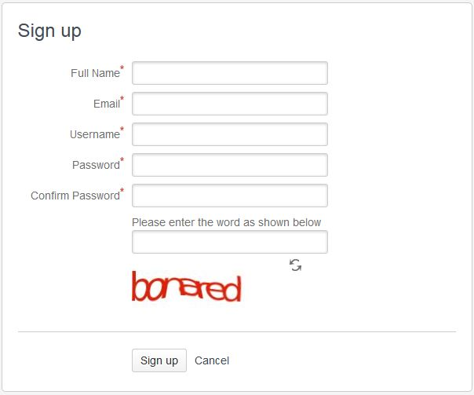
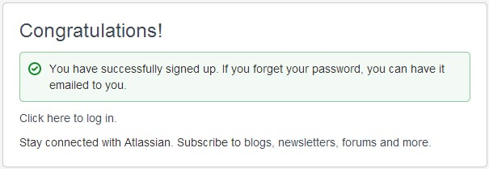
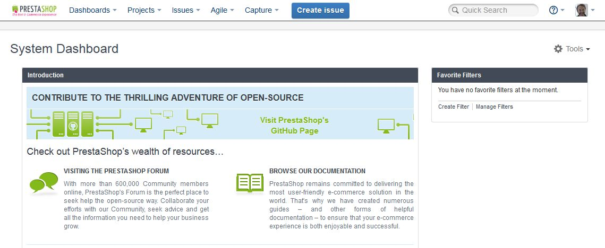
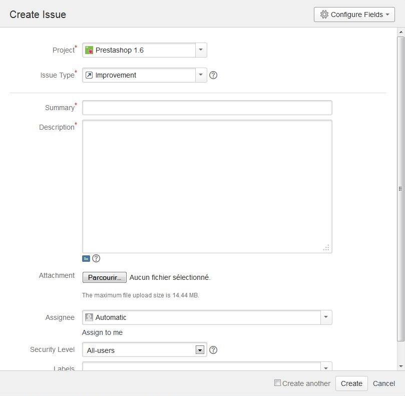

# How to use the Forge to contribute to PrestaShop

## How to use the Forge to contribute to PrestaShop 

The Forge is the name of PrestaShop's bug and issue tracker, which uses Atlassian's JIRA tool. This is the best place to describe bugs you are witnessing on your PrestaShop installation, and have the developers try to fix it.

### Creating your account 

In order to participate, you need to create an account to use the bug tracker.

You can do it here: [http://forge.prestashop.com/secure/Signup!default.jspa](http://forge.prestashop.com/secure/Signup!default.jspa)

Fill all fields and validate your account request.

Once your account is validated, click here to log in: [http://forge.prestashop.com/secure](http://forge.prestashop.com/secure).

### Creating an issue 

You can now create your first issue: click on the "Create issue" button in the top bar.

A form appears:

1. **Project**: Choose the Forge project depending on the context of your report:
   1. "PrestaShop 1.7": when your report is tied to version 1.7.
   2. "PrestaShop 1.6":when your report is tied to version 1.6.
   3. "Partners & Native Modules": when your issue is tied to a default module.
2. **Issue type**: Choose "Bug" or "Improvement" depending on what you your issue is about.
3. **Affects version**: Always indicate the exact version where your issue happens.\

   * If possible, check on the latest version to make sure that the issue is not already solved.
4. **Summary**: Give a short description of the issue.
5. **Description**: Give a complete and precise description of the bug and the best way to reproduce it.
6. **How to reproduce the issue**: Being able to reproduce every time is the best way to get your issue fixed. Please give details!\

7. **Attachment**: If necessary, add image files or sample code.
8. Click the "Create" button when you are done.

### Best practices for writing an issue 

When writing a bug report, please use these guidelines:

* Make sure you can reproduce your bug every time.
* Make sure your software is up to date.
  * Ideally, test an in-development version to see whether your bug has already been fixed.
* Search the Forge to see whether your bug has already been reported.
* Write a clear summary.
* Write precise steps to reproduce. Be specific and verbose: do not fear to give details on how you did reproduce the bug.
  * After your steps, precisely describe the observed result and the expected result.

These are inspired from Mozilla's own guidelines: [https://developer.mozilla.org/en-US/docs/Mozilla/QA/Bug\_writing\_guidelines](https://developer.mozilla.org/en-US/docs/Mozilla/QA/Bug\_writing\_guidelines)

To learn more about how to best use the Forge, read the JIRA documentation: [https://confluence.atlassian.com/display/JIRA/JIRA+Documentation](https://confluence.atlassian.com/display/JIRA/JIRA+Documentation)
