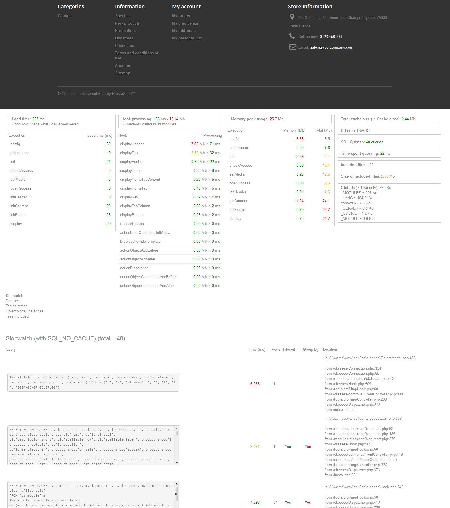

# PrestaShop's developer tools

PrestaShop tries its best to make it easy for developers to build clean and working themes, modules and overriding classes. This is done through a set of developer tools that you can enable whenever you needs them.

By default, PrestaShop turns error reporting off, which makes that if your code fails, you will see a blank page with no information. This is because customers should not see anything from your server. You can get a lot of information using the following tools.

Most of these tools should only be enabled when you are in the development process, on your local installation. If you have to enable them on a production store, you should first disable the store so that only you can see the results of your tests.

## Developer mode 

PrestaShop's developer mode enables a series of tools to help developers:

* Sets PHP's `display_errors` to "on": errors are displayed in the browser instead of just blank pages.
* Sets PrestaShop's `_PS_DEBUG_SQL_` constant to "true": PrestaShop displays potential problems within your SQL queries.
* Sets PrestaShop's `_PS_DISPLAY_COMPATIBILITY_WARNING_` constant to "true": PrestaShop displays a warning message if a piece of code you are using is deprecated in the current version.

All in all, this mode displays a lot more error messages than the regular mode.

Enabling it is quite easy:

* On your server, open the `/config/defines.inc.php` file.
* Find this line: `define('_PS_MODE_DEV_', false);`
* In this line, change "false" to "true".
* Save your changes.

Now reload any blank or suspicious page: you should get a lot more information.

## p() and d() 

PHP developers are used to regularly call `print_r($var)` in order to know what lies inside `$var`. In order to properly display the content of $var, they often encapsulates `print_r()` within HTML or XML tags.

PrestaShop does that for you! `p()` and `d()` are both wrappers around `print_r()`. `p()` returns the content of the variable, while `d()` finishes with `die('END')`.

On top of that, PrestaShop defines the `ppp()` and `ddd()` method, which are respectively the aliases of `p()` and `d()`. They work exactly the same, but are often easier to search and find in a huge block of code.

These debug methods are not available by default. To activate them, you must enable the Developer mode (see above).

## Code profiler 

PrestaShop's profiler is a great way to discover the bottlenecks in your code: once enabled, each page on either the front-end or the back-end of your store will display a lot of information about the page and its files:

* Load time.
* Processed hooks.
* Memory usage.
* Number of database queries and their overall duration.
* Database stopwatches per query.
* Duplicate queries.
* Database table stress.
* ObjectModel instances.
* Included files.

This is a huge step in knowing which files or SQL query you should work on when you need to improve the performance of your store.

Enabling it is quite easy:

* On your server, open the `/config/defines.inc.php` file.
* Find this line (around line 43): `define('_PS_DEBUG_PROFILING_', false);`
* In this line, change "false" to "true".
* Save your changes.

Now load any page of your store, either front-end or back-end, and it will display a lot of statistics at the bottom of the page, below the regular content of that page.

In order to disable the Profiling Mode, simply open the defines.inc.php file and change the value back to "false" in the line mentioned above.

Here is the result from the home page:

Here is the result from the back office:

