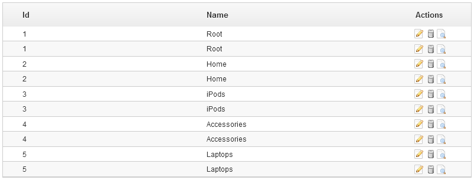
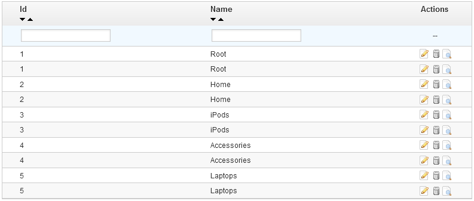

# Using the HelperList class

**Table of contents**

* [Using the HelperList class](using-the-helperlist-class.md#UsingtheHelperListclass-UsingtheHelperListclass)
  * [List declaration](using-the-helperlist-class.md#UsingtheHelperListclass-Listdeclaration)
  * [Basic declaration](using-the-helperlist-class.md#UsingtheHelperListclass-Basicdeclaration)
  * [Enabling specific features](using-the-helperlist-class.md#UsingtheHelperListclass-Enablingspecificfeatures)
    * [Sortable header](using-the-helperlist-class.md#UsingtheHelperListclass-Sortableheader)
  * [Adding an "Actions" column](using-the-helperlist-class.md#adding-an-actions-column)
  * [Adding a "Details" row action](using-the-helperlist-class.md#adding-a-details-row-action)
    * [Principle](using-the-helperlist-class.md#principle)
    * [Example](using-the-helperlist-class.md#example)
      * [Add the action](using-the-helperlist-class.md#add-the-action)
  * [Ajax generalities](using-the-helperlist-class.md#UsingtheHelperListclass-Ajaxgeneralities)
    * [Performing an Ajax request on the table's structure](using-the-helperlist-class.md#performing-an-ajax-request-on-the-tables-structure)
    * [Performing an Ajax request using your own structure](using-the-helperlist-class.md#performing-an-ajax-request-using-your-own-structure)

## Using the HelperList class <a href="#usingthehelperlistclass-usingthehelperlistclass" id="usingthehelperlistclass-usingthehelperlistclass"></a>

This Helper is used to generate a table of elements. The elements can belong to ObjectModel-type objects, but they do not have to. Example: client list, order status list.

### List declaration <a href="#usingthehelperlistclass-listdeclaration" id="usingthehelperlistclass-listdeclaration"></a>

Fields inside \[brackets] are optional as per the HTML standard.\
Values between {curly braces} list the possible values for this field.

```
$this->fields_list = array(
  'country' => array(                              // First column.
    'title' => $this->l('Country'),                // Column name.
    'width' => 100,                                // Column width. At least one field should be set to 'auto' in order to grow with window size.
    ['align'] => {'left', 'center', 'right'},      // Content position inside the column (default 'left', optional).
    ['type'] => {'select', 'bool', 'date',         // Column format.
      'datetime', 'decimal', 'float', 'percent', 
      'editable', 'price'}, 
    ['list'] => $this->countries_array,            // For type == select only. Content for the select drop down filter list (optional).
    ['filter_key'] => 'cl\!id_country'),           // Define a custom filter key to be used by the filter SQL request 
                                                   // (optional, default uses the array key name, i.e. 'country').
    ['orderby'] => {true, false},                  // If true, list will be alphabetically ordered using this column values (optional, default false).
    ['search'] => {true, false},                   // If true, this column will have a search field (optional, default true).
    ['image'] => 's',                              // If set, an image will be displayed in this field located in the '/img' subfolder defined as value here (optional).
    ['image_id'] => 3,                             // If 'image' is set and if 'image_id' is set, it will be used as the image filename, 
                                                   // else the record item id will be used (optional)
    ['icon'] => array(               	           // If set, an icon will be displayed with icon key matching the field value. 
      0 => 'disabled.gif',                         // Used in combination with type == bool (optional).
      1 => 'enabled.gif',
      'default' => 'disabled.gif'
    ),
    ['active'] => 'status',                        // If set, the field will be replaced by a clickable boolean switch for the item field (i.e. 'status'). 
                                                   // An icon will display the current status.
    ['activeVisu'] => 'new_window',                // If set, the field will be replaced by an icon depending on the boolean value
                                                   // of the field specified (i.e. 'new_window') (optional).
    ['callback'] => 'getOrderTotalUsingTaxCalculationMethod', // If set, the return value of the defined method call 
															  //  will be used as the field content (optional).
    ['callback_object'] => $cart,                  // If set in combination with 'callback', the method will be called from the provided object 
                                                   // instead of the current controller (optional).
    ['prefix'] => '0x',                            // If set, it will be displayed before the field value (optional).
    ['suffix'] => 'kg',                            // If set, it will be displayed after the field value (optional).
    ['currency'] => {true, false},                 // If set and type == price, the currency displayed 
												   // will use the item currency and not the default currency (optional).
    ['maxlength'] => 90,                           // If set, the field value will be truncated if it has more characters than the numeric value set (optional).
    ['position'] => 'position',                    // If set to position, the field will display arrows
												   // and be drag and droppable, which will update position in db (optional).
    ['tmpTableFilter'] => {true, false},           // If set to true, the WHERE clause used to filter results 
												   // will use the $_tmpTableFilter variable (optional, default false).
    ['havingFilter'] => {true, false},             // If set to true, the WHERE clause used to filter results 
												   // will use the $_filterHaving variable (optional, default false).
    ['filter_type'] => {'int', 'bool', 'decimal'}, // Specify the value format when used in the filter where clause.
                                                   // Useful when "filter_type" is different from "type" (i.e. type == select) (optional).
    ['color'] => 'color',                          // If set, the field value will appear inside a colored element. 
                                                   // The color used is the "color" index of the record and is in HTML name or hexadecimal format (optional).
    ['hint'] => $this->l('This is the quantity available in the current shop/group.'), // The hint will appear on column name hover (optional).
	['ajax'] => {true, false}						// if the type is bool, you use ajax
 ),
  'another_field' => array(                        // Second column.
    ...
  ),
  'another_field' => array(                        // Third column.
    ...
  ),
);
```

### Basic declaration <a href="#usingthehelperlistclass-basicdeclaration" id="usingthehelperlistclass-basicdeclaration"></a>

Removing all the optional fields, this is how to build a basic HelperList element:

```
private function initList()
{
    $this->fields_list = array(
        'id_category' => array(
            'title' => $this->l('Id'),
            'width' => 140,
            'type' => 'text',
        ),
        'name' => array(
            'title' => $this->l('Name'),
            'width' => 140,
            'type' => 'text',
        ),
    );
    $helper = new HelperList();
    
    $helper->shopLinkType = '';
    
    $helper->simple_header = true;
    
    // Actions to be displayed in the "Actions" column
    $helper->actions = array('edit', 'delete', 'view');
    
    $helper->identifier = 'id_category';
    $helper->show_toolbar = true;
    $helper->title = 'HelperList';
    $helper->table = $this->name.'_categories';
    
    $helper->token = Tools::getAdminTokenLite('AdminModules');
    $helper->currentIndex = AdminController::$currentIndex.'&configure='.$this->name;
    return $helper;
}
```

This specific code generates this list:



### Enabling specific features <a href="#usingthehelperlistclass-enablingspecificfeatures" id="usingthehelperlistclass-enablingspecificfeatures"></a>

#### Sortable header <a href="#usingthehelperlistclass-sortableheader" id="usingthehelperlistclass-sortableheader"></a>

By default, the list's header simply displays the name of each column.

In order to make the column sortable and searchable, you only have to disable one option:

```
$helper->simple_header = false;
```

By disabling the `simple_header` option, the list displays a more complex header:



### Adding an "Actions" column

The above example directly builds a table with an action column, which comprises three actions: edit, delete, view.

```
$helper->actions = array('edit', 'delete', 'view');
```

Note that they will not work out of the box: while the action icons are there and can be clicked, nothing will happen when the user clicks until you have assigned proper code to these actions.

### Adding a "Details" row action

#### Principle

You can define a "Details" action (or "+" action) in each row of a list. This action is useful if you want to show other information about the row (for example, the details of a sum).

This action is represented by a "+" if the details is shown and by a "-" if the details is hidden. The content is obtained through an Ajax request.

#### Example

There are two possible ways to displays:

* The easy one is to re-use the table structure. See for instance the "Stock instant state" page, under the "Stock" menu (when the "Advanced Stock Management" option is enabled).
* You can define your own structure (for example, to display a new table within the table). See for instance the "Stock Management" page, under the "Stock" menu (when the "Advanced Stock Management" option is enabled).

#### **Add the action**

To add the "Details" action, use the following function in the target AdminController:

```
$this->addRowAction('details');
```

### Ajax generalities <a href="#usingthehelperlistclass-ajaxgeneralities" id="usingthehelperlistclass-ajaxgeneralities"></a>

Ajax requests must be generated by the `ajaxProcess()`method in your AdminController.

Only one element is sent to the request: the table row's `id`. You can get it by using:

```
(int)Tools::getValue('id');
```

This `id` is defined either in the `$identifier` class attribute, or by the table name (`$table` attribute), prefixed by "`id_`".

This function must display the result in JSON format.

#### Performing an Ajax request on the table's structure

The expected JSON format:

```
{
  use_parent_structure: true,  // Optional.
  data:                        // Here is the SQL result.
  [
    {field_name: 'value'}
  ],
  fields_display:              // $fieldsDisplay attribute for the AdminController.
}
```

Sample Ajax request code:

```
public function ajaxProcess()
{
  $query = 'SELECT * FROM mytable';
  echo Tools::jsonEncode(array(
    'data'=> Db::getInstance(_PS_USE_SQL_SLAVE_)->executeS($query),
    'fields_display' => $this->fieldsDisplay
  ));
  die();
}
```

#### Performing an Ajax request using your own structure

The expected JSON format:

```
{
    use_parent_structure: false,
    data: '<p>My HTML content</p>'
}
```
