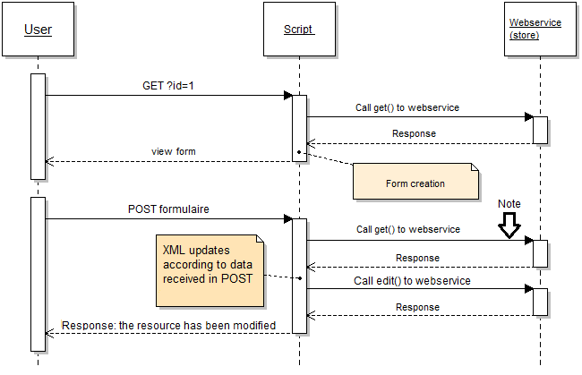

# Chapter 5 - Data modification: Updating a customer

**Goal**: A Web application to list and update customer information.\
**Difficulty**: \*\*\*

## Preparation <a href="#chapter5-datamodification-updatingacustomer-preparation" id="chapter5-datamodification-updatingacustomer-preparation"></a>

Duplicate file `list_the_customers.php` from Chapter 3.3, rename it to `U-CRUD.php`, and put it at the root of your Web server.

Updating resources via the web service is complex, so we will first explain its operation.

Sequence diagram representing how a resource is updated:



We can see that the diagram is divided into 2 parts:

1. Getting the resource to a defined id (1 in the diagram) and creating of the form.
2. Update resource.

The arrow points to a `get()`, which means a resource retrieval.\
&#x20;This step is important because we need to get the XML file back in order to match it with the data sent by the form before we can call "edit" to update the resource.\
&#x20;Note that we could have modified it otherwise by sending an XML using JavaScript, and thus have not used `get()` in this process.

## Step 1: Getting data and form creation <a href="#chapter5-datamodification-updatingacustomer-step1-gettingdataandformcreation" id="chapter5-datamodification-updatingacustomer-step1-gettingdataandformcreation"></a>

Retrieving the XML file and display the form:

```
// Define the resource
$opt = array('resource' => 'customers');

// Define the resource id to modify
$opt['id'] = $_GET ['id'];

// Call the web service, recuperate the XML file
$xml = $webService->get( $opt );

// Retrieve resource elements in a variable (table)
$resources = $xml->children()->children();

// customer form
```

Here, the call is similar to data retrieval. It is this call that will enable us to create the form.

We will generate the automatic update form.

For now, use HTML tags "input" as having as its "name" the name of the attribute, and as its "value" the value of the attribute.

In order not to lose the id for the second step according to the diagram, the form will show up as: `?id = "Customer Id"`

Thus we will get it this way:

```
$_GET['id'];
```

We could have done this differently, such as by passing this ID in a `POST` request, but you will see that this method will simplify the processing that follows.

## Step 2: Update the resource <a href="#chapter5-datamodification-updatingacustomer-step2-updatetheresource" id="chapter5-datamodification-updatingacustomer-step2-updatetheresource"></a>

Initially, as you can see from the "Note" arrow in the diagram, we will retrieve the XML file. For this, you will carry out the same call as you did when you created the form.

If you have specified, as indicated above, the form destination with an id, your call should already be done and the form will be redisplayed.

Help for creating a form:

```
foreach ($resources as $key => $resource) {
	echo '<tr><th>' . $key . '</th><td>';
	echo '<input type="text" name="' . $key . '" value="' . $resource . '"/>';
	echo '</td></tr>';
}
```

Once the XML file is retrieved we need to modify the new data with data received by POST.

Path of the keys in the XML file and update values:

```
foreach ($resources as $nodeKey => $node) {
	$resources->$nodeKey = $_POST[$nodeKey];
}
```

We now have an XML file updated. Now we just need to send it.

Example of an update:

```
// Resource definition
$opt = array('resource' => 'customers'); 

//XML file definition
$opt['putXml'] = $xml->asXML();

// Definition of ID to modify 
$opt['id'] = $_GET[ 'id' ]; 

// Calling asXML() returns a string corresponding to the file
$xml = $webService->edit($opt);
```

Now, in your `U-CRUD.php` script, try to modify a customer with an ID defined in the code, then do it for all customers.

Check using `R-CRUD.php` that the information has been changed and then process the customer ID.

If you have trouble, look at the code in the `2-update.php` sample file.
