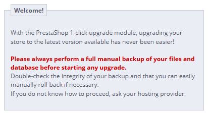
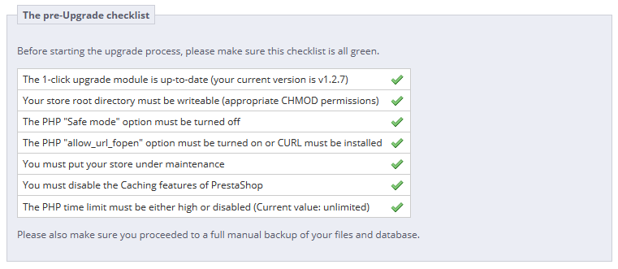
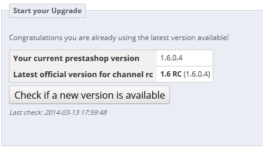
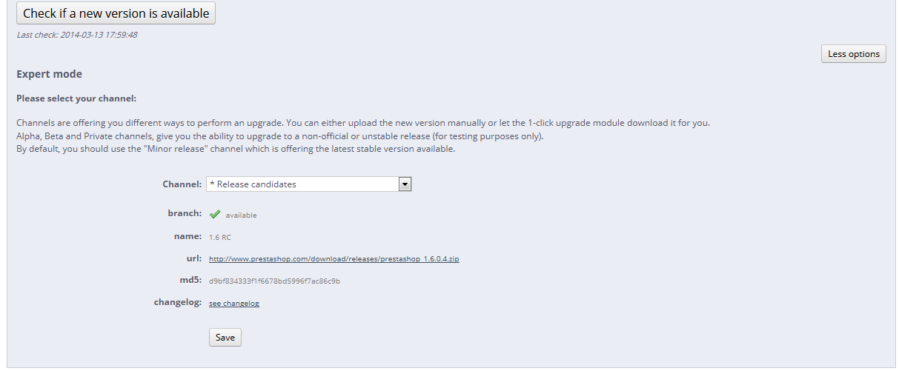
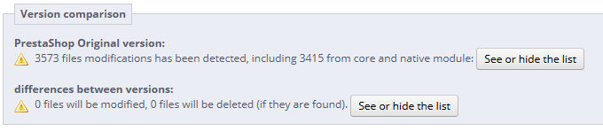
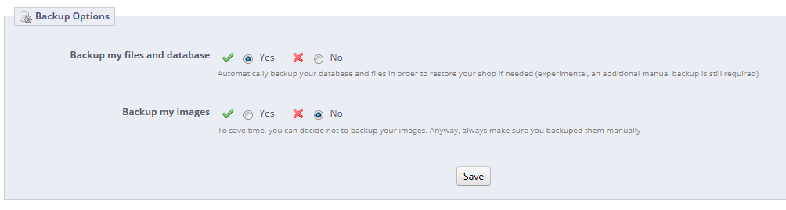
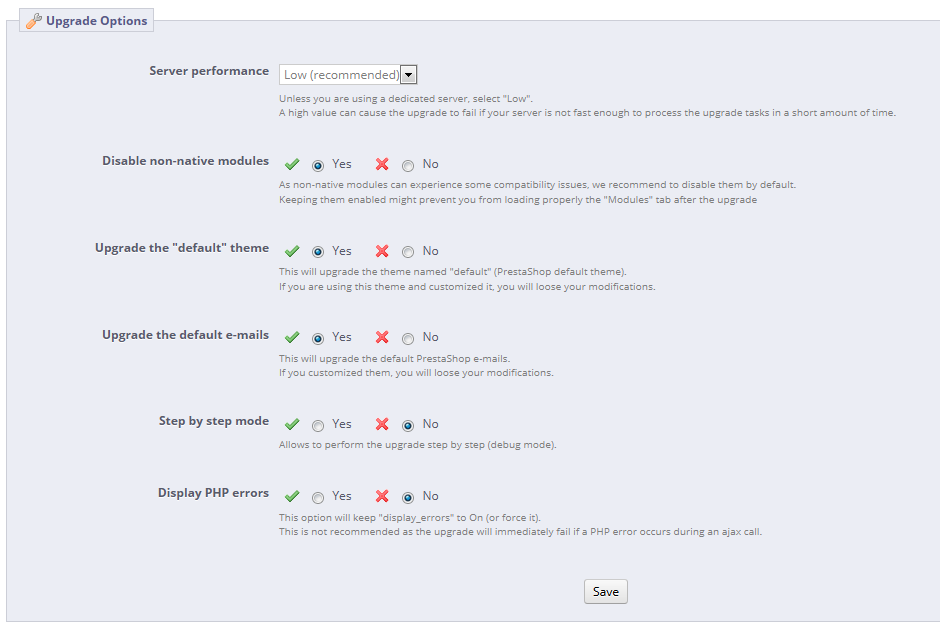

# Automatic update

**Table of contents**

* [Automatic upgrade](automatic-update.md#Automaticupdate-Automaticupgrade)
  * [Downloading and installing the 1-Click Upgrade module](automatic-update.md#Automaticupdate-Downloadingandinstallingthe1-ClickUpgrademodule)
  * [The configuration screen](automatic-update.md#Automaticupdate-Theconfigurationscreen)
    * [Welcome](automatic-update.md#Automaticupdate-Welcome)
    * [The pre-Upgrade checklist](automatic-update.md#Automaticupdate-Thepre-Upgradechecklist)
    * [Start your Upgrade](automatic-update.md#Automaticupdate-StartyourUpgrade)
    * [Version comparison](automatic-update.md#Automaticupdate-Versioncomparison)
    * [Rollback](automatic-update.md#Automaticupdate-Rollback)
    * [Backup options](automatic-update.md#Automaticupdate-Backupoptions)
    * [Upgrade Options](automatic-update.md#Automaticupdate-UpgradeOptions)
  * [The Upgrade process](automatic-update.md#Automaticupdate-TheUpgradeprocess)
  * [Going back to the previous version: rollbacks](automatic-update.md#Automaticupdate-Goingbacktothepreviousversion:rollbacks)
  * [Going back to the previous version: restoring your own backup](automatic-update.md#Automaticupdate-Goingbacktothepreviousversion:restoringyourownbackup)

## Automatic upgrade <a href="#automaticupdate-automaticupgrade" id="automaticupdate-automaticupgrade"></a>

PrestaShop's automatic upgrade tool enables shop owners to backup and update their site in a few clicks and no technical knowledge.

The 1-Click Upgrade module should be available by default in the "Modules" page (in the "Administration" category): just click on its Install button, and you can use it to upgrade to the latest version of PrestaShop.

You should never update your online shop right away. The automatic upgrade tool can fail in some situations, and you might not be able to revert to the previous version.

The safest way is to have an exact copy of your shop available, either on your local computer or in another folder of your web server. It should contain all your products, categories, themes, modules, translations, settings, etc.

Make a trial upgrade on that copy of your shop. Once the upgrade is done, browse your front and back office thoroughly to make sure that everything is as expected. If not, then the upgrade tool has an issue with your configuration, and you should use the manual upgrade method, which is now deprecated and takes longer, but which may help in your situation.

### Downloading and installing the 1-Click Upgrade module <a href="#automaticupdate-downloadingandinstallingthe1-clickupgrademodule" id="automaticupdate-downloadingandinstallingthe1-clickupgrademodule"></a>

If the 1-Click Upgrade module is not available in your installation of PrestaShop 1.4 or 1.5, you can download it for free from the Addons site.

Even if you have already installed the "1-Click upgrade" module, make sure you are using the latest version:

* PrestaShop 1.4: Check the version number in your "Modules" tab, then compare it to the version number listed on the Addons website (see below). If the numbers differ, proceed with the download and update.
  * To update you module: uninstall it and delete it from the PrestaShop administration, then copy the "/autoupgrade" folder from the module's archive (that you have downloaded from the Addons website) to the "/modules" folder of your installation of PrestaShop. Finally, install the module from the administration.
* PrestaShop 1.5 and later versions: PrestaShop will automatically check the Addons site for new versions of your modules. If a new version is available, it will display a new "Upgrade!" button next to the "Install/Uninstall" button. Click to have PrestaShop download and update the module for you.

Simply follow the usual steps to install a module in PrestaShop:

1. Download the 1-Click Upgrade module from PrestaShop Addons: [http://addons.prestashop.com/en/administration-tools/5496-autoupgrade.html](http://addons.prestashop.com/en/administration-tools/5496-autoupgrade.html). Save the Zip file on your desktop.
2. In your PrestaShop administration panel, go to the "Modules" page of the "Modules" menu.
3.  Click on the "Add a module" button, located in the upper right part of the list of available modules.

    If updating from version 1.4, click on the "Add a module from my computer" link, located at the top left.
4. In the form that opens, click on the "Browse..." button, then find and select the module's Zip file that you just downloaded.
5. Click the "Upload this Module" button. PrestaShop will put the module on your server, unzip it, and place the files in the `/modules` folder.

The module is now available in your list of modules, but you still have to install it:

1. In the "Modules" tab, find the 1-Click Upgrade module: type "1-click upgrade" or "autoupgrade" in the module search box (not the global search at the top). A direct link to the module should appear as you type. Click it.
2. PrestaShop then displays the module in the main module list.
3. Click the module's "Install" button.

The module is now ready to configure and use.

### The configuration screen <a href="#automaticupdate-theconfigurationscreen" id="automaticupdate-theconfigurationscreen"></a>

The module's configuration screen is available from the "Modules" list, by clicking on the module's "Configure" link.

The configuration screen is also available from:

* PrestaShop 1.4: under the "Tools" tab, in the "1-Click Upgrade" sub-tab.
* PrestaShop 1.5 and later: under the "Advanced parameters", in the "1-Click Upgrade" page.

The configuration screen presents you with a series of sections, providing information, tools and settings.

#### Welcome <a href="#automaticupdate-welcome" id="automaticupdate-welcome"></a>

This small section serves as a reminder that an upgrade is never 100% safe, and therefore that you should make sure you have made a complete backup of your files and data. This way, should the upgrade fail, you will be able to return to the initial state of your shop – albeit with a bit of work putting your files and data back into place.

This process is explained in details in the "[Making and restoring your own backup](making-and-restoring-your-own-backup.md)" chapter of this guide.



Note that the 1-Click Upgrade module performs its own set of backup in order to allow for reverting of the whole upgrade. Nevertheless, you should rely on your own backups.

#### The pre-Upgrade checklist <a href="#automaticupdate-thepre-upgradechecklist" id="automaticupdate-thepre-upgradechecklist"></a>

The "pre-Upgrade checklist" section gives you useful information on your current PrestaShop installation, and how it might interact with the automatic upgrade.



You must make sure that all the checks are validated before you can launch the upgrade.

* **The 1-click upgrade module is up-to-date (your current version is x.x)**. Indicates whether you need to update the update module itself. If you have just installed it, there is little chance you will need to update it.\
  &#x20;If you do not have the latest version of the module, a button appears below this field, marked "Install the latest by clicking 'Add from my computer'". Clicking it takes you to the "Modules" page. From there, click on the "Add a module from my computer" link to reveal the pre-filled form. Click the "Download this module" button to start updating the module. Finally, go back to the 1-Click Upgrade configuration page to continue performing pre-upgrade checks.
* **Your store root directory is writeable (appropriate CHMOD permissions)**. Indicates if the read/write permissions are correctly set. If not, you will have to change them, using your FTP client, such as FileZilla.\
  &#x20;See the Getting Started guide's "System compatibility & system configuration" section for a quick explanation of how to perform a CHMOD.
* **The PHP "Safe mode" option must be turned off**.
* **The PHP "allow\_url\_fopen" option must be turned on or CURL must be installed**.
* **You must put your store under maintenance**. Indicates if your shop is active or in maintenance mode. You must put your shop in maintenance mode during the whole process (file backup, database backup, automatic upgrade, verification), so as to prevent customers from losing orders... and prevents you from losing clients. The module can disable your shop for you: Simply click on the "Click here to put your shop under maintenance" button. You can also choose to disable the shop yourself, using the shop's preference page:
  * PrestaShop 1.4: enable/disable the shop in the main "Preferences" tab.
  * PrestaShop 1.5 and later: enable/disable the shop in the "Maintenance" page, under the "Preferences" menu.
* **You must disable the Caching features of PrestaShop**. Indicates whether your shop's cache is enabled or disabled. You must disable it during the whole process. The module will not do it for you.
  * PrestaShop 1.4: enable/disable the cache in the "Performances" page, under the "Preferences" tab.
  * PrestaShop 1.5 and later: enable/disable the cache in the "Performance" page, under the "Advanced parameters" menu.
* **The PHP time limit is high or disabled (Current value: xxx)**. The automatic upgrade can be a lengthy process, as it needs to download the archive from prestashop.com, unzip it on the server, replace the currently installed files, then trigger the update itself. Hence, the PHP settings might be too low, and break the upgrade altogether, mid-process at worse. In this field, PrestaShop gives you an indication of the current PHP settings. Ideally, it should indicate "disabled".

All these indicators must be green for the upgrade to work. Otherwise, the upgrade button will not appear.

When your store is hosted on your local server ([`http://localhost`](http://localhost) or [`http://127.0.0.1`](http://127.0.0.1)), the auto-upgrade module understands that the maintenance mode is not required, since no one else than you can access the site. Therefore, even if you are not in maintenance mode, the module marks that check as valid.

#### Start your Upgrade <a href="#automaticupdate-startyourupgrade" id="automaticupdate-startyourupgrade"></a>

This section compares your version of PrestaShop with the latest stable one. You can quickly see whether an update is required or not. If you know that there is a more recent version available than the one presented, you can trigger a version check by clicking the "Check if a new version available" button.



By default, the update tool is set to update your store to the next minor version. This means that if you use a version from the 1.4.x branch, it will not suggest the latest 1.6.x version, but rather the latest 1.4.x version. Therefore, if you want to update from a 1.4.x version to the latest 1.6.x version, you must click on the "More options (Expert mode)" button. This will open a new section, named "More options (expert mode)", where you can choose the distribution channel to which you want to update.\
&#x20;This is also very useful if you want to check for a version other than a stable one (for instance, beta, RC or any other unstable version).

Before launching the upgrade, you must make sure that you understand its settings. The "Backup options" and "Upgrade options" sections are available at the bottom of the page (and are described later in this chapter). Make sure you understand them all.

**Expert mode**

This section enables you to pinpoint exactly the version to which you want to upgrade your current PrestaShop installation.



The options are:

* **Channel**. Choose the distribution channel that you want to use. The recommended selection is "Minor releases", which means "any stable release above the current one". The other options are:
  * **Major releases**. The next stable releases from the latest branch: since the current branch is 1.6.x, the update tool would use the latest 1.6 version (as of this writing, v1.6.0).
  * **Minor releases**. _This is the default setting._ Uses only the next stable release within the current branch: if you have PrestaShop 1.4.2, it will update your shop to v1.4.9, even if v1.6.2 is available.
  * **Release candidates**. RC versions are deemed stable enough to be tested by the majority, but not stable enough to be the real release. Use them at your own risk.
  * **Beta releases**, **alpha releases**. These are development versions. Use them at your own risk.
  * **Private release**. Sometimes, the PrestaShop developers upload a private test version. If you have the right URL and hash key, you can update to this version easily using this channel. Check the "Allow major upgrade" box if your are only interested in major releases.
  * **Local archive**. To be used if you have downloaded the version you want to upgrade to in the correct local folder, `/admin/autoupgrade/download`. Once you have selected an archive in the drop-down selector, type the exact version number in the text field.
  * **Local directory**. To be used if you have downloaded and uncompressed the version you want to upgrade to in the `/admin/autoupgrade/latest/prestashop` folder. That `/prestashop` folder must come directly from the archive that you downloaded.
* **branch**. Indicates if anything is available in the chosen channel.
* **name**. The name of the latest version in the chosen channel.
* **url**. The URL to the latest version in the chosen channel.
* **md5**. The hash check for the latest version in the chosen channel.

#### Version comparison <a href="#automaticupdate-versioncomparison" id="automaticupdate-versioncomparison"></a>

For the curious, the numbered differences between your current version and the latest version in the chosen channel.



In case you have made changes directly to the core files instead of using the overriding possibilities of PrestaShop, these lists can help you know if your changes are safe or not.\
&#x20;Nevertheless, you can improve the lifespan of your custom code by turning it into overriding files. See the developer documentation for more information.

#### Rollback <a href="#automaticupdate-rollback" id="automaticupdate-rollback"></a>

This section only appears when at least one upgrade has been performed.

See below for more information.

#### Backup options <a href="#automaticupdate-backupoptions" id="automaticupdate-backupoptions"></a>

These options enable you to have some control on the backup process:

* **Backup my files and database**. You must have your files backed-up, and the module will take care of this for you. You should never disable this setting, unless told to.
* **Backup my images**. You should let the module take care of your images too, in order to be able to do a clean re-install again by re-uploading your files.



#### Upgrade Options <a href="#automaticupdate-upgradeoptions" id="automaticupdate-upgradeoptions"></a>

These options enable you to have some control on the upgrade process:

* **Server performance**. Some shared hosted offer poor performance, which might hinder the performance of the upgrade process, or even make it fail. "Low" is thus selected by default, but if you know you have a powerful server, you can choose "Medium" or even "High".
* **Disable non-native modules**. It is recommended to choose "Yes" for this option, as some module might prove a hindrance when upgrading PrestaShop.
* **Upgrade the "default" theme**. The upgrade process overwrites the default theme with its latest incarnation. If you have made changes to the theme directly, you can protect these changes by choosing "No". As a reminder, it is NOT recommended to edit the default theme! You should make a copy of the theme, and make changes to that copy.
* **Upgrade the default e-mails**. An update might bring new default e-mail templates. By default, the upgrade will replace the existing ones with the ones from the newer archive, and add the new templates. If you have customized your templates, it is recommended you keep them. You would then have to customize the new templates in order to fit the general style of your shop.
* **Step-by-step mode**. _Dev mode only_. If enabled, the module will stop at each step to ask you for confirmation.
* **Display PHP errors**. _Dev mode only_. If enabled, the module will displays PHP errors, which could help you discover server issues that would otherwise stay hidden from view.



### The Upgrade process <a href="#automaticupdate-theupgradeprocess" id="automaticupdate-theupgradeprocess"></a>

Once all the indicators in the "pre-Upgrade checklist" section are green, the update button appears in the "Start your Upgrade" section, along with the URL from which the new version will be downloaded.

Clicking the "Upgrade PrestaShop now !" button triggers the whole process.

Once the upgrade process is launched, the whole configuration page is replaced by two sections: "Activity Log" and "Rollback".

The activity log gives you a detailed journal of what the updater is doing, in a screen you can scroll through:

* Removed files: only the sample files are removed, such as empty override classes and controllers.
* Name of the backup archive: the name follows the `auto-backupfiles_V1.6.0.2_20140127-120310-798d3a69.zip` form.
* Files added to the backup archive: all the remaining files of your current installation are put into the Zip archive.
* Database tables added to the backup archive: your files are important, but your whole catalog is stored in your database, and is therefore saved in the same archive.
* Removed files: mostly modules, controllers, classes, CSS and JavaScript files. Now that all the files have been saved in the backup archive, they can be safely removed.
* Files copied from the new archive: all the existing files are replaced by their new version.
* Merged translation files.
* Created, deleted, altered and updated database tables.
* Emptied temporary folders: if possible, the upgrader will try and delete the content of the cache folders.

A lot of files are mentioned during the whole process. You do not need to read all the notifications, it's only there for you to peruse in case of error.

You'll know the upgrade is over when the following message "upgrade complete. Please check your front office theme is functional (try to make an order, check theme)" appears in green, along with the following final log entry: "End of process".\
&#x20;The upgrader also indicates that you should re-enable your shop, but before you do that, you should first check that everything is working in your back office: no errors, all products and categories are in place with their images and attached files, etc. Until you have checked that everything is okay in your shop, it is better to keep it from the public eye.

On first load, pages might look wonky: because your web browser caches files, it is probably using the old CSS files instead of the new ones. Do not hesitate to reload the page several times, or even empty your browser's cache, in order to get the correct interface.

When you upgrade from version 1.4 to version 1.6, your menus will not be arranged the way they would be if you made a fresh installation of version 1.6.

That is because PrestaShop 1.4 tabs got reorganized into 1.6 menus, and a lot of pages were moved around in order to create consistent menus. Additionally, the upgrader assumes that your 1.4 tabs may have been customized or moved around, either by a module or by your own action. Therefore, rather than breaking the existing settings, the upgrader takes the tabs as-is, and does not re-arrange them into the default 1.6 menu order.

If you want to change the position of pages within a menu once you have updated to version 1.6, go the to "Menus" page under the "Administration" menu, and start fiddling with positions.

Once you have made sure your PrestaShop installation is up and running, you can re-enable your shop using the option in the "Maintenance" page of the "Preferences" menu, then make tests on your front office: browse products, sort them, try to order one, etc. In short, go through the entire buying process in order to make sure that you won't miss a sale.

**Is everything working fine? Congratulations, you know have successfully upgraded your PrestaShop installation!**

JavaScript error

In some server configurations, an error message might be displayed, saying "Javascript error (parseJSON) detected for action "upgradeNow". Starting restoration...".

Follow these steps to solve the error, :

* Open your `php.ini` file and enable (uncomment) the MySQLi and MySQL PDO extensions. If you cannot access the `php.ini` file, contact your web host about this.
*   Open the `/modules/autoupgrade/db/Db.php` and find these lines (around line 210):

    ```
    public static function getClass()
    {
        $class = 'MySQL';
        /*if (PHP_VERSION_ID >= 50200 && extension_loaded('pdo_mysql'))
            $class = 'DbPDO';
        else if (extension_loaded('mysqli'))
            $class = 'DbMySQLi';*/
        return $class;
    }
    ```

    Simply uncomment these lines (remove `/*` and `*/`). They should now look like this:

    ```
    public static function getClass()
    {
        $class = 'MySQL';
        if (PHP_VERSION_ID >= 50200 && extension_loaded('pdo_mysql'))
            $class = 'DbPDO';
        else if (extension_loaded('mysqli'))
            $class = 'DbMySQLi';
        return $class;
    }
    ```

After you have done all this, start the autoupgrade process again.

### Going back to the previous version: rollbacks <a href="#automaticupdate-goingbacktothepreviousversion-rollbacks" id="automaticupdate-goingbacktothepreviousversion-rollbacks"></a>

Sadly, not all upgrades are successful – which is the very reason why you should **always** back-up all your files and data, and why PrestaShop performs an additional backup of said files and data by itself, which you should not always count on. **Make your own backup first**. See the "Making and restoring your own backup" chapter of this guide for more information.

PrestaShop's own backup files are saved on your server, and if it turns out your update has gone badly, you can find them in the "Rollback" section of the configuration page for the 1-Click Upgrade module.\
&#x20;Backup files are created as soon as the upgrade process is started, and are available immediately in the "Choose your backup" drop-down list.\
&#x20;Choose the most recent one. The date and hour of the creation of the backup file are right within the name: `Vversion-date-hour-random`, for instance "V1.4.9.0\_20120907-114024-f85f41a" for a backup of a previous PrestaShop 1.4.9 installation, made September 7th 2012, at 11:40:24 AM.

The "Rollback" button triggers two actions:

* Takes the files from the latest backup, and re-installs them in place of those from the current installed version.
* Takes the data from the latest backup, and re-installs it in place of that from the current database.

Select the backup archive to which you want to roll back to, and click the "Rollback" button. As with the upgrade process, the whole interface disappears to only leave the "Activity Log" section and the "Rollback" section. You can follow the rollback process in the scrolling journal, and once it is finished, reload the page in order to check that everything is indeed back in place.

### Going back to the previous version: restoring your own backup <a href="#automaticupdate-goingbacktothepreviousversion-restoringyourownbackup" id="automaticupdate-goingbacktothepreviousversion-restoringyourownbackup"></a>

This is explained in details in the "[Making and restoring your own backup](making-and-restoring-your-own-backup.md)" of this guide.
