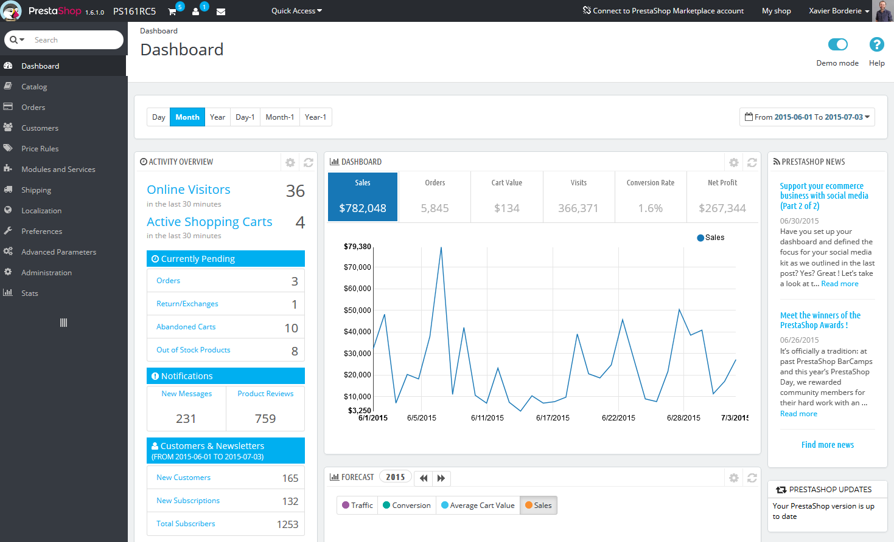
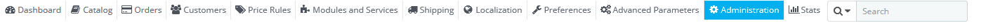
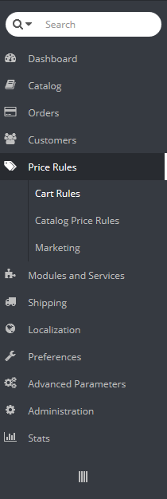
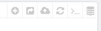
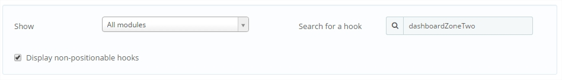
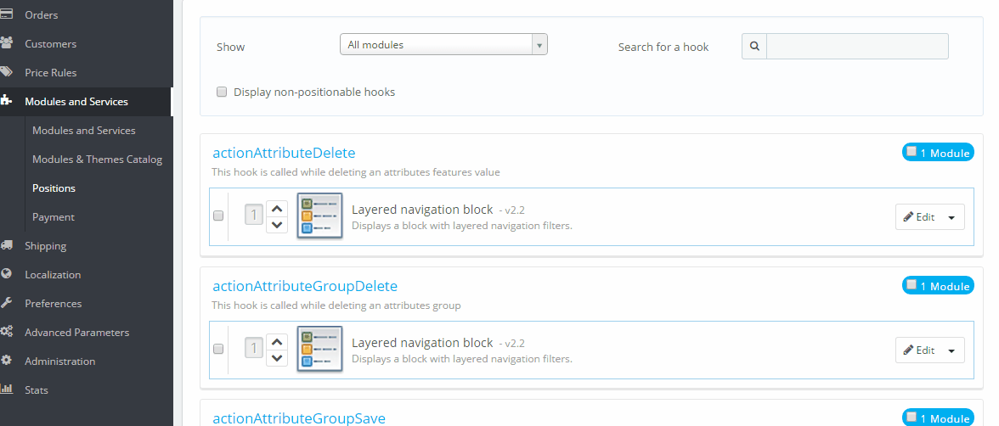

# Discovering the Administration Area

**Table of contents**

* [Discovering the Administration Area](discovering-the-administration-area.md#DiscoveringtheAdministrationArea-DiscoveringtheAdministrationArea)
  * [Overview of the main interface](discovering-the-administration-area.md#DiscoveringtheAdministrationArea-Overviewofthemaininterface)
    * [The top bar](discovering-the-administration-area.md#DiscoveringtheAdministrationArea-Thetopbar)
    * [The menus](discovering-the-administration-area.md#DiscoveringtheAdministrationArea-Themenus)
  * [The buttons](discovering-the-administration-area.md#DiscoveringtheAdministrationArea-Thebuttons)
  * [Contextual help](discovering-the-administration-area.md#DiscoveringtheAdministrationArea-Contextualhelp)
  * [The Dashboard](discovering-the-administration-area.md#DiscoveringtheAdministrationArea-TheDashboard)
    * [The horizontal bar](discovering-the-administration-area.md#DiscoveringtheAdministrationArea-Thehorizontalbar)
    * [The left column](discovering-the-administration-area.md#DiscoveringtheAdministrationArea-Theleftcolumn)
    * [The central column](discovering-the-administration-area.md#DiscoveringtheAdministrationArea-Thecentralcolumn)
    * [The right column](discovering-the-administration-area.md#DiscoveringtheAdministrationArea-Therightcolumn)
    * [Reorder the elements](discovering-the-administration-area.md#DiscoveringtheAdministrationArea-Reordertheelements)

## Discovering the Administration Area 

Now that you have installed PrestaShop 1.6 and that you are properly logged-in to your administration area, you should make sure to easily find your way through its administration interface, understand its notifications and know where to find one specific bit of information.

The design of the administration area has been completely revamped with version 1.6 of PrestaShop in order to be more intuitive and ergonomic – as well as working better on mobile devices.

While most of the 1.5 pages and options are still where you can expect them to be, it might take some time to get used to it all

We have created this chapter in order to help you make the most of your discovery of PrestaShop's administration interface. It has been designed to be very ergonomic and easy to use, but be aware that you should read the whole guide in order to get a perfect grasp of your new online business tool!

### Overview of the main interface 

Take the time to review the Dashboard – that is, the first page you see when logging into your back office. Not only does it present you with a summary of everything you need to know about your shop at any given time, along with quick links to the main action page, but as a first-timer in PrestaShop, it also gives you tips about what you should have a look at.

PrestaShop's back office got revamped for version 1.6.1.0, for better readability and ease of use.

From version 1.6.0.0 to 1.6.1.0, the back office looked like this:

.png>)

#### The top bar 

At the top of the back office is a black bar containing a handful of information and links:

* **The PrestaShop logo**, along with your current version number.
* **The name of your shop**. From any page, this takes you back to the Dashboard.
* **Cart icon**. A tooltip indicates the number of new orders, if any. Clicking it opens a panel presenting the new orders since you last clicked that icon. From there on, you can either display one of the new orders, or go to the list of orders.
* **Person icon**. A tooltip indicates the number of new customers, if any. Clicking it opens a panel presenting the last registered customers. From there on, you can either display one of the new customers, or go to the list of customers.
* **Letter icon**. A tooltip indicates the number of new messages, if any. Clicking it opens a panel presenting the last customer service message. From there on, you can either display one of the new messages, or go to the list of messages.
* **Trophy icon.** A tooltip indicates the number of new items, if any. Clicking it opens a panel presenting your progress as a merchant. From there on, you can reach the full page of badges and points, from the "Merchant Expertise" module.
* **Quick Access**. This is the quick links menu, presenting the most useful links, as set in the "Quick Access" page under the "Administration" menu.
* **"Connect to PrestaShop Marketplace account" link**. Opens a modal window enabling you to connect your shop to the Addons marketplace, and thus get updates from the modules and themes you bought.
* **"My shop" link**. Opens a new browser tab with your shop's front-end.
* **Personal menu named after your first name and surname**. A simple dropdown panel with a reminder of the administrative account with which you are currently logged-in. It contains the following links:\

  * **"My preferences" link**. Takes you to your account's preferences page, where you can set some personal options (for instance, the language of your back office or your password).
  * **"Sign out" link**. Logs you out of the current user account.

#### The menus 

All along your daily activities administrating your shop, you will have to browse through the many pages and options of the back office.

By default, the menu system in PrestaShop 1.6 is displayed on the left side of the page. You can switch the menu to the top of the page by using the "Admin menu orientation" option in your user preference page (which you can access through the link bearing your name in the top bar).

In either vertical or horizontal format, the content of each menu is displayed when the mouse hovers the menu label, thus reducing the necessity to load new screens just to access menu options.&#x20;

In addition to that, the vertical format can be minimized to only its icons by clicking on the "parallel lines" icon at the bottom of it.

Each menu applies to a given set of tasks and contexts:

* **Search field with dropdown list**. Enables you to search within the content of your shop.
* **Dashboard**. The homepage of your back office, where you can see the main statistics, live.
* **Catalog**. This is the heart of your shop, where you will add products, create categories, set up carriers and suppliers, etc.
* **Orders**. Once clients start adding products in their shopping carts, you will see orders in this menu, with the resulting invoices. This is also where you handle merchandise returns, credit slips and per-order customer service, among other things.
* **Customers**. Here you can access all the information about your clients, and edit their addresses, create groups of customers to which you can apply special discounts, handle customer service, and even manage social titles if need be.
* **Price Rules**. A very specific menu, enabling you to easily create vouchers and price reductions through a set of rules.
* **Modules and Services**. Extend the power and usefulness of your shop by adding and activating modules: more than a hundred are available by default, and many more are available to buy on the Addons marketplace ([http://addons.prestashop.com/](http://addons.prestashop.com/)). This is also where you handle themes, and where you can position the blocks of content from your module on the theme (including the Live Edit feature). One last menu page enables you to apply global settings to payment modules.
* **Shipping**. Everything pertaining to carriers and shipping costs, as well as marketing.
* **Localization**. Helps you customize your shop with local values, such as language and translation, currency, units, taxes and tax rules, and geographical entities (regions, countries, etc.).
* **Preferences**. PrestaShop is a very configurable e-commerce solution, and you can edit just about any of its behaviors using the full-featured preferences.
* **Advanced Parameters**. This menu contains links to tools and informational pages that are too specific to fit in other menus, such as the Web service settings, the database backup tool, or the performance page, among others.
* **Administration**. Here are the settings pertaining to the back office itself; for instance, the content of the Quick Access menu, the employees list and permissions, or the menu order, among others.
* **Stats**. This menu gives you access to all the numerous statistics and graphics that are gathered and generated by PrestaShop.

These are the default menus. Note that modules can add new options to the existing pages, new pages to the existing menus, and even new menus.

Also, one menu is only available when the proper option is set:

* **Stock**. This menu gives you access to stock management feature, where you can handle warehouses, stock movement and supply orders.\
  &#x20;It can be made available through the "Products" preference page: simply activate the "Enable advanced stock management" option (in the "Products stock" section) and save your change to see the menu appear.

All the default standard menus, including the "Stock" menu, are explained in depth in this user guide.

### The buttons 

Many of the back-end pages use recurring buttons, either at the top or at the bottom of the screen. For instance, the product edition page can have up to 8 buttons available at the same time.

More than simple shortcuts, they open actual features that you will use very often.

The available buttons vary a lot depending on the context, and therefore two different pages might not feature the same set of buttons. Still, there are a few that you will often see:

* **Add new**. Opens the creation page of the current context: new product, new product category, new order, etc.
* **Recommended Modules and Services**. Opens a pop-in window containing the modules available in the current context.
* **Help**. Opens the inline documentation for the current page – or "contextual help".

The "Recommended modules" button presents you the modules which apply to the current context. For instance, in the "Shipping > Carriers" page, it will display the modules from the "Shipping & Logistics" category of modules. This is very helpful when you need to quickly find which module to install and configure in order to get a given result.

Many of the back office forms are validated with buttons at the bottom of the screen:

* **Save**. Saves the content of the current page and returns to the list of existing items.
* **Save and stay**. Saves the content of the current page and keep the page open.
* **Cancel**. Returns to the list of existing items.

Data tables (lists of products, of categories, of customers, etc.) have their own set of buttons to manage the listed items:

* **Add new**. Creates a new item in the current context.
* **Export**. Downloads a CSV file of all the items.
* **Import**. Sends you to the CSV Import option page, from where you can import your CSV files.
* **Refresh List**. Reloads the list of items to display the latest changes.
* **Show SQL Query**. Provides the SQL query to reproduce your search or filter in your own SQL manager.
* **Export to SQL Manager**. Opens PrestaShop's SQL Manager tool (in the "Advanced Parameters") menu, from which you can query PrestaShop's database with SQL statements ("`SELECT ... FROM ... WHERE ...`").\
  If your list of items was filtered (by name, for instance), then the default SQL statement will take this into account (for instance, "``WHERE 1  AND b.`name` LIKE '%blouse%'``" for product list).

### Contextual help 

Since version 1.6.0.7 of PrestaShop, the software's documentation is directly embedded into the administration interface: clicking on the "Help" button from any back office page reduces the main interface's width in order to add a new column on the right, which contains the documentation for that section of the back office.

Another click on the "Help" button closes the contextual help. If you do not close the help column, PrestaShop understands that you want it displayed on every page of the back office, and thus will maintain the column open until you have clicked to close it.

If the browser's display zone is lower than 1220 pixels width, then PrestaShop will open the contextual documentation in a new browser window rather than reducing the screen space dedicated to the main interface.

At the bottom of the help column, a small form enables you to tell the PrestaShop team whether the help section has been helpful to you or not. Rate the help page by clicking on one of the 5 levels of satisfaction. If you click on one of the two lowest levels, PrestaShop will open a short form allowing to detail your thoughts? You can either fill it and click on the "Submit" button, or close the form by clicking on the cross, in which case only your rating will be sent to our server.

### The Dashboard 

Let's now explore the content of the Dashboard itself. It can feel crowded to a first-time user, but you will find that it gives an excellent summary of your shop's daily activities at a glance.

The Dashboard is divided in 4 main areas: a horizontal bar, and three columns.

Demo mode

By default, the Dashboard uses fake data so that you can better visualize what the various stats are for.

When using PrestaShop for a real online store, you must disable this fake data so that your real data is used: deactivate the "Demo mode" option at the top right of the screen, next to the "Help" icon.

#### The horizontal bar 

At the top of the Dashboard is a single bar which helps you choose the period of time for the currently displayed dashboard statistics. Three sets of options are available:

* Current day, month or year.
* Previous day, month or year.
* Precise date selection (the button on the right, which opens a date selector).

Choosing an option updates all the blocks of content that are on the Dashboard so that they display data for the chosen period of time only. Blocks that are not stats-based do not change.

In order to choose a period of time, you can either click the first and last date of that period in the calendar (the clicking order does not matter), or you can type the dates in the YYYY-MM-DD format in the text boxes. Click "Apply" to see the Dashboard change according to your settings.

.png>)

You can also compare two periods of time together by checking the "Compare To" box. Select the second period as would do for the first one (the two can even overlap), then click on the "Apply" button.\
When comparing two periods, some of the content blocks will update to indicate the evolution of the data (see for instance the main "Dashboard" block, which presents data from the Dashboard Trends module).

#### The left column 

.png>)By default, this column presents you with data from the Dashboard Activity module, which gives the main figures from your database in a quick glance:

* Online visitors in the last 30 minutes.
* Active shopping carts in the last 30 minutes.
* Currently pending orders, return/exchange inquiries, abandoned carts and out of stock products.
* Notifications for new messages, order inquiries and product reviews.
* New customers and new newsletter subscriptions.
* Traffic statistics: visits, unique visitors, traffic sources and direct links.

#### The central column 

The central column is where the term "dashboard" takes its importance: this area of the Dashboard presents the user (you) with the most important numbers pertaining to his shop's daily activities, along with a graph of sales and a list of the latest orders. Every time you log into your shop's administration area, you will be first and foremost looking at the evolution that these numbers take. This is where you see your shop live and breathe.

By default, there are three blocks of content in this column, which are handled by modules:

* **Dashboard** (Dashboard Trends module). This is the main block of information on the dashboard. With its various graphics, it really helps you see if your shop is headed in the right direction or not. Click on one of the graphic type to display it. Additionally, when comparing two time periods, it displays the evolution of each figure in percentages. Hover the graphic with your mouse to see the details.\
  .png>)\
  Clicking on its configuration icon (top right) open a new page where you can set various expenses that your shop has (bank wire fee, average shipping fee, hosting expenses, etc.), in order to better indicate your trends.
* **Your Forecast** (Dashboard Goals module). This block presents you with the goals you have for the coming months, and how your shop is doing as compared to them. Hover the graphic with your mouse to see the details.\
  .png>)\
  Depending on your monthly results, you should update your forthcoming goals. You can set your goals in the block's configuration form (top right of the block), and fill in your expectations month per month in terms of traffic, conversion rate, and average cart value. The "Sales" column will be updated according to the goals set in the other columns (for instance, for a 1000 visitors with a 2% conversion rate and a $10 average cart, you would get 1000\*(2/100)\*10 = $200). You can change the currency in the "Currencies" page under the "Localization" menu.
* **Products and sales** (Dashboard Products module). This block presents you with a table of your latest orders and a ranking of your products: best sellers, most viewed and top searches (as searched in your shop's search form, not from search engines).\
  .png>)\
  You can set the number of items to display in each by opening the block's configuration form

#### The right column 

This last column is an informational one: it gives you the latest news from PrestaShop.com, notifications about new PrestaShop versions, and useful links.

It also features the "Demo mode" block, from which you can disable the fake data used by default on the Dashboard and use your own data (as gathered by PrestaShop's statistics system).

|

#### Reorder the elements 

On your dashboard, you have the possibility to change the order of the elements displayed on each column (left and center, see above). It is mostly useful if you have additional modules or if you want to focus on some statistics that are not on the first position.

To change the order, please follow these steps:

1. Go to Modules & Services / **Position** page (via your menu)
2. Select "**Show: All modules**"
3. Check the "**Display non-positionable hooks**" checkbox
4. In the "Search of a hook" field, enter "**dashboardZoneOne**" for the left column, or "**dashboardZoneTwo**" for the right column.

Now you see all the elements hooked on the left/center columns.

To change the positions, you can drag and drop them or you can click on the small arrow close to the module logos, as shown below :

